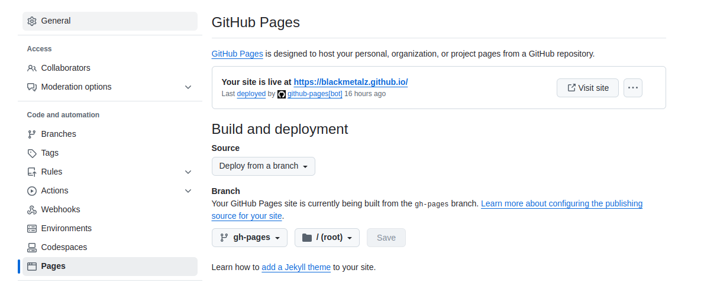

### Installation
https://docs.getpelican.com/en/latest/install.html
```
python -m pip install "pelican[markdown]"
```

- Themes:
```
# git clone https://github.com/Pelican-Elegant/elegant.git themes/elegant
git submodule init
git submodule update
```

### Run
```
pelican content && pelican --listen
```


### Github Action settings
- Settings: 
- Workflows:
```yaml
name: Build and Deploy Pelican

on:
  push:
    branches:
      - master  # Replace with your default branch

jobs:
  build:
    runs-on: ubuntu-latest

    steps:
    - name: Checkout repository
      uses: actions/checkout@v4
      with:
        submodules: recursive

    - name: Set up Python
      uses: actions/setup-python@v4
      with:
        python-version: '3.9'

    - name: Install dependencies
      run: pip install pelican markdown

    - name: Build Pelican site
      run: pelican content -o output -s pelicanconf.py

    - name: Deploy to GitHub Pages
      uses: peaceiris/actions-gh-pages@v4
      with:
        github_token: ${{ secrets.GITHUB_TOKEN }}
        publish_dir: output
        publish_branch: gh-pages
```