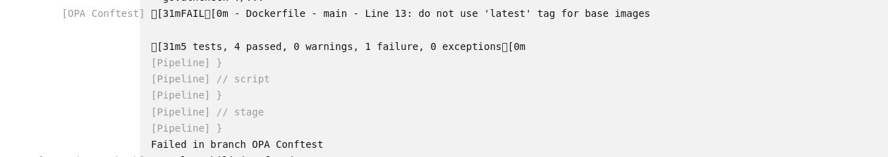

Title: Practical DevSecOps: Automating Security, Integrating DevSecOps into CI/CD with Jenkins and Golang application - Part 3
Date: 2025-02-23
Category: Knowledge Base
Tags: k8s, devsecops

### This series will contain 3 parts:
- Part 1. Secure Coding Practices: Tools and Techniques for DevSecOps.
- Part 2. Hardening and Monitoring: Benchmarking and Runtime Security in DevSecOps. 
- Part 3. Automating Security: Integrating DevSecOps into CI/CD with Jenkins. (**We are here!**)

### Before continue:
- This is an extra part of [My DevOps Journey: with Jenkins, ArgoCD, and GitOps Tools
](https://medium.com/@kienlt.qn/my-devops-journey-with-jenkins-argocd-and-gitops-tools-e61a57201361)
- I will introduce new tools only, old tools like Trivy, Gitleak, Sonarqube, and Hashicorp vault i will not mention here!
- I will introduce new tools, they are:
    - Dependency check
    - OPA Config test for Dockerfile.
    - Vulnerability Scan k8s - Kubesec.
    - Dynamic Application Testing (DAST) with OWASP ZAP ( Zed Attack Proxy).
- I already introduced some of them in Part 2.
- This includes only the Golang application. 
- Pipeline for Devsecops is not clean, needs some rewriting xD

### Workflow Overview

Dependency check is included in `Code quality check` step i guess xD

### Dependency check
- I will install `golang.org/x/vuln/cmd/govulncheck@latest` package to check for vulnerabilities in dependencies
- Output example from pipeline, it means my dependencies don't have any vulnerability and are good to go!
```
+ which govulncheck
/usr/local/go/bin/govulncheck
[Pipeline] sh
+ pwd
+ docker run --rm -v /data/jenkins/workspace/DevSecOps-Golang_main:/project kienlt992/opa-custom:v0.56.0 Dockerfile
+ export TMPDIR=/data/jenkins/workspace/DevSecOps-Golang_main/tmp-go
+ mkdir -p /data/jenkins/workspace/DevSecOps-Golang_main/tmp-go
+ govulncheck ./...
```

### OPA config test
- I will not allow it if the Dockerfile of the application has the following conditions:
    - Use root user
    - Use the latest image tag

- Output example from pipeline if everything is going well
```
Scanning image 'kienlt992/devsecops-golang:v0.5' for OPA conftest...
5 tests, 5 passed, 0 warnings, 0 failures, 0 exceptions
```

- Output with issues:
    - 

### Vulnerability Scan k8s - Kubesec
- One more check to make sure our manifest is not fucked up with security concerns.
- Output may be too long, that is why i hide them in the pipeline and show only the result. Exit 0 if all resources don't have a score lower than 0
```
[Pipeline] { (Vulnerability Scan - Kubernetes)
[Pipeline] script
[Pipeline] {
[Pipeline] dir
Running in /data/jenkins/workspace/DevSecOps-Golang_main/k8s-manifest/devsecops-golang
[Pipeline] {
[Pipeline] sh
+ echo Running Kubesec security scan...
Running Kubesec security scan...
+ set +x
+ [ 0 -gt 0 ]
+ echo Kubesec security scan passed. No vulnerabilities found with a score lower than 0.
Kubesec security scan passed. No vulnerabilities found with a score lower than 0.
+ exit 0
```

### Dynamic Application Testing (DAST) with OWASP ZAP ( Zed Attack Proxy)
- This may not is the best practice if this step put behind after deployed to k8s. But this is just for a demo and introduction so yeah. xD
- My repo for the demo which was deployed to k8s: https://github.com/BlackMetalz/Golang-Webapp-Testing
- Before update code:
```
WARN-NEW: Hidden File Found [40035] x 4 
	http://devsecops-golang.rke2-cluster.kienlt.local/.hg (200 OK)
	http://devsecops-golang.rke2-cluster.kienlt.local/.bzr (200 OK)
	http://devsecops-golang.rke2-cluster.kienlt.local/._darcs (200 OK)
	http://devsecops-golang.rke2-cluster.kienlt.local/BitKeeper (200 OK)
WARN-NEW: Insufficient Site Isolation Against Spectre Vulnerability [90004] x 4 
	http://devsecops-golang.rke2-cluster.kienlt.local/ (200 OK)
	http://devsecops-golang.rke2-cluster.kienlt.local/robots.txt (200 OK)
	http://devsecops-golang.rke2-cluster.kienlt.local (200 OK)
	http://devsecops-golang.rke2-cluster.kienlt.local/sitemap.xml (200 OK)
FAIL-NEW: 0	FAIL-INPROG: 0	WARN-NEW: 2	WARN-INPROG: 0	INFO: 0	IGNORE: 0	PASS: 135
```
- After updating the code with **[commit](https://github.com/BlackMetalz/Golang-Webapp-Testing/commit/83c50e6e41141503ab216bd544cbad0927bbc48a)**

```
WARN-NEW: Insufficient Site Isolation Against Spectre Vulnerability [90004] x 2 
    http://devsecops-golang.rke2-cluster.kienlt.local/ (200 OK)
    http://devsecops-golang.rke2-cluster.kienlt.local (200 OK)
FAIL-NEW: 0	FAIL-INPROG: 0	WARN-NEW: 1	WARN-INPROG: 0	INFO: 0	IGNORE: 0	PASS: 136
```
- I still have no idea why it still gives some warning at this time, because time is limited, i will investigate later in the near future.
- I would ignore anything below critical. Only break the build if it is critical in the pipeline!

### Completed steps of Devsecops for Golang application 


# Ref:
- [https://github.com/zaproxy/zaproxy](https://github.com/zaproxy/zaproxy)
- [My DevOps Journey: with Jenkins, ArgoCD, and GitOps Tools](https://medium.com/@kienlt.qn/my-devops-journey-with-jenkins-argocd-and-gitops-tools-e61a57201361)