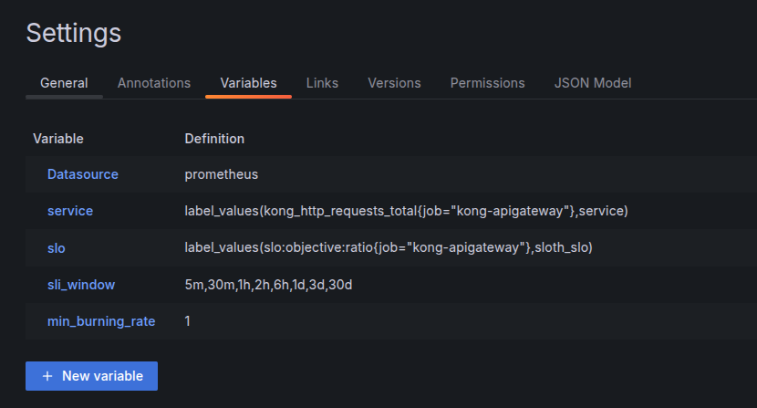
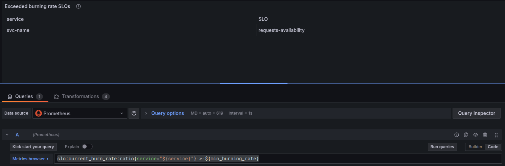
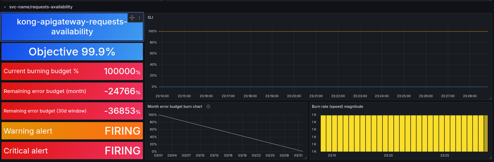
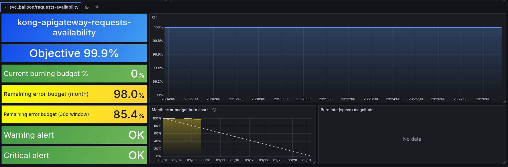

Title: What is SLA-SLO-SLI? SLO Generator introduction - Sloth and dynamic rules for SLO
Date: 2025-03-08
Category: Knowledge Base
Tags: SRE

# Concept, meaning, and example for SLA-SLO-SLI
I will try to explain with my ability and knowledge!

**1.SLA**:

- SLA is an abbreviation of word Service Level Agreement. It is a contract/agreement between you (service provider) and your customer/end user.
- What kind of contract?. Something like you promise you can make about level of service they can expect.
- Example: SLA might state: "The web application will have 99% uptime in a given month." This is a part of contractual, customer-facing part. It often tied to consequences like refunds or penalties if you don't meet. 
    - Give voucher discount 10%-20% cost of customer next time.
    - The technical team will not have KPI this month or even get salary reduced like 10%-20% xD
- The 99% uptime means the platform can be down for no more than about 7.2 hours in a 30-day month (30 × 24 × 0.01 = 7.2 hours)

**2.SLO**:

- SLO is an abbreviation of word Service Level Objective, the internal goal you set to ensure you meet the SLA. This is your operational target, more specific than SLA, and guides your team's day-to-day work.
- For your 99% uptime SLA, you might set SLO like: "The Application will be available 99.5% of the time, measured over a 30-day period."
- Why 99.5%? You don't want to have any alert or warning if SLA doesn't meet.
- Again, this is an internal target, you and your team need to monitor it, no need to show it to customer/end-user!

**3.SLI**:

- SLI is an abbreviation of word Service Level Indicator which you use to track how you are doing agaist your SLO.
- It's raw data/metrics you collect.
- For your uptime example: an SLI could be "The percentage of successful HTTP requests to the application, measured every minute", the success request can be counted as not containing 499 and 5xx status codes.
- If your app responds status code that does not contain 499 and 5xx for 99.7% of the time in a month, that is your SLI value.
- It tells you precisely how the service is performing and see if you are on track!

---

# SLO Generator - Sloth
As the title, SLO Generator. Sloth is a tool designed to simplify the management and creation of Service Level Object (SLO) for your service. Imagine your goal is to track request rate success in total requests. You probably have a query like this:
```
rate(http_requests_success[5m]) / rate(http_requests_total[5m])
```

But it is not enough for sure. Here is the list:

- Like how many percent left of SLO before it burned lower than your SLO? (99%). 
- Last hour more than 5% of requests have not been successful, have you noticed it?
- And many more i guess xD.

So Sloth is designed to handle those issues. It will create 3 rules:

1. SLI Rules: calculate request fails in many different SLI windows (5m, 30m, 1h, 2h, ....) used to check if service is failing SLO.
2. Metadata Rules: provide additional information like error budget, target of SLo is how much %
3. Alert Rules: create 2 types of alert
    - Critical/Page: Critical alert when error budget is burning fast. Example 10% in 5 minutes.
    - Warning/Ticket: warning alert, this is slowly burn error but still watch out. Example 2% in 1 hour.

### Sloth in action
- Probably detailed here: [https://sloth.dev/introduction/](https://sloth.dev/introduction/). This will generate rules for ya 1 service for 1 rule file which contains multiple rules.
- But imagine you have more than 1000 services like mine?:
    - Are you gonna create 1000 rules file++?
    - Yes, it is fine with a little automation script, but how about when a new service is added/deleted? Are you gonna do it again?
    - See? That is why i come with dynamic service for SLO. Let me tell you about it.

- Sloth for Api gateway which has 1000++ services. Only 1 file is needed. I', using Kong for internal API gateway
- `kong-slos.yaml`:
```yaml
version: "prometheus/v1"
service: "kong-apigateway"  # General name for the service
labels:
  job: "kong-apigateway"
  owner: "kienlt-team"
slos:
  - name: "requests-availability"
    objective: 99.9  # SLO 99.9% availability
    description: "Availability SLO for all Kong services"
    sli:
      events:
        error_query: 'sum(rate(kong_http_requests_total{job="kong-apigateway", code=~"5..|499"}[{{.window}}])) by (service)'
        total_query: 'sum(rate(kong_http_requests_total{job="kong-apigateway"}[{{.window}}])) by (service)'
    alerting:
      name: "KongServiceHighErrorRate"
      page_alert:
        labels:
          severity: "critical"
        annotations:
          summary: "Critical: {{$labels.service}} burning error budget too fast!"
          description: "Error rate > 5% for 5m on {{$labels.service}}."
      ticket_alert:
        labels:
          severity: "warning"
        annotations:
          summary: "Warning: {{$labels.service}} consuming error budget."
          description: "Error rate > 2% for 1h on {{$labels.service}}."
```
- Run command: `sloth generate -i kong-slos.yaml -o kong-slos-rules.yaml`
- Output of `kong-slos-rules.yaml`
```yaml

---
# Code generated by Sloth (v0.11.0): https://github.com/slok/sloth.
# DO NOT EDIT.

groups:
- name: sloth-slo-sli-recordings-kong-apigateway-requests-availability
  rules:
  - record: slo:sli_error:ratio_rate5m
    expr: |
      (sum(rate(kong_http_requests_total{job="kong-apigateway", code=~"5..|499"}[5m])) by (service))
      /
      (sum(rate(kong_http_requests_total{job="kong-apigateway"}[5m])) by (service))
    labels:
      job: kong-apigateway
      owner: kienlt-team
      sloth_id: kong-apigateway-requests-availability
      sloth_service: kong-apigateway
      sloth_slo: requests-availability
      sloth_window: 5m
  - record: slo:sli_error:ratio_rate30m
    expr: |
      (sum(rate(kong_http_requests_total{job="kong-apigateway", code=~"5..|499"}[30m])) by (service))
      /
      (sum(rate(kong_http_requests_total{job="kong-apigateway"}[30m])) by (service))
    labels:
      job: kong-apigateway
      owner: kienlt-team
      sloth_id: kong-apigateway-requests-availability
      sloth_service: kong-apigateway
      sloth_slo: requests-availability
      sloth_window: 30m
  - record: slo:sli_error:ratio_rate1h
    expr: |
      (sum(rate(kong_http_requests_total{job="kong-apigateway", code=~"5..|499"}[1h])) by (service))
      /
      (sum(rate(kong_http_requests_total{job="kong-apigateway"}[1h])) by (service))
      ....... AND THE REST ....... I don't want to include it fully here since it is generated!
```

- Apply those rules to Prometheus, in my case, it was Victoria Metrics (vmalert)
- Now we have rules for it, but none of service metrics are available? For common, you will have to wait 30 days to get enough metrics for your SLOs. But don't worry, Victoria Metrics have feature that backfilling data for our SLO rules. Link for it in **Ref** section. P/S: I have no idea how it works in Prometheus since i'm not using it, only for `remoteWrite` xD.
- And we still have 1 more important thing to make it complete which is to modify the Dashboard to fit with dynamic service.

### Grafana dashboard modify:
- Sloth will use 2 dashboards from here: [https://sloth.dev/introduction/dashboards/](https://sloth.dev/introduction/dashboards/)
- Let's begin with dashboard: `SLO / Detail`
- We have to modify some variables




- Next, modify query to filter by service: **slo:current_burn_rate:ratio{service="${service}"} > ${min_burning_rate}**. And do the same for the rest!



- This is demo of service have none error budget left



- This is demo of service have no issue with error budget



# Conclusion
- This is a great way to improve service quality
- With correct SLOs, you can make promises, agreement with your customer/end user
- This consumed about 4 days of mine, the most issue was part after setup dashboard and dynamic/static service. I have no data. But with little recommend that recording metadata need to run calculate with vmalert rules-replay. I'm able to finish the task that setup SLO for Kong - APIGATEWAY

# Ref:
- [Reliability and Resilience: The Dynamic Duo of SRE](https://www.youtube.com/watch?v=zMqo4NXDr3g&lc=UgzsXWLBPB-t0LmNyUl4AaABAg)
- [Rules backfilling via vmalert](https://victoriametrics.com/blog/rules-replay/)