Title: Canary/Blue-Green deployment with Argocd Rollouts
Date: 2025-03-10
Category: Knowledge Base
Tags: devops, k8s

# What is Argocd Rollouts, is it related to ArgoCD?
- Argocd Rollouts is a progressive delivery controller for K8S which provide avanced deployment capabilities such as blue-green, canary.....

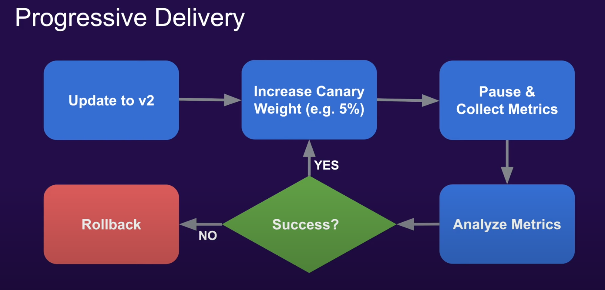

- It doesn't related to ArgoCD. Argo Rollouts is often used in conjunction with Argo CD, the Argo project’s continuous delivery (CD) tool. Argo CD implements declarative GitOps-driven CD for Kubernetes, while Rollouts offers a controller and CRDs that let you robustly manage blue-green and canary deployments

--- 

# What is Canary/Blue-Green deployment?
Umm, if i explain complete for this, this article will be long to read so i will not include here, only focus on main objective.

In case of you don't know about it, google is your friend xD

---

# Installation

### Install Argo Rollouts
- I will use default install, assume you have Argocd installed

```
kubectl create namespace argo-rollouts
kubectl apply -n argo-rollouts -f https://github.com/argoproj/argo-rollouts/releases/latest/download/install.yaml
```

- Output after command executed is like this:

```bash
namespace/argo-rollouts created
customresourcedefinition.apiextensions.k8s.io/analysisruns.argoproj.io created
customresourcedefinition.apiextensions.k8s.io/analysistemplates.argoproj.io created
customresourcedefinition.apiextensions.k8s.io/clusteranalysistemplates.argoproj.io created
customresourcedefinition.apiextensions.k8s.io/experiments.argoproj.io created
customresourcedefinition.apiextensions.k8s.io/rollouts.argoproj.io created
serviceaccount/argo-rollouts created
clusterrole.rbac.authorization.k8s.io/argo-rollouts created
clusterrole.rbac.authorization.k8s.io/argo-rollouts-aggregate-to-admin created
clusterrole.rbac.authorization.k8s.io/argo-rollouts-aggregate-to-edit created
clusterrole.rbac.authorization.k8s.io/argo-rollouts-aggregate-to-view created
clusterrolebinding.rbac.authorization.k8s.io/argo-rollouts created
configmap/argo-rollouts-config created
secret/argo-rollouts-notification-secret created
service/argo-rollouts-metrics created
deployment.apps/argo-rollouts created
```

- Make sure argo rollout controller is ready: `kubectl get pods -n argo-rollouts`

```
NAME                             READY   STATUS    RESTARTS   AGE
argo-rollouts-5498f9bc4b-8xt26   1/1     Running   0          69s
```

- Extra note: If you have multiple k8s clusters like mine, you have to install Argo Rollout to each cluster you want to use feature rollouts for canary/blue-green deployment.

### Install kubectl plugin for Argo Rollouts
- Download and install
```
curl -LO https://github.com/argoproj/argo-rollouts/releases/latest/download/kubectl-argo-rollouts-linux-amd64
chmod +x kubectl-argo-rollouts-linux-amd64
sudo mv kubectl-argo-rollouts-linux-amd64 /usr/local/bin/kubectl-argo-rollouts
```
- Check: `kubectl argo rollouts version`
```
kubectl-argo-rollouts: v1.8.0+9c5d75d
  BuildDate: 2025-01-30T15:54:30Z
  GitCommit: 9c5d75d84a998bc0515caa64085bf8c23f2a41b7
  GitTreeState: clean
  GoVersion: go1.23.5
  Compiler: gc
  Platform: linux/amd64
```

--- 
# Testing canary rollout
### Change from deployment to canary rollout 
- I already have argocd deployment with helm running, now i want to migrate it to Argocd rollouts. How i can achieve this?
First, remove `deployment.yaml` and add [rollout.yaml](https://github.com/BlackMetalz/k8s-manifest/blob/main/golang-webapp-testing/templates/rollout.yaml).
You will notice little change in in `apiVersion` and `kind`. Then `strategy`, it will be define like belows

```
  strategy:
      canary:
        steps:
          - setWeight: 25  # 25% traffic to new version (with replica count 4, 1 pod will be updated)
          - pause: { duration: 300s }  # wait 5 minutes before next step
          - setWeight: 50  #  50% traffic to new version
          - pause: {}  # wait indefinitely for manual approval
```

- Example picture after switch from deployment to rollout

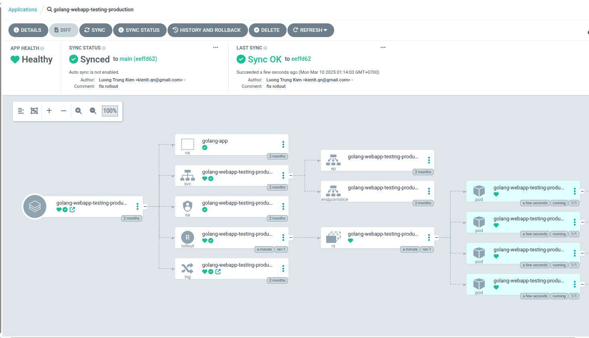

- Check current version before rollout with canary:
```
for i in {0..100}; do curl -XGET "http://golang-webapp-testing.rke2-cluster.kienlt.local/version"; done
Version: 2.1.1
Version: 2.1.1
Version: 2.1.1
Version: 2.1.1
Version: 2.1.1
Version: 2.1.1
Version: 2.1.1
Version: 2.1.1
Version: 2.1.1
```

- Ok. Lets build new image and manually switch image tag for the fast demo. Assume new tag will be **v3.0.0**. Code repo:  [https://github.com/BlackMetalz/Golang-Webapp-Testing](https://github.com/BlackMetalz/Golang-Webapp-Testing) 

```
docker build . -t kienlt992/golang-webapp-testing:v3.0.0
docker push kienlt992/golang-webapp-testing:v3.0.0
```

- Check current status of rollout after migrate:

`kubectl argo rollouts get rollout -n golang-app golang-webapp-testing-production`

```
Name:            golang-webapp-testing-production
Namespace:       golang-app
Status:          ✔ Healthy
Strategy:        Canary
  Step:          4/4
  SetWeight:     100
  ActualWeight:  100
Images:          kienlt992/golang-webapp-testing:v2.1.1 (stable)
Replicas:
  Desired:       4
  Current:       4
  Updated:       4
  Ready:         4
  Available:     4

NAME                                                          KIND        STATUS     AGE  INFO
⟳ golang-webapp-testing-production                            Rollout     ✔ Healthy  18m  
└──# revision:1                                                                           
   └──⧉ golang-webapp-testing-production-6f5b799cf7           ReplicaSet  ✔ Healthy  18m  stable
      ├──□ golang-webapp-testing-production-6f5b799cf7-b5rh7  Pod         ✔ Running  18m  ready:1/1
      ├──□ golang-webapp-testing-production-6f5b799cf7-d9j8r  Pod         ✔ Running  18m  ready:1/1
      ├──□ golang-webapp-testing-production-6f5b799cf7-df5b9  Pod         ✔ Running  18m  ready:1/1
      └──□ golang-webapp-testing-production-6f5b799cf7-njrfn  Pod         ✔ Running  18m  ready:1/1
```

- Ok, now update manifest to use image v3.0.0 and sync. Then use command to watch rollout progress: 
```
kubectl argo rollouts get rollout -n golang-app golang-webapp-testing-production --watch
```

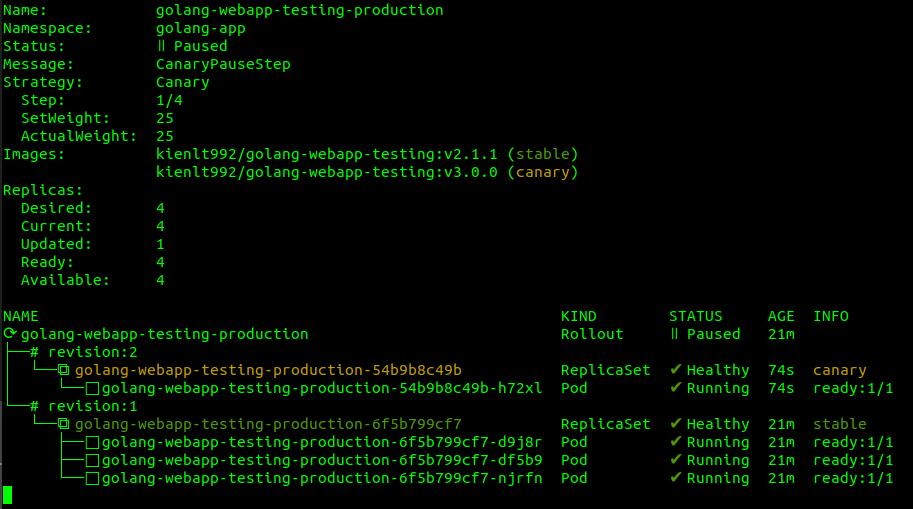

- Output for check version, you can see there is some requests have version 3.0.0 already!
```
for i in {0..100}; do curl -XGET "http://golang-webapp-testing.rke2-cluster.kienlt.local/version" && sleep 1; done
Version: 3.0.0
Version: 2.1.1
Version: 2.1.1
Version: 3.0.0
Version: 3.0.0
Version: 2.1.1
Version: 2.1.1
Version: 2.1.1
Version: 2.1.1
Version: 2.1.1
Version: 2.1.1
Version: 2.1.1
```

- After 5 minutes, rollout for canary will increased to 50% as we defined in rollout

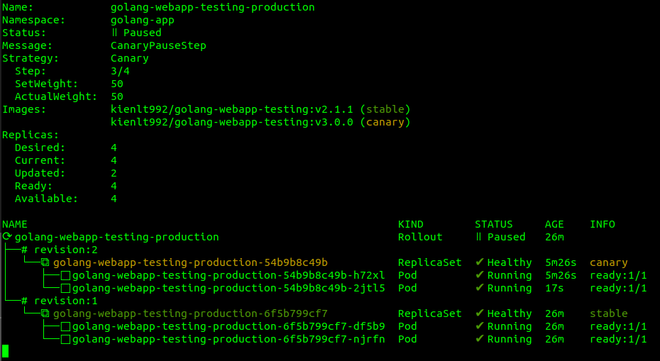

- We assume our application is good and ready to promote 50% left for complete rollout.

```
kubectl argo rollouts promote -n golang-app golang-webapp-testing-production
rollout 'golang-webapp-testing-production' promoted
```

- Check again rollout status for the final

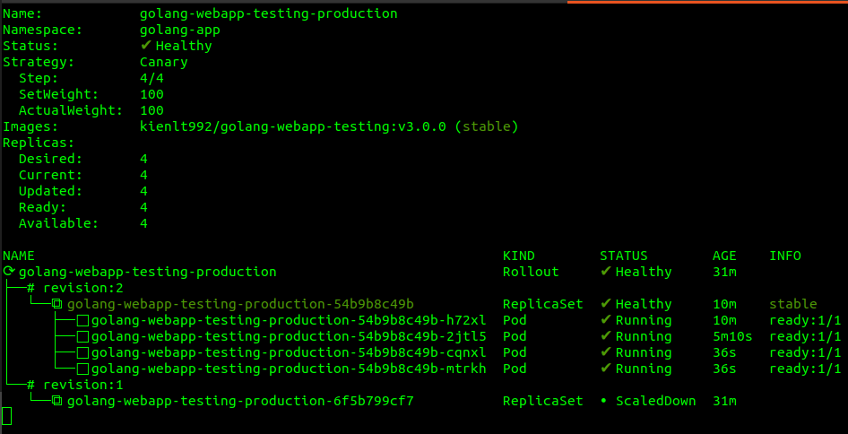

- Check request again, you can see it is 100% switch to version 3.0.0 right now!
```
for i in {0..100}; do curl -XGET "http://golang-webapp-testing.rke2-cluster.kienlt.local/version" && sleep 1; done
Version: 3.0.0
Version: 3.0.0
Version: 3.0.0
Version: 3.0.0
Version: 3.0.0
Version: 3.0.0
Version: 3.0.0
Version: 3.0.0
Version: 3.0.0
Version: 3.0.0
.......
```

### How could we monitor and rollback canary deployment if new version have issue?
- This is a good question to improve this article. Let's create canary deployment first:
```bash
kubectl argo rollouts get rollout golang-webapp-testing-production -n golang-app
Name:            golang-webapp-testing-production
Namespace:       golang-app
Status:          ॥ Paused
Message:         CanaryPauseStep
Strategy:        Canary
  Step:          3/4
  SetWeight:     50
  ActualWeight:  50
Images:          kienlt992/golang-webapp-testing:v4.0.0 (stable)
                 kienlt992/golang-webapp-testing:v5.0.0 (canary)
Replicas:
  Desired:       4
  Current:       4
  Updated:       2
  Ready:         4
  Available:     4

NAME                                                          KIND        STATUS        AGE    INFO
⟳ golang-webapp-testing-production                            Rollout     ॥ Paused      46h    
├──# revision:10                                                                               
│  └──⧉ golang-webapp-testing-production-6c8c79b696           ReplicaSet  ✔ Healthy     6m56s  canary
│     ├──□ golang-webapp-testing-production-6c8c79b696-dsltf  Pod         ✔ Running     6m56s  ready:1/1
│     └──□ golang-webapp-testing-production-6c8c79b696-ggh56  Pod         ✔ Running     107s   ready:1/1
├──# revision:9                                                                                
│  └──⧉ golang-webapp-testing-production-86bb7d659f           ReplicaSet  ✔ Healthy     30h    stable
│     ├──□ golang-webapp-testing-production-86bb7d659f-r6drp  Pod         ✔ Running     16m    ready:1/1
│     └──□ golang-webapp-testing-production-86bb7d659f-zgv7h  Pod         ✔ Running     16m    ready:1/1
```


- Make some request for test, you can see status code 504 right below
```bash
while true;do  status_code=$(curl -s -o /dev/null -w "%{http_code}" http://golang-webapp-testing.rke2-cluster.kienlt.local/version); echo "Status code: $status_code"; sleep 1; done
Status code: 504
Status code: 200
Status code: 200
Status code: 200
Status code: 200
Status code: 200
Status code: 200
Status code: 200
Status code: 200
Status code: 504
Status code: 200
Status code: 200
Status code: 200
Status code: 200
Status code: 200
Status code: 200
Status code: 200
Status code: 504
Status code: 200
Status code: 504
```

- Query in prometheus:

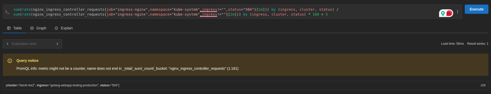

- Wait for a little times and see the alert:

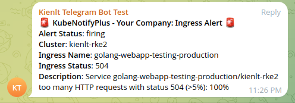

- Hmm? Wait a minute? 100%? This is not correct. Let's me fix this by correct prometheus rule xD

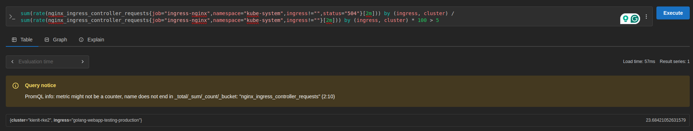

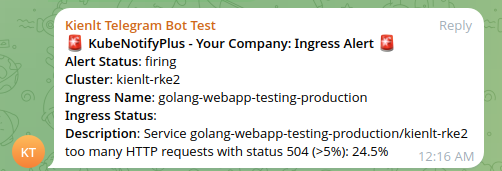

- Now we need to rollback the canary rollout. And request will be 200 again
```bash
kubectl argo rollouts abort  golang-webapp-testing-production -n golang-app
rollout 'golang-webapp-testing-production' aborted
```

- Get rollout status:
```bash
kubectl argo rollouts get rollout golang-webapp-testing-production -n golang-app
Name:            golang-webapp-testing-production
Namespace:       golang-app
Status:          ✖ Degraded
Message:         RolloutAborted: Rollout aborted update to revision 10
Strategy:        Canary
  Step:          0/4
  SetWeight:     0
  ActualWeight:  0
Images:          kienlt992/golang-webapp-testing:v4.0.0 (stable)
Replicas:
  Desired:       4
  Current:       4
  Updated:       0
  Ready:         4
  Available:     4

NAME                                                          KIND        STATUS        AGE  INFO
⟳ golang-webapp-testing-production                            Rollout     ✖ Degraded    46h  
├──# revision:10                                                                             
│  └──⧉ golang-webapp-testing-production-6c8c79b696           ReplicaSet  • ScaledDown  21m  canary
├──# revision:9                                                                              
│  └──⧉ golang-webapp-testing-production-86bb7d659f           ReplicaSet  ✔ Healthy     30h  stable
│     ├──□ golang-webapp-testing-production-86bb7d659f-r6drp  Pod         ✔ Running     30m  ready:1/1
│     ├──□ golang-webapp-testing-production-86bb7d659f-zgv7h  Pod         ✔ Running     30m  ready:1/1
│     ├──□ golang-webapp-testing-production-86bb7d659f-6bbhk  Pod         ✔ Running     32s  ready:1/1
│     └──□ golang-webapp-testing-production-86bb7d659f-6qfbd  Pod         ✔ Running     32s  ready:1/1
```

- After sometimes....

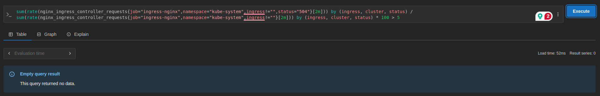

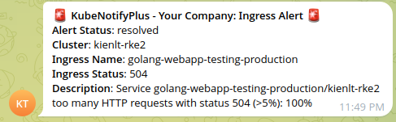

- Let's make status Healthy again by (Don't focus on correct revision, i was test abort and promote mulitple times And it won't affect at all i guess xD)
```bash
# kubectl argo rollouts undo golang-webapp-testing-production --to-revision=9 -n golang-app
INFO[0000] unknown field "spec.template.metadata.creationTimestamp" 
rollout 'golang-webapp-testing-production' undo
# kubectl argo rollouts get rollout golang-webapp-testing-production -n golang-app
Name:            golang-webapp-testing-production
Namespace:       golang-app
Status:          ✔ Healthy
Strategy:        Canary
  Step:          4/4
  SetWeight:     100
  ActualWeight:  100
Images:          kienlt992/golang-webapp-testing:v4.0.0 (stable)
Replicas:
  Desired:       4
  Current:       4
  Updated:       4
  Ready:         4
  Available:     4

NAME                                                          KIND        STATUS        AGE    INFO
⟳ golang-webapp-testing-production                            Rollout     ✔ Healthy     47h    
├──# revision:13                                                                               
│  └──⧉ golang-webapp-testing-production-86bb7d659f           ReplicaSet  ✔ Healthy     31h    stable
│     ├──□ golang-webapp-testing-production-86bb7d659f-r6drp  Pod         ✔ Running     77m    ready:1/1
│     ├──□ golang-webapp-testing-production-86bb7d659f-zgv7h  Pod         ✔ Running     77m    ready:1/1
│     ├──□ golang-webapp-testing-production-86bb7d659f-hwd2s  Pod         ✔ Running     3m43s  ready:1/1
│     └──□ golang-webapp-testing-production-86bb7d659f-mt5fp  Pod         ✔ Running     3m43s  ready:1/1
├──# revision:12                                                                               
│  └──⧉ golang-webapp-testing-production-6c8c79b696           ReplicaSet  • ScaledDown  67m    
├──# revision:11                                                                               
│  └──⧉ golang-webapp-testing-production-54b9b8c49b           ReplicaSet  • ScaledDown  46h    
└──# revision:1                                                                                
   └──⧉ golang-webapp-testing-production-6f5b799cf7           ReplicaSet  • ScaledDown  47h    
```
---

# Trying blue-green deployment

### Config rollout for blue-green
- Just change `strategy` section from previous rollout:
```yaml
  strategy:
      blueGreen:
        activeService: {{ include "golang-webapp-testing.fullname" . }}-active
        previewService: {{ include "golang-webapp-testing.fullname" . }}-passive
        autoPromotionEnabled: false  # Do not automatically promote the new ReplicaSet to the active service
        # autoPromotionSeconds: 300  # Wait 300 seconds before automatically promoting the new ReplicaSet to the active service
```

- Add/Update service for blue-green deployment
```
apiVersion: v1
kind: Service
metadata:
  name: {{ include "golang-webapp-testing.fullname" . }}-active
  labels:
    {{- include "golang-webapp-testing.labels" . | nindent 4 }}
spec:
  type: {{ .Values.service.type }}
  ports:
    - port: {{ .Values.service.port }}
      targetPort: http
      protocol: TCP
      name: http
  selector:
    {{- include "golang-webapp-testing.selectorLabels" . | nindent 4 }}
---
apiVersion: v1
kind: Service
metadata:
  name: {{ include "golang-webapp-testing.fullname" . }}-passive
  labels:
    {{- include "golang-webapp-testing.labels" . | nindent 4 }}
spec:
  type: {{ .Values.service.type }}
  ports:
    - port: {{ .Values.service.port }}
      targetPort: http
      protocol: TCP
      name: http
  selector:
    {{- include "golang-webapp-testing.selectorLabels" . | nindent 4 }}
```

- Also you need to update your ingress as well (like mine) for expose service. Just add *-active* after service name. Then you will be able access your service after switch to blue-green rollouts. 
```
{{- if .Values.ingress.enabled -}}
{{- $fullName := include "golang-webapp-testing.fullname" . -}}
{{- $svcPort := .Values.service.port -}}
....... etc ...........
  rules:
    {{- range .Values.ingress.hosts }}
    - host: {{ .host | quote }}
      http:
        paths:
          {{- range .paths }}
          - path: {{ .path }}
            {{- if and .pathType (semverCompare ">=1.18-0" $.Capabilities.KubeVersion.GitVersion) }}
            pathType: {{ .pathType }}
            {{- end }}
            backend:
              {{- if semverCompare ">=1.19-0" $.Capabilities.KubeVersion.GitVersion }}
              service:
                name: {{ $fullName }}-active
                port:
                  number: {{ $svcPort }}
              {{- else }}
              serviceName: {{ $fullName }}-active
              servicePort: {{ $svcPort }}
```

- After that, push the changes to manifest repo and get sync with Argocd.

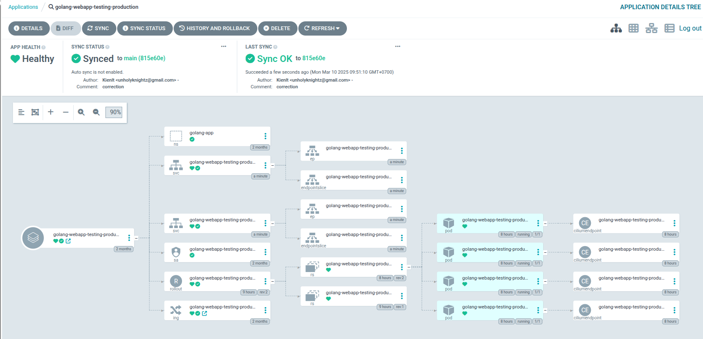

- Check rollout status after Argocd healthy. You can see Strategy changed to **BlueGreen**
```
# kubectl argo rollouts get rollout -n golang-app golang-webapp-testing-production
Name:            golang-webapp-testing-production
Namespace:       golang-app
Status:          ✔ Healthy
Strategy:        BlueGreen
Images:          kienlt992/golang-webapp-testing:v3.0.0 (stable, active)
Replicas:
  Desired:       4
  Current:       4
  Updated:       4
  Ready:         4
  Available:     4

NAME                                                          KIND        STATUS        AGE  INFO
⟳ golang-webapp-testing-production                            Rollout     ✔ Healthy     15h  
├──# revision:2                                                                              
│  └──⧉ golang-webapp-testing-production-54b9b8c49b           ReplicaSet  ✔ Healthy     15h  stable,active
│     ├──□ golang-webapp-testing-production-54b9b8c49b-h72xl  Pod         ✔ Running     15h  ready:1/1
│     ├──□ golang-webapp-testing-production-54b9b8c49b-2jtl5  Pod         ✔ Running     15h  ready:1/1
│     ├──□ golang-webapp-testing-production-54b9b8c49b-cqnxl  Pod         ✔ Running     15h  ready:1/1
│     └──□ golang-webapp-testing-production-54b9b8c49b-mtrkh  Pod         ✔ Running     15h  ready:1/1
└──# revision:1                                                                              
   └──⧉ golang-webapp-testing-production-6f5b799cf7           ReplicaSet  • ScaledDown  15h  
```

- Let's update new image in helm values file. Changed from **v3.0.0** to **v4.0.0**
```bash
   # Overrides the image tag whose default is the chart appVersion.
-  tag: "v3.0.0"
+  tag: "v4.0.0"
```

- Let's see what happens after we push manifest. You can see rollout status still version v3.0.0 because in strategy of rollout, i required manually promote, not auto after xxx times

First with check version still is **3.0.0**
```bash
curl "http://golang-webapp-testing.rke2-cluster.kienlt.local/version"
Version: 3.0.0
```

Second check status via Argocd UI

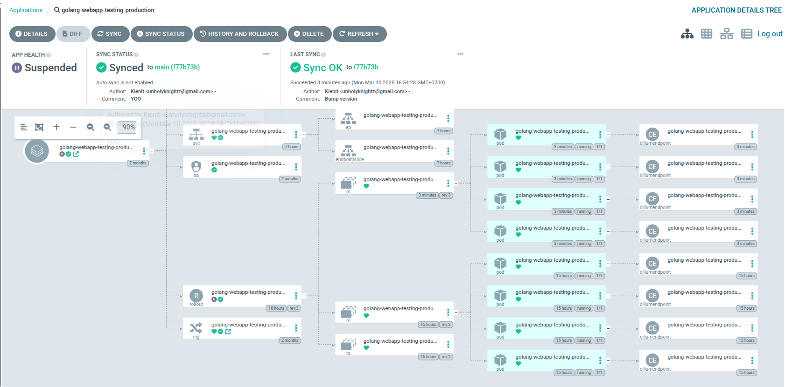

And Rollout status via CLI

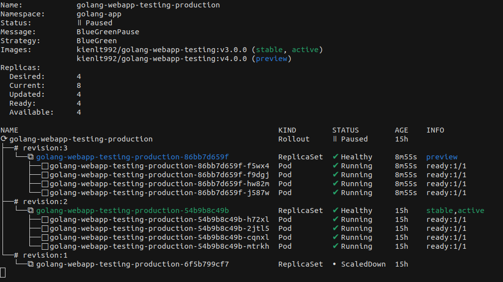

- I will promote and see what happens, i like to use CLI instead of UI sometimes xD

```bash
# kubectl argo rollouts promote golang-webapp-testing-production -n golang-app
rollout 'golang-webapp-testing-production' promoted
```

Rollout status

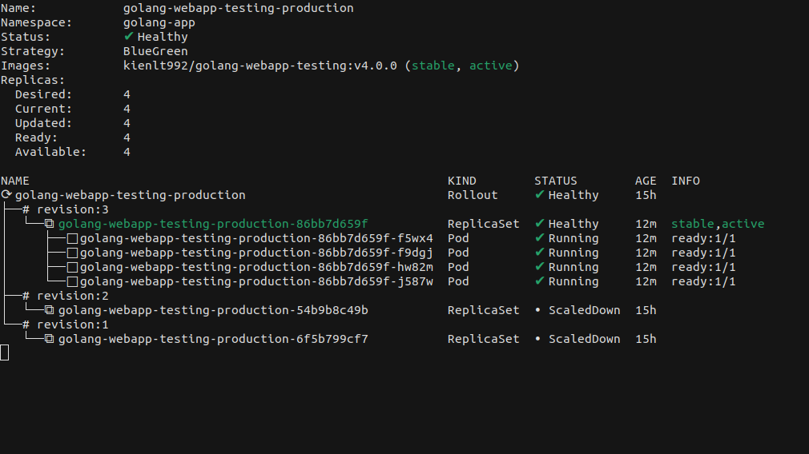

Argocd UI

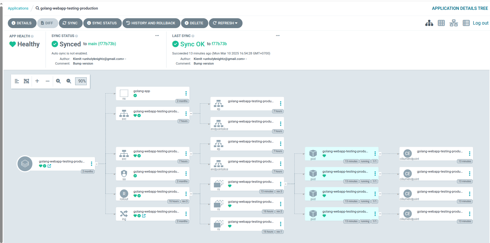

Check version again:

```bash
curl "http://golang-webapp-testing.rke2-cluster.kienlt.local/version"
Version: 4.0.0
```

- Complete manifest for blue-green here: 
[golang-webapp-testing-bluegreen](https://github.com/BlackMetalz/k8s-manifest/tree/main/golang-webapp-testing-bluegreen)

### How about rollback, not promote for blue-green deployment? 
- I will go for real quick! Here is status:
```bash
kubectl argo rollouts get rollout golang-webapp-testing-production -n golang-app
Name:            golang-webapp-testing-production
Namespace:       golang-app
Status:          ॥ Paused
Message:         BlueGreenPause
Strategy:        BlueGreen
Images:          kienlt992/golang-webapp-testing:v3.0.0 (preview)
                 kienlt992/golang-webapp-testing:v4.0.0 (stable, active)
Replicas:
  Desired:       4
  Current:       8
  Updated:       4
  Ready:         4
  Available:     4

NAME                                                          KIND        STATUS        AGE    INFO
⟳ golang-webapp-testing-production                            Rollout     ॥ Paused      45h    
├──# revision:6                                                                                
│  └──⧉ golang-webapp-testing-production-54b9b8c49b           ReplicaSet  ✔ Healthy     45h    preview
│     ├──□ golang-webapp-testing-production-54b9b8c49b-g6f86  Pod         ✔ Running     65s    ready:1/1
│     ├──□ golang-webapp-testing-production-54b9b8c49b-rmqk2  Pod         ✔ Running     65s    ready:1/1
│     ├──□ golang-webapp-testing-production-54b9b8c49b-znvvw  Pod         ✔ Running     65s    ready:1/1
│     └──□ golang-webapp-testing-production-54b9b8c49b-zsxf7  Pod         ✔ Running     65s    ready:1/1
├──# revision:5                                                                                
│  └──⧉ golang-webapp-testing-production-86bb7d659f           ReplicaSet  ✔ Healthy     29h    stable,active
│     ├──□ golang-webapp-testing-production-86bb7d659f-gdkn2  Pod         ✔ Running     7m25s  ready:1/1
│     ├──□ golang-webapp-testing-production-86bb7d659f-q9p6d  Pod         ✔ Running     7m22s  ready:1/1
│     ├──□ golang-webapp-testing-production-86bb7d659f-ftxck  Pod         ✔ Running     7m21s  ready:1/1
│     └──□ golang-webapp-testing-production-86bb7d659f-25np2  Pod         ✔ Running     7m19s  ready:1/1
└──# revision:1                                                                                
   └──⧉ golang-webapp-testing-production-6f5b799cf7           ReplicaSet  • ScaledDown  45h 
---
# curl "http://golang-webapp-testing.rke2-cluster.kienlt.local/version"
Version: 4.0.0
```

- Abort the rollout: 
```bash
kubectl argo rollouts abort -n golang-app golang-webapp-testing-production
rollout 'golang-webapp-testing-production' aborted
```

- Get status again and see preview gone
```bash
Name:            golang-webapp-testing-production
Namespace:       golang-app
Status:          ✖ Degraded
Message:         RolloutAborted: Rollout aborted update to revision 6
Strategy:        BlueGreen
Images:          kienlt992/golang-webapp-testing:v4.0.0 (stable, active)
Replicas:
  Desired:       4
  Current:       4
  Updated:       0
  Ready:         4
  Available:     4

NAME                                                          KIND        STATUS        AGE  INFO
⟳ golang-webapp-testing-production                            Rollout     ✖ Degraded    45h  
├──# revision:6                                                                              
│  └──⧉ golang-webapp-testing-production-54b9b8c49b           ReplicaSet  • ScaledDown  45h  preview,delay:passed
├──# revision:5                                                                              
│  └──⧉ golang-webapp-testing-production-86bb7d659f           ReplicaSet  ✔ Healthy     30h  stable,active
│     ├──□ golang-webapp-testing-production-86bb7d659f-gdkn2  Pod         ✔ Running     13m  ready:1/1
│     ├──□ golang-webapp-testing-production-86bb7d659f-q9p6d  Pod         ✔ Running     13m  ready:1/1
│     ├──□ golang-webapp-testing-production-86bb7d659f-ftxck  Pod         ✔ Running     13m  ready:1/1
│     └──□ golang-webapp-testing-production-86bb7d659f-25np2  Pod         ✔ Running     13m  ready:1/1
└──# revision:1                                                                              
   └──⧉ golang-webapp-testing-production-6f5b799cf7           ReplicaSet  • ScaledDown  45h  
```

- Undo rollback to version 5 to make status healthy again:
```bash
kubectl argo rollouts undo golang-webapp-testing-production --to-revision=5 -n golang-app
INFO[0000] unknown field "spec.template.metadata.creationTimestamp" 
rollout 'golang-webapp-testing-production' undo
```

- The result after undo:
```bash
kubectl argo rollouts get rollout golang-webapp-testing-production -n golang-app
Name:            golang-webapp-testing-production
Namespace:       golang-app
Status:          ✔ Healthy
Strategy:        BlueGreen
Images:          kienlt992/golang-webapp-testing:v4.0.0 (stable, active)
Replicas:
  Desired:       4
  Current:       4
  Updated:       4
  Ready:         4
  Available:     4

NAME                                                          KIND        STATUS        AGE  INFO
⟳ golang-webapp-testing-production                            Rollout     ✔ Healthy     45h  
├──# revision:7                                                                              
│  └──⧉ golang-webapp-testing-production-86bb7d659f           ReplicaSet  ✔ Healthy     30h  stable,active
│     ├──□ golang-webapp-testing-production-86bb7d659f-gdkn2  Pod         ✔ Running     15m  ready:1/1
│     ├──□ golang-webapp-testing-production-86bb7d659f-q9p6d  Pod         ✔ Running     15m  ready:1/1
│     ├──□ golang-webapp-testing-production-86bb7d659f-ftxck  Pod         ✔ Running     15m  ready:1/1
│     └──□ golang-webapp-testing-production-86bb7d659f-25np2  Pod         ✔ Running     15m  ready:1/1
├──# revision:6                                                                              
│  └──⧉ golang-webapp-testing-production-54b9b8c49b           ReplicaSet  • ScaledDown  45h  delay:passed
└──# revision:1                                                                              
   └──⧉ golang-webapp-testing-production-6f5b799cf7           ReplicaSet  • ScaledDown  45h  
```

### Next scenario, undo the promoted in blue-green deployment
- I will not post fully detail since they are just the same with little different.
```bash
kubectl argo rollouts promote golang-webapp-testing-production -n golang-app
rollout 'golang-webapp-testing-production' promoted
---
curl "http://golang-webapp-testing.rke2-cluster.kienlt.local/version"
Version: 3.0.0
```

- Get status:
```bash
kubectl argo rollouts get rollout golang-webapp-testing-production -n golang-app
Name:            golang-webapp-testing-production
Namespace:       golang-app
Status:          ✔ Healthy
Strategy:        BlueGreen
Images:          kienlt992/golang-webapp-testing:v3.0.0 (stable, active)
                 kienlt992/golang-webapp-testing:v4.0.0
Replicas:
  Desired:       4
  Current:       8
  Updated:       4
  Ready:         4
  Available:     4

NAME                                                          KIND        STATUS        AGE  INFO
⟳ golang-webapp-testing-production                            Rollout     ✔ Healthy     45h  
├──# revision:8                                                                              
│  └──⧉ golang-webapp-testing-production-54b9b8c49b           ReplicaSet  ✔ Healthy     45h  stable,active
│     ├──□ golang-webapp-testing-production-54b9b8c49b-b6ss5  Pod         ✔ Running     80s  ready:1/1
│     ├──□ golang-webapp-testing-production-54b9b8c49b-fkm6b  Pod         ✔ Running     80s  ready:1/1
│     ├──□ golang-webapp-testing-production-54b9b8c49b-xm2jt  Pod         ✔ Running     80s  ready:1/1
│     └──□ golang-webapp-testing-production-54b9b8c49b-bnkvq  Pod         ✔ Running     79s  ready:1/1
├──# revision:7                                                                              
│  └──⧉ golang-webapp-testing-production-86bb7d659f           ReplicaSet  ✔ Healthy     30h  delay:23s
│     ├──□ golang-webapp-testing-production-86bb7d659f-gdkn2  Pod         ✔ Running     21m  ready:1/1
│     ├──□ golang-webapp-testing-production-86bb7d659f-q9p6d  Pod         ✔ Running     21m  ready:1/1
│     ├──□ golang-webapp-testing-production-86bb7d659f-ftxck  Pod         ✔ Running     21m  ready:1/1
│     └──□ golang-webapp-testing-production-86bb7d659f-25np2  Pod         ✔ Running     21m  ready:1/1
└──# revision:1                                                                              
   └──⧉ golang-webapp-testing-production-6f5b799cf7           ReplicaSet  • ScaledDown  45h  
```

- Undo to previous version which is 7:
```bash
kubectl argo rollouts undo golang-webapp-testing-production --to-revision=7 -n golang-app
INFO[0000] unknown field "spec.template.metadata.creationTimestamp" 
rollout 'golang-webapp-testing-production' undo
# Need to promote as well
kubectl argo rollouts promote golang-webapp-testing-production -n golang-app
rollout 'golang-webapp-testing-production' promoted
```

- After that, get status again, after 2-3 minutes it will remove pods in old revision (which is revision 8 in output)
```bash
Name:            golang-webapp-testing-production
Namespace:       golang-app
Status:          ✔ Healthy
Strategy:        BlueGreen
Images:          kienlt992/golang-webapp-testing:v3.0.0
                 kienlt992/golang-webapp-testing:v4.0.0 (stable, active)
Replicas:
  Desired:       4
  Current:       8
  Updated:       4
  Ready:         4
  Available:     4

NAME                                                          KIND        STATUS        AGE    INFO
⟳ golang-webapp-testing-production                            Rollout     ✔ Healthy     45h    
├──# revision:9                                                                                
│  └──⧉ golang-webapp-testing-production-86bb7d659f           ReplicaSet  ✔ Healthy     30h    stable,active
│     ├──□ golang-webapp-testing-production-86bb7d659f-582kj  Pod         ✔ Running     44s    ready:1/1
│     ├──□ golang-webapp-testing-production-86bb7d659f-bsb8v  Pod         ✔ Running     44s    ready:1/1
│     ├──□ golang-webapp-testing-production-86bb7d659f-r6drp  Pod         ✔ Running     44s    ready:1/1
│     └──□ golang-webapp-testing-production-86bb7d659f-zgv7h  Pod         ✔ Running     44s    ready:1/1
├──# revision:8                                                                                
│  └──⧉ golang-webapp-testing-production-54b9b8c49b           ReplicaSet  ✔ Healthy     45h    delay:27s
│     ├──□ golang-webapp-testing-production-54b9b8c49b-b6ss5  Pod         ✔ Running     3m34s  ready:1/1
│     ├──□ golang-webapp-testing-production-54b9b8c49b-fkm6b  Pod         ✔ Running     3m34s  ready:1/1
│     ├──□ golang-webapp-testing-production-54b9b8c49b-xm2jt  Pod         ✔ Running     3m34s  ready:1/1
│     └──□ golang-webapp-testing-production-54b9b8c49b-bnkvq  Pod         ✔ Running     3m33s  ready:1/1
└──# revision:1                                                                                
   └──⧉ golang-webapp-testing-production-6f5b799cf7           ReplicaSet  • ScaledDown  45h
# This is output after 2-3 minutes (maybe lower xD)
Name:            golang-webapp-testing-production
Namespace:       golang-app
Status:          ✔ Healthy
Strategy:        BlueGreen
Images:          kienlt992/golang-webapp-testing:v4.0.0 (stable, active)
Replicas:
  Desired:       4
  Current:       4
  Updated:       4
  Ready:         4
  Available:     4

NAME                                                          KIND        STATUS        AGE    INFO
⟳ golang-webapp-testing-production                            Rollout     ✔ Healthy     45h    
├──# revision:9                                                                                
│  └──⧉ golang-webapp-testing-production-86bb7d659f           ReplicaSet  ✔ Healthy     30h    stable,active
│     ├──□ golang-webapp-testing-production-86bb7d659f-582kj  Pod         ✔ Running     3m16s  ready:1/1
│     ├──□ golang-webapp-testing-production-86bb7d659f-bsb8v  Pod         ✔ Running     3m16s  ready:1/1
│     ├──□ golang-webapp-testing-production-86bb7d659f-r6drp  Pod         ✔ Running     3m16s  ready:1/1
│     └──□ golang-webapp-testing-production-86bb7d659f-zgv7h  Pod         ✔ Running     3m16s  ready:1/1
├──# revision:8                                                                                
│  └──⧉ golang-webapp-testing-production-54b9b8c49b           ReplicaSet  • ScaledDown  45h    
└──# revision:1                                                                                
   └──⧉ golang-webapp-testing-production-6f5b799cf7           ReplicaSet  • ScaledDown  45h    
# curl "http://golang-webapp-testing.rke2-cluster.kienlt.local/version"
Version: 4.0.0
```

# Conclusion
- This is just basic of canary/blue-green deployment with Argo Rollout. But good step for beginner like me.
- Know concept is important more than know step.

# Ref:
- [Argo Rollouts - Kubernetes Progressive Delivery Controller](https://argo-rollouts.readthedocs.io/en/stable/)
- [Argo Rollouts Demo](https://www.youtube.com/watch?v=hIL0E2gLkf8)
- [Argo Rollouts – What Is It, How It Works & Tutorial](https://spacelift.io/blog/argo-rollouts)