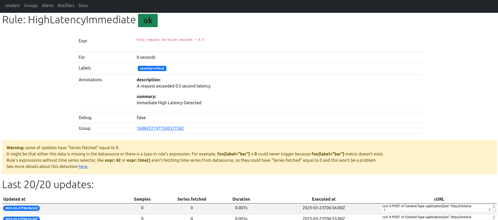
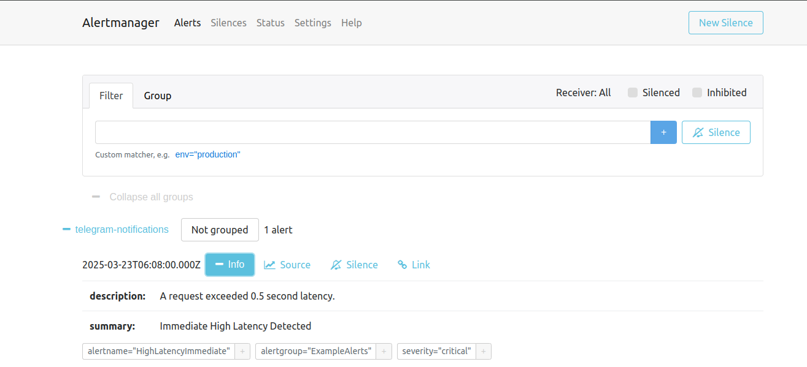
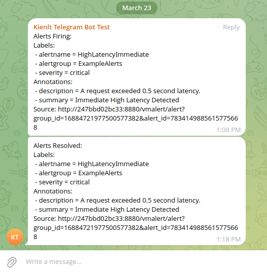
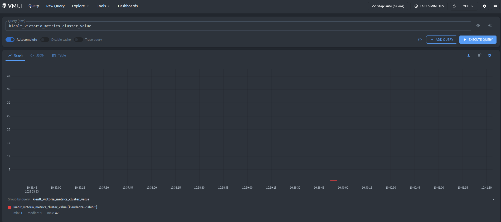

Title: VictoriaMetrics - From small business to large scale.
Date: 2025-03-23
Category: Knowledge Base
Tags: metrics

# What is VictoriaMetrics(VM)?
- VictoriaMetrics is a free open source time series database (TSDB) and monitoring solution, designed to collect, store and process real-time metrics
- My company used VM to replace Prometheus for high availability and better performance.
- In this article, i will introduce 2 types of VM:
    - Single node VM: for small businesses that have fewer than 10-20 servers
    - Cluster VM: for larger businesses

---

# Small business with VictoriaMetrics single-mode 

### Docker compose
- Yes, using docker compose for fast deployment and easy to control.
- Docker compose file:
```yaml
services:
  victoria-metrics:
    image: victoriametrics/victoria-metrics:v1.114.0
    container_name: vm_single_node
    ports:
      - "8428:8428"  # Default port for HTTP API
    volumes:
      - vm_data:/storage  # Save data to a volume
      - ./prometheus.yml:/etc/vm/prometheus.yml  # Mount file config
    command:
      - "-storageDataPath=/storage"  # Specify the path to store data
      - "-retentionPeriod=30d"      # Retain data for 30 days
      - "-promscrape.config=/etc/vm/prometheus.yml"  # Specify the path to the config file
    restart: unless-stopped

  vmalert:
    image: victoriametrics/vmalert:v1.114.0
    container_name: vmalert
    ports:
      - "8880:8880"  # Port for vmalert HTTP API/UI
    volumes:
      - ./alert_rules.yml:/etc/alerts/alert_rules.yml  # Mount alert rules file
    command:
      - "-rule=/etc/alerts/alert_rules.yml"  # Path to alert rules
      - "-datasource.url=http://victoria-metrics:8428"  # Connect to VM
      - "-notifier.url=http://alertmanager:9093"  # Connect to Alertmanager
      - "-httpListenAddr=:8880"  # vmalert listens on 8880
    depends_on:
      - victoria-metrics
      - alertmanager
    restart: unless-stopped

  alertmanager:
    image: prom/alertmanager:v0.27.0
    container_name: alertmanager
    ports:
      - "9093:9093"  # Default Alertmanager port
    volumes:
      - ./alertmanager.yml:/etc/alertmanager/alertmanager.yml  # Mount Alertmanager config
    command:
      - "--config.file=/etc/alertmanager/alertmanager.yml"  # Use mounted config file
    restart: unless-stopped

volumes:
  vm_data:
```
- `prometheus.yml` file:
```
global:
  scrape_interval: 60s  # Interval between each scrape
  scrape_timeout: 30s   # Timeout for each scrape
  
scrape_configs:
  - job_name: 'ES-Dev'
    metrics_path: '/metrics'
    static_configs:
      - targets: ['10.1.1.1:9114']  # target to scrape
```

- `alert_rules.yml` file sample rules to trigger notify only:
```
groups:
  - name: ExampleAlerts
    rules:
      - alert: HighLatencyImmediate
        expr: http_request_duration_seconds > 0.5
        labels:
          severity: critical
        annotations:
          summary: "Immediate High Latency Detected"
          description: "A request exceeded 0.5 second latency."
```

- `alertmanager.yml` file sample with telegram notifier:
```
route:
  receiver: 'telegram-notifications'
  group_wait: 30s
  group_interval: 5m
  repeat_interval: 1h

receivers:
- name: 'telegram-notifications'
  telegram_configs:
  - bot_token: '<YOUR_TELEGRAM_BOT_TOKEN>'
    chat_id: <YOUR_TELEGRAM_CHAT_ID>
    send_resolved: true # Optional: Send notifications when alerts are resolved.
    parse_mode: 'HTML' # Optional: Use HTML formatting.
    disable_web_page_preview: true # Optional: Disable web page previews.

templates:
- |-
    {{ define "telegram.message" }}
    {{ range .Alerts }}
    <b>{{ .Annotations.summary | default .Labels.alertname }}</b>

    {{ if .Labels.severity }}Severity: {{ .Labels.severity }}{{ end }}
    {{ if .Labels.namespace }}Namespace: {{ .Labels.namespace }}{{ end }}
    {{ if .Labels.job }}Job: {{ .Labels.job }}{{ end }}
    {{ if .Labels.instance }}Instance: {{ .Labels.instance }}{{ end }}

    {{ if .Annotations.description }}Description: {{ .Annotations.description }}{{ end }}

    {{ if gt (len .GeneratorURL) 0 }}<a href="{{ .GeneratorURL }}">View in Prometheus</a>{{ end }}

    {{ if gt (len .DashboardURL) 0 }}<a href="{{ .DashboardURL }}">View Dashboard</a>{{ end }}

    {{ if eq .Status "firing" }}🔥 Firing{{ else }}✅ Resolved{{ end }}
    {{ end }}
    {{ end }}

    {{ define "telegram.title" }}
    {{ .CommonLabels.alertname }}: {{ .GroupLabels.alertname }}
    {{ end }}
```

- I guess i don't need to write how to start this container!

### Insert and test query
- Insert script, run this, and wait like 2-3 minutes to fill up some metrics
```bash
#!/bin/bash

for i in $(seq 1 100); do
  timestamp=$(date +"%Y-%m-%d %H:%M:%S")
  echo "[$timestamp] Inserting metric: kienlt{kien=\"depzai\"} $i into http://localhost:8428/api/v1/import/prometheus"
  curl -d "kienlt{kien=\"depzai\"} $i" http://localhost:8428/api/v1/import/prometheus
  echo "[$timestamp] Sleep for 10 seconds. Insert count: $i"
  sleep 10
done

echo "Completed!"
```

- Query with VM ui at `http://localhost:8428/vmui`


### Scrape Target
- We have defined our target need to scrape metrics in file `prometheus.yml`
- Let's check the target at the endpoint: http://localhost:8428/api/v1/targets


### Rule and Notify
- Let's make a sample test to trigger our rules:

```bash
for i in $(seq 0 100); do curl -d 'http_request_duration_seconds 1' http://localhost:8428/api/v1/import/prometheus; sleep 1; echo "sleep 1s"; done
```

- After a little time, it will appear in vmalert UI and will be forwarded to Alertmanager





- How is it displayed in Telegram? (I know the format is ugly, but it is a demo xD)




### Conclusion
- There are many features of VM but i want to keep this simple and short for single-node since we still have Cluster VM to go.
- I included vmalert and alertmanager for the complete stack!

---

# Large business with VictoriaMetrics cluster mode

### Introduction
- **vmstorage**: Save time-series data
- **vminsert**: receive metrics from client and write to **vmstorage**
- **vmselect**: handle query, select data from **vmstorage**
- **vmagent**: scrape metrics from targets and send them to **vminsert**
- **vmalert**: evaluate alerting rules and send notifications to **alertmanager**
- **alertmanager**: handle alerts sent by **vmalert** and manage notifications

### Installtion
For this mode, i prefer to use a dedicated host/ virtual machine to install VictoriaMetrics. I will use 3 nodes to setup this cluster.

- Here is the installation script that will install: [setup-vm-cluster.sh](https://gist.github.com/BlackMetalz/2cc7473c6ed483013f3d28b6d413e01c)

- Things need to change in this script in case you want to modify the version and hosts
    - hosts: update this `Step 3: Update /etc/hosts` to your host or don't need if you have internal DNS system
    - variables **VM_VERSION**, **AM_VERSION**

- Check logs and port status after inserting if you have any problems. Below are example output from mine:
```bash
netstat -tulpn|grep -E "vmstorage|vmagent|vmselect|vminsert|vmalert|alertmanager"
tcp        0      0 0.0.0.0:8401            0.0.0.0:*               LISTEN      491202/vmstorage-pr 
tcp        0      0 0.0.0.0:8400            0.0.0.0:*               LISTEN      491202/vmstorage-pr 
tcp        0      0 0.0.0.0:8429            0.0.0.0:*               LISTEN      491225/vmagent-prod 
tcp        0      0 0.0.0.0:8482            0.0.0.0:*               LISTEN      491202/vmstorage-pr 
tcp        0      0 0.0.0.0:8481            0.0.0.0:*               LISTEN      491216/vmselect-pro 
tcp        0      0 0.0.0.0:8480            0.0.0.0:*               LISTEN      491207/vminsert-pro 
tcp        0      0 0.0.0.0:8880            0.0.0.0:*               LISTEN      491226/vmalert-prod 
tcp6       0      0 :::9094                 :::*                    LISTEN      491238/alertmanager 
tcp6       0      0 :::9093                 :::*                    LISTEN      491238/alertmanager 
udp6       0      0 :::9094                 :::*                                491238/alertmanager 
```

### Port access and information
- **vmstorage**: This have 3 ports
    - **8400**: Receive metrics from **vminsert**
    - **8401**: internal communication between vmstorage in the cluster
    - **8482**: No idea about this much but this is where exporter expose metrics of **vmstorage** with path: `vm-node1:8482/metrics`

- **vminsert**: receive metrics from other sources and optimize process writes data into **vmstorage** in a distributed way!
Here is an example write into **vmstorage** via **vminsert**. It will use port **8480**
```
curl -X POST --data-binary 'kienlt_victoria_metrics_cluster,kiendepzai=ahihi value=42' "http://vm-node1:8480/insert/0/influx/write"
```

- **vmselect**: We have inserted data, now let's check. The endpoint will be: `http://vm-node1:8481/select/0/prometheus/vmui`



- **vmagent**: This will show all active targets and other useful api like show all target in json format. The endpoint will be: `http://vm-node1:8429/targets`


- **vmalert**: Endpoint will be: `http://vm-node1:8880/vmalert/alerts` . Same as vmalert in single mode

- **alertmanager**: `http://vm-node1:9093`. Same as single-node but in cluster mode xD

### Conclusion
- This is a simple article for VictoriaMetrics like how it works in single mode and cluster mode
- I'm so lazy at this time and so this article still lacks of things below:
    - Real notification setup for alert manager
    - Backup and Restore with vmutils
    - Authentication: no auth for endpoints to access **vminsert** / **vmselect**
    - No HAProxy for failover and load balancing
- There are many features i still don't know about VictoriaMetrics, i will write more articles in case i need to learn to use xD

---

# Ref
- [https://victoriametrics.com/](https://victoriametrics.com/)