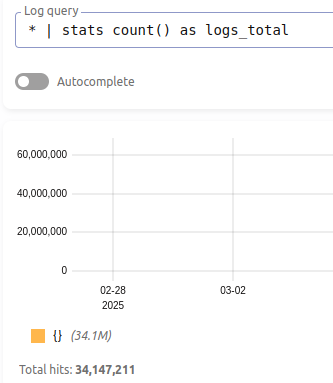
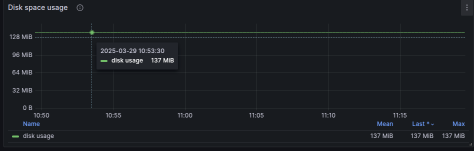
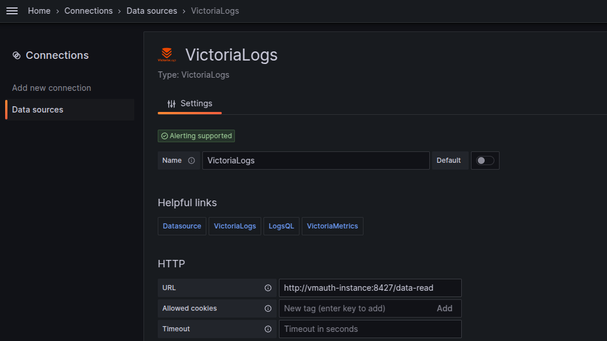
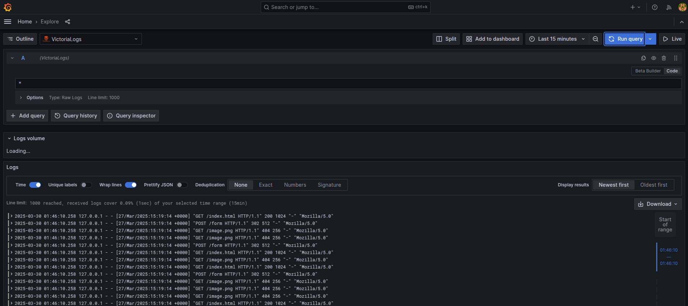

Title: VictoriaLogs: The Space-Efficient Alternative to Elasticsearch for Log Management
Date: 2025-03-30
Category: Knowledge Base
Tags: logs

# VictoriaLogs: A Brief Introduction
VictoriaLogs is a high-performance log management solution from the VictoriaMetrics team. It offers significant advantages over traditional solutions like Elasticsearch:

- Storage Efficiency: Uses up to 10x less disk space
- Performance: Higher ingestion rates with lower CPU usage
- Simplicity: Single binary deployment with minimal configuration
- Query Language: Intuitive LogsQL for searching and analyzing logs
- Integration: Works seamlessly with Grafana and other monitoring tools

Designed for organizations seeking cost-effective log management without sacrificing functionality, VictoriaLogs combines performance and simplicity for modern observability needs.

# Data preparation for Elasticsearch and Victoria Logs

### Setup
- Elasticsearch: Assume you already have a cluster with 3 nodes!
- VictoriaLogs: docker compose for the best xD
```
services:
  victorialogs:
    image: victoriametrics/victoria-logs:v1.17.0-victorialogs
    container_name: victorialogs
    command:
      - "--storageDataPath=/vlogs"
      - "--httpListenAddr=:9428"
      - "--loggerLevel=INFO"
      - "--retentionPeriod=30d"  # Retain logs for 30 days
    volumes:
      - /data/vlogs-data:/vlogs
    ports:
      - "9428:9428"

volumes:
  vlogs-data:
```

### Elasticsearch

- Generate nginx access logs with 3Gb size for an example via Python script
```python
import random
import time

log_formats = [
    '127.0.0.1 - - [27/Mar/2025:15:19:14 +0000] "GET /index.html HTTP/1.1" 200 1024 "-" "Mozilla/5.0"',
    '127.0.0.1 - - [27/Mar/2025:15:19:14 +0000] "POST /form HTTP/1.1" 302 512 "-" "Mozilla/5.0"',
    '127.0.0.1 - - [27/Mar/2025:15:19:14 +0000] "GET /image.png HTTP/1.1" 404 256 "-" "Mozilla/5.0"',
]

def generate_log_entry():
    return random.choice(log_formats)

def main(filename, size_in_gb):
    size_in_bytes = size_in_gb * 1024 * 1024 * 1024
    with open(filename, 'w') as f:
        while f.tell() < size_in_bytes:
            f.write(generate_log_entry() + '\n')
            if f.tell() % (1024 * 1024) == 0:
                print(f"Generated {f.tell() / (1024 * 1024)} MB")

if __name__ == "__main__":
    main("nginx_access.log", 3)
```

- Write logs to Elasticsearch (This is not the good way but okay for demo xD). And you need to create an index first.

```
PUT nginx_access_log
{
  "settings": {
    "index": {
      "number_of_shards": 6,  
      "number_of_replicas": 1 
    }
  }
}
```

```python
import requests
import json

def parse_log_line(line):
    parts = line.split(' ')
    log_entry = {
        "remote_host": parts[0],
        "remote_user": "-",
        "timestamp": parts[3].replace('[', '') + ' ' + parts[4].replace(']', ''),
        "request": parts[5] + ' ' + parts[6] + ' ' + parts[7],
        "status": int(parts[8]),
        "bytes_sent": int(parts[9]),
        "referrer": parts[10].replace('"', ''),
        "user_agent": ' '.join(parts[11:]).replace('"', '')
    }
    return log_entry

def send_bulk_data(bulk_data, index_name):
    bulk_payload = ""
    for item in bulk_data:
        bulk_payload += json.dumps({"index": {"_index": index_name}}) + "\n"
        bulk_payload += json.dumps(item) + "\n"
    
    response = requests.post(
        'http://my-es-ip:9200/_bulk',
        data=bulk_payload,
        headers={'Content-Type': 'application/x-ndjson'},
        auth=('elastic', 'password')
    )

def main():
    bulk_data = []
    batch_size = 49020  # Adjust the batch size to fit 10MB bulk request
    index_name = "nginx_access_log"  # Set the index name
    with open('nginx_access.log', 'r') as f:
        for line in f:
            log_entry = parse_log_line(line)
            bulk_data.append(log_entry)

            if len(bulk_data) >= batch_size:
                send_bulk_data(bulk_data, index_name)
                bulk_data = []

    # Send remaining data
    if bulk_data:
        send_bulk_data(bulk_data, index_name)
        print("Finished!")

if __name__ == "__main__":
    main()
```

- Run script: `python nginx_to_elasticsearch.py`

### Victoria Logs
- Script to send: `nginx_to_victoria_logs_with_batch_size.py`
```python
import requests
import time
import json
import logging

# Set up logging
logging.basicConfig(level=logging.INFO, format='%(asctime)s - %(levelname)s - %(message)s')

def parse_log_line(line):
    parts = line.split(' ')
    log_entry = {
        "remote_host": parts[0],
        "remote_user": "-",
        "timestamp": parts[3].replace('[', '') + ' ' + parts[4].replace(']', ''),
        "request": parts[5] + ' ' + parts[6] + ' ' + parts[7],
        "status": int(parts[8]),
        "bytes_sent": int(parts[9]),
        "referrer": parts[10].replace('"', ''),
        "user_agent": ' '.join(parts[11:]).replace('"', ''),
        "_msg": line.strip()  # Include the original log line as the _msg field
    }
    return log_entry

def convert_to_victoria_logs(log_entry):
    timestamp = int(time.mktime(time.strptime(log_entry['timestamp'], '%d/%b/%Y:%H:%M:%S %z')))
    return {
        "remote_host": log_entry["remote_host"],
        "remote_user": log_entry["remote_user"],
        "timestamp": timestamp,
        "request": log_entry["request"],
        "status": log_entry["status"],
        "bytes_sent": log_entry["bytes_sent"],
        "referrer": log_entry["referrer"],
        "user_agent": log_entry["user_agent"],
        "_msg": log_entry["_msg"]
    }

def send_to_victoria_logs(victoria_log_entries):
    try:
        response = requests.post(
            'http://my-vlog-ip:9428/insert/jsonline',
            data='\n'.join(json.dumps(entry) for entry in victoria_log_entries),
            headers={'Content-Type': 'application/json'}
        )
        response.raise_for_status()  # Raise an exception for HTTP errors
        return True
    except requests.exceptions.RequestException as e:
        logging.error(f"Error sending log entries: {e}")
        return False

def main():
    success_count = 0
    error_count = 0
    batch_size = 10000  # Default batch size
    batch = []

    with open('nginx_access.log', 'r') as f:
        for line in f:
            log_entry = parse_log_line(line)
            victoria_log_entry = convert_to_victoria_logs(log_entry)
            batch.append(victoria_log_entry)

            if len(batch) >= batch_size:
                if send_to_victoria_logs(batch):
                    success_count += len(batch)
                    logging.info(f"Successfully sent {len(batch)} log entries.")
                else:
                    error_count += len(batch)
                batch = []

    # Send remaining log entries
    if batch:
        if send_to_victoria_logs(batch):
            success_count += len(batch)
            logging.info(f"Successfully sent {len(batch)} log entries.")
        else:
            error_count += len(batch)

    logging.info(f"Total successfully sent logs: {success_count}")
    logging.info(f"Total failed logs: {error_count}")

if __name__ == "__main__":
    main()
```

# Comparison

### Elasticsearch disk Usage:
- Query: `GET _cat/indices/nginx_access_log?s=index&v`
- Output:
```
index             docs.count  store.size pri.store.size
nginx_access_log  34147211      1.7gb        887mb
```

### VictoriaLogs disk Usage:
- Count total document: `* | stats count() as logs_total`



- I used the exporter built-in and displayed it with [this dashboard](https://grafana.com/grafana/dashboards/22084-victorialogs-single-node)



### Compare
I see my test is not optimized, it can be optimized more to save more space for logging, i guess?

- Elasticsearch: 887Mb
- VictoriaLogs: 137Mb

So for this quick test, the VictoriaLogs use space to store logs less than ~6.5 times that of Elasticsearch.

In another test that is not created by myself but the result here xD

| Name | VictoriaLogs | Elasticsearch |
|----|----|----|
| Servers | 1 | 13 (3 master + 10 data) |
| CPU | 16 | 32 (x 13 servers) |
| RAM | 16 | 32 (x 13 servers) |
| Disk | \~120GB / day | \~1.1 TB / day |
| Log shipper | Vector: 3 instances (x 4 cores) | Filebeat: 10 instances (x 4 cores) |

After this test you can see how much resource we save from replace Elasticsearch with VictoriaLogs!

# Cluster Mode
So to be honest, VictoriaLogs did great work for single node, that can handle everything we need for. But you can have think like me, where is the cluster mode, how we can failover if the single node is dead? So to answer that question. Simply we will use: 2x VictoriaLogs + vmauth

- So what is vmauth? It is a tool of VictoriaMetrics, used as proxy and manage connection to instance backend like VictoriaLogs, it added basic auth, route the request based URL and support load balancing, easy to run and config. Below is an example with Docker compose
```
services:
  vmauth:
    image: victoriametrics/vmauth:latest
    container_name: vmauth
    ports:
      - "8427:8427"
    volumes:
      - ./vmauth-config.yml:/etc/vmauth-config.yml
    command:
      - "-auth.config=/etc/vmauth-config.yml"
      - "-httpListenAddr=:8427"
    restart: unless-stopped
    networks:
      - vmauth-network

networks:
  vmauth-network:
    driver: bridge
```

and config file `vmauth-config.yml`
```
unauthorized_user:
  url_map:
    - src_paths: ["/data-read/.*"]
      drop_src_path_prefix_parts: 1
      url_prefix: 
        - http://victorialogs-1:9428
        - http://victorialogs-2:9428
```

- Then we can use that to config as endpoint of VictoriaLogs datasource in Grafana



- Then query logs in Grafana datasource explorer(This is demo), althought we still have add dashboard [like this](https://grafana.com/grafana/dashboards/22759-victorialogs-explorer/) and do a little modify to query and filter for search log in production



- How about scale? Simple add more disk to VictoriaLogs. I assumed you used LVM for the beginning (You should calculate how much log VictoriaLogs will store).
- An example: you can use 3 disk that combined with LVM and resize or add more disk to increase storage of VictoriaLogs.

### My opinions
- VictoriaLogs used less disk space than Elasticsearch, could be up to 10x in some specific scenarios.
- VictoriaLogs inserts data faster and uses less CPU than Elasticsearch.
- VictoriaLogs simple read is faster than Elasticsearch, but when it comes to queries with AGG, Elasticsearch wins xD
- And many other things i don't know yet at this time when I'm writing this article.
- In my company, we have used 4 VictoriaLogs instances with 1 vmauth, 2 instances for 10 K8S cluster logging and 2 instances for Kong - APIGateway with an average request of about 20k -> 80k RPS and it has been tested for 3 months before we dropped Elasticsearch.
- Good for logging solution where user need a place to check logs of their container in K8S environment with multiple clusters.
- Right now VictoriaLogs doesn't have the cluster mode but there is solution for it is add 1 one more instance and distributed them with vmauth utility

# Ref:
- [https://docs.victoriametrics.com/victorialogs/](https://docs.victoriametrics.com/victorialogs/)
- [https://news.ycombinator.com/item?id=42859016](https://news.ycombinator.com/item?id=42859016)
- [https://itnext.io/how-do-open-source-solutions-for-logs-work-elasticsearch-loki-and-victorialogs-9f7097ecbc2f](https://itnext.io/how-do-open-source-solutions-for-logs-work-elasticsearch-loki-and-victorialogs-9f7097ecbc2f)
- [https://www.influxdata.com/comparison/elasticsearch-vs-victoria/](https://www.influxdata.com/comparison/elasticsearch-vs-victoria/)