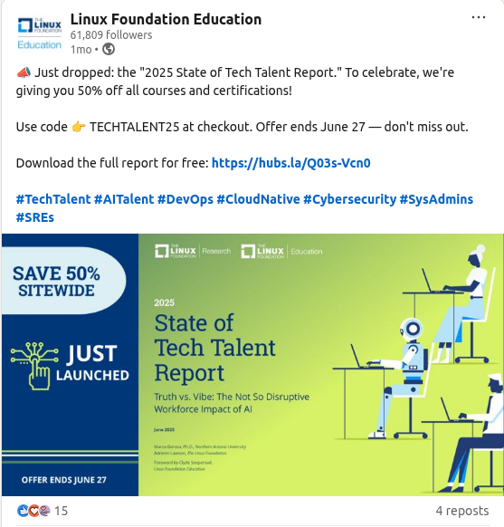

Title: [WIP] Prepare for the Certified Kubernetes Security Specialist (CKS) exam in 2025
Date: 2025-08-19
Category: Knowledge Base
Tags: k8s


# My little experience for prepare for the CKS exam in 2025
- Some sharing why you should attempt for exam
- Which course you should pick in order for prepare
- Where to practice without building a cluster
- Some experience you should focus and not for the exam (Skip about this if you want to master everything)
- Voucher in general (to reduce exam costs xD)

---

# 1. Why you should attempt for exam
My opinions:

- First, I think most of every people have attempted to exam will agree that when you prepare for the exam, you know more knowledge you can be expected. For a small example, I never know about strace command in Linux until I prepare for CKS exam via learn a course xD
- Second, I was wonder about this will not really useful for current my job, a colleague that gave me a recommendation, just take the exam for increase mindset which I'm lacking currently.
- Third, not really important but certification collection is something fun to do like Achievement in a game, if you have ever played an online game like World of Warcraft, you will understand it xD. It is not about skill, it is all about you have something called achievement, and this is little achievement you can achieve by spend time and money(of course).

---

# 2. Which course you should pick
There are 2 courses: I do recommend taking both of course xD, each course has different advantage

- From [Kodekloud](https://learn.kodekloud.com/user/courses/certified-kubernetes-security-specialist-cks), they do have lab environment setup for each Lesson, for an example, you just finish watching a lesson (What are CIS Benchmarks 05:52), then next lesson is Lab - Run CIS Benchmark Assessment tool on Ubuntu. It is really amazing and gave the speed of prepare for the exam.
- From [Udemy](https://www.udemy.com/course/certified-kubernetes-security-specialist-certification/) by Zeal Vora, his explanation is very good for me, if you don't understand enough, simple watch again. He also gives some focus point on exam in his course.

---

# 3. Where to practice without building a cluster

- [Minikube](https://minikube.sigs.k8s.io/docs/start/) for Sure, build your owned lab in your laptop/pc, it begins consume only with 2Gb memory.
- [KillerCoda](https://killercoda.com/killer-shell-cks/), a great place that cover almost of every topic in exam (except Istio xD). And yes, it is free! 
- [Kodekloud CKS Challenge](https://learn.kodekloud.com/courses/cks-challenges), they give good lab focused on exam scenario, and it's free!

For KillerCoda and Kodekloud CKS Challenge, finish all of them, even with repeat daily with really understanding instead of memorization it.

---

# 4. Some experience you should focus and not for the exam

Because write whole content for CKS exam again in here is just wasted time for me and for who is reading this, so I decided to write only something I feel like it is needed (at least for me xD)

If you are not have certification CKA, you should finish it first before taking CKS exam unless you are going to renew your CKS cert in 2025 xD.

TLDR: I realized that everything I mentioned below, they are all described well in course xD, so if you believe you watched the course and remember everything, you can skip this section.

### [Yes] Audit Logging

- Link: https://kubernetes.io/docs/tasks/debug/debug-cluster/audit/
- Audit Policy: Be sure to understand, example you could be asked to log level `Metadata` for resource `configmaps, secrets` in specific namespace and so on...
- Enable audit policy and modify setting: via API Server and some setting like:
    - `--audit-log-path`: specifies the log file path that log backend uses to write audit events, basically mount from host to API Server container, in document is well write already, remember in volumeMounts, mount it with readOnly = true
    - audit log setting like: `audit-log-maxage`, `audit-log-maxbackup`, `audit-log-maxsize`. If you practice enough in section 3, you will understand why I point it here.
    - Mount for audit log, remember to mount it with readOnly = false, if not, it will not able to write log! 

### [Should] Falco

- Well, this is tough in exam because practice was all about modify output to display as the question or enable it. But in exam you may need to write new policy for handle specific events. So for my personal experience, skip this because it would eat a lot of time.

### [Should] Immutability Readonly Filesystem

- This is all about add securityContext, which prevent unauthorized modifications. For an example, you can not edit running file in container if defined this setting.
```yaml
apiVersion: v1
kind: Pod
metadata:
  name: my-read-only-pod
spec:
  containers:
  - name: my-container
    image: my-image:latest
    securityContext:
      readOnlyRootFilesystem: true
```

### [Yes] CIS Benchmarks

- Yes, fucking yes!

### [Not] Rego/OPA

- It is all good if you have time to learn it if you can use it in your work. But for common person (like me), it could be overwhelming.

### [Yes] TLS Ingress

- This could be free point, just set up a secret with type TLS, be sure to remember to create it from command xD. Then use that secret in ingress. [Document here](https://kubernetes.io/docs/concepts/services-networking/ingress/#tls)

### [Should] Network Policy / Cilium Network Policy (CNP)

- I assumed you are well known for Network Policy, so I focus only for CNP. And yeah, it takes time to master CNP because it could happen in CKS exam xD

### [Yes] Static File Analysis

- Dockerfile: Mostly it is all about change user from Root to user that added in Dockerfile, remove unnecessary line like expose port 22 (Example: why would we expose port 22 in flask application, right?)
- Manifest: again, it will ask you to modify line only, not add new line. For an example, there is a line with: `readOnlyRootFilesystem: true`, simply change it false xD. 

### [Should] Docker and Linux

- You should be familiar with basic Linux commands like add/remove user to/from group, chmod, chown, Systemd (Practice tests are all Ubuntu) and so on... 

### [Should] Istio

- Recently it has been added to CKS exam. You can set up for lab by using Minikube, I will not write detail for it because it is pretty simple, just read document, and you will get it!
- Enable istio-proxy injection in a namespace: https://istio.io/latest/docs/setup/additional-setup/sidecar-injection/#deploying-an-app
- Enforce strict mTLS in the namespace: https://istio.io/latest/docs/tasks/security/authentication/mtls-migration/#lock-down-to-mutual-tls-by-namespace

- This is considered free point in exam in my personal opinion. Also, you will be able to use Istio document during exam, so not worry.

### [Should] ImagePolicyWebhook setup

- You will need to correct for setup webhook, not the backend which is used to verify, so make sure you know how to do it. There is scenario to practice this in [KillerCoda](https://killercoda.com/killer-shell-cks/)

### [Yes] CLI

- crictl, podman are required commands to know beside of kubectl...

### Hmm, during write this article, I feel like I write too much useless information?

- So I repeat: **practice, practice, practice** in KillerCoda + Kodekloud CKS Challenge (**Important things are repeated 3 times**.). So this is the end for 4th section, let's move to the next section!

- I personally agree with this meme:


---

# 5. Extra Notes

- Flag the question and return later if you are not comfortable with it like need to research in document.
- Time is the real issue if it has been passed 60 minutes, and you have 70% questions are resolved. (Real Stress)
- So to avoid them, try to resolve easy question first, I would feel better if I have 50% question resolved by time is not passed by half xD
- Memorization is needed for imperative command to save time. Because reading document during exam is a pain!
- But even you need to read document for specific field, there is a trick: **kubectl explain pod.spec**, it will show all field and information of pod.spec (other example: **kubectl explain pod.spec.containers.securityContext**). This is a trick I learn from one of 2 courses I mentioned, but I don't remember!
- Manage your time during exam, each question should be around 6-10 minutes max! Verify your solution when you have time after you finish everything!
- After prepare for exam for a long time, last step is take a trial in KillerShell which you had 2. If you failed in first time like me, you are not alone...


--- 

# 6. Voucher/discount for the exam [WIP]

- Follow Linux Foundation for voucher (Linked, Facebook and Email). For an example, this is 50% off which is the best i have ever seen between 12 months... But your time matter more, 40% is totally acceptable. When i rush for exam, i even take 35% discount.



- Use **TUX REWARDS**, for every 500$ you spent, you got a single coupon that used to reduce 50% cost of exam 😢 😢 😢. Check it out in [Your Linux Foundation profile](https://openprofile.dev/myrewards/coupons)

