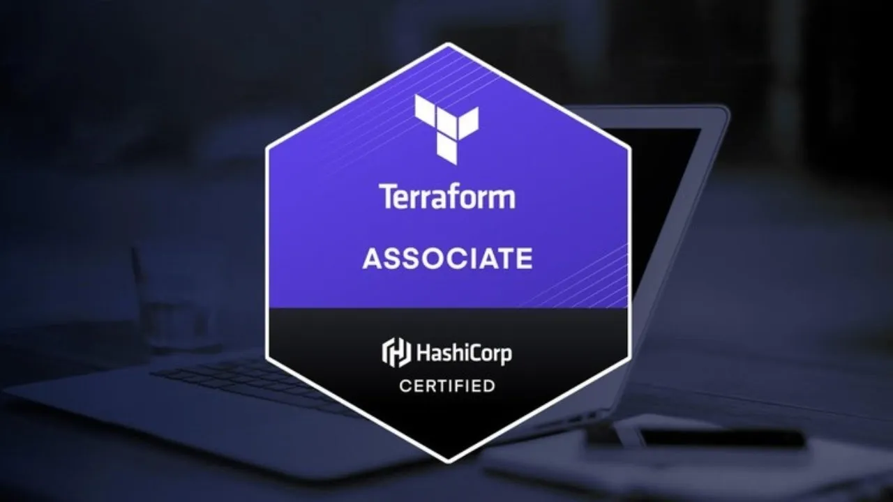

Title: Prepare for the Terraform Associate (003) Certification Exam in 2025
Date: 2025-11-02
Category: Knowledge Base
Tags: iac




# My little experience to prepare for the Terraform Associate Exam in 2025
- Why exam, do you think certification is the golden ticket to help you get a better job???
- What context should you know before taking the exam
- Practice without any bucks spent!
- Resource for learning/preparing for the exam!
- Conclusion

Let's begin!


# 1. Why exam, do you think certification is the golden ticket to help you get a better job?
The context below is just my personal opinion:

- To be honest, certification just shows that you know the basics about and maybe a little achievement, nothing more.
- It will not help you get a better job or increase your salary, the important thing is that when you prepare for the exam, you learned how it works, that is the point I want to tell (at least for my case, maybe not for your case).
- When you have no real project to show during an interview, better to have a certification than nothing xD
- Last, certifications are not golden tickets; it is the only thing I proved to myself that I finished that course properly and know the basics, specifically here is Terraform Associate level.


# 2. What context should you know before taking the exam
I also write this to myself to remind me what I need to remember for the exam, haha. This section could contain a lot of text. I will use the AWS provider as an example.

## Basic concept of Terraform

### Provider Plugin
It allows Terraform manage 1 external API, when we run terraform init, plugins needed for provider will automatically download from Terraform Registry (default) or other if configured and save into local directory **.terraform/providers/**

### Resource Blocks
A resource block describes 1 or multiple infrastructure objects

```hcl
resource "aws_instance" "myec2" {
    ami = "ami-123456"
    instance_type = "t2.micro"
}
```

**Key points about Resource Blocks:**

- **Resource type**: `aws_instance`
- **Resource name**: `myec2` 
- **Resource ID format**: `<resource_type>.<resource_name>` → `aws_instance.myec2`
- Resource type and resource name together serve for resource identity, so it must be unique (resource name)
- Use this ID for reference: **aws_instance.myec2.id**
- You can not use the resource type `aws_instance` in provider `azurerm` xD


### Terraform Destroy
- Destroy all: `terraform destroy`
- Destroy specific resource: `terraform destroy -target aws_instance.myec2`

### Terraform State file - terraform.tfstate (this is important)
- Terraform saves the state of infrastructure created to tf files. This state allows Terraform to map resources with the current config
- After creating resources, Terraform will save information of the resource (with example of EC2 instance) like instance-id, instance-type, security-group… Let's take a look at the example below
```terraform
"resource" : [
    {
        "type" : "aws_instance",
        "name" : "myec2"
    }
]
```
- And more than that, tfstate saves actual state (in terraform.tfstate) of live resource (desired state: in .tf config files). Recommendation: never ever manually edit this file!
- If you accidentally edit this file like remove state, if you run terraform apply again it will create another ec2 instance for example.
- State files contain sensitive data → need to secure. Recommend using remote backend (S3, Terraform Cloud) instead of local.
- Use state locking to avoid conflict when working with a team!

### AWS Provider - Authentication Configuration
- Default config: Linux/macOS: "$HOME/.aws/config" && "$HOME/.aws/credentials"
- You can install and setup `awscli` to auth with terraform, no need to set secret/access key inside terraform xD
- Or recommend use env: AWS_ACCESS_KEY_ID + AWS_SECRET_ACCESS_KEY + AWS_REGION

## Function, Data Types, Resource Attributes, Output Values, Variables, Meta-Argument

### Function
- So for this section I will introduce `terraform console`, you can imagine it works like `python console` xD. For example:

```bash
terraform console
> max(10,20,30)
30
> min(5,10,15)
5
> length(["a","b","c"])
3
```

- You can always test in terraform console before write config
```bash
terraform console
> file("./iam_policy.json")
# will print content of iam_policy.json file
```

- Read and learn more about built-in function of HCL here: [**Terraform Functions**](https://developer.hashicorp.com/terraform/language/functions)
- Terraform doesn't support user-defined function, only built-in, remember this!


### Data Types
| Data Type | Description | Example |
|-----------|-------------|---------|
| `string` | Sequence of Unicode characters representing text | `"hello"`, `"us-east-1"` |
| `number` | Numeric value (can be integer or float) | `42`, `3.14`, `-10` |
| `bool` | Boolean value | `true`, `false` |
| `list` (or `tuple`) | Ordered sequence of values | ["us-west-1a", "us-west-1b"], [1, 2, 3] |
| `set` | Unordered collection of unique values | `["a", "b", "c"]` (no duplicates) |
| `map` (or `object`) | Collection of key-value pairs | `{name = "web", port = 80}` |
| `null` | Represents absence of a value | `null` |
| `any` | Placeholder for any type (used in variable definitions) | Can accept any of the above types |

**Reference:** [**Terraform Type Constraints**](https://developer.hashicorp.com/terraform/plugin/framework/handling-data/types)


### Resource Attributes
- Time to document like a pro guy, haha. [**AWS Instance Resource**](https://registry.terraform.io/providers/hashicorp/aws/latest/docs/resources/instance)
- We can understand attributes like `ami`, `instance_type`, `tags` are attribute of aws_instance resource. 
- Attributes can be arguments (inputs) or exported attributes (outputs after creation)

### Output Values
- Display after run terraform apply. For example
```hcl
# Display vpc id value
output "vpc_id" {
  value = aws_vpc.kienlt_first_vpc.id
}
####
## Outputs:
## vpc_id = "vpc-0b806f82efdbe8d5f"
####
```
- Without define `.id`, it will display all attributes of resource `aws_vpc.kienlt_first_vpc`

### Cross-Project Outputs (Remote State Data Source)

- Project B can read outputs from Project A using **`terraform_remote_state`** data source
- Project A's state must be stored in **remote backend** (S3, Terraform Cloud, etc.)
- Example:

**Project A** (outputs in remote state):
```hcl
output "vpc_id" {
  value = aws_vpc.main.id
}
```

**Project B** (reads from Project A):
```hcl
data "terraform_remote_state" "project_a" {
  backend = "s3"
  config = {
    bucket = "my-terraform-state"
    key    = "project-a/terraform.tfstate"
    region = "us-east-1"
  }
}

resource "aws_instance" "web" {
  vpc_id = data.terraform_remote_state.project_a.outputs.vpc_id
}
```

**Key points:**

- Must use **remote backend** (local state won't work)
- Access via `data.terraform_remote_state.<name>.outputs.<output_name>`
- Common pattern for **shared infrastructure** (VPC, networks, etc.)

**Reference:** [terraform_remote_state](https://developer.hashicorp.com/terraform/language/state/remote-state-data)


### Terraform Variables
- Use to handle static value without repeat!
- Central management, edit in 1 file, no need to edit terraform code

#### Variable Definition File (TFVARS)
- Hashicorp recommends create file separated with the name of *.tfvars to define all variables in a project
- Managing variables in production env is 1 of ways to achieve code clean and reusable
- For example:
```hcl
# variables.tf
variable "instance_type" {
  type = string
}

variable "instance_count" {
  type = number
}
```

```hcl
# example.tfvars
instance_type  = "t2.micro"
instance_count = 1
```

Deploy example:
```bash
terraform plan -var-file="example.tfvars"
terraform apply -var-file="example.tfvars"
```

- File terraform.tfvars or *.auto.tfvars will autoload, no need to define flag `-var-file`
- File *.tfvars needs to be defined with flag -var-file
- Common practice

```
project/
├── environments/
│   ├── dev/
│   │   └── terraform.tfvars
│   ├── prod/
│   │   └── terraform.tfvars
├── modules/
└── main.tf
```

#### Variable definition precedence
- This question could appear in the exam
- Priority from highest (5) to lowest (1) xD
- **1. Environment Variable**
- **2. terraform.tfvars file if exists**
- **3. terraform.tfvars.json file if exists**
- **4. *.auto.tfvars or *.auto.tfvars.json**
- **5. From cli: -var and -var-file**

### Meta-Argument
- [Meta-Argument Documents](https://developer.hashicorp.com/terraform/language/meta-arguments)
- I will show 2 popular examples I like:

#### Count
- Sometime you want to create multiple object with type without repeat resource block. For example
```hcl
resource "aws_instance" "local_resource_name" {
    ami = "ami-1234"
    instance_type = "t2.micro"
    count = 3 # will create 3 instances like this!
}
```
- Notice that `count` argument works with multiple resource, not only ec2 instance. When resources are created, we can access data expected output like this:
```
aws_instance.local_resource_name[0]
aws_instance.local_resource_name[1]
aws_instance.local_resource_name[2]
```

### for_each
- With count, we can not create resource with different name (aws_instance), only index (0,1,2)
- If we want multiple instance and each instance have different name → use `for_each`
- Remember `Name` is special tag, display in first column in EC2 console
```hcl
❌ count - only index, same instance name
resource "aws_instance" "server" {
  count         = 3
  ami           = "ami-1234"
  instance_type = "t2.micro"
  tags = {
    Name = "server-${count.index}"  # server-0, server-1, server-2
  }
}

✅ for_each - name can be customize
resource "aws_instance" "server" {
  for_each      = toset(["web", "api", "db"])
  ami           = "ami-1234"
  instance_type = "t2.micro"
  tags = {
    Name = each.key  # web, api, db
  }
}

# Access:
# aws_instance.server["web"]
# aws_instance.server["api"]
# aws_instance.server["db"]
```

- So, use `for_each` over `count` when need flexible naming/config!

### Splat Expressions - Get All Resource IDs
This is crucial topic for exam! Splat expressions provide a concise way to extract attributes from lists of resources.

#### Modern Splat Expression `[*]` (Recommended)
- Use `[*]` to get all attributes from a list of resources
- More flexible and consistent behavior
```hcl
# Create multiple instances with count
resource "aws_instance" "web" {
  count         = 3
  ami           = "ami-1234"
  instance_type = "t2.micro"
}

# Get all instance IDs using modern splat expression
output "all_instance_ids" {
  value = aws_instance.web[*].id  # Returns: ["i-123", "i-456", "i-789"]
}

# Get all private IPs
output "all_private_ips" {
  value = aws_instance.web[*].private_ip
}

# Access nested attributes
output "all_instance_names" {
  value = aws_instance.web[*].tags.Name
}
```

#### Legacy Splat Expression `.*` (Deprecated)
- Older syntax using `.*` instead of `[*]`
- Still supported for backward compatibility but **NOT recommended**
- Has subtle different behavior and limitations
```hcl
# ❌ Legacy syntax - avoid using this
output "legacy_instance_ids" {
  value = aws_instance.web.*.id
}

# The legacy form has different behavior with indexing:
# aws_instance.web.*.tags[0] != aws_instance.web[*].tags[0]
```

#### Key Differences:
| Modern `[*]` | Legacy `.*` |
|--------------|-------------|
| `aws_instance.web[*].id` | `aws_instance.web.*.id` |
| More consistent indexing | Limited indexing support |
| Works with complex expressions | Attribute-only access |
| **Recommended** | **Deprecated** |

#### When to Use Splat Expressions:
- ✅ **Use with `count`**: Resources created with `count` meta-argument
- ❌ **Don't use with `for_each`**: Resources created with `for_each` are maps, not lists


## Terraform Provisioner
- This is known as being removed from the exam? (NO)
- Even Terraform is not recommend use this, but in some scenario, you can not use Ansible/Salt stack, here you go...
- Provisioners used to `execute scripts on a local or remote machine` as part of resource creation or Destruction!
- 2 major types of provisioners: local-exec and remote-exec

### Local-exec provisioner
- Invoke local execute after resource created, like after EC2 created, get IP of EC2 instance save to file called server_ip.txt in where we run terraform apply

### remote-exec provisioner
- invoke scripts or run commands directly on remote-server

### Defining provisioner
- Need to be **defined inside resource block**
- For example remote-exec
```hcl
resource "aws_instance" "myec2" {
    ami = "ami-1234"
    instance_type = "t2.micro"

    # Bonus: add connection block for remote exec
    connection {
        type = "ssh"
        user = "ec2-user"
        private_key = file("./terraform-key.pem")
        host = self.public_ip
    }

    provisioner "remote-exec" {
        inline = [
            "sudo yum install -y nginx",
            "sudo systemctl start nginx"
        ]
    }
}
```

- For example local-exec: we can understand $self is a way to call attribute of resource aws_instance after created!.
```hcl
resource "aws_instance" "myec2" {
    ami = "ami-1234"
    instance_type = "t2.micro"

    # Run after created!
    provisioner "local-exec" {
        command = "echo ${self.private_ip} >> server_ip.txt"
    }
}
```

- Remember we can add 1 or more provisioner local-exec inside 1 resource block!
- Provisioner run **only during creation (default)**
- Want to run when destroy? --> Add `when = destroy`


## Terraform Module
- Till this line, I'm so lazy to continue even this is one of really important component in Terraform, so I will go for it real quick T_T
- Module is extremely important for DRY code (Don't Repeat Yourself!)
- Challenge when we have no idea about module:
    - Every time we create ec2 instance, there is 1 resource block added, 10 teams 10 resource blocks?
    - When AWS provider changed, we need to change in terraform config of 10 teams?
    - No standard for 10 teams? Hard to management!
- Terraform module allow manage resource configuration in central, make it works in multiple project
- Instead write module from beginning, we could use multiple module available and ready to use.
- When not to use module? You want to write your own module, you think there is no module better than your xD. Otherwise, keep use module instead of write from scratch!
- [View more module here](https://registry.terraform.io/browse/modules)
- When run: `terraform init`, it will download module code and provider into local folder `.terraform`, module code is GitHub repo!

And many more...

## Terraform Workspace, remote state management, sensitive parameter, multiple provider configuration, dependency lock file, terraform cloud
They are all keyword you need to learn and understand in order to have well-prepared state for the exam, but if write all of them here, this post would contain more than 1000 lines T_T.


# 3. Practice without any bucks spent
- TLDR: Use security group and VPC to practice with AWS, they will not cost any money!

- main.tf
```hcl
terraform {
  required_providers {
    aws = {
      source  = "hashicorp/aws"
      version = "~> 6.0"
    }
  }
}

# Configure the AWS Provider
provider "aws" {
  region = "ap-southeast-1"
}

# Create VPC First
resource "aws_vpc" "kienlt_first_vpc" {
  cidr_block = "10.0.0.0/22"

  tags = {
    Name = var.vpc_name
  }
}

resource "aws_security_group" "kienlt_first_sg" {
  name        = "kienlt_first_sg"
  description = "Security group for KienLT first VPC"
  vpc_id      = aws_vpc.kienlt_first_vpc.id

  ingress {
    description = "Allow HTTPS"
    from_port   = var.https_port
    to_port     = var.https_port
    protocol    = "tcp"
    cidr_blocks = ["0.0.0.0/0"]
  }

  ingress {
    description = "Allow ssh from VPC Only"
    from_port   = var.ssh_port
    to_port     = var.ssh_port
    protocol    = "tcp"
    cidr_blocks = [aws_vpc.kienlt_first_vpc.cidr_block]
  }

  egress {
    description = "Allow all outbound"
    from_port   = 0
    to_port     = 0
    protocol    = "-1"          # All Protocol
    cidr_blocks = ["0.0.0.0/0"] # # All ports/destinations!
  }
}
```

- variables.tf
```hcl
variable "vpc_name" {
  type        = string
  default     = "kienlt first vpc via variable"
  description = "Description here is for document!"
}

variable "ssh_port" {
  default = 22
}

variable "https_port" {
  default = 443
}
```

- outputs.tf
```hcl
output "vpc_id" {
  value = aws_vpc.kienlt_first_vpc.id
}

output "security_group_id" {
  value = aws_security_group.kienlt_first_sg.id
}
```

Remember to destroy after practice, VPC + SG = free tier!

# 4. Resources for learning/preparing for the exam
- Well, they're all available in Terraform documentation, but for the best and most effective preparation, learn via a structured course.
- Which course did I choose? [HashiCorp Certified: Terraform Associate 2025](https://www.udemy.com/course/terraform-beginner-to-advanced/)
- Fun fact: I've listened to so much India-English from tech tutorials that by 2025, I don't need subtitles anymore! 😄

# 5. Conclusion
- Well, that exam is not easy like what I thought, 20-30% questions are not in my knowledge.
- Some domains you should understand are HashiCorp Terraform Cloud basics, workspace management, and remote state.
- After passing the exam, I think the course I provided in section 4 is really, really worth learning. Even though its length is 22 hours, it explains everything including practice that contains everything you should know before taking the exam.
- For example: **Splat expressions** (`[*]`) and **legacy splat syntax** (`.*`) are important concepts that appear in the exam, but in my example, if I don't know about legacy splat syntax, I would lose 1 question for that!
- Practice with real scenarios, not just theory. Set up actual infrastructure and break things to understand how Terraform behaves.
- So learn and practice carefully - one mistake, and you will lose $70 for the exam cost!
