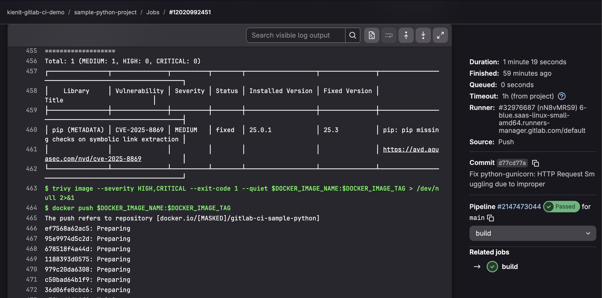
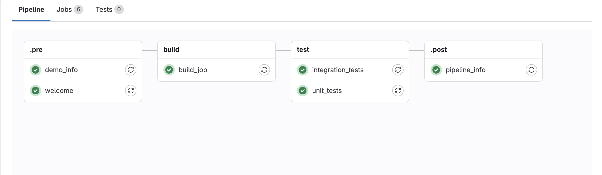
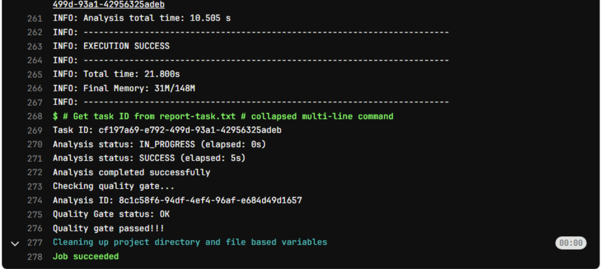
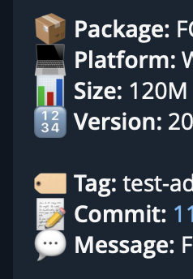

Title: My journey with GitLab CI: friendly and effective!
Date: 2025-11-08
Category: Knowledge Base
Tags: ci/cd

# Introduction
- Comparison from me who was always biased towards Jenkins before xD
- Basic example with GitLab CI (Linting + Testing + Build + SAST)
- Template Repository
- Extra examples
- Conclusion

This is very, very basic, nothing advanced. All lab repo will come from my public GitLab repo, so I can see them again in future xD, and you guy can understand what is going on.

In this series I will use GitLab account free. 400 Minutes per month (I will use runner that has Cost factor = 1, that is why I said I have 400 minutes xD). Read more about it in here: [Compute Minutes](https://docs.gitlab.com/ci/pipelines/compute_minutes/).

# Comparison between GitLab CI and Jenkins
The fact my previous company used Jenkins to manage about 500++ jobs and I never tried anything different from Jenkins, if I did lab it was basic of GitLab CI with shell executor and GitHub Actions with some echo script xD. So at that time I always bias with Jenkins, everything deployment from basic to complicated, Jenkins always go first no matter!

In 2025, I have switched from Jenkins to GitLab CI due to work changes, my mindset is expanded, no longer biased towards Jenkins, here is my opinion in comparison between GitLab CI and Jenkins

### GitLab CI
- Easy to begin, friendly with developer.
- Want to set up fast, less complicated. You only need to maintain Runner if you use GitLab cloud
- Hard to integrate external tool. Less elegant.
- You can not hide pipeline config file `.gitlab-ci.yml` from Developers.
- Conclusion: *Easy and Effective in some condition!*
### Jenkins
- Complicated, Plugin Hell but ready to use.
- Harder to maintain than GitLab, need to manage both Jenkins master and slave instances.
- Ability to integrate with external. More elegant.
- You can hide pipeline config file `Jenkinsfile` from Developers.
- Conclusion: *Complicated but flexible, can be customized with whatever you want!*

Hmm, above are pretty much like too much theory, no real example. Lets me go with more detail comparison.

### Dynamic Parameters Dropdown
- Jenkins: Active Choices Plugin allow dropdown automatically populate tags/branches from Git.
- GitLab CI: NO dynamic dropdown parameters.

### ArgoCD Create/Update Logic
- Jenkins: Groovy code elegant with if/else check app exists
```groovy
// Pseudocode from argocdCreateOrUpdateApp.groovy
def appExists = sh(
  script: "argocd app get ${appName}",
  returnStatus: true
) == 0

if (appExists) {
  sh "argocd app set ${appName} --repo ${repoUrl}"
} else {
  sh "argocd app create ${appName} --repo ${repoUrl} --dest-server https://kubernetes.default.svc --dest-namespace default --path ." 
}

```
- GitLab CI: Need to write shell in YAML, less elegant but still do-able xD
```yaml
# GitLab CI .gitlab-ci.yml
argocd_sync:
  script:
    - |
      if argocd app get $APP_NAME &>/dev/null; then
        echo "App exists, updating..."
        argocd app set $APP_NAME --repo $REPO_URL
      else
        echo "App not found, creating..."
        argocd app create $APP_NAME --repo $REPO_URL --dest-server https://kubernetes.default.svc --dest-namespace default --path .
      fi
```

For scenario that I have multiple K8S cluster (13 for example, based real story), I can choose which K8S cluster to deploy with Jenkins, but with GitLab I think it is not flexible like that.

### Rollback with Tag Selection
Scenario if ArgoCD project set manual sync:

- Jenkins: UI can be customized with action select tag and action for DEPLOY/ROLLBACK/RESTART/STOP (Defined in Jenkins.)
- GitLab CI: no dropdown, action like stop k8s pod, restart k8s need manually update Gitops repo. 

### Super important things to remember
- After write to this line, I think it is depends on workflow, environment and conditions of team, central in company then we can decide to use which technology!
- That is enough thing to compare, Let's begin with GitLab CI introduction!


# Basic example with GitLab CI (Linting + Testing + Build + SAST)
- I used Copilot to generate this example. Here is the link to public repo: https://gitlab.com/kienlt-gitlab-ci-demo/sample-python-project
- GitLab CI Pipeline: I made it simple as I could, I believe simple is better than complex example in this section xD
- I don't think that I need to explain details here since this is just basic and well documented in GitLab Documents!

### GitLab Pipeline Config:
```yaml
stages:
  - test
  - build

variables:
  DOCKER_IMAGE_NAME: $CI_REGISTRY_IMAGE
  DOCKER_IMAGE_TAG: $CI_COMMIT_SHORT_SHA

# Lint job - check code quality
lint:
  stage: test
  image: python:3.12-slim
  before_script:
    - pip install flake8
  script:
    - flake8 app.py tests/ --max-line-length=100 --statistics
  allow_failure: true

# Test job - run unit tests
test:
  stage: test
  image: python:3.12-slim
  script:
    - pip install -r requirements.txt
    - pytest tests/ -v --junitxml=report.xml
  artifacts:
    reports:
      junit: report.xml

# Build and push Docker image
build:
  stage: build
  needs:
    - test # Ensure tests pass before building
  image: docker:24-dind
  services:
    - docker:24-dind # Without this, docker will not able to push!
  before_script:
    - echo "Container Registry - $CI_REGISTRY"
    - echo $CI_REGISTRY_PASSWORD | docker login -u $CI_REGISTRY_USER --password-stdin $CI_REGISTRY
  script:
    - docker build -t $DOCKER_IMAGE_NAME:$DOCKER_IMAGE_TAG -t $DOCKER_IMAGE_NAME:latest .

    # Install Trivy
    - echo "Installing Trivy..."
    - apk add --no-cache curl
    - curl -sfL https://raw.githubusercontent.com/aquasecurity/trivy/main/contrib/install.sh | sh -s -- -b /usr/local/bin
 
    # Scan the image for vulnerabilities
    - echo "Scanning image with Trivy for MEDIUM, HIGH and CRITICAL vulnerabilities..."
    # Generate full report (MEDIUM, HIGH, CRITICAL) for visibility
    - trivy image --severity MEDIUM,HIGH,CRITICAL --format table $DOCKER_IMAGE_NAME:$DOCKER_IMAGE_TAG
    # Fail build only if HIGH or CRITICAL vulnerabilities found
    - trivy image --severity HIGH,CRITICAL --exit-code 1 --quiet $DOCKER_IMAGE_NAME:$DOCKER_IMAGE_TAG > /dev/null 2>&1

    - docker push $DOCKER_IMAGE_NAME:$DOCKER_IMAGE_TAG
    - docker push $DOCKER_IMAGE_NAME:latest
  after_script:
    - docker logout $CI_REGISTRY
```

And here is the link to the pipeline in case of you are new to GitLab CI: [https://gitlab.com/kienlt-gitlab-ci-demo/sample-python-project/-/pipelines/2147473044](https://gitlab.com/kienlt-gitlab-ci-demo/sample-python-project/-/pipelines/2147473044)

### Test Stage
- So this stage has 2 jobs run in order which defined first and run in parallel to save time!
- Artifact store report in XML format, here is demo screenshot


### Build Stage
- So for the quick demo, I include Image Scanner which is Trivy in build stage.
- The severity was set to MEDIUM, HIGH, CRITICAL when scan that should give Developers awareness about Medium vulnerability.
- Second line will make pipeline fail if only HIGH AND CRITICAL vulnerabilities appears!
- If it fails, don't push to the registry.
- Here is example when it failed with HIGH vulnerabilities: [https://gitlab.com/kienlt-gitlab-ci-demo/sample-python-project/-/jobs/12020989478], Lets me show you a screenshot for quick view

 

- Here is the simple fix that do as Trivy instruct, haha: [https://gitlab.com/kienlt-gitlab-ci-demo/sample-python-project/-/commit/d77cd77a4eaef634b1d04c6dec61d6a04375c553](https://gitlab.com/kienlt-gitlab-ci-demo/sample-python-project/-/commit/d77cd77a4eaef634b1d04c6dec61d6a04375c553)

```git
pytest==7.4.3
pytest-flask==1.3.0
flake8==6.1.0
- gunicorn==21.2.0
+ gunicorn==22.0.0
```
- Then pipeline was fixed and image is able to push to the registry



# Template Repository

### Introduction
This is my favorite section in GitLab CI when I'm writing this article. Centralization for GitLab pipeline configuration. Here is the information for repositories:

- Template repository: https://gitlab.com/kienlt-gitlab-ci-demo/gitlab-ci-templates
- Repository used template: https://gitlab.com/kienlt-gitlab-ci-demo/demo-use-templates

### Examples
Notice:

- I used Copilot to generate those examples.
- Copilot is bad and not good as Claude!

And here is some example pipelines:

- First: [https://gitlab.com/kienlt-gitlab-ci-demo/demo-use-templates/-/pipelines/2147717833](https://gitlab.com/kienlt-gitlab-ci-demo/demo-use-templates/-/pipelines/2147717833)
- Second: [https://gitlab.com/kienlt-gitlab-ci-demo/demo-use-templates/-/pipelines/2147722237](https://gitlab.com/kienlt-gitlab-ci-demo/demo-use-templates/-/pipelines/2147722237)
- Third: [https://gitlab.com/kienlt-gitlab-ci-demo/demo-use-templates/-/pipelines/2147724078](https://gitlab.com/kienlt-gitlab-ci-demo/demo-use-templates/-/pipelines/2147724078)

Some screenshots for the first example:

- Pipeline displays:


- Clean GitLab pipeline configurations xD


### Information
First, I don't know this could work at all, I was just thinking if with Jenkins I can do it, how about do the same for GitLab CI? Then I finally know basic about template repository which is [included file](https://docs.gitlab.com/ci/yaml/includes/)

### Benefit
Lets me explain real quick benefits of Template Repository:

- Centralized Pipeline Management.
- DRY principle (Don't Repeat Yourself).
- Standardize CI/CD pipelines across multiple projects.

I hope you will understand what I tried to explain!


# Extra examples
I just show some basic example about GitLab CI and it's capabilities but it still lacks of some scenario, this section I will try to fit some more.


### Workflow
- Always run Lint + Testing
- Only run build if commit get tagged
- Example with Pseudocode:
```yaml
stages:
  - test
  - build

# Lint job - check code quality
lint:
  stage: test

# Test job - run unit tests
test:
  stage: test

# Build and push Docker image
build:
  stage: build
rules:
    - if: '$CI_COMMIT_TAG'
      when: always
    - when: never
```

### SonarQube
I only want to introduce the pipeline script that run SonarQube in runner that is running under proxy and able to get Quality Gateway after pushed, in this example still finish yet, it doesn't include how many issue with level Critical, High and Medium.

The example below was well tested xD
```yaml
#=== SONARQUBE STAGE ===#
#=== 5.0.1 compatible with Sonarqube Server 10.5.xx ===#
sonarqube:
  <<: *sonar_variables
  variables:
    SONAR_PROJECT_KEY: "sonarqube-project-name"
    SONAR_SOURCES: "scanner"
    SONAR_SCANNER_OPTS: "-Dhttp.proxyHost=10.0.0.99 -Dhttp.proxyPort=8080 -Dhttps.proxyHost=10.0.0.99     -Dhttps.proxyPort=8080"
  script:
    - sonar-scanner -Dsonar.host.url=$SONAR_HOST_URL -Dsonar.token=$SONAR_TOKEN -Dsonar.projectKey=$SONAR_PROJECT_KEY -Dsonar.sources=$SONAR_SOURCES -Dsonar.python.coverage.reportPaths=coverage.xml
    - |
      # Get task ID from report-task.txt
      if [ ! -f .scannerwork/report-task.txt ]; then
        echo "Error: report-task.txt not found"
        exit 1
      fi
      
      TASK_ID=$(cat .scannerwork/report-task.txt | grep ceTaskId | cut -d'=' -f2)
      
      if [ -z "$TASK_ID" ]; then
        echo "Error: Could not extract ceTaskId"
        exit 1
      fi
      
      echo "Task ID: ${TASK_ID}"

      # Wait for task completion
      MAX_WAIT=600
      ELAPSED=0
      
      while [ $ELAPSED -lt $MAX_WAIT ]; do
        STATUS=$(curl -s -u "${SONAR_TOKEN}:" "${SONAR_HOST_URL}/api/ce/task?id=${TASK_ID}" | jq -r '.task.status')
        
        if [ -z "$STATUS" ] || [ "$STATUS" = "null" ]; then
          echo "Error: Failed to get task status from API"
          exit 1
        fi
        
        echo "Analysis status: ${STATUS} (elapsed: ${ELAPSED}s)"
        
        if [ "$STATUS" = "SUCCESS" ]; then
          echo "Analysis completed successfully"
          break
        elif [ "$STATUS" = "FAILED" ] || [ "$STATUS" = "CANCELED" ]; then
          echo "SonarQube analysis failed with status: ${STATUS}"
          exit 1
        fi
        
        sleep 5
        ELAPSED=$((ELAPSED + 5))
      done
      
      if [ $ELAPSED -ge $MAX_WAIT ]; then
        echo "Timeout waiting for analysis (${MAX_WAIT}s)"
        exit 1
      fi
      
      # Check quality gate
      echo "Checking quality gate..."
      ANALYSIS_ID=$(curl -s -u "${SONAR_TOKEN}:" "${SONAR_HOST_URL}/api/ce/task?id=${TASK_ID}" | jq -r '.task.analysisId')
      
      if [ -z "$ANALYSIS_ID" ] || [ "$ANALYSIS_ID" = "null" ]; then
        echo "Error: Could not get analysisId"
        exit 1
      fi
      
      echo "Analysis ID: ${ANALYSIS_ID}"
      
      QG_STATUS=$(curl -s -u "${SONAR_TOKEN}:" "${SONAR_HOST_URL}/api/qualitygates/project_status?analysisId=${ANALYSIS_ID}" | jq -r '.projectStatus.status')
      
      echo "Quality Gate status: ${QG_STATUS}"
      
      if [ "$QG_STATUS" != "OK" ]; then
        echo "Quality gate failed: ${QG_STATUS}"
        echo "View details at: ${SONAR_HOST_URL}/dashboard?id=${SONAR_PROJECT_KEY}"
        exit 1
      fi
      
      echo "Quality gate passed!!!"
```



### Access an image from a private container registry
- Document: [Access an image from a private container registry](https://docs.gitlab.com/ci/docker/using_docker_images/#access-an-image-from-a-private-container-registry)

- Solution was used type variable: `DOCKER_AUTH_CONFIG`, value will be JSON Minify, so it can be masked
from:
```yaml
{
    "auths": {
        "docker.io": {
            "auth": "base64_of_username:password"
        }
    }
}
```

to this, use this website https://jsonformatter.org/json-minify
```yaml
{"auths":{"docker.io":{"auth":"base64_of_username:password"}}}
```

### Build App for Window in GitLab CI that not using Window runner xD
Challenge: Build application for Multiple OS then upload binary to S3, then notify tester! It should not a problem with Ubuntu Jammy and Noble, but I don't want extra window runner that only run for single job

Sound weird right? But in fact it is possible with Linux Runner. Here is how I do it with Pywine

- Dockerfile.windows-builder: Build this image and used this as base for pipeline
```Dockerfile
# Pre-installs Wine + Python 3.12 + cx-Freeze + PySide6 + all dependencies

FROM tobix/pywine:3.12

# Install system dependencies
RUN apt-get update && apt-get install -y \
    cabextract \
    curl \
    git \
    p7zip-full \
    s3cmd \
    wget \
    xvfb \
    && rm -rf /var/lib/apt/lists/*

# Debug: Check Wine prefix location
RUN echo "=== Wine Environment Debug ===" && \
    wine --version && \
    echo "WINEPREFIX: $WINEPREFIX" && \
    echo "HOME: $HOME" && \
    wine cmd /c echo %PROGRAMFILES% && \
    wine cmd /c dir "C:\\" && \
    find / -name "drive_c" -type d 2>/dev/null | head -5

# Download and install Inno Setup using Wine  
RUN cd /tmp && \
    wget -q https://files.jrsoftware.org/is/6/innosetup-6.5.4.exe -O innosetup.exe && \
    echo "Running Inno Setup installer...." && \
    DISPLAY=:99 xvfb-run -a wine innosetup.exe /VERYSILENT /SUPPRESSMSGBOXES /NORESTART /SP- && \
    wineserver -w && \
    echo "Checking Inno Setup installation..." && \
    ls -la "/opt/wineprefix/drive_c/Program Files (x86)/Inno Setup 6/" && \
    test -f "/opt/wineprefix/drive_c/Program Files (x86)/Inno Setup 6/ISCC.exe" && \
    echo "✓ ISCC.exe installed successfully" && \
    rm -rf /tmp/innosetup.exe

# Pre-install Python dependencies under Wine
COPY requirements/base.txt /tmp/requirements-base.txt
COPY requirements/compiler.txt /tmp/requirements-compiler.txt

RUN wine pip install --no-cache-dir -r /tmp/requirements-base.txt && \
    wine pip install --no-cache-dir -r /tmp/requirements-compiler.txt && \
    wine pip install --no-cache-dir cx-Freeze && \
    wine pip install --no-cache-dir pypiwin32 pywin32 pywin32-ctypes

# Warm up Wine prefix
RUN wine python --version && wine pip --version

# Clean up
RUN rm /tmp/requirements-*.txt

WORKDIR /workspace

```

- GitLab pipeline config, not complete but should give you overview how it be done!
```yaml
#############################################
# Stage 3 (continued): Build Windows Package. Built with Dockerfile.windows-builder
#############################################
build-windows:
  stage: build-packages
  image: ${BUILDER_IMAGE_WINDOWS}  # Pre-built Windows builder image. 
  dependencies:
    - build-windows-libs
  variables:
    WINEDEBUG: "-all"  # Suppress Wine debug messages
  script:
    - |
      # Generate version (keep Windows version simple, just strip prefix)
      if [ -n "${CI_COMMIT_TAG}" ]; then
        # Strip non-numeric prefix from tag (e.g., "test-1.0.0" -> "1.0.0")
        VERSION=$(echo "${CI_COMMIT_TAG}" | sed 's/^[^0-9]*//')
        if [ -z "$VERSION" ]; then
          VERSION="${CI_COMMIT_TAG}"
        fi
      else
        VERSION="${CI_COMMIT_SHORT_SHA}"
      fi
      echo "Building Windows package - Version ${VERSION}"

      # Convert QRC resources
      wine pyside6-rcc resources/icons.qrc -o src/views/base/pyside6/icons_rc.py

      # Build executable with cx-Freeze (dependencies already installed in image!)
      cd src
      wine python setup.py build
      cd ..

      # Create installer with Inno Setup using Wine
      echo "🔧 Running Inno Setup to create installer..."
      wine "C:\\Program Files (x86)\\Inno Setup 6\\ISCC.exe" fcdclient_installer.iss

      # Find the generated installer file
      INSTALLER_FILE=$(find Output -name "*.exe" -type f | head -n 1)

      if [ -f "$INSTALLER_FILE" ]; then
        # Rename with version
        INSTALLER_VERSIONED="FCDClient_${VERSION}_win64.exe"
        mv "$INSTALLER_FILE" "$INSTALLER_VERSIONED"

        PACKAGE_SIZE=$(du -h "$INSTALLER_VERSIONED" | cut -f1)
        echo "✓ Installer created: $INSTALLER_VERSIONED ($PACKAGE_SIZE)"
      else
        echo "❌ ERROR: Installer file not found!"
        exit 1
      fi

      # Configure s3cmd
      S3_HOST=$(echo ${S3_ENDPOINT} | sed 's|https://||' | sed 's|http://||')
      cat > ~/.s3cfg <<EOF
      [default]
      access_key = ${S3_ACCESS_KEY}
      secret_key = ${S3_SECRET_KEY}
      host_base = ${S3_HOST}
      host_bucket = ${S3_HOST}
      use_https = True
      check_ssl_certificate = False
      EOF

      # Upload to S3
      S3_PATH="fcdclient/windows/${INSTALLER_VERSIONED}"
      echo "Uploading to S3: ${S3_PATH}"
      s3cmd put --acl-public "$INSTALLER_VERSIONED" "s3://${S3_BUCKET}/${S3_PATH}"

      # Construct download URL (include bucket in path)
      DOWNLOAD_URL="${S3_ENDPOINT}/${S3_BUCKET}/${S3_PATH}"
      echo "Download URL: $DOWNLOAD_URL"

      # Save build info for notify stage
      mkdir -p build-info
      echo "${DOWNLOAD_URL}" > "build-info/windows_url.txt"
      echo "${INSTALLER_VERSIONED}" > "build-info/windows_filename.txt"
      echo "${PACKAGE_SIZE}" > "build-info/windows_size.txt"
      echo "${VERSION}" > "build-info/windows_version.txt"

      echo "✓ Windows build and upload completed successfully"
  after_script:
    - |
      # Save job URL (runs even on failure)
      mkdir -p build-info
      echo "${CI_JOB_URL}" > "build-info/windows_job_url.txt"
  artifacts:
    paths:
      - build-info/
    when: always
    expire_in: "1 day"
```

- And screenshot for output of notification stage that I don't include in this xD


# Conclusion
- Before write this article, the resource I used to learn very quick was [this course from Udemy](https://www.udemy.com/course/gitlab-ci-pipelines-ci-cd-and-devops-for-beginners/)
- There are many areas that I didn't mention in here, for complete please learn from the course I linked above or simple read all [GitLab Document](https://docs.gitlab.com/user/get_started/) which included everything and well structure!
- I don't think myself could do better in guide from scratch, there are a lot of tutorial like that out there.
- I only focused on what I'm interested.
- While I'm writing this article I learned a lot.