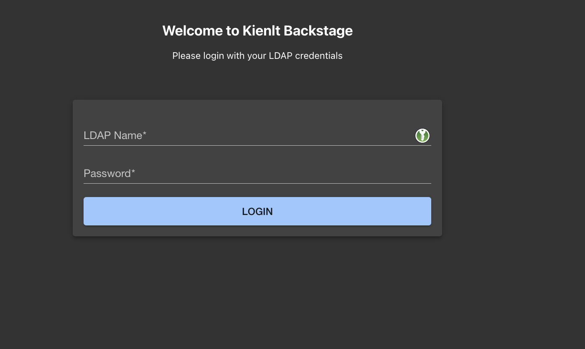

Title: [WIP] My Platform Engineering Journey #2: Getting Started with Backstage - Internal Developer Portal and Prepare for Certified Backstage Associate Exam
Date: 2025-12-08
Category: Knowledge Base
Tags: platform-engineering, backstage

# Sections
- Prerequisite
- Hello World - Backstage
- Backstage with LDAP integration - For Authentication
- Remote Location - Manage your configuration with GitOps style
- Custom Backstage UI
- First Backstage plugin
- Backstage Scaffolder - Golden Path
- Prepare for Certified Backstage Associate Exam
- Conclusion

# Prerequisite
- I assumed you have done have local backstage instance running. So I don't need to repeat most of the content that already appear in [https://backstage.io/docs/](https://backstage.io/docs/) with well-structured documents!
- Basic of GitOps and other knowledge like Dockerfile, GitLab CI
- Need an instance of LDAP for authentication because I will use it in this article.
- You don't really need to know JavaScript, Typescript... AI(ChatGPT/Claude/Gemini/Deepseek/Grok....) are your friends!

--- 

# Hello World - Backstage
- Backstage is an open source framework for building developer portals. I know there are a lot of alternatives for Backstage, but I like Backstage since they are open source, and it is a great way to build internal developer portal in my opinion!

- So a Backstage project will have a workspace with backend (packages/backend) and frontend (packages/app).

- Configuration Central: [app-config.yaml](https://backstage.io/docs/conf/), everything you need to config for Backstage is here.

--- 

#  Backstage with LDAP integration - For Authentication
Before we start, in this article I don't use database to store, only use default in-memory configuration!

So what we want to do first after having Backstage running with port 3000?, it is authentication! So I'm going to do with LDAP, if you want to set up LDAP with docker-compose for quick testing, take a look here [https://github.com/BlackMetalz/docker-compose/tree/main/ldap-osixia](https://github.com/BlackMetalz/docker-compose/tree/main/ldap-osixia)

After set up, we are having LDAP users and LDAP credential for set up with following setting in [app-config.yaml](https://gitlab.com/kienlt-backstage/backstage-authentication-with-ldap/-/commit/2090fa55e82916847a84e7a0ab28760dbbc3fb96#9ff0e6dee7e839f6bab79d2f712f4a7fff9c8bb1).
```yaml

auth:
  environment: development
  providers:
    ldap:
      development:
        cookies:
          secure: false
          field: 'backstage-token'
        # ⚠️ FIX: ldapAuthenticationOptions cần có ldapOpts.url như một object
        ldapAuthenticationOptions:
          userSearchBase: 'ou=users,dc=kienlt,dc=local'
          usernameAttribute: 'uid'
          adminDn: 'cn=admin,dc=kienlt,dc=local'
          adminPassword: 'admin'
          # QUAN TRỌNG: ldapOpts phải là object với url bên trong
          ldapOpts:
            url: 'ldap://localhost:389'
            tlsOptions:
              rejectUnauthorized: false
catalog:
  providers:
    ldapOrg:
      default:
        target: ldap://localhost:389
        bind:
          dn: cn=admin,dc=kienlt,dc=local
          secret: admin
        # QUAN TRỌNG: Thêm schedule để fix lỗi startup
        schedule:
          frequency: PT1H
          timeout: PT15M
          initialDelay: PT30S
        users:
          - dn: ou=users,dc=kienlt,dc=local
            options:
              filter: (uid=*)
              scope: one
              attributes: ['*', '+']
            map:
              rdn: uid
              name: uid
              description: description
              displayName: cn
              email: mail
        groups:
          - dn: ou=groups,dc=kienlt,dc=local
            options:
              filter: (objectClass=groupOfNames)
              scope: one
              attributes: ['*', '+']
            map:
              rdn: cn
              name: cn
              description: description
              displayName: cn
              members: member
```

Oh shiet, I almost forget that we have to install plugin, from root folder of Backstage, where we run command `yarn start` to start Backstage
```bash
# Install frontend plugin
yarn workspace app add @immobiliarelabs/backstage-plugin-ldap-auth

# Install backend plugin
yarn workspace backend add @immobiliarelabs/backstage-plugin-ldap-auth-backend

# Install catalog sync
yarn workspace backend add @backstage/plugin-catalog-backend-module-ldap
```

We should verify installed packages to make sure it is installed!
```bash
grep -r "ldap" packages/*/package.json
packages/app/package.json:    "@immobiliarelabs/backstage-plugin-ldap-auth": "^4.3.1",
packages/backend/package.json:    "@backstage/plugin-catalog-backend-module-ldap": "^0.12.0",
packages/backend/package.json:    "@immobiliarelabs/backstage-plugin-ldap-auth-backend": "^4.3.1",
```

After that, modify some required files to enable login page, they are all in [this commit](https://gitlab.com/kienlt-backstage/backstage-authentication-with-ldap/-/commit/2090fa55e82916847a84e7a0ab28760dbbc3fb96)
- `packages/app/src/App.tsx`
- `packages/backend/src/index.ts`

And the result



Use example LDAP user for login, and we have this (Forget about components, I will talk about them later soon!)


So we already set up authentication for Backstage, but yes only authentication, authorization not include in this introduction article!

# Remote Location - Manage your configuration with GitOps style
This section, we gonna ingest Components/API from remote location, the idea is make it like GitOps style, central location, single source of truth for Components/API. 

You can take a look in [this commit](https://gitlab.com/kienlt-backstage/backstage-authentication-with-ldap/-/commit/618556bf716476316c1a534e3cdbbd21b8eda670#9ff0e6dee7e839f6bab79d2f712f4a7fff9c8bb1) for more detail. 
```yaml
catalog:
  locations:
    # Central catalog repository providing the single source of truth for all entities.
    - type: url
      target: https://gitlab.com/kienlt-backstage/backstage-catalog/blob/main/locations.yaml
      rules:
        - allow: [Component, API, Group, Resource, Location, Template]
```

# Custom Backstage UI
For example, I want to add new button in sidebar. I can do it via like [this commit](https://gitlab.com/kienlt-backstage/backstage-authentication-with-ldap/-/commit/c5b9d293a88447b65fa0812d6d130eaba320c39c)

```git
import ExtensionIcon from '@material-ui/icons/Extension';
import LibraryBooks from '@material-ui/icons/LibraryBooks';
import CreateComponentIcon from '@material-ui/icons/AddCircleOutline';
+ import LibraryAdd from '@material-ui/icons/LibraryAdd';
import LogoFull from './LogoFull';
import LogoIcon from './LogoIcon';
import {
        <SidebarItem icon={ExtensionIcon} to="api-docs" text="APIs" />
        <SidebarItem icon={LibraryBooks} to="docs" text="Docs" />
        <SidebarItem icon={CreateComponentIcon} to="create" text="Create..." />
+        <SidebarItem icon={LibraryAdd} to="catalog-import" text="Import Catalog" />
        {/* End global nav */}
        <SidebarDivider />
        <SidebarScrollWrapper>

```

The result, it will create a button to location defined in `to` property, sound easy right?


Other example I want to show that is custom thing show in tab CI/CD inside a component:


And here is how I do it via [this commit](https://gitlab.com/kienlt-backstage/backstage-authentication-with-ldap/-/commit/2624df002a5942e847fdaeb95b0c344dda2e4e71)

It needs a plugin, install required plugin via this way
```bash
yarn workspace backend add @immobiliarelabs/backstage-plugin-gitlab
```

# First Backstage plugin
This does take a lot of time from mine for simple plugin. So I will introduce proxy configuration in this section as well. You know when we call content from frontend, It will not works because CORS, that is why we need to use proxy, and proxy in this scenario is our backend. Here is how we config our proxy:

```yaml
proxy:
  endpoints:
    '/zenquotes':
      target: 'https://zenquotes.io/api'
      changeOrigin: true
      # This is the crucial part that preserves the path
      pathRewrite:
        '^/api/proxy/zenquotes': ''
  ### Example for how to add a proxy endpoint for the frontend.
  ### A typical reason to do this is to handle HTTPS and CORS for internal services.
  # endpoints:
  #   '/test':
  #     target: 'https://example.com'
  #     changeOrigin: true
```

And [the commit](https://gitlab.com/kienlt-backstage/backstage-authentication-with-ldap/-/commit/f997649e69e51d37b34fb6adb69ebae56a13c057) for the plugin with big help of AI (Gemini in this scenario)

I even learned how to publish the package to npmjs.com haha. Here is the package link: [https://www.npmjs.com/package/@kienlt/backstage-plugin-random-quote](https://www.npmjs.com/package/@kienlt/backstage-plugin-random-quote)

And it's source code: [https://gitlab.com/kienlt-backstage/backstage-plugin-random-quote](https://gitlab.com/kienlt-backstage/backstage-plugin-random-quote). You can take a look with commit to see some pain I go through to make it works. And the result of simple plugin (Random Quote).


# Backstage Scaffolder - Golden Path
The idea was from my previous leader back in 2022-2023, we are trying to find a solution for automation that have a form to create full CI/CD deployment. User(Developer) only need to enter which language, service type (api/website). Kinda like some simple information and the backend will process from A->Z that create best practice example code include Dockerfile and other components based service type. At that time I understand the idea but could not make it works.

Until today, I'm learning Backstage and remember the past, ohh, Backstage Software Template (Backstage Scaffolder) is the solution for that issue.

Here is how [it implemented via commit](https://gitlab.com/kienlt-backstage/backstage-authentication-with-ldap/-/commit/341cae4713ec0ab390fc6b4ae7a8affe6027ad4e)

We need GitLab Token with following information (For Demo):


And update in app-config.yaml for scan.
```git
catalog:
  providers:
    gitlab:
      # A unique name for this provider
      kienlt-group:
        host: gitlab.com
        # The GitLab group to scan for projects
        group: 'kienlt-backstage'
        # Skip personal projects
        skipPersonalProjects: true
        schedule:
          frequency: { minutes: 5 }
          timeout: { minutes: 3 }
```

And yeah, with `catalog-info.yaml` located inside Skeleton folder, it will not make any senses for GitOps. But this article I just want to show some basic of Backstage and what's capable of!

Here is the Demo after we implement Backstage Scaffolder


We will choose `NodeJS Express Service` from backstage-catalog repo, enter some required field


And here is the result after we create


it already imported to Software Catalog page


And public demo repo: [https://gitlab.com/kienlt-backstage/blackmetalz.github.io](https://gitlab.com/kienlt-backstage/blackmetalz.github.io)

Sound great right?

# Prepare for Certified Backstage Associate Exam
A lot of things I haven't introduced in this Section was:
- Techdocs: How document as code working.
- Tech builder: How document build and generation.
- Search: How we search component/catalog/document.
- Relation between kind Component and API.
- What is the lifecycle?
- And many things more, but they can be found in here. The mock exam to prepare for Certified Backstage Associate exam!

https://www.udemy.com/course/certified-backstage-associate-exam-practice-questions

I used that to prepare for the exam and scored 83/100 in real test!

# Conclusion
- Backstage is not easy.
- Don't use it if you don't have issue like Spotify or your infrastructure is not big enough because it will consume very very big human resource to implement!

Resource I used to create this Article:
- https://www.youtube.com/watch?v=r46uFbu9wOs (A little out date)
- https://backstage.io/docs/overview/what-is-backstage
- https://orkohunter.net/blog/you-need-a-product-mindset