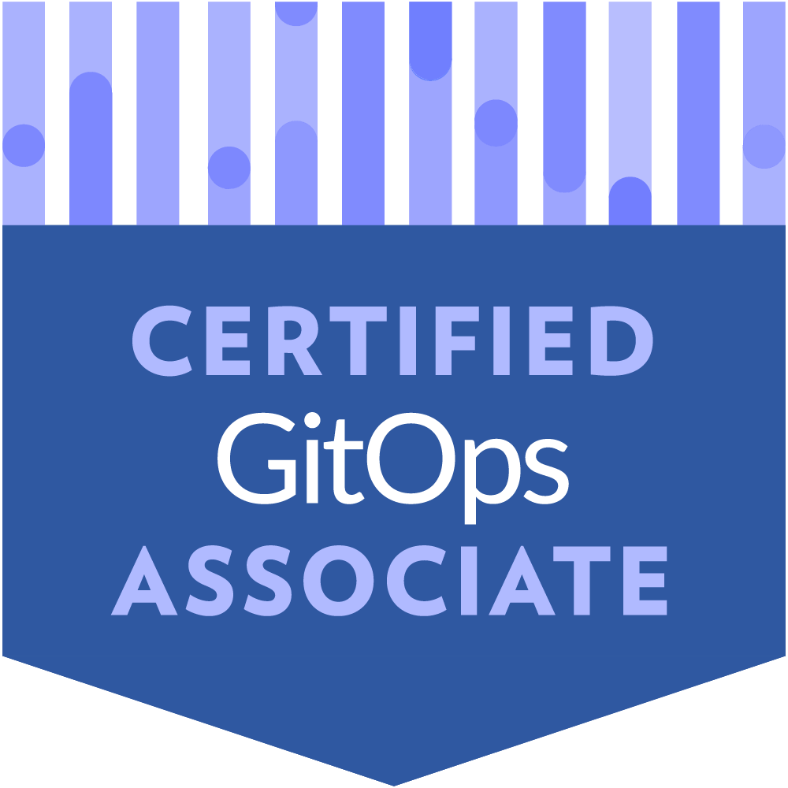

Title: Mastering GitOps & Crushing the Certified GitOps Associate (CGOA) Exam
Date: 2025-12-12
Category: Knowledge Base
Tags: gitops, certification, linux-foundation

# Sections
- Introduction
- What is CGOA?
- The 4 GitOps Principles
- Understanding the Architecture
- Key Topics to Master
- My Secret Weapon: The Mock Exams
- Exam Day Strategy
- Conclusion

---

# Introduction
- GitOps is not something new, we have been talking or using them in most of our daily works. It can be considered for common pattern for CD (Continuous Delivery).
- We gonna go through concepts of GitOps and prepare for the Certified GitOps Associate (CGOA) with mock exams.

---

# What is CGOA?
- Who is it for: The ideal minimally qualified candidate has been in a supporting role within a Platform Engineering team working with Cloud Native technologies for approx 6-12 months. You can take [more detail here](https://trainingportal.linuxfoundation.org/courses/cloud-native-platform-associate-cnpa) xD
- Key features: Quiz Exam, Vendor-Neutral (You don't need to stick with vendor). Cost $250 (Discount could up to 50%) and 90 minutes exam.
- Highlight: It is mindset for run and maintain modern system, not only using tool in a blind way.

---

# The 4 GitOps Principles

This section carries a very high score and forms the basis for reasoning in all other questions:

- First, Declarative - The entire desired state of your system is expressed declarative (what you want, not how to get there). You define infrastructure and applications as code using declarative formats like YAML/JSON, describing the end state rather than the steps to achieve it.
- Second, Versioned and Immutable - The canonical desired state is versioned in Git, making it the single source of truth. Every change is tracked through Git commits, providing a complete audit trail, rollback capability, and the ability to recreate any previous state of your system.
- Third, Pulled Automatically - Software agents automatically pull the desired state declarations from Git and apply them to your system. This pull-based model is more secure than traditional push-based deployments since your cluster credentials never leave your environment.
- Continuously Reconciled - Agents continuously observe the actual system state and compare it with the desired state in Git. When drift is detected (manual changes, failures, etc.), the system automatically reconciles by bringing the actual state back in line with what's declared in Git, ensuring self-healing capabilities.

---

# Understanding the Architecture

- Pull vs Push Model: This is not hard, you only need to understand pull is pull from git repo and push is something like kubectl apply, it is easy, isn't it? xD
- The Reconciliation Loop: Let's take an example from ArgoCD, you update manifest in git repo, ArgoCD watch and detects changes auto (with auto-sync mode) then pull the changes and apply to K8s cluster. This is heart of GitOps!

---

# Key Topics to Master

Git Strategies: Mono-repo vs Multi-repo, manage environment (branch vs directory)

- Mono-repo keeps all applications and environments in a single repository, making it easier to manage shared configurations and enforce consistency.
- Managing Environments: Branch-based - Each environment (dev, staging, prod) gets its own branch. Changes flow through branches via pull requests (dev → staging → prod). This approach is intuitive and provides clear separation, but can lead to merge conflicts and makes it harder to track what's deployed where.
- Managing Environments: Directory-based - All environments live in the same branch but in separate directories (env/dev, env/staging, env/prod). This is the preferred approach in GitOps as it avoids merge conflicts, makes environment differences clearly visible in a single view, and works better with tools like Kustomize or Helm for managing variations between environments.
- Best Practice - Most teams use mono-repo with directory-based environments for simplicity, or multi-repo when they need strong isolation between teams/projects. The key is maintaining a clear structure that makes it obvious what's deployed in each environment

Security in GitOps:

- Secrets Management - Never commit plain text secrets to Git. Use external secret management solutions like Sealed Secrets (encrypts secrets that can only be decrypted by your cluster), External Secrets Operator (syncs from Vault/AWS Secrets Manager).
- Audit Trail - Git provides built-in audit capabilities through commit history. Every change shows who made it, what was changed, when it happened, and why (commit message).
- Access Control - Leverage Git's native access controls (branch protection, required reviews, signed commits) to enforce security policies. Pull requests become your approval gates, ensuring no unauthorized changes reach production.
- Principle of Least Privilege - GitOps agents only need read access to Git and write access to the cluster. Developers only need Git access, not direct cluster credentials. This separation reduces risk - even if a developer account is compromised, attackers can't directly touch production infrastructure without going through the review process.

Progressive Delivery in GitOps:

- Core Concept - Progressive Delivery is about gradually rolling out changes to reduce risk. Canary releases deploy new versions to a small subset of users first, monitoring for issues before full rollout. Blue/Green keeps two identical environments, switching traffic between them for instant rollbacks.
- GitOps Role - Limited - Here's the reality: GitOps primarily handles the declarative deployment part, not the intelligent traffic shifting. 
- How It Works? Lets me provide a simple keyword: Argo Rollout (ArgoCD) or Flagger (FluxCD). I do recommend you to read [this article](https://medium.com/@kienlt.qn/canary-blue-green-deployment-with-argo-rollouts-fc9b34535f18) xD
- Clarification - GitOps doesn't inherently "automate" progressive delivery - it provides the foundation (declarative state, automation, reconciliation) that progressive delivery tools build upon.

---

# My Secret Weapon: The Mock Exams

Okay, real talk—want to know how I actually passed the CGOA? It wasn't just reading docs or watching videos. It was grinding through practice questions until the concepts clicked.

Why They Work?:

- Wide Coverage - Every major topic is in here: the 4 Principles, pull vs push, reconciliation loops, Git strategies, security, progressive delivery—all of it.
- Real Scenarios - Not just "what is GitOps?" but actual situations like "your developer just ran kubectl apply—what happens next in a GitOps workflow?"
- Detailed Explanations - Every answer explains why it's correct and why the others are wrong. This is where you actually learn, not just memorize.
- I took these exams multiple times, reviewed every explanation (even for questions I got right), and by exam day, I walked in feeling like I'd already seen every curveball they could throw.

Check out the full mock exam course here: [Crushing the Certified GitOps Associate (CGOA) Exam](https://www.udemy.com/course/crushing-the-certified-gitops-associate-cgoa-exam/)

---

# Exam Day Strategy
- Read questions, eliminate wrong options.
- Think with principle: "Single Source of Truth" (git is truth xD)

---

# Conclusion
- This is not hard, it is all about mindset and understanding GitOps principle!
- Please try the mock exam to increase your confidence before exam!

Reference:

- Most content I used to copy from this haha: https://opengitops.dev/
- Udemy mock exam: https://www.udemy.com/course/crushing-the-certified-gitops-associate-cgoa-exam