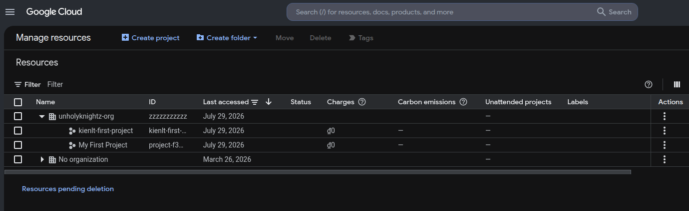
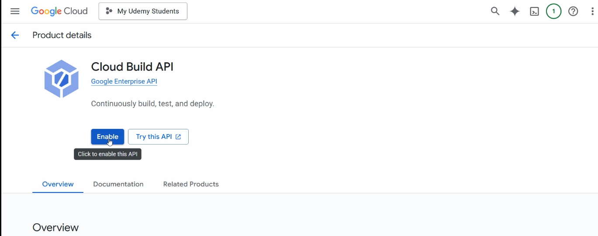
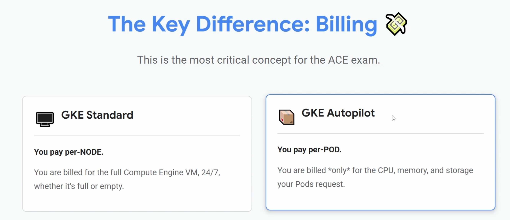
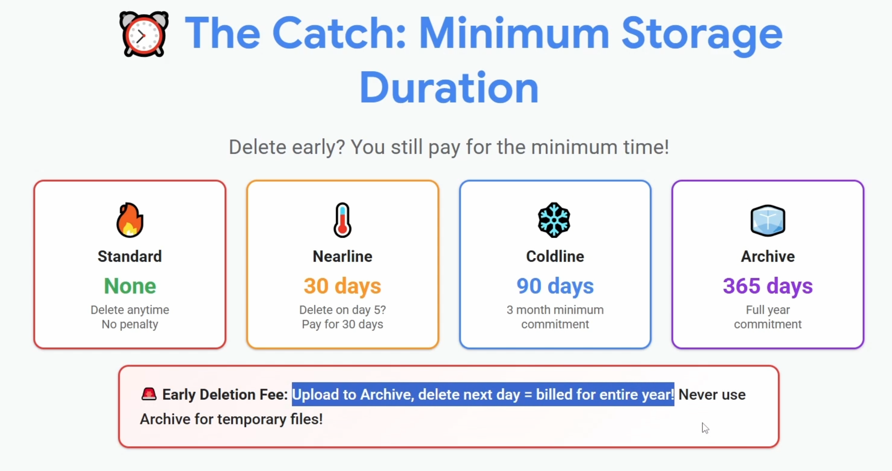

Title: Prepare for GCP - Associate Cloud Engineer Certification
Date: 2026-07-27
Category: Knowledge Base
Tags: gcp, certification

# 1.Intro
Ah shit, here we go again xD. This time is Google Cloud, my first time. Please prepare new trial account with **300$**, we will use it for 3 months in a row. Not sure I can do what I'm aiming for (Cloud Engineer Associate + DevOps Pro). In this article, I'm mainly using resource from [Udemy course](https://www.udemy.com/course/gcp-associate-cloud-engineer-certification/) and visit [Associate Cloud Engineer](https://cloud.google.com/learn/certification/cloud-engineer/) link for me information!

Useful links:

- [Train for the exam](https://www.skills.google/paths/11)
- [Exam Guide](https://services.google.com/fh/files/misc/associate_cloud_engineer_exam_guide_english.pdf)

Section of the exam:

- Section 1: Setting up a cloud solution environment (~20% of the exam)
- Section 2: Planning and implementing a cloud solution (~30% of the exam)
- Section 3: Ensuring the successful operation of a cloud solution (~30% of the
exam)
- Section 4: Configuring access and security (~20% of the exam)

---

# 2.Resource Hierarchy

### Concept of project in GCP
A project is the main container for all your resources. (Ref: ResourceGroup at Azure)

### Resource Hierarchy

Same like Azure, pretty familiar xD. Permissions management in GCP work with mechanism inheritance. GCP Resource Hierarchy has 4 levels: Organization, Folders, Projects and Resources.


### Manage Projects

We can use this for tracking costs of specific project like this



### Organization Policies VS IAM

Nothing new for me, no need to explain detailed: 

- Org Policies: WHAT can be done (Example: Edit/Create a policy for resource location lock, only allow to create instance in specific location like es-east1/europe-west1.)
- IAM: WHO can do something.

### API

For some services, we need to enable before use it!



### Cloud Identity

**WHO** is the people that allow to do **WHAT**

- Cloud Identity: Manages the "WHO"
- IAM: Manages the "WHAT"

Best practice is manage people with group for sure, not only in GCP. For example in Elasticsearch, we create a role called data-reader that has permission to read indices `kienlt-data-*`, then we add right user to that role, so we don't need to create multiple role for each user or remove user from that role when they are no longer needed, pretty common practice I believe!

### Asset Inventory

Inventory of everything in your GCP. Is the central catalog for every single resource in yuor GCP Org.

I remember when my boss ask me to create inventory of whole system on-premises, it would take shit load of time... But in GCP, there are already service for this shit!

### Cloud Billing Account
A single billing account can pay for thoudsands of projects, centralizing financial control. And need to remember that billing accounts are "Separate" from projects in GCP (to use paid service, a project must be linked to an active cloud billing account so Google know where to send the fuckin' bill!)

Ofc, like other public cloud providers, you are able to view the cost with labels...

### Other shit

- We can setting billing exports to BigQuery to analyze the costs?

---

# 3. IAM

Just little more detail of Cloud Identity I told above!

### Impersonate

GCP IAM Impersonation example, impersonate GCP Service Account to test permission read storage. So you don't need to use serviceAccount Key Json (More fuckin' secure!)
```bash
gcloud storage ls gs://my-company-bucket \
  --impersonate-service-account=app-reader@my-project.iam.gserviceaccount.com
```

You feel like familiar with something in K8S? right? Yes, exactly! It is fuckin' serviceAccount in K8S. Example test serviceAccount **developer-sa** in namespace **dev** if it is able to get pods!
```bash
kubectl get pods -n dev --as=system:serviceaccount:dev:developer-sa
```

### Fine-grained accounts

Format: 
```
[app-name]-[env]-[purpose]-sa
```

And yes, fuckin' **Least privileges** please!

### Workload vs Workforce Identity Federation

- Workforce: for human
- Workload: for machine

---

# 4. Compute & Scaling

### VM Access
We can login with IAM instead of SSH or User/Password. Actually behind the scene, GCP did many many thing it in:

- [OS Login](https://docs.cloud.google.com/compute/docs/oslogin?authuser=1)
- [Guest agent functionality](https://docs.cloud.google.com/compute/docs/images/guest-agent-functions?authuser=1)
- [Github Guest Os Login](https://github.com/GoogleCloudPlatform/guest-oslogin)

Default Google-provided OS images already included the Guest Agent and OS Login packages come pre-installed and pre-configured. So we don't need to install them manually xD.

The OS Login Package provides the actual binaries and Linux modules that communicate with GCP (detail in Github above):

- Authorized Keys Command
- NSS Modules
- PAM(Pluggable Authentication Modules) Modules: You will like me feel like the last word "Modules" is little duplicate, but actually they are widely used. For example: ATM machine -> Automated Teller Machine machine, PDF format -> Portable Document Format format, SQL language -> Structured Query Language language. That is how we talk in common of software engineering I guess xD

### Managed Instance Group (MIG)
Nothing to write here, they are almost exactly fuckin' same like Auto Scaling Group in AWS. LOL

---

# 5. Google Kubernetes Engine (GKE)

This one worth to mention since this is new for me.



And yes, we have same thing in Azure + AWS:

- Azure: Azure Container Apps or AKS Automatic
- AWS: AWS Fargate (cho EKS / ECS)

### K8S

This courses include some basic K8S knowledge, great for newbie I believe!

### Cluster Autoscaling

Reference: [About GKE cluster autoscaling](https://docs.cloud.google.com/kubernetes-engine/docs/concepts/cluster-autoscaler?authuser=1)

```
Cluster autoscaler makes these scaling decisions based on the resource requests (rather than actual resource utilization) of Pods running on that node pool's nodes. It periodically checks the status of Pods and nodes, and takes action
```

That is little different in GKE, so it will only add new nodes based pending (Unschedulable) pods, not CPU Utilization of Node. This works both for standard and autopilot cluster.

### Workload Identity

It is the recommended, secure way for GKE pods to access GCP services. And we have same business logic in public cloud providers:

- AWS: IAM Roles for Service Accounts (IRSA)
- Azure/GCP: Workload Identity

---

# 6. Serverless with Cloud Run

### Cloud run services (Serverless containers)

- GCP: Cloud Run
- AWS: Fargate or App Runner
- Azure: Azure Container Apps / App Service Container

### Cloud run function (Serverless functions)

- GCP: Cloud Run Functions
- AWS: Lambda
- Azure: Azure Functions

### Event Trigger for function

- GCP: Eventarc or Pub/Sub
- AWS: EventBridge
- Azure: Azure Event Grid

### Example with Eventarc

This is fuckin' popular example that would appear in every tutorial, LOL. When user upload an image to Cloud Storage Bucket (S3), Eventarc will catch this event and trigger Cloud Run Function to handle (resize image, extract metadata of image and write to somewhere?)

Another example would to mention: Pub/Sub will related to decoupling services (using Eventarc). Also remember, there is no fuckin' persistant data in Cloud Run Service (But mount NFS or publish data to Cloud Storage are fine xD)

---

# 7. Cloud Storage

### Storage Classes
Bucket name must be globally unique. We have some storage classes like others but almost just name different, LOL:

- Standard (Hot)
- Nearline (Warm)
- Coldline (Cool)
- Archive (Cold)

And for early deletion fee. The author explained pretty well and easy to understand in this picture:



And there is little different in retrieval time of GCP vs AWS/Azure:

- Archive in GCP allow you able to read data from archive class
- AWS (S3 Glacier) / Azure (Archive Tier): ask you to wait 3 to 12 hours to retrieve data after "request restore".

### Policies & Permissions
- Signed URL in GCP (GCS) = SAS Token in Azure (Blob Storage) = Presigned URL in AWS (S3)
- Delete encryption key = permanent data loss, because there is no way to decrypt files storage in bucket without key (But we have Pending deletion for key and soft delete for files in bucket. So don't worry if accident happens xD).
- Lifecycle policy management: same as other, move files from current classes to other classes or delete it for costs saving. And 1 thing interests about it, there is no fuckin' "Early Deletion Fees"
- And use lifecycle for know, autoclass for unknown. Age condition then set storage class actions.
- Autoclass ignores file size < 128Kb by default, it only transitions to Nearline (unless you configured it for Archive).
- And even with Automation, remember minimum durations: Nearline(30 days), Coldline(90 days), Archive (365 days)
- Uniform Bucket-Level access is the standard, no need legacy ACL and required to use feature like Managed Folders.

### Storage Transfer Service (STS)
- Use when needed for large transfers into GCS: support Cloud to Cloud or On-premises to Cloud
- Able to run directly or via scheduling, run synchronization and have data integrity for validation.

---

# 8. Managed Databases in GCP

Relational (SQL) options:

- Cloud SQL: Mysql, PostgreSQL, SQL Server...
- AlloyDB: PostgreSQL by GCP, not fuckin' open source xD, like Aurora in AWS.
- Cloud Spanner: like DynamoDB in AWS

NoSQL options:

- Firestore: Document database, like MongoDB. Perfect for mobile/web apps
- Bigtable: Clickhouse or TiFlash in TIDB?
- MemoryStore: Redis/Memcached

### High availability and read replicas

It is just like AWS, nothing specials...

### Other shit

- Want a centralized view -> go for Database Center

### Cloud Managed Services vs. Open-Source Equivalents

Not related but I want to put here, everytime I see services in AWS/GCP/Azure, I often search if there is same solution but **open-source**. So here is my little research:

- GCP Cloud Spanner = CockroachDB/YugabyteDB (Distributed SQL).
- AWS DynamoDB = ScyllaDB (Distributed NoSQL, Key-Value/Documents.
- Cloud-Native RDBMS: Aurora (AWS) & AlloyDB (GCP). Not multi-write, still using single master (primary node for write).

---

# 9. Big Data & Analytics Platforms

OLAP workloads. We are able to upload dataset with .csv example and query based column in csv file. They are split by ","

Dataflow is Google Cloud's fully managed, serverless service for processing large amounts of data. For example Raw Data (CSV,logs...) --> Dataflow (Transform, filter, aggregate) --> Clean Data (Ready for BigQuery)

---

# 10. Managed file storage

Filestore = managed NFS, for Linux. NetApp (NFS or SMB file services, for Window mostly!)

---

# 11. Virtual Private Cloud (VPC) Networking