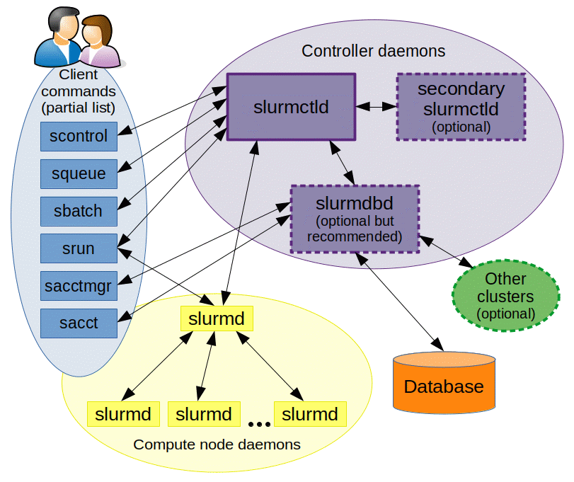
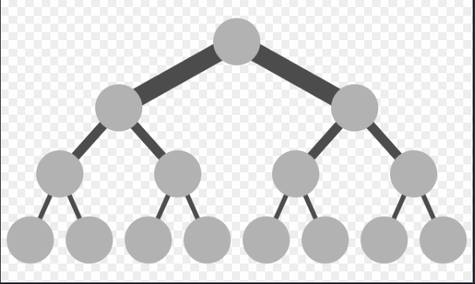
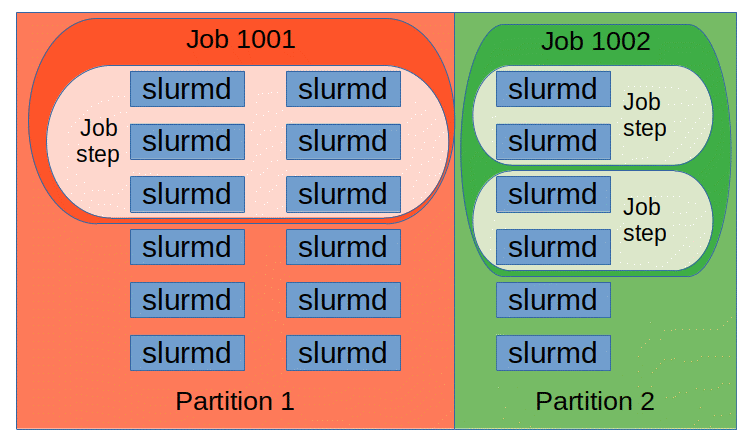
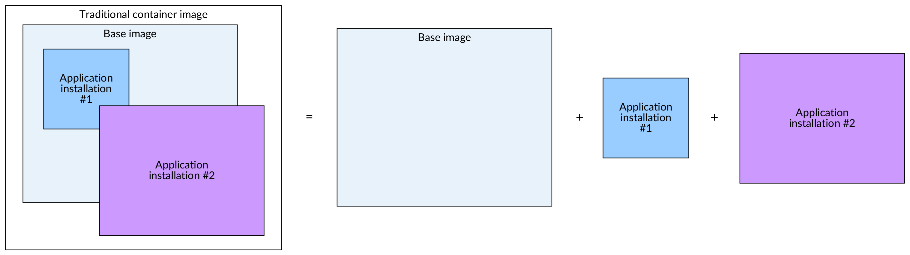

Title: [WIP] Slurm 101
Date: 2026-09-07
Category: Knowledge Base
Tags: hpc, slurm

TLDR: **Slurm** is an open source, fault-tolerant, and highly scalable cluster management and job scheduling system for large and small Linux clusters.

# Phase 1: Understanding the Core Concepts of Slurm (Most Important)

### First, understand the basic topology:

```
User
  |
Login Node
  |
slurmctld (controller)
  |
+------------+------------+
|            |            |
slurmd      slurmd      slurmd
Node01      Node02      Node03
```



### Key Components:

| Component  | Role                                              |
| ---------- | ------------------------------------------------- |
| [`slurmctld`](https://slurm.schedmd.com/slurmctld.html) | Scheduler + Central Controller                    |
| [`slurmd`](https://slurm.schedmd.com/slurmd.html)       | Agent daemon running on compute nodes             |
| [`slurmdbd`](https://slurm.schedmd.com/slurmdbd.html)   | Accounting daemon ([Slurm Database Daemon](https://slurm.schedmd.com/accounting.html)) |
| [`munge`](https://dun.github.io/munge/)                 | Authentication service                            |
| `login node`| Gateway node where users SSH in to submit jobs   |

### Mapping Concepts: Slurm vs Kubernetes

```
K8s                    Slurm

kube-apiserver   ~=    slurmctld
kubelet          ~=    slurmd
Node             ~=    Compute Node
Pod              ~=    Job/Task
Scheduler        ~=    Slurm Scheduler
```

Key fundamental differences:

- **Kubernetes** is optimized for long-running services (Deployments, APIs, web apps).
- [**Slurm**](https://slurm.schedmd.com/) is optimized for batch workloads (AI training, simulations, HPC jobs).

For example:

- **K8s:** *"I want to run an Nginx service indefinitely."*
- **Slurm:** *"I want to run a 48-hour model training job and exit when done."*

### Why not just use K8s Jobs for Distributed AI Training?

While Kubernetes has `Job` objects, Slurm remains the gold standard for large-scale GPU training because of three core HPC capabilities built into its DNA:

**Atomic Multi-Node Allocation (Native Co-Allocation):**

- Multi-node distributed training ([PyTorch DDP](https://pytorch.org/docs/stable/notes/ddp.html) / [FSDP](https://pytorch.org/docs/stable/fsdp.html) / [Megatron-LM](https://github.com/NVIDIA/Megatron-LM)) requires all $N$ GPUs across multiple nodes to start simultaneously to establish rendezvous and synchronize gradients.
- In vanilla Kubernetes, the default scheduler binds pods incrementally. If 60 GPUs are free and 4 are busy, it might schedule 60 pods and leave them idling—wasting expensive GPU hours unless using external batch co-scheduling add-ons like [Kueue](https://kueue.sigs.k8s.io/) or [Volcano](https://volcano.sh/).
- Slurm natively guarantees **atomic allocation**: a job is only launched when 100% of the requested nodes and resources are simultaneously available, remaining in `PENDING` state without holding or fragmenting resources. *(Note: In Slurm documentation, "[Gang Scheduling](https://slurm.schedmd.com/gang_scheduling.html)" specifically refers to time-slicing oversubscribed resources between jobs, rather than co-allocation).*

**Network Topology Awareness (InfiniBand / RoCE Tree):**

- The biggest bottleneck in AI training is inter-GPU communication ([NCCL](https://developer.nvidia.com/nccl) AllReduce latency).
- Slurm understands network switch hierarchy via [Topology Plugins](https://slurm.schedmd.com/topology.html) (Spine-Leaf / Fat-Tree). It prioritizes packing jobs within the same Top-of-Rack (ToR) switch to maximize throughput and minimize latency.



**Bare-Metal Performance & Direct POSIX Storage:**

- Slurm executes processes directly on the host OS with [Linux cgroups](https://docs.kernel.org/admin-guide/cgroup-v2.html) locking specific CPU cores, NUMA nodes, and GPU PCI buses.
- Zero container overlay network (CNI) overhead and direct POSIX access to high-performance parallel file systems ([Lustre](https://www.lustre.org/), [BeeGFS](https://www.beegfs.io/), [GPFS / IBM Storage Scale](https://www.ibm.com/products/storage-scale)).

### Essential CLI Commands:

[**`sbatch`**](https://slurm.schedmd.com/sbatch.html): Submits a batch job script. Slurm accepts the job and initially places it in a `PENDING` state:
```
JobID=123
State=PENDING
```
It then waits for the scheduler to allocate resources and execute it. In Kubernetes terms, it feels like:
```bash
kubectl apply -f job.yaml
```

[**`srun`**](https://slurm.schedmd.com/srun.html): Executes jobs immediately in interactive mode or runs parallel tasks within an allocation. For example:
```bash
srun hostname
```
Slurm allocates a node and executes the command on `node01`. A quick way to distinguish them:
```
sbatch = Submit a job script (asynchronous)

srun   = Run a command / step (synchronous / interactive)
```


[**`squeue`**](https://slurm.schedmd.com/squeue.html): Views the cluster's job queue. Running **`squeue`**:
```
JOBID PARTITION USER ST
123   gpu       kien PD
124   gpu       kien R
```

State meanings:
```
PD = Pending
R  = Running
CG = Completing
```

Conceptually similar to: **`kubectl get pods`**

[**`sinfo`**](https://slurm.schedmd.com/sinfo.html): Views the status of nodes and partitions. Running **`sinfo`**:
```
PARTITION AVAIL NODES STATE
cpu       up      4   idle
gpu       up      2   alloc
```

Think of it like:
```bash
kubectl get nodes
```

[**`scancel`**](https://slurm.schedmd.com/scancel.html): Cancels/kills a job. For example: **`scancel 123`**. Similar to: **`kubectl delete pod xxx`**.

[**`sacct`**](https://slurm.schedmd.com/sacct.html): Accounting tool. Displays historical job accounting records.

### Core Resource & Scheduling Concepts

- [**QoS (Quality of Service)**](https://slurm.schedmd.com/qos.html): Priority, limits, and preemption rules.
- [**Partition**](https://slurm.schedmd.com/slurm.conf.html#OPT_PartitionName): Logical grouping of nodes (like queues or namespaces with specific node pools).
- [**GRES (Generic Resources)**](https://slurm.schedmd.com/gres.html): Generic resource management (e.g. GPUs).
- [**cgroup**](https://slurm.schedmd.com/cgroups.html): Resource isolation (CPU cores, memory, devices) enforced on compute nodes.



---

# Phase 2: Localhost Lab with Docker

### Building a Mini Cluster

```bash
docker network create slurm-net

controller
compute01
compute02
```

Each container acts as a specific role:
```
slurm-controller
slurm-node1
slurm-node2
```

Architecture:
```
+------------------+
|    slurmctld     |
+------------------+
         |
    +----+----+
    |         |
+--------+ +--------+
| slurmd | | slurmd |
| node01 | | node02 |
+--------+ +--------+
```

### Hands-on Testing
This is the most valuable part to practice:

- `sbatch job.sh`
- `srun hostname`
- `sinfo`
- `squeue`

---

# Phase 3: Simulating a Production Cluster

Once the basic Docker cluster is up and running:

### Adding a Login Node:

```
login
controller
compute01
compute02
```


The login node doesn't run computation workloads:

User workflow:
```bash
ssh login
sbatch train.sh
```

This mirrors real-world production environments much closer.

### Adding `slurmdbd` (Accounting)

Learn accounting — this is one of the most frequently used subsystems by HPC admins.

```
MariaDB
  |
slurmdbd
  |
slurmctld
```

Then explore these commands:

- [`sacct`](https://slurm.schedmd.com/sacct.html)
- [`sreport`](https://slurm.schedmd.com/sreport.html)

--- 

# Phase 4: GPU Scheduling

Note: GPU scheduling (GRES) can be skipped initially if you don't have local GPUs.

- Slurm manages GPU via [GRES (Generic Resources)](https://slurm.schedmd.com/gres.html) combined with [Linux cgroups](https://slurm.schedmd.com/cgroups.html) to map device files (`/dev/nvidia*`).
- Tip for learners without a local GPU like me, we still can define dummy GRES in [`slurm.conf`](https://slurm.schedmd.com/slurm.conf.html) and [`gres.conf`](https://slurm.schedmd.com/gres.conf.html) to completely understand the resource request flow of **`--gres=gpu:1`** in Slurm without any physical GPU!

```ini
# slurm.conf
GresTypes=gpu
NodeName=node[1-2] Gres=gpu:fake:2

# gres.conf
NodeName=node[1-2] Name=gpu Type=fake File=/dev/null
```

---

# Phase 5: High Availability (HA) & Production Setup

When scaling up to a larger lab:

### Controller HA

Learn [Slurm High Availability (HA)](https://slurm.schedmd.com/quickstart_admin.html#HA):

```
Primary slurmctld
Backup slurmctld
```

Configuration concepts in [`slurm.conf`](https://slurm.schedmd.com/slurm.conf.html):

```ini
SlurmctldHost=ctrl1
SlurmctldHost=ctrl2
```

### Shared Storage Strategy

While not a hardcoded Slurm specification, the standard industry convention in HPC/AI clusters is to tier shared storage into 3 distinct mount paths based on I/O performance and lifecycle:

- **`/home` (User Environment):**
  - Holds dotfiles, Python virtualenvs, and job submission scripts.
  - Backed by standard NFS / CephFS with daily backups and strict quotas (e.g., 20GB/user).
- **`/scratch` (High-Speed Ephemeral Workspace):**
  - Dedicated for active job I/O, temporary checkpoints (`.pt`), and staging datasets.
  - Backed by high-throughput Parallel File Systems ([Lustre](https://www.lustre.org/), [BeeGFS](https://www.beegfs.io/)). **No backups** and subject to auto-purging policies (e.g., automatically deleted if unaccessed for 30 days).
- **`/project` or `/data` (Team Shared Assets):**
  - Shared storage for base datasets (e.g., ImageNet, HuggingFace caches) and long-term project artifacts with team-based POSIX permissions (`setgid`).

---

# Phase 6: Slurm + Containers

This is where the real fun begins:

### Why don't we just use docker run in Slurm?

- The essence: Docker requires a daemon running with root access. In multi-tenant HPC clusters, giving docker access to users is practically equivalent to giving them root access xD.
- Solution for HPC: [**Apptainer (Singularity)**](https://apptainer.org/) or [**NVIDIA Enroot**](https://github.com/NVIDIA/enroot) / [**Pyxis**](https://github.com/NVIDIA/pyxis) that turn container images into flat files (`.sif`), run completely under the user's UID/GID within a user namespace, and mount `/scratch` and host NVIDIA drivers directly without a root daemon.



### Apptainer (Singularity)

Extremely popular in HPC environments. [Apptainer](https://apptainer.org/) is well worth learning before Docker-on-Slurm, as almost every HPC cluster uses it for rootless container execution.

```bash
srun apptainer exec pytorch.sif python train.py
```

---

# Phase 7: Slurm + Kubernetes

This is the most sensible model in modern AI/ML infrastructure today. For example:

### K8S Layer (Cloud-native control plane)

Serving developer experience:
- [JupyterHub](https://jupyter.org/hub)
- [MLflow](https://mlflow.org/)
- [Ray](https://www.ray.io/) / Ray Dashboard
- Model Registry
- Serving APIs / Inference Servers ([vLLM](https://github.com/vllm-project/vllm) / [Triton Inference Server](https://developer.nvidia.com/triton-inference-server))

### Slurm Layer (Bare-metal Execution Engine)

Serving heavy distributed training & fine-tuning where thousands of GPUs connect to each other via [InfiniBand](https://www.infinibandta.org/) or [RoCEv2](https://en.wikipedia.org/wiki/RDMA_over_Converged_Ethernet).

---
