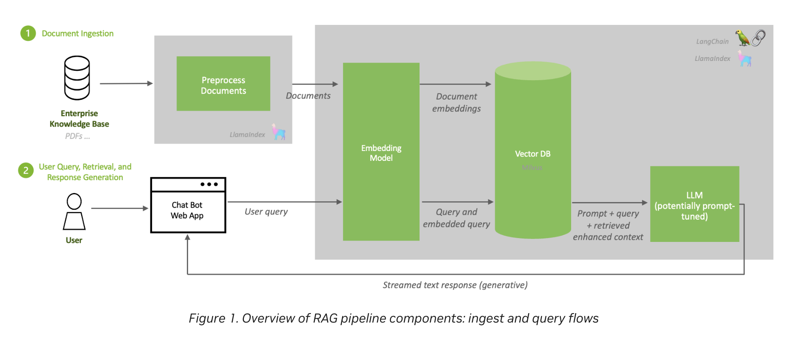
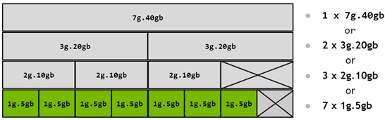
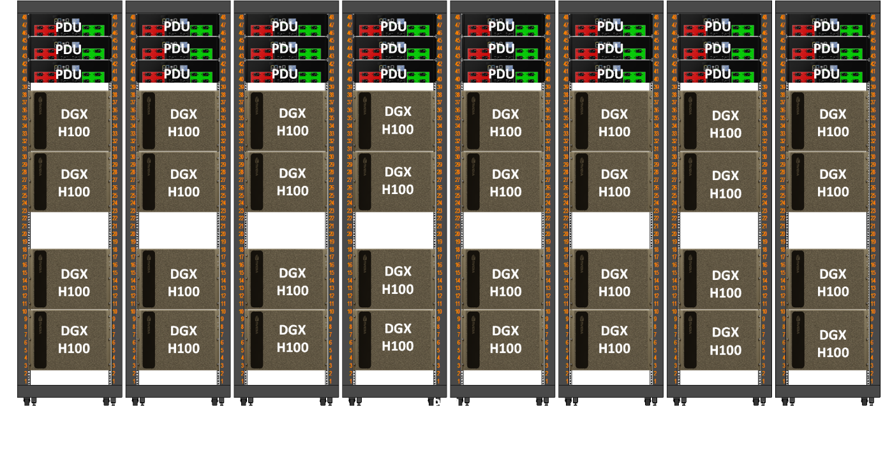

Title: Prepare for NVIDIA Certified Associate: AI Infrastructure and Operations (NCA-AIIO) Exam
Date: 2026-09-08
Category: Knowledge Base
Tags: nvidia, hpc, ai, certification, devops

TLDR: Study guide for the **NVIDIA Certified Associate: AI Infrastructure and Operations (NCA-AIIO)** exam, written from an operations background — if you already run Kubernetes or Slurm, this maps the AI infrastructure world onto what you already know.

---

# Introduction: Why This Fuckin' Certification

I'm about to start working with NVIDIA GPUs at work, so I'd rather learn this properly instead of pick it up for fun purpose, because it won't going anywhere or further and the [**NCA-AIIO**](https://www.nvidia.com/en-us/learn/certification/ai-infrastructure-operations-associate/) is a reasonable way to force that.

Everything here is written from an operations background. If you already run Kubernetes clusters, a lot of this world has a familiar shape — and where it doesn't. This is article have no hands-on, every commands output in this section is just I copied it somewhere xD

### Where NCA-AIIO Sits

NCA-AIIO is the entry point, not the destination. Same idea as passing AWS Cloud Practitioner before Solutions Architect Associate, like everyone:

| Certification | Level | Price | Focus |
|---|---|---|---|
| [**NCA-AIIO**](https://www.nvidia.com/en-us/learn/certification/ai-infrastructure-operations-associate/) | Associate | $125 | Foundational AI infra & ops concepts (**we are here**) |
| **NCP-AIO** | Professional | $500 | Monitor, troubleshoot, optimize AI infrastructure |
| **NCP-AII** | Professional | $400 | Deploy, configure, validate AI infrastructure |
| **NCP-AIN** | Professional | $400 | AI networking (InfiniBand / Spectrum-X) - **This shit is hard AF**! |

### Exam Details

Full details on the [official exam page](https://www.nvidia.com/en-us/learn/certification/ai-infrastructure-operations-associate/) — 50 questions, 1 hour, online proctored, registered through [Certiverse](https://www.certiverse.com/#/checkout/nvidia/store-exam/NCA-AIIO).


Three weighted domains:

| Domain | Weight | Covered in |
|---|---|---|
| Essential AI Knowledge | 38% | Phase 1, plus 2.1 (CPU vs. GPU), Phase 5 (software stack) and 6.4 (lifecycle) |
| AI Infrastructure | 40% | Phases 2-4, Phase 8 |
| AI Operations | 22% | Phases 6-7 |

### How to Read This

Everything here maps to a blueprint bullet **unless the heading says otherwise**. Two markers appear:

- ***(optional — NCP-AIO level)*** — real ops knowledge that the Associate exam does not test. Skip it on the first pass; come back when you run a cluster.
- ***(optional — reference)*** — numbers to look up, never to memorize.

If you are short on time, read everything unmarked, do the [Exam Checklist](#exam-checklist), and ignore the rest.

### Learning Resources

- [**AI Infrastructure and Operations Fundamentals**](https://www.coursera.org/learn/ai-infrastructure-operations-fundamentals) on Coursera, the official course. Paid, worth it if your company sponsors training.
- [**YouTube full course**](https://www.youtube.com/watch?v=0WjfKQdfeMU), free alternative covering the same ground, no chapters though.

---

# Mapping: What You Already Operate → AI Infrastructure

If you come from Kubernetes, most of this world has a familiar shape. Start here:

| You already know | AI infra equivalent | Note |
|---|---|---|
| Worker node | GPU node / [DGX](https://www.nvidia.com/en-us/data-center/dgx-platform/) system | One DGX = 8 GPUs + 2 CPUs in one chassis |
| Deployment + HPA | Inference service ([Triton](https://developer.nvidia.com/triton-inference-server), [NIM](https://developer.nvidia.com/nim)) | Long-running, scales with request load |
| Job | Training job | Runs for days, then exits |
| resources.limits | GPU allocation, [MIG](https://docs.nvidia.com/datacenter/tesla/mig-user-guide/) profile | MIG is a *hardware* limit, not cgroups |
| kube-scheduler | [Slurm](https://slurm.schedmd.com/) / [Run:ai](https://www.nvidia.com/en-us/software/run-ai/) | Batch queueing, not incremental binding |
| PVC + CSI | Parallel filesystem mount (Lustre, WEKA, VAST) | POSIX, shared by every node |
| node-exporter → Prometheus | [DCGM Exporter](https://developer.nvidia.com/dcgm) → Prometheus | Same pattern, GPU metrics |
| kubectl drain on node needs maintain | Drain node on Xid / ECC error | Same reflex, different signal |
| kubeadm / Cluster API | [Base Command Manager](https://www.nvidia.com/en-us/data-center/base-command/) (BCM) | Bare-metal provisioning + fabric health |

And the one thing that has **no Kubernetes equivalent at all**:

> **The compute fabric.** In K8s you have one network and you mostly don't think about it. In AI infrastructure there are four physically separate networks, and the fastest of them exists purely so GPUs in different chassis can behave like one giant GPU. This is the biggest conceptual gap coming from the cloud-native world, and it's covered in Phase 3.

---

# Phase 1: The AI Workload — What Are We Actually Running?

This is the part infrastructure people skip. Please dont! You can't size (capacity planning) a cluster for a workload you can't describe.

### 1.1 Training vs. Inference

Everything else in this article follows from this table. These are two completely different workloads that happen to use the same hardware:

| | **Training** | **Inference** |
|---|---|---|
| What it does | Builds the model from data | Uses the finished model to answer |
| Runs for | Days to weeks, one huge job | Forever, millions of small requests |
| Feels like | A giant Job | A Deployment behind a load balancer |
| Scale unit | Many GPUs, many nodes, tightly coupled | Often 1-8 GPUs, loosely coupled |
| Main bottleneck | Inter-GPU bandwidth (gradient sync) | Memory bandwidth and latency |
| Network that matters | Compute fabric (InfiniBand) | Normal Ethernet is usually fine |
| If a node dies | Whole job stops, resume from checkpoint | Kill the pod, reschedule, nobody notices |
| Typical scheduler | Slurm | Kubernetes |
| Success metric | Time-to-train, GPU utilization | Tokens/sec, p99 latency, cost per request |

This single table explains a lot of the hardware catalogue. It's why the H200 beats the H100 on inference despite having *identical compute* — inference is limited by how fast you can move weights out of memory, and the H200 has faster, larger memory. It's also why a training cluster spends a fortune on InfiniBand while an inference cluster often doesn't need it.

### 1.2 AI vs. ML vs. Deep Learning vs. GenAI

Nested circles, broadest to narrowest:

- **AI** — any system doing something that normally needs human intelligence, including plain rule-based systems that never learn.
- **Machine Learning** — learns patterns from data instead of being programmed. A human still picks which input features matter.
- **Deep Learning** — ML with multi-layer neural networks that work out the features themselves. Needs far more data and compute, which is what made GPUs mandatory.
- **Generative AI** — a deep learning application that produces new content (text, images, code) rather than a label or a number.

Rule of thumb: **tabular data with thousands of rows → classical ML. Unstructured data (images, audio, text) at scale → deep learning.**

### 1.3 Why Now — What Actually Changed

Neural networks are from the 1980s. The blueprint asks why they only took over recently, and it's four Neural networks are from the 1980s. Four things landed at once:

- **Data** — *self-supervised* learning (Phase 1.5) removed the human-labeling
  bottleneck, so the raw internet became training data.
- **Compute** — Tensor Cores plus ever-lower precision (FP32 → BF16 → FP8 → FP4):
  same watt, far more math.
- **Architecture** — the transformer parallelizes where RNNs were sequential, so a
  model can finally *use* ten thousand GPUs. Without this, the other three don't matter.
- **Ecosystem** — CUDA, PyTorch, pretrained models, GPU by the hour. Most teams
  fine-tune someone else's model rather than train one.

The consequence for infrastructure scaling laws. More parameters + data + compute gives predictably better models.

### 1.4 Training Fundamentals

Example: Model 70B params -> gradient is 70B numbers, each number is direction for a weight (weight = weight - learning_rate × gradient). AllReduce sync gradient, not the fuckin data!

Training is a loop: feed data in + let the model guess (forward pass), measure how wrong it was (loss), adjust slightly (optimizer step), repeat millions of times. The "adjust" step is matrix math, which is why it needs a GPU.

Terms worth recognizing: it is a wall of text but worth for a noob like me, that is why I put them below

- **Batch size** — how many samples the GPU processes before the model updates. Bigger batch = better GPU utilization but more GPU memory.
- **Iteration** (step) — one trip around the loop above: one batch in, one weight update out.
- **Epoch** — one complete pass over the whole dataset. It is a counter, not an extra step.
- **Overfitting** — the model memorized the training data instead of learning the general pattern. The opposite is **underfitting** — too simple, bad at both.
- **Checkpoint** — a periodic save of model state to shared storage, so a job that dies on day three resumes instead of restarting.

Batch, iteration and epoch are the same work counted three ways. Think of revising a question bank:

```
Question bank of 1,000 questions      <- the dataset
Answer 20, check them, learn          <- batch size 20 = one iteration
50 iterations = all 1,000 questions   <- one epoch
```

Epoch 2 is the same bank again, not a new one — each pass only nudges the weights a little, so you go around several times.

Overfitting is revising that bank until you have the answer key memorized: 10/10 on it, and lost on anything unseen. That is the trap, because the score you are watching looks great. Underfitting is not having studied enough — bad on both. It is the same failure as tuning a config against one recorded traffic pattern: the benchmark looks perfect right up until production shifts.

You catch it with a *validation set* the model never trains on, scored after each epoch. Training loss still dropping while validation loss starts climbing means the memorizing has begun, and *early stopping* is the usual answer.

> Exam-style question: *a model scores 99% on training data but 60% on test data — what is this?* → overfitting.

Two of these land directly on infrastructure: **batch size drives GPU memory**, and **checkpointing drives storage bandwidth** — every rank writes at the same instant, so the filesystem has to absorb the burst. Checkpoint sizing is a real capacity input, not an afterthought.

### 1.5 How Models Learn

| Paradigm | Labeled data? | Example use case |
|---|---|---|
| **Supervised** | Yes | Fraud detection, image classification, forecasting |
| **Unsupervised** | No | Customer segmentation, anomaly detection |
| **Self-supervised** | Labels derived from the data itself | LLM pre-training (predict the next word) |
| **Reinforcement** | No — learns from a reward signal | Robotics, game playing, RLHF for chatbots |

Two output types under supervised learning: **classification** (discrete — spam or not spam) and **regression** (continuous — predicted price).

### 1.6 Evaluation Metrics

This section original is way too fuckin' hard for me, it is not fuckin' possible for me to understand how thing work! So I will try to memorize instead, it sucks but better than nothing:

- **False positive** — flagged it, nothing was wrong.
- **False negative** — stayed silent, something was wrong.
- **Precision** — *"of everything I called out, how much was right?"*
- **Recall** — *"of everything that actually happened, how much did I catch?"*
- **Low precision = noise.** Calling out a lot, wrong a lot.
- **Low recall = misses.** Staying silent while something was going on.
- **Accuracy** — correct overall. **Useless when the data is imbalanced**: a check that never fires is still 99.9% accurate, simply because almost nothing is ever wrong.
- **F1** — precision and recall rolled into one number. Use it instead of accuracy when the classes are imbalanced.
- **Picking one** — which mistake is more expensive? Misses cost more → recall. False alarms cost more → precision.

Questions describe a business scenario and ask which metric matters. The shapes repeat:

| What the scenario says | Answer |
|---|---|
| Missing a real case is expensive — cancer screening, fraud, equipment failure | **Recall** |
| A false alarm is expensive — a spam filter deleting real mail, blocking a good account | **Precision** |
| Classes are imbalanced and one number is wanted | **F1** |
| A model reports 99% accuracy on a rare event | **Accuracy is misleading** — look at precision/recall |

### 1.7 Generative AI & LLMs

This is the part worth actually understanding, because everything NVIDIA sells right now is aimed at it.

- **Transformer** — the architecture behind every modern LLM ([*Attention Is All You Need*](https://arxiv.org/abs/1706.03762), 2017). Its core trick, **self-attention**, lets every word weigh its relevance against every other word — and does it *in parallel*, which is exactly why GPUs suit it and older sequential architectures didn't.
- **Token** — the unit an LLM processes, roughly ¾ of an English word. **Context window** — how many tokens it can consider at once.
- **Embedding** — text turned into a vector, where similar meaning means nearby in space. Stored in a **vector database** (FAISS, Milvus, pgvector) so you can search by meaning instead of keyword.
- **Hallucination** — confident, fluent, wrong. The fix is grounding the model in real documents, not more training.

**Inference has two phases**, and they stress the GPU differently:

| Phase | What happens | Bound by |
|---|---|---|
| **Prefill** | Reads the entire prompt at once | Compute — highly parallel |
| **Decode** | Generates output one token at a time | **Memory bandwidth** — sequential |

That second row is why inference GPUs are chosen for HBM bandwidth and capacity. The **KV cache** — which stores the attention state of tokens already generated so each new token doesn't recompute the whole conversation — grows with batch size × context length and is frequently the real memory ceiling in production serving.

**Customizing a model** — guaranteed exam material:

| Approach | Changes the model? | Use when | Cost |
|---|---|---|---|
| **Prompt engineering** | No | Quick behavior steering | ~Zero |
| **[RAG](https://developer.nvidia.com/blog/rag-101-demystifying-retrieval-augmented-generation-pipelines/)** | No | Facts that are proprietary or change often | Low |
| **Fine-tuning (LoRA / QLoRA)** | Small adapter weights | Teaching style, format, domain jargon | Moderate |
| **Full fine-tuning** | All weights | Deep domain shift | High |
| **Pre-training from scratch** | All weights | Basically never, for an enterprise | Extreme |

**RAG in one line:** chunk your documents → embed them → store in a vector DB → at query time, retrieve the most relevant chunks and paste them into the prompt as context.


*Ingest runs offline, query runs per request — and notice the LLM itself is never retrained. Source: [NVIDIA, RAG 101](https://developer.nvidia.com/blog/rag-101-demystifying-retrieval-augmented-generation-pipelines/)*



If a question says *"must reflect data that changes daily"* or *"must cite internal documents"*, the answer is **RAG**, not fine-tuning. If it says *"must always respond in our house style / output strict JSON"*, that's **fine-tuning**.

### 1.8 Who Uses What

Scenario questions like *"a hospital wants X — which NVIDIA offering?"* are common:

| Industry | Workload | NVIDIA stack |
|---|---|---|
| Healthcare / life sciences | Medical imaging, drug discovery, genomics | **Clara**, **MONAI**, **BioNeMo**, **Parabricks** |
| Retail / e-commerce | Recommender systems, forecasting | **Merlin**, RAPIDS |
| Telecom / customer service | Speech AI, translation, contact centers | **Riva**, **NeMo**, **ACE** |
| Manufacturing / robotics | Digital twins, defect detection | **Omniverse**, **Isaac**, **Metropolis** |
| Financial services | Fraud detection, risk modeling | RAPIDS, **Morpheus** |
| Smart cities / edge | Video analytics | **Metropolis**, **DeepStream**, Jetson |
| Any enterprise | Serving an LLM behind a stable API | **NIM** on **NVIDIA AI Enterprise** |

And for those content above, I feel like they are almost reflection of On-prem vs AWS (for example of Cloud) xDD

---

# Phase 2: The Compute Layer

### 2.1 CPU vs. GPU vs. DPU

- **CPU — latency optimized.** Few powerful cores, big caches, branch prediction. Good at sequential logic and decisions.
- **GPU — throughput optimized.** Thousands of small cores doing the same operation on different data (SIMT). Good at matrix math, useless at branching logic.
- **DPU ([BlueField](https://www.nvidia.com/en-us/networking/products/data-processing-unit/)) — infrastructure offload.** Takes networking, storage and security work *off* the host CPU so the CPU can stay busy feeding the GPUs. Programmed with the **DOCA** SDK. If we need one thing for reflection, we can think about AWS Nitro I believe! 

**Amdahl's law is the practical takeaway.** The part you *can't* accelerate sets the ceiling:

```
# Example!
A job takes 100 min:   [==== GPU: 80 min ====][ CPU: 20 min ]
More and faster GPUs:                         [ CPU: 20 min ]  -> 5x, never more
```

Those 20 minutes are a floor no amount of GPUs can touch. In real clusters the leftover is almost always data loading and preprocessing — which is exactly why [**DALI**](https://developer.nvidia.com/dali) and [**RAPIDS**](https://rapids.ai/) exist: move that work onto the GPU and the ceiling moves up with it.

### 2.2 GPU Generations — What Actually Changed

Skip the transistor counts. Remember what each generation *introduced*, because that's what gets asked:

| Generation | Flagship | What it introduced |
|---|---|---|
| **Ampere** | A100 | MIG, TF32, BF16, NVLink 3 (600 GB/s) |
| **Hopper** | H100 / H200 | **Transformer Engine + FP8**, confidential computing, NVLink 4 (900 GB/s) |
| **Blackwell** | B200 / GB200 | 2nd Gen Transformer Engine + **FP4**, NVLink 5 (1.8 TB/s), RAS Engine, rack-scale NVLink domains |

Three relationships worth memorizing:

- **H100 vs. A100** — same 80GB capacity, but faster HBM3, 1.5x NVLink bandwidth, and FP8 via Transformer Engine.
- **H200 = H100 compute + better memory** — 141GB HBM3e, ~1.4x memory bandwidth. Drop-in compatible with HGX H100 systems. **Best for large-model inference and long context**, and now you know why (Phase 1.7: decode is memory-bandwidth bound).
- **GB200 Superchip** = 1 Grace CPU + 2 Blackwell GPUs over **NVLink-C2C** (900 GB/s, ~7x PCIe Gen5). **GB200 NVL72** = 36 Grace + 72 Blackwell in one liquid-cooled rack acting as a single NVLink domain.

Also worth recognizing: **L40S** (Ada, 48GB, no NVLink — inference and graphics), **L4** (Ada, 24GB, 72W — low-power inference/video), **GH200** (1 Grace + 1 Hopper).

Detailed specs are in [Appendix A](#appendix-a-hardware-spec-reference-optional-reference) — reference material, not memorization material.

### 2.3 DGX vs. HGX vs. MGX

- **DGX** — NVIDIA's own complete turnkey system, hardware plus software stack. Scales into a **DGX SuperPOD** reference architecture.
- **HGX** — just the GPU baseboard (8 GPUs + NVSwitch), sold to OEMs like Dell and Supermicro to build their own servers around.
- **MGX** — a modular *reference design* letting OEMs assemble many different CPU/GPU/DPU server configurations.

One-liner: **DGX you buy finished, HGX is the engine block, MGX is the chassis blueprint.**

### 2.4 Tensor Cores & Precision Formats

**Tensor Cores** are dedicated units that do fused matrix multiply-and-add (`D = A × B + C`) — the single operation that dominates deep learning. Regular CUDA cores can do this too, just far slower.

Lower precision means fewer bytes per value: less memory, more throughput, some accuracy risk. **That byte count is the number you actually use** — it's what the sizing math in Phase 2.6 runs on.

| Format | Bytes/value | What to know |
|---|---|---|
| **FP32** | 4 | The baseline |
| **BF16 / FP16** | 2 | Standard for training |
| **FP8** | 1 | Hopper+, via the **Transformer Engine** |
| **INT8** | 1 | Inference quantization, Turing onward — **not** a Blackwell feature |
| **FP4** | 0.5 | Blackwell's **NVFP4**, inference only |

A 70B model is `70 × 2 = 140 GB` at BF16, half that at FP8. Which generation introduced which format is the other thing worth remembering — that's the shape the exam question takes.

> *Optional — none of this is on the exam. (This is the fuckin' AI Generated content xD)* Each format splits its bits between **exponent** (buys range) and **mantissa** (buys precision). BF16 keeps FP32's full exponent, so it needs no loss scaling, which is why it displaced FP16 for training. **TF32** is an Ampere-era internal compute format the math libraries apply transparently. FP8 ships in two flavors, **E4M3** forward and **E5M2** backward, because gradients span a wider range. NVFP4 stays accurate enough only because of per-block scaling.

### 2.5 Sharing a GPU: MIG vs. vGPU vs. Time-Slicing

A full H100 is overkill for most inference workloads, so there are three ways to split one. Ordered from strongest isolation to weakest:

| Method | Isolation | Mechanism | K8s analogy |
|---|---|---|---|
| **[MIG](https://docs.nvidia.com/datacenter/tesla/mig-user-guide/)** | **Hardware** — dedicated cores, memory, cache, bandwidth | Physically partitions the GPU into up to **7 instances** | A dedicated node, carved from one machine |
| **vGPU** | Hypervisor | Software sharing across VMs. Needs a license. Combinable with MIG | A VM per tenant |
| **Time-slicing** | **None** | Processes take turns on the whole GPU | Overcommitted CPU with no limits — one bad neighbor ruins everything |



MIG is the only one giving **true QoS and fault isolation** — a crash in one instance doesn't touch the others. That phrase is how the exam identifies it.


*The same physical GPU, four legal ways to cut it. The crossed-out boxes are the capacity you lose to partitioning. Source: [NVIDIA MIG User Guide](https://docs.nvidia.com/datacenter/tesla/mig-user-guide/concepts.html)*

### 2.6 Sizing: How Much Hardware?

Two blueprint bullets ask you to pick hardware for a described use case. Both come down to memory. Why? this can be daily job if I'm not fuckin' wrong!. 

Small example: a customer says they want to run a 70B model. The first question back is **train it, or serve it?** Serving it at BF16 takes ~170 GB once the KV cache is counted, so a single DGX H100 (8 × 80 GB = 640 GB) is already more than enough — three GPUs would do — and selling them a second box is wasted money. Training that same model needs over 1 TB before activations, so one DGX is *not* enough and you are looking at two nodes minimum. Same model, completely different bill.



**Inference — memory holds the weights:**

| If it's served at | Bytes per parameter | A 70B model needs |
|---|---|---|
| **BF16** | 2 | ~140 GB |
| **FP8** | 1 | ~70 GB |
| **4-bit** | 0.5 | ~35 GB |

Add the KV cache and runtime overhead on top — budget roughly 20%. So a 70B model at BF16 does **not** fit one 80GB H100, but does fit one 141GB H200. That's the H200 story from 2.2 in concrete form.

**Training — memory holds far more than the weights:**

Weights + gradients + Adam optimizer state runs about **16 bytes per parameter**, before activations. The same 70B model therefore needs ~1.1 TB of state — at least 14 GPUs' worth of HBM, so 16 in practice, and more once activations are counted.

> **Training needs roughly 10x the memory of inference.** If you remember one number from this section, that's the one.

**Scaling up vs. scaling out** — NVIDIA's own vocabulary, and a likely answer option:

| | Means | Technology | Where it stops |
|---|---|---|---|
| **Scale-up** | More GPUs inside one coherent domain | NVLink + NVSwitch | 8 GPUs per chassis — or 72 in a GB200 NVL72 |
| **Scale-out** | More nodes joined by a fabric | InfiniBand / Spectrum-X | The size of your datacenter |


*Scale-up: every one of the 72 GPUs in a GB200 NVL72 wired into 18 NVLink switch chips. Any GPU reaches any other in a single hop at full NVLink speed — and it stops at 72. Source: [NVIDIA DGX SuperPOD — Network Fabrics](https://docs.nvidia.com/dgx-superpod/reference-architecture-scalable-infrastructure-gb200/latest/network-fabrics.html)*


*Scale-out: leaf → spine → core InfiniBand joining 8 racks into a scalable unit, then 16 of those together. The C-UFM boxes are the fabric manager from Phase 3.4, and every one of those lines is an optic with a reach limit — which is Phase 8.3's problem. Source: [NVIDIA DGX SuperPOD — Network Fabrics](https://docs.nvidia.com/dgx-superpod/reference-architecture-scalable-infrastructure-gb200/latest/network-fabrics.html)*

Scale up first, because NVLink is far faster than anything crossing a chassis boundary; scale out when you run out of chassis. **DGX SuperPOD** is NVIDIA's reference architecture for doing the second properly.

**Picking the part:**

| Workload | Part | Why |
|---|---|---|
| Large distributed training | H100 / B200 SXM | NVLink + NVSwitch, scales across nodes |
| Large-model or long-context inference | **H200** | Memory capacity and bandwidth |
| Small-model inference, video, graphics | L40S / L4 | Cheap, and NVLink buys you nothing here |
| Edge | Jetson | Power budget measured in watts, not kilowatts |

---

# Phase 3: The Fabric Layer

This is the part with no Kubernetes equivalent, and the part most worth understanding.

### 3.1 Why Not Just Use PCIe?

Distributed training means every GPU must exchange gradients with every other GPU, every single step. That collective operation is **AllReduce**: each GPU finishes its batch holding its own gradients, AllReduce sums them across every GPU and hands back the identical result to all of them, so all the model copies stay in lockstep. It happens thousands of times per epoch, and nobody computes anything until it finishes.

PCIe Gen5 x16 gives ~128 GB/s bidirectional. NVLink 4 gives 900 GB/s bidirectional — **roughly 7x**. Run AllReduce over PCIe and your expensive GPUs spend most of their life waiting.

**Quick note on units.** These links are full duplex — separate lanes each way — so the same cable gets quoted two ways, and the two conventions differ by exactly 2x:

| | Per direction | Bidirectional |
|---|---|---|
| PCIe Gen5 x16 | ~64 GB/s | ~128 GB/s |
| NVLink 4 (H100) | 450 GB/s | 900 GB/s |

NVIDIA prints NVLink bidirectional, PCIe specs are per direction. Compare them as-printed and you "find" a 14x that isn't there. Networking flips it again: **400 Gb/s NDR InfiniBand means 400 Gb/s *each* direction.**

- **[NVLink](https://www.nvidia.com/en-us/data-center/nvlink/)** — direct GPU-to-GPU interconnect bypassing PCIe entirely (H100: 18 links × 50 GB/s bidirectional = 900 GB/s).
- **NVSwitch** — a non-blocking switch chip so all 8 GPUs in a chassis talk to each other simultaneously at full speed, not just in pairs.
- **NVLink Switch** (Blackwell) — extends NVLink *outside* the chassis, making 72 GPUs in a GB200 NVL72 behave as one NVLink domain.

### 3.2 The Four Fabrics

An AI datacenter runs four physically separate networks. Know which does what:

| Fabric | Purpose | Technology | Speed |
|---|---|---|---|
| **Compute (East-West)** | Inter-node GPU traffic, NCCL AllReduce | InfiniBand (Quantum-2 400G, Quantum-X800 800G) or Spectrum-X Ethernet | Fastest thing in the building |
| **Storage** | Nodes ↔ parallel filesystem | InfiniBand or RoCE Ethernet, NVMe-oF | Very fast |
| **In-Band Management** | SSH, job scheduling, cluster APIs, user traffic | Standard Ethernet | Ordinary |
| **Out-of-Band (OOB)** | BMC / IPMI, power control, bare-metal provisioning | Dedicated 1GbE | Slow, and must stay isolated |

The rule of thumb for a DGX: **one compute NIC per GPU** (8 GPUs → 8 NICs, a "rail-optimized" design), plus separate NICs or DPUs for storage and in-band, plus one RJ45 BMC port.


*The storage and in-band fabrics share Ethernet switching but stay logically separate — and note the link legend: storage runs at 800 Gbps while in-band runs at 100. Source: [NVIDIA DGX SuperPOD — Network Fabrics](https://docs.nvidia.com/dgx-superpod/reference-architecture-scalable-infrastructure-gb200/latest/network-fabrics.html)*


*The OOB fabric: 1 Gbps to everything with a management port — PDUs, BMCs, the IB switches themselves, the UFM appliances. Slow, dull, and the one network that must never be reachable from user space. Source: [NVIDIA DGX SuperPOD — Network Fabrics](https://docs.nvidia.com/dgx-superpod/reference-architecture-scalable-infrastructure-gb200/latest/network-fabrics.html)*

### 3.3 RDMA and Its Friends

- **RDMA** — a NIC writes directly into a remote machine's **host memory**, bypassing the OS kernel and the remote CPU. Zero-copy, very low latency.
- **[GPUDirect RDMA](https://docs.nvidia.com/cuda/gpudirect-rdma/)** — the same, but straight into **GPU memory**, never touching host RAM. This is what NCCL uses for inter-node traffic, and the distinction between these two is exam material.

### 3.4 InfiniBand vs. RoCE vs. Spectrum-X

**InfiniBand isn't Ethernet with different cables.** It's a separate stack — its own switches, its own adapters (HCAs), no TCP/IP — built for RDMA from day one. It never drops packets under congestion, because a sender may only transmit once the receiver has granted it buffer credits, and routes are computed centrally by a **Subnet Manager** rather than by each switch on its own. Ethernet drops and retransmits, which is fine for web traffic and fatal for AllReduce. **RoCE** is the compromise: RDMA bolted onto Ethernet, which then has to be configured into behaving losslessly. **Spectrum-X** is NVIDIA selling that configuration pre-done.

If it helps: InfiniBand is to Ethernet what Fibre Channel is to iSCSI.

| | InfiniBand | RoCE | Spectrum-X |
|---|---|---|---|
| Base | Purpose-built fabric | RDMA over Ethernet | NVIDIA's AI-tuned Ethernet |
| Lossless | Native, credit-based flow control | Must be configured: **PFC** pauses at link level, **ECN** marks congestion, and **DCQCN** is the ECN-based congestion control algorithm on top | Built in |
| Routable | Within a subnet | **RoCEv2** encapsulates in UDP/IP (port 4791), so yes | Yes |
| Extras | Adaptive routing, **SHARP** in-network reduction | — | Spectrum-4 switches + BlueField-3 SuperNICs |
| Managed by | A **Subnet Manager** | Standard Ethernet tooling | Standard Ethernet tooling |

Two clarifications the exam likes:

- **SHARP** (Scalable Hierarchical Aggregation and Reduction Protocol) does part of the AllReduce *inside the switch*, so less data crosses the wire.
- **Subnet Manager**: **OpenSM** is the open-source subnet manager that configures the fabric. **UFM** is NVIDIA's fabric management *platform* built around it (monitoring, telemetry, health). Don't mix them up.

---

# Phase 4: The Storage Layer

### 4.1 Why Storage Is a GPU Problem

Traditional I/O wastes CPU and PCIe bandwidth on pure copying:

```text
Traditional Path:
Storage/NIC ──► Host RAM (page cache) ──► Host RAM (bounce buffer) ──► GPU Memory

GPUDirect Storage (GDS) Path:
Storage/NIC ─────────────────(Direct PCIe P2P / RDMA)───────────────► GPU Memory
```

[**GPUDirect Storage**](https://docs.nvidia.com/gpudirect-storage/index.html) opens a direct DMA path from storage into GPU memory, skipping the CPU bounce buffer. Local NVMe uses PCIe peer-to-peer; remote storage uses RDMA. Applications reach it through the **cuFile API** (kernel module `nvidia-fs`). Result: lower latency, higher throughput, **and lower CPU utilization** — that last one matters because the CPU is usually busy preprocessing data.

### 4.2 Storage Tiers

```text
Local NVMe          →  Shared parallel FS        →  Object storage
(scratch, cache)       (datasets, checkpoints)      (data lake, archive)
fastest, smallest      fast, shared by all nodes    cheap, slow, huge
```

**Parallel filesystems** (Lustre / DDN EXAScaler, WEKA, VAST Data, IBM Storage Scale, BeeGFS) exist because a normal NFS server cannot feed hundreds of GPUs at once. They spread both data *and* metadata across many servers.

Remember the checkpoint problem from Phase 1.4: hundreds of GPUs writing simultaneously, all idle until the write finishes. Checkpoint burst bandwidth is usually what sizes the filesystem, not average throughput.

---

# Phase 5: The Software Stack

### 5.1 The Layers

```text
[ Applications & Models ]   NeMo, BioNeMo, Clara, Riva, Omniverse
            ▲
[ Serving & Optimization ]  NIM, Triton Inference Server, TensorRT, TensorRT-LLM
            ▲
[ Frameworks ]              PyTorch, JAX, TensorFlow  │  RAPIDS (data science)
            ▲
[ Accelerated Libraries ]   CUDA  │  CUDA-X: cuDNN, NCCL, cuBLAS, DALI  │  DOCA
            ▲
[ System Layer ]            GPU Driver, NVIDIA Container Toolkit
            ◄── DCGM monitors every layer above
```

- **[CUDA](https://developer.nvidia.com/cuda-toolkit)** — the parallel computing platform and programming model. Everything sits on this.
- **cuDNN** — tuned primitives for neural networks (convolution, pooling, normalization).
- **[NCCL](https://developer.nvidia.com/nccl)** — the collective communication library for multi-GPU and multi-node (`AllReduce`, `AllGather`, `Broadcast`, `ReduceScatter`), optimized for NVLink and InfiniBand. **Any question about optimizing inter-GPU communication is an NCCL question.**
- **CUDA-X** — the umbrella name for the accelerated libraries sitting on top of CUDA (cuDNN, NCCL, cuBLAS, RAPIDS, DALI). NVIDIA uses the term constantly, so recognize it.
- **DOCA** — SDK for BlueField DPUs and SuperNICs.

### 5.2 Serving: TensorRT vs. Triton vs. NIM

These three get confused constantly, and the exam knows it:

| | What it is | Analogy |
|---|---|---|
| **[TensorRT](https://developer.nvidia.com/tensorrt)** | Compiler/optimizer that makes one model run fast (layer fusion, kernel tuning, quantization) | Compiling your code with `-O3` |
| **TensorRT-LLM** | Same idea, LLM-specific (in-flight batching, paged KV cache, FP8/FP4) | A compiler that understands transformers |
| **[Triton Inference Server](https://developer.nvidia.com/triton-inference-server)** | Serves models over HTTP/gRPC — multi-framework, concurrent execution, dynamic batching, versioning | Your web server |
| **NIM** | A prebuilt container with model + TensorRT-LLM + Triton + an OpenAI-compatible API | The whole thing as a Helm chart |

**TensorRT optimizes the model; Triton serves it; NIM ships both as a supported container.**

And three ways to shrink a model *before* you serve it — classic answer options, so don't mix them up: **quantization** (fewer bits per weight, what TensorRT does), **pruning** (drop weights that barely contribute), **distillation** (train a small *student* model to imitate a large *teacher*).

### 5.3 Distribution & Support

- **[NGC](https://catalog.ngc.nvidia.com/)** — NVIDIA's registry of GPU-optimized containers, pretrained models and Helm charts. Think Docker Hub, curated.
- **NVIDIA AI Enterprise (NVAIE)** — the paid layer: validated images, security patches, enterprise support, and NIM. This is what a company buys so someone else is accountable for CVEs.
- **Apptainer (formerly Singularity)** — containerization for HPC, not orchestration. Runs unprivileged and mounts the host filesystem naturally, which is why Slurm sites use it over Docker.

---

# Phase 6: Operations — Scheduling & Orchestration

### 6.1 Slurm vs. Kubernetes vs. Run:ai

[Slurm](https://slurm.schedmd.com/) is still the standard for large training jobs, mainly because it allocates **all or nothing** — vanilla `kube-scheduler` will happily bind 60 of 64 pods and leave them idling.

| | Best for | Why |
|---|---|---|
| **Slurm** | Large distributed training | All-or-nothing allocation, `topology/tree` awareness, `cons_tres` + GRES resource tracking |
| **Kubernetes + GPU Operator** | Inference serving, microservices, pipelines | Everything cloud-native already does well |
| **[Run:ai](https://www.nvidia.com/en-us/software/run-ai/)** | Multi-tenant GPU governance on K8s | Adds what kube-scheduler lacks: queues, quotas, fair-share, gang scheduling, fractional GPUs |

Run:ai is worth understanding because it's essentially *"Slurm's scheduling brain, but for Kubernetes"* — teams get quotas, idle quota gets borrowed and reclaimed, and distributed jobs start all-or-nothing instead of deadlocking half-scheduled.

*(Note: Slurm uses "gang scheduling" to mean time-slicing oversubscribed jobs — see [`PreemptMode=GANG`](https://slurm.schedmd.com/gang_scheduling.html). Everyone else uses it to mean all-or-nothing co-allocation. Blame history.)*

### 6.2 NVIDIA GPU Operator

The [**GPU Operator**](https://docs.nvidia.com/datacenter/cloud-native/gpu-operator/latest/index.html) is the reason you don't hand-install drivers on 200 nodes. It deploys and manages:

- NVIDIA driver + **Container Toolkit**
- **Device plugin** — exposes `nvidia.com/gpu` as a schedulable resource
- **GPU Feature Discovery** + Node Feature Discovery — labels nodes with GPU model, MIG profile, etc.
- **MIG Manager** — applies MIG partitioning declaratively
- **DCGM + DCGM Exporter** — monitoring
- Operator validator

The companion **Network Operator** handles the networking side: MOFED/DOCA drivers, RDMA shared device plugin, GPUDirect RDMA.

### 6.3 Base Command Manager

**BCM** (formerly Bright Cluster Manager) is bare-metal cluster provisioning for DGX and non-DGX clusters: OS deployment, InfiniBand fabric health checks, monitoring, and integration with both Slurm and Kubernetes. Closest thing to Cluster API in this world.

Do not confuse it with **Base Command Platform**, which is a SaaS for running training workloads on **DGX Cloud**.

### 6.4 MLOps, Briefly

- **Lifecycle:** data versioning → experiment tracking → training → model registry → validation → deploy → monitor → retrain.
- **Model registry** — versioned model artifacts with lineage and stage promotion. NGC plays this role for NVIDIA-published models.
- **Deployment** — canary and blue/green apply exactly as they do for services; Triton can serve multiple model versions concurrently on one GPU.
- **Drift** — *data drift* is the inputs changing; *concept drift* is the input→output relationship changing. Either one is the signal to retrain.
- **Reproducibility** — pin the container image, framework version, driver version, dataset version and random seed. Containers are the mechanism.

The blueprint asks you to *"describe software components related to the AI development and deployment life cycle"* — and it files that under **Essential AI Knowledge**, the 38% domain. So know which tool sits at which stage:

| Stage | What happens | Tooling |
|---|---|---|
| Data prep | Ingest, clean, augment | **RAPIDS**, **DALI** |
| Train | The training loop itself | PyTorch, TensorFlow, JAX, **NeMo** for LLMs |
| Track & version | Experiments, datasets, lineage | MLflow, Weights & Biases |
| Registry | Store the approved model | **NGC**, MLflow registry |
| Optimize | Make it fast enough to serve | **TensorRT**, **TensorRT-LLM** |
| Deploy | Put it behind an API | **Triton**, **NIM**, Kubernetes |
| Monitor | Latency, throughput, drift | **DCGM** for GPUs, Prometheus + Grafana for the rest |

The pattern is the same CI/CD loop you already run, with a model artifact instead of a binary — and one extra failure mode (**drift**) that has no equivalent in ordinary software.

---

# Phase 7: Operations — Monitoring & War Stories

### 7.1 The Tools

| Tool | Scope | Use it for |
|---|---|---|
| `nvidia-smi` | One node | Quick look: utilization, memory, temperature, power, processes, ECC |
| `nvidia-smi topo -m` | One node | Shows which GPUs are NVLink-connected vs. PCIe-connected |
| `nvidia-smi mig` | One node | Create and inspect MIG instances |
| [**DCGM**](https://developer.nvidia.com/dcgm) (`nv-hostengine`) | Cluster | Low-overhead telemetry daemon: util, power, PCIe/NVLink bandwidth, ECC, Xid |
| **DCGM Exporter** | Cluster | Feeds Prometheus → Grafana. Same pattern as node-exporter |
| `dcgmi diag -r 1..4` | One node | On-demand validation, from quick check to long stress test |
| `dmesg` | One node | Where **Xid** errors surface |

I don't have GPU hardware yet, so I'm not going to paste output I didn't generate. When I do, the hands-on version of this table gets its own article.

### 7.2 Xid Errors

[**Xid**](https://docs.nvidia.com/deploy/xid-errors/index.html) errors are codes the NVIDIA driver writes into the kernel log when something goes wrong — hardware fault, bad memory, driver bug, or an application doing something illegal. The number identifies the class of problem.

Operationally the reflex is the same one you already have for a flaky K8s node: **detect → drain → diagnose → RMA or return to service.** DCGM can watch for them across the fleet so you're not grepping `dmesg` on 200 machines.

For NCA-AIIO, knowing what an Xid is and where it surfaces is enough — matching specific codes to specific faults is NCP-AIO work.

Related: **ECC errors**. Correctable ones get fixed silently; a rising count or an uncorrectable error means drain the node.

### 7.3 Reading a Bottleneck *(optional — NCP-AIO level)*

> **Above Associate level — useful for the job, not for this exam.** Every NCA-AIIO operations bullet is *describe*, *articulate* or *identify*; none of them ask you to diagnose. Reading telemetry belongs to **NCP-AIO**, which carries a whole 23% *Troubleshooting and Optimization* domain plus hands-on labs. Skim it now, come back when you own a cluster.

The most useful skill on the job, and the format NCP-AIO likes — you're given telemetry and asked what's wrong. **GPU utilization alone tells you nothing**; read it alongside everything else:

| Symptom | Bottleneck | Fix |
|---|---|---|
| GPU util low, CPU pegged | Preprocessing can't keep up | More dataloader workers, **DALI**, GPU-side preprocessing |
| GPU util low, CPU low, disk busy | Storage starving the GPUs | Faster parallel FS, local NVMe cache, **GDS**, bigger prefetch |
| GPU util flatlines periodically, all ranks at once | Synchronous checkpoint stall | Async or sharded checkpointing, stage to local NVMe, checkpoint less often |
| GPU util spiky, scales badly past one node | Inter-node communication | Check NCCL topology, GPUDirect RDMA enabled, fabric health |
| GPU util high but throughput low | Batch too small, Tensor Cores idle | Larger batch, enable mixed precision |
| OOM during training | Activations + optimizer state exceed HBM | Gradient checkpointing, smaller batch, sharding, lower precision |
| OOM during serving | KV cache growth | Cap context/concurrency, paged KV cache, quantization |
| Clocks dropping under load | Thermal or power throttling | Check inlet temps and power caps |
| Job dies, `Xid` in `dmesg` | Hardware or driver fault | Match the Xid, run `dcgmi diag -r 3`, drain the node |

### 7.4 Multi-Tenancy & Security

This one *is* on the NCA-AIIO blueprint: *"identify key considerations for virtualizing accelerated infrastructure."*

- **Isolation ladder**, weakest to strongest: time-slicing (none) → MPS (shared fault domain) → vGPU (hypervisor) → **MIG** (hardware) → dedicated GPU.
- **Confidential computing** (Hopper and Blackwell) encrypts data *in use* so even the hypervisor or cloud operator can't read GPU memory. For regulated workloads on shared infrastructure.
- **The OOB fabric must never be routable from user networks.** Same rule as any BMC network, higher stakes.

---

# Phase 8: Data Center Realities

Three blueprint bullets live here — power and cooling, facility requirements, and on-prem vs. cloud — and all three sit inside the **40% infrastructure domain**, not operations. More exam weight than the length of this phase suggests.

### 8.1 Power

- **Density** — a traditional enterprise rack is 5-10 kW. A single DGX H100 draws ~10.2 kW, and a GB200 NVL72 rack ~120 kW. You cannot drop these into an existing hall and hope.
- **Delivery** — that density means three-phase distribution and busways rather than ordinary PDUs, and it resizes the whips, breakers, UPS and generator behind them.
- **Redundancy** — **N+1** is one spare unit; **2N** is a complete second path at roughly double the cost. 2N is what you buy when a three-week training run must not die.
- **Transients** — GPUs are not a steady load. Thousands of them entering the same AllReduce swing power hard and fast, which stresses upstream gear in a way a rack of web servers never does.


*One DGX SuperPOD scalable unit: 32 DGX H100 across 8 racks. Four systems per rack at ~10.2 kW each is roughly 40 kW in a rack sized for 10. Source: [NVIDIA DGX SuperPOD Reference Architecture](https://docs.nvidia.com/dgx-superpod/reference-architecture-scalable-infrastructure-h100/latest/dgx-superpod-architecture.html)*

### 8.2 Cooling

| Method | Practical ceiling | Notes |
|---|---|---|
| Air + hot/cold aisle containment | ~40-50 kW/rack | Where traditional datacenters top out |
| Rear-door heat exchanger | ~50-60 kW/rack | Liquid at the rack door, air inside the box — the retrofit step |
| **Direct-to-chip liquid** (cold plates) | 100 kW+/rack | **Required** for GB200 NVL72, not an upgrade option |
| Immersion | Highest | Rare, invasive, niche |

Direct-to-chip needs a **CDU** (coolant distribution unit) to separate the facility water loop from the clean loop touching the cold plates, plus pipework into the row. That is a building project, not a rack purchase.

**PUE (Power Usage Effectiveness)** = total facility power ÷ IT equipment power. **Closer to 1.0 is better.** A PUE of 1.5 means every 2 kW of compute costs another 1 kW in cooling and losses. Liquid cooling is one of the main levers for pushing it down.

### 8.3 Facility Requirements

The unglamorous list that stops projects:

- **Floor loading** — a fully populated NVL72 rack weighs over a tonne. Raised floors have limits, and so do freight elevators and the route from the loading dock.
- **Water** — direct-to-chip means supply, return, leak detection and a CDU. Most enterprise halls have none of it today.
- **Cable runs** — one compute NIC per GPU means eight high-speed links per node plus storage and management. Optics have reach limits, which constrains where a rack can physically sit relative to the spine.
- **Space and service access** — containment, ceiling height, and enough clearance to actually slide out a 10U chassis that takes two people to lift.

### 8.4 On-prem vs. Cloud vs. Hybrid

| | On-prem | Cloud |
|---|---|---|
| Cost | Wins at **high sustained utilization** | Wins for bursty or unknown demand |
| Money shape | CapEx, depreciated over years | OpEx, nothing up front |
| Control | Full — data never leaves | Shared responsibility |
| Time to start | Procurement and buildout in months | Minutes |
| Ceiling | Whatever you bought | Somebody else's quota |

**Utilization is the deciding number.** A cluster busy 20% of the time should have been rented; one pinned at 90% for three years should have been bought. Hybrid keeps regulated data local and bursts the overflow out — **DGX Cloud** is NVIDIA's own version of that.

---

# Exam Checklist

Study time should follow the blueprint weights, not your comfort zone.

**Essential AI Knowledge (38%)**

- Contrast training and inference across duration, bottleneck, failure behavior and scheduler.
- Place AI, ML, DL and GenAI as nested sets; say when classical ML beats deep learning.
- Name the four factors behind AI's recent takeoff, and why the transformer was the unlock.
- Explain batch size, epoch, overfitting, checkpoint — and which two hit infrastructure.
- Name the four learning paradigms with one use case each.
- Pick between accuracy, precision, recall and F1 given a described business cost.
- Explain self-attention in one sentence, and why prefill is compute-bound but decode is memory-bandwidth-bound.
- Choose between prompt engineering, RAG, LoRA and full fine-tuning for a requirement.
- Describe the RAG pipeline and where embeddings and the vector DB fit.
- Match an industry scenario to Clara / Merlin / Riva / Omniverse / Metropolis / Morpheus / NIM.
- Name the layers of the NVIDIA stack from driver to application, and what CUDA-X covers.
- Walk the AI lifecycle and name the tool at each stage, from RAPIDS to Triton to DCGM.

**AI Infrastructure (40%)**

- Explain why GPUs beat CPUs at matrix math, and what a DPU offloads.
- Say what Ampere, Hopper and Blackwell each introduced.
- Explain why H200 is the inference choice despite H100-identical compute.
- Estimate model memory at a given precision, and say why training needs ~10x inference.
- Distinguish scale-up (NVLink) from scale-out (InfiniBand), and say which you exhaust first.
- Differentiate DGX, HGX and MGX.
- Explain NVLink, NVSwitch and NVLink Switch, and why PCIe isn't enough.
- Differentiate FP32, TF32, BF16, FP16, FP8 (E4M3 vs E5M2), FP4 — and say which needs loss scaling.
- Describe MIG's hardware QoS and how it differs from vGPU and time-slicing.
- List the four fabrics and what each carries.
- Explain RDMA vs. GPUDirect RDMA.
- Compare InfiniBand, RoCEv2 and Spectrum-X; say what SHARP does.
- Explain how GDS removes the CPU bounce buffer, and name three parallel filesystems.
- Distinguish TensorRT, Triton and NIM.
- Distinguish quantization, pruning and distillation as ways to shrink a model.
- Explain what NCCL does and name its main collectives.
- Size power and cooling for a 120 kW rack; explain PUE and when liquid cooling stops being optional.
- List the facility requirements that block a deployment: floor loading, water, cable reach, service access.
- Compare on-prem, cloud and hybrid on cost, control, elasticity — and name utilization as the deciding number.

**AI Operations (22%)**

- Choose between Slurm, Kubernetes + GPU Operator, and Run:ai for a workload.
- List what the GPU Operator deploys and what the Network Operator adds.
- Describe what DCGM monitors and how it reaches Grafana.
- Distinguish Base Command Manager from Base Command Platform.
- Given utilization figures, name the bottleneck and the fix. *(NCP-AIO level — lowest priority here.)*
- Explain what an Xid error is and where it appears.
- Outline the MLOps lifecycle; distinguish data drift from concept drift.

---

# Appendix A: Hardware Spec Reference *(optional — reference)*

> **Reference only — do not memorize this.** None of these numbers are worth exam study time at Associate level, and most aren't worth it at Professional level either. They're here because I keep needing to look them up. What matters is the *why* in Phase 2, not the digits.

### GPU Specs

| Spec | A100 | H100 | H200 | B200 |
|---|---|---|---|---|
| Architecture | Ampere | Hopper | Hopper | Blackwell |
| GPU memory | 40 / 80GB HBM2e | 80GB HBM3 | 141GB HBM3e | 180GB HBM3e |
| NVLink per GPU | 600 GB/s (v3) | 900 GB/s (v4) | 900 GB/s (v4) | 1.8 TB/s (v5) |
| PCIe | Gen4 | Gen5 | Gen5 | Gen5 |
| Max TDP (SXM) | 400W | 700W | 700W | 1000W |
| Key precision | TF32 | FP8 | FP8 | FP4 |
| MIG instances | up to 7 | up to 7 | up to 7 | up to 7 |
| Transistors | 54B | 80B | 80B | 208B |

*B100 also exists — a 700W Blackwell that drops into HGX H100 chassis — but NVIDIA ships mainly B200 and GB200.*

### DGX Systems

| System | GPUs | Total GPU memory | NVSwitch | Compute NICs | Max power |
|---|---|---|---|---|---|
| DGX A100 (6U) | 8× A100 | 320 / 640GB | 6 | 8× ConnectX-6, 200Gb/s HDR | ~6.5 kW |
| DGX H100 (8U) | 8× H100 | 640GB | 4 | 8× ConnectX-7, 400Gb/s NDR | ~10.2 kW |
| DGX H200 (8U) | 8× H200 | 1,128GB | 4 | same as H100 | ~10.2 kW |
| DGX B200 (10U) | 8× B200 | 1,440GB | 2 | same as H100 | ~14.3 kW |
| GB200 NVL72 | 72× B200 + 36 Grace | 13.4TB HBM3e | 9 switch trays | ConnectX-7/8 or BlueField-3 | ~120 kW |

CPUs, for completeness: DGX A100 = 2× AMD EPYC 7742 (128 cores); DGX H100/H200 = 2× Xeon Platinum 8480C (112 cores); DGX B200 = 2× Xeon Platinum 8570 (112 cores). Storage on all of them is roughly "2× 1.92TB M.2 for the OS, 8× 3.84TB U.2 for cache".

### Marketing Numbers

NVIDIA quotes these constantly; they occasionally show up as answer options:

- **DGX B200 vs. DGX H100** — up to 3x training, 15x inference.
- **GB200 NVL72 vs. H100** — up to 30x trillion-parameter inference, 4x training, 25x better energy efficiency.

*Specs cross-checked September 2026 against the sources below. NVIDIA edits these pages, so re-verify before your exam.*

---

# Summary & Next Steps

NCA-AIIO is a foundation credential, and the honest way to treat it is as the vocabulary exam before the real ones. Coming from a Kubernetes or Slurm background, most of the operations domain is already familiar — the genuinely new material is the fabric layer and the ML fundamentals.

Preparation order that made sense to me:

1. Watch the [**YouTube course**](https://www.youtube.com/watch?v=0WjfKQdfeMU) (free) or take the [**Coursera course**](https://www.coursera.org/learn/ai-infrastructure-operations-fundamentals) (paid).
2. Work through Phase 1 here until the training-vs-inference table is automatic — everything else hangs off it.
3. Check the [official blueprint](https://www.nvidia.com/en-us/learn/certification/ai-infrastructure-operations-associate/) for anything that shifted.
4. Book it on [Certiverse](https://www.certiverse.com/#/checkout/nvidia/store-exam/NCA-AIIO).

Next for me: getting real GPU hardware in front of me and doing the hands-on version — DCGM + Prometheus + Grafana, GPU Operator on Kubernetes, and `dcgmi diag` against something that can actually fail. That's the path toward NCP-AIO.

Good luck!

---

> **Image credit:** every diagram and photo in this article belongs to NVIDIA, taken from the documentation and blog posts linked beneath each one. None of it is mine.

# References

- [NVIDIA Certification catalog](https://www.nvidia.com/en-us/learn/certification/)
- [NCA-AIIO official exam page](https://www.nvidia.com/en-us/learn/certification/ai-infrastructure-operations-associate/)
- [NVIDIA MIG User Guide](https://docs.nvidia.com/datacenter/tesla/mig-user-guide/)
- [NVIDIA GPU Operator Documentation](https://docs.nvidia.com/datacenter/cloud-native/gpu-operator/latest/index.html)
- [NVIDIA GPUDirect Storage Documentation](https://docs.nvidia.com/gpudirect-storage/index.html)
- [NVIDIA Xid Errors](https://docs.nvidia.com/deploy/xid-errors/index.html)
- [NVIDIA DCGM](https://developer.nvidia.com/dcgm)
- [NVIDIA Run:ai](https://www.nvidia.com/en-us/software/run-ai/)
- [NVIDIA NCCL](https://developer.nvidia.com/nccl)
- [DGX A100 Datasheet](https://www.nvidia.com/content/dam/en-zz/Solutions/Data-Center/nvidia-dgx-a100-datasheet.pdf)
- [DGX H100/H200 User Guide](https://docs.nvidia.com/dgx/dgxh100-user-guide/introduction-to-dgxh100.html)
- [DGX B200 User Guide](https://docs.nvidia.com/dgx/dgxb200-user-guide/introduction-to-dgxb200.html)
- [NVIDIA H200 product page](https://www.nvidia.com/en-us/data-center/h200/)
- [GB200 NVL72 product page](https://www.nvidia.com/en-us/data-center/gb200-nvl72/)
- [Inside NVIDIA Blackwell Ultra](https://developer.nvidia.com/blog/inside-nvidia-blackwell-ultra-the-chip-powering-the-ai-factory-era/)
- [Attention Is All You Need](https://arxiv.org/abs/1706.03762)
