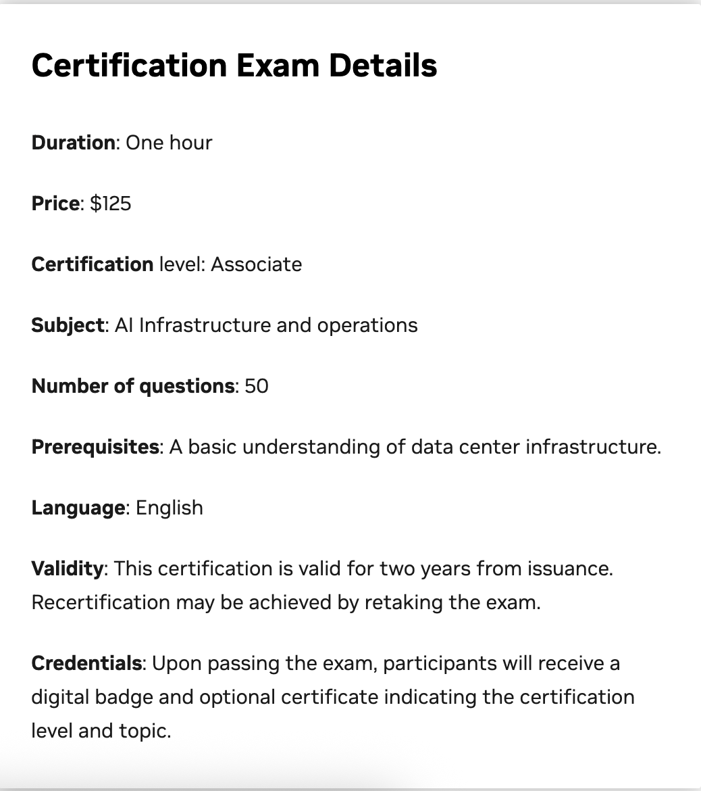

Title: Prepare for NVIDIA Certified Associate: AI Infrastructure and Operations (NCA-AIIO) Exam
Date: 2026-09-08
Category: Knowledge Base
Tags: nvidia, hpc, ai, certification, devops

TLDR: Study guide and core blueprint for the **NVIDIA Certified Associate: AI Infrastructure and Operations (NCA-AIIO)** exam.

---

# 1. Introduction & Motivation

After getting our hands dirty with high-performance computing in [**Slurm 101**]({filename}/2026/51.slurm_101.md) and building a 5-node cluster in [**Slurm 202**]({filename}/2026/52.slurm_202.md), the next logical step in the AI infrastructure journey is validating this knowledge with an industry-recognized credential: the **NVIDIA Certified Associate: AI Infrastructure and Operations (NCA-AIIO)**.

Since I'm going to have a chance to works with **NVIDIA GPU** and I will take exam, aiming for certification if I'm serious.

---

# 2. Exam Details & Certification Overview

Please visit [**here**](https://www.nvidia.com/en-us/learn/certification/ai-infrastructure-operations-associate/) for full detail xD



---

# 3. Recommended Learning Resources & Courses

Here are the key learning resources and study materials recommended for preparing for the exam:

### Core Training Courses:

- [**Coursera Course (Paid):**](https://www.coursera.org/learn/ai-infrastructure-operations-fundamentals). This is the official foundational course on Coursera covering AI computing paradigms, GPU architecture, networking fabrics, and cluster software. *Note: Requires a paid Coursera subscription/enrollment fee — recommended for those with budget or company sponsorship.*
- [**YouTube Video Course:**](https://www.youtube.com/watch?v=0WjfKQdfeMU). A comprehensive free video alternative covering the essential topics. While it does not include timestamped chapters/sections, it is 100% free to access.

---

# 4. Official Exam Blueprint & Domain Weights

According to NVIDIA's official exam specifications, the certification is divided into **3 core weighted domains**:

- Essential AI Knowledge
- AI Infrastructure
- AI Operations

---

# Domain 1: Essential AI Knowledge (38% of Exam)

This domain validates foundational understanding of accelerated computing concepts, AI workload lifecycles, and the NVIDIA software ecosystem.

### 1.1 CPU vs. GPU vs. DPU Architecture:

- **CPU (Latency-Optimized):** Few powerful cores with large caches designed for sequential processing and branch prediction.
- **GPU (Throughput-Optimized):** Thousands of smaller, energy-efficient cores designed for massive parallel matrix operations (SIMD/SIMT).
- **DPU (Data Processing Unit - BlueField):** Offloads, accelerates, and isolates data center infrastructure workloads (networking, security, telemetry, storage virtualization) away from host CPUs/GPUs.

### 1.2 AI Workflow Lifecycle:

- **Data Ingestion & Preprocessing:** High I/O throughput, CPU/RAM intensive.
- **Model Training:** Compute and inter-GPU bandwidth intensive. Utilizes mixed precision (FP32, TF32, FP16, BF16, FP8).
- **Model Fine-Tuning:** LoRA, QLoRA, full parameter fine-tuning.
- **Inference & Serving:** Low-latency, high-throughput token generation. Optimized with quantization (INT8, FP4) and KV-caching.

### 1.3 NVIDIA Full-Stack AI Ecosystem & Software:

```text
                     NVIDIA FULL-STACK AI ECOSYSTEM
                                   │
[ Applications & Models ] ──► NeMo (LLMs), BioNeMo, Clara, Omniverse, Riva
                                   │
[ Microservices & Runtimes] ──► NVIDIA NIM (Inference Microservices), Triton, TensorRT
                                   │
[ Platforms & Frameworks ] ──► PyTorch, JAX, TensorFlow, RAPIDS
                                   │
[ Core Accelerated SDKs ] ──► CUDA, cuDNN, NCCL (Multi-GPU), TensorRT-LLM
                                   │
[ System Layer ]          ──► NVIDIA GPU Driver, NVIDIA Container Toolkit, DCGM
```

- **CUDA (Compute Unified Device Architecture):** Parallel computing platform and programming model for NVIDIA GPUs.
- **cuDNN:** Highly tuned primitives for deep neural networks (convolutions, pooling, normalization, activation).
- **NCCL (NVIDIA Collective Communications Library):** Multi-GPU and multi-node collective communication primitives (`AllReduce`, `AllGather`, `Broadcast`, `ReduceScatter`) optimized for NVLink and InfiniBand.
- **TensorRT:** High-performance deep learning inference optimizer and runtime (layer fusion, kernel auto-tuning, quantization).
- **Triton Inference Server:** Multi-framework open-source model serving software (PyTorch, ONNX, TensorRT, vLLM, Python backend) supporting concurrent model execution, dynamic batching, and model pipelining.
- **NVIDIA NeMo:** End-to-end cloud-native framework for building, customizing, and training generative AI models.
- **NVIDIA AI Enterprise (NVAIE):** Enterprise platform providing production support, validated container images, security patches, and microservices (NVIDIA NIM).
- **NGC (NVIDIA GPU Cloud) Registry:** Curated catalog of GPU-optimized containers, pre-trained model weights, Helm charts, and SDKs.

---

# Domain 2: AI Infrastructure (40% of Exam)

The largest domain in the exam covers GPU hardware architectures, interconnects, high-speed networking fabrics, and storage pipelines.

### 2.1 GPU Architectural Generations:

- **Ampere (A100):** Introduced 3rd Gen Tensor Cores, TF32 precision, and Multi-Instance GPU (MIG).
- **Hopper (H100 / H200):** Introduced Transformer Engine (FP8 precision), DPX instructions for dynamic programming, 4th Gen Tensor Cores, and NVLink 4 (900 GB/s bidirectional).
- **Blackwell (B200 / GB200):** 2nd Gen Transformer Engine (FP4 precision), dual-die packaging (208 billion transistors), NVLink 5 (1.8 TB/s bidirectional), NVLink Switch Chip.

### 2.2 Tensor Cores & Precision Formats:

- **Matrix Acceleration:** Tensor Cores perform fused matrix multiply-accumulate operations in a single clock cycle: $D = A \times B + C$.
- **FP32:** Single precision (standard scientific computing).
- **TF32 (TensorFloat-32):** Same range as FP32, same precision as FP16, native on Tensor Cores without code changes.
- **BF16 / FP16:** Half precision, standard for LLM pre-training.
- **FP8 (E4M3 / E5M2):** Standard on Hopper/Blackwell for 2x faster transformer training.
- **INT8 / FP4:** Ultra-fast inference with minimal loss in model perplexity.

### 2.3 High-Speed Interconnects: NVLink & NVSwitch:

- **PCIe Limitation:** Standard PCIe Gen5 x16 provides ~64 GB/s unidirectional bandwidth, creating a major communication bottleneck for multi-GPU training.
- **NVLink:** Direct point-to-point interconnect between GPUs bypassing the PCIe bus.
- **NVSwitch:** Crossbar switch chip enabling any-to-any full bidirectional line-rate GPU communication within a node (e.g., all 8 GPUs in a DGX H100 talk to each other simultaneously at full NVLink speed).

### 2.4 Multi-Instance GPU (MIG):

- Partitions a single physical GPU (A100/H100) into up to **7 isolated GPU instances**.
- Each instance has dedicated hardware resources: compute cores, memory controllers, cache, and memory bandwidth (true hardware QoS and fault isolation).

### 2.5 AI Data Center Networking & Fabrics:

```text
                    THE 4 DATA CENTER NETWORK FABRICS
                                   │
  ┌─────────────────┬──────────────┴──────────────┬─────────────────┐
  ▼                 ▼                             ▼                 ▼
[ Compute Fabric ] [ Storage Fabric ]       [ In-Band Mgmt ]  [ Out-of-Band (OOB) ]
• InfiniBand /     • RoCE / NVMe-oF         • Node telemetry  • IPMI, BMC
  Spectrum-X       • Parallel storage access• SSH, cluster API• Dedicated 1GbE
• Inter-node NCCL    (Weka, Lustre, VAST)
```

1. **Compute (East-West) Fabric:** Connects GPUs across different server nodes for distributed training (AllReduce collective operations). Uses InfiniBand (Quantum-2 400Gb/s, Quantum-X800 800Gb/s) or Spectrum-X Ethernet.
2. **Storage Fabric:** Connects compute nodes to high-speed shared parallel storage systems (Lustre, Weka, VAST Data).
3. **In-Band Management Fabric:** Cluster communication, job scheduling, API requests, and user traffic.
4. **Out-of-Band (OOB) Management Fabric:** Dedicated physical network connecting server BMC/IPMI controllers for power control and bare-metal provisioning.

- **RDMA (Remote Direct Memory Access):** Bypasses the operating system kernel and CPU, allowing a network adapter to read/write GPU memory directly across the network.
- **InfiniBand:** Native hardware-based credit-flow control, sub-microsecond latency, zero packet loss, adaptive routing, and In-Network Computing (**SHARP - Scalable Hierarchical Aggregation and Reduction Protocol**).
- **RoCE (RDMA over Converged Ethernet):** Encapsulates InfiniBand packets inside standard Ethernet UDP headers (RoCEv2). Requires lossless Ethernet configuration (PFC - Priority Flow Control, ECN - Explicit Congestion Notification).
- **NVIDIA Spectrum-X:** Ethernet platform designed specifically for generative AI clouds, delivering near-InfiniBand performance over Ethernet.

### 2.6 AI Storage Architecture & GPUDirect Storage (GDS):

- Traditional I/O copies data from NVMe disk -> CPU Memory (RAM) -> Bounce Buffer -> GPU Memory (VRAM), consuming CPU cycles and PCIe bandwidth.
- **GPUDirect Storage (GDS):** Enables direct DMA transfers between local NVMe drives or remote storage NICs directly into GPU VRAM using RDMA, cutting latency by 10x and freeing CPU cores.

```text
Traditional Path:
Storage/NIC ──► Host RAM (CPU Buffer) ──► Host RAM (Bounce) ──► GPU Memory

GPUDirect Storage (GDS) Path:
Storage/NIC ─────────────────(Direct PCIe / RDMA)───────────────► GPU Memory
```

- **Parallel File Systems:** AI architectures utilize parallel file systems (**Lustre, Weka.io, VAST Data, IBM Spectrum Scale, BeeGFS**) to sustain millions of concurrent file reads without metadata bottlenecks.

---

# Domain 3: AI Operations (22% of Exam)

This domain covers workload scheduling, cluster orchestration, provisioning, and health telemetry.

### 3.1 Workload Schedulers: Slurm vs. Kubernetes:

- **Slurm:** The standard for large-scale distributed AI pre-training. Native support for multi-node MPI, InfiniBand topology awareness, atomic gang-scheduling, and tight consumable resource tracking (`cons_tres`).
- **Kubernetes + NVIDIA GPU Operator:** The standard for microservices, inference serving, and enterprise pipelines. The GPU Operator automates the deployment of the NVIDIA driver, Container Toolkit, device plugin, and DCGM monitoring on K8s nodes.

### 3.2 NVIDIA Base Command Manager (BCM):

- Cluster management and provisioning software for DGX systems. Automates bare-metal OS provisioning, InfiniBand fabric health checks, monitoring, and workload scheduler integration.

### 3.3 Monitoring & Telemetry (DCGM):

- **NVIDIA DCGM (Data Center GPU Manager):** Low-overhead daemon that collects GPU telemetry metrics (temperature, power draw, GPU utilization, memory utilization, PCIe bandwidth, NVLink bandwidth, ECC memory errors).
- Exposes metrics via Prometheus DCGM Exporter for Grafana dashboards and automated alerting.

---

# 5. Study Plan & Quick Review Checklist

Before sitting for the exam, ensure you can confidently answer the following checklist:

- Explain why GPUs are faster than CPUs for matrix operations.
- Differentiate between InfiniBand and Ethernet, and explain what RDMA achieves.
- Explain the role of NVLink and NVSwitch inside an 8-GPU node.
- Describe how Multi-Instance GPU (MIG) provides hardware-level QoS.
- Explain how GPUDirect Storage (GDS) eliminates CPU memory bounce buffers.
- List the 4 network fabrics in an AI data center and identify their functions.
- Explain the purpose of NCCL in distributed multi-GPU training.
- Identify the differences between Triton Inference Server and TensorRT.
- Explain what the NVIDIA GPU Operator deploys on a Kubernetes cluster.
- Describe what DCGM monitors and how it integrates with Prometheus.

---

# Summary & Next Steps

The **NVIDIA Certified Associate: AI Infrastructure and Operations** credential is an excellent validation for systems engineers, DevOps practitioners, and platform architects looking to specialize in AI and HPC infrastructure.

### Preparation Checklist:

1. Complete the [**AI Infrastructure and Operations Fundamentals** course on Coursera](https://www.coursera.org/learn/ai-infrastructure-operations-fundamentals) (paid) or watch the [**YouTube Full Video Course**](https://www.youtube.com/watch?v=0WjfKQdfeMU) (free alternative).
2. Review the core concepts in our [**Slurm 101**]({filename}/2026/51.slurm_101.md) and [**Slurm 202**]({filename}/2026/52.slurm_202.md) articles.
3. Review the exam blueprint on the [official NVIDIA Certification page](https://www.nvidia.com/en-us/learn/certification/ai-infrastructure-operations-associate/).
4. Schedule your exam on [Certiverse](https://www.certiverse.com/#/checkout/nvidia/store-exam/NCA-AIIO).

Good luck with your certification journey!
