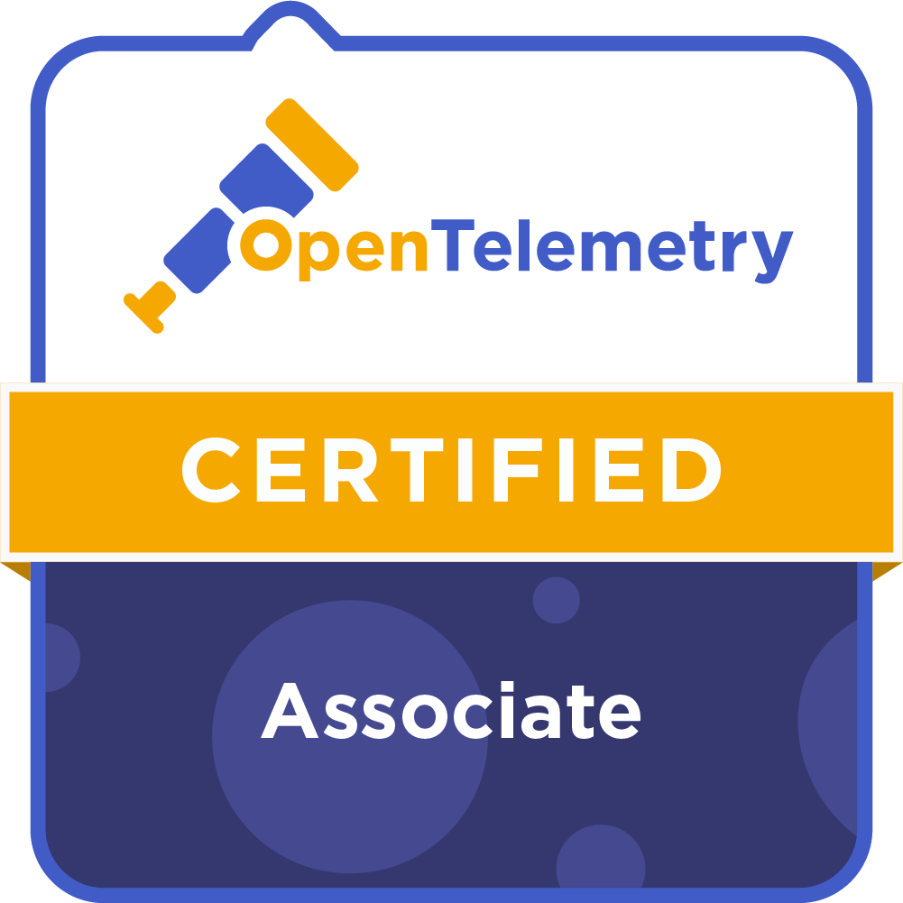

Title: Prepare for the OpenTelemetry Certified Associate (OTCA) exam
Date: 2025-12-20
Category: Knowledge Base
Tags: opentelemetry, certification, linux-foundation, otca

# OpenTelemetry Certified Assocate (OTCA) overview

---

### 1. Observability Fundamentals

Understanding the "Why" before the "How."

- **The Three Pillars:** Deep dive into **Traces, Metrics, and Logs**.
- **The Need for OpenTelemetry:** Solving "Vendor Lock-in" and standardizing telemetry data collection.
- **Monitoring vs. Observability:** Understanding the difference between knowing "what" is happening vs. "why" it is happening.

### 2. OpenTelemetry Core Architecture

The backbone of the project.

- **The OTel Collector:** Understanding the data pipeline: **Receivers** (ingestion), **Processors** (transformation), and **Exporters** (destination).
- **OTLP (OpenTelemetry Protocol):** The unified protocol for delivering telemetry data.
- **Context Propagation:** How OTel maintains the "trace context" as requests move across different microservices (Baggage and Traceparent).

### 3. OpenTelemetry Specification

Key concepts and data models.

- **Resources:** Metadata describing the entity producing the telemetry (e.g., `service.name`, `host.id`).
- **Traces & Spans:** Understanding Span hierarchy, Span Events, and Span Attributes.
- **Metrics:** Learning about different instrument types: **Counter, Gauge, Histogram, and Summary**.
- **Logs:** How OTel bridges the gap with legacy logging systems.

### 4. Instrumentation Approaches

How to get data out of your applications.

- **Automatic Instrumentation:** Using Agents or SDKs to collect data without changing the application code (Zero-code approach).
- **Manual Instrumentation:** Using the **OpenTelemetry API** and **SDK** to manually define custom spans and metrics within the business logic.
- **API vs. SDK:** Understanding the distinction (API is for instrumentation; SDK is for configuration and processing).

### 5. Configuration & Deployment Patterns

Putting OTel into production.

- **Deployment Modes:** Difference between running the Collector as an **Agent** (Sidecar/DaemonSet) vs. a **Gateway** (Standalone service).
- **Collector Configuration:** Mastering the YAML structure (`extensions`, `receivers`, `processors`, `exporters`, and `service pipelines`).
- **Sampling:** Understanding **Head-based sampling** vs. **Tail-based sampling** to manage data volume and costs.

### 6. Ecosystem & Interoperability

- **CNCF Landscape:** OpenTelemetry’s role as a CNCF incubated project.
- **Compatibility:** How OTel interacts with other tools like **Prometheus**, **Jaeger**, **Zipkin**, and **Fluentd**.
- **Semantic Conventions:** The importance of standardized naming for attributes across different technologies.

---

# Section need to be understood

### 1. Context Propagation (The "Glue" of Tracing)
*Domain: OpenTelemetry API and SDK*

Distributed tracing cannot work without **Context Propagation**. This is the mechanism that transfers metadata (Trace ID, Span ID) from service A to service B to connect spans into a complete trace.

- **Trace Context (W3C Standard):** OpenTelemetry uses the W3C `traceparent` header standard to transmit information.
    - Format: `version-traceid-parentid-traceflags`
    - Example: `00-4bf92f3577b34da6a3ce929d0e0e4736-00f067aa0ba902b7-01`
- **Baggage:** Used to transmit custom key-value pairs (like `userid=123`, `env=prod`) throughout services **without** creating new spans. This data can be used for filtering or sampling in later steps.
- **Propagators:** Objects responsible for injecting (attaching to request) and extracting (retrieving from request) context.

> **References:**
> - [OTel Docs: Context Propagation](https://opentelemetry.io/docs/concepts/context-propagation/)
> - [W3C Trace Context Specification](https://www.w3.org/TR/trace-context/)

### 2. OTel Metrics Instruments (vs. Prometheus)
*Domain: OpenTelemetry API and SDK*

Unlike Prometheus which has only 4 basic metric types, OpenTelemetry divides them further to map accurately to various backends. It is crucial to distinguish when to use which.

- **Synchronous Instruments (Called by user when event occurs):**
    - `Counter`: Only increases (Monotonic). Example: `http_requests_total`.
    - `UpDownCounter`: Increases or decreases. Example: `queue_size` (similar to Prometheus Gauge).
    - `Histogram`: Records value distribution. Example: `http_response_time`.
- **Asynchronous Instruments (Observer - Only collected when invoked):**
    - `ObservableCounter`, `ObservableUpDownCounter`, `ObservableGauge`: Used to read values from the system (like CPU usage, Memory usage) periodically (scrape interval) instead of per request.

> **References:**
> - [OTel Docs: Metrics Concepts](https://opentelemetry.io/docs/concepts/signals/metrics/)
> - [OTel Specification: Metrics Data Model](https://opentelemetry.io/docs/specs/otel/metrics/data-model/)

### 3. Sampling Strategies (Head vs. Tail)
*Domain: The OpenTelemetry Collector & API/SDK*

To save storage costs and bandwidth, we cannot store 100% of traces. Sampling is the technique to decide whether to keep or drop a trace.

- **Head Sampling (At SDK/Client):** Decided immediately when the trace starts (root span).
    - *Pros:* Saves the most resources as dropped traces are not processed further.
    - *Cons:* May miss critical error traces (since errors are unknown at the start).
    - *Strategies:* `ParentBased` (follows parent), `TraceIDRatioBased` (% ratio), `AlwaysOn`, `AlwaysOff`.
- **Tail Sampling (At Collector):** Decided after the trace is complete (or mostly complete).
    - *Pros:* Keeps exactly the interesting traces (High Latency, Status code = 500).
    - *Cons:* Consumes RAM/CPU at the Collector as it must temporarily store all spans before deciding.

> **References:**
> - [OTel Docs: Sampling](https://opentelemetry.io/docs/concepts/sampling/)
> - [Tail Sampling Processor (Collector Contrib)](https://github.com/open-telemetry/opentelemetry-collector-contrib/blob/main/processor/tailsamplingprocessor/README.md)

### 4. Collector Deployment Patterns
*Domain: The OpenTelemetry Collector*

The Collector is the "heart" of the OTel architecture. There are 3 main deployment models to master for the exam:

1. **Agent (Sidecar/DaemonSet):** Runs right next to the application (on the same Pod or Node).
    - *Role:* Receives data from App -> Adds metadata (k8s pod name, host ip) -> Sends to Gateway. Helps reduce connection management load for the App.
2. **Gateway (Standalone Service):** An independent Collector cluster (Deployment).
    - *Role:* Receives data from Agent -> Heavy processing (Tail Sampling, Batching, Filtering, Credential management) -> Sends to Backend (Jaeger, Prometheus).
3. **No Collector (Direct):** App sends directly to Backend. Rarely used in large productions due to lack of flexibility.

> **References:**
> - [OTel Docs: Collector Deployment](https://opentelemetry.io/docs/collector/deployment/)
> - [OTel Operator Patterns](https://github.com/open-telemetry/opentelemetry-operator#deployment-modes)

### 5. Semantic Conventions (Standardization)
*Domain: OpenTelemetry API and SDK*

OTel defines how attributes are named to ensure consistency across systems. Backends need this standard to draw charts automatically.

- **Resource Attributes (Immutable):** Describes "What" is producing the telemetry.
    - Example: `service.name`, `service.version`, `k8s.pod.name`, `cloud.region`.
- **Span Attributes (Dynamic):** Describes "What action" is happening.
    - HTTP: `http.method` (GET), `http.status_code` (200), `http.route` (/api/v1/users).
    - Database: `db.system` (mysql), `db.statement` (SELECT * FROM users).
    - *Note:* From OTel v1.20+, some old conventions (like `http.method`) are gradually moving to `http.request.method`. Need to update according to the latest version.

> **References:**
> - [OTel Docs: Semantic Conventions](https://opentelemetry.io/docs/concepts/semantic-conventions/)
> - [Existing Registry](https://opentelemetry.io/docs/specs/semconv/general/trace/)

### 6. Telemetry Signal Status
*Domain: Fundamentals of Observability*

Not everything in OTel is "Production Ready" (Stable). The exam may ask about the status of signals to know the reliability level when using them.

- **Tracing:** **Stable**. Mature and widely supported.
- **Metrics:** **Stable**. Fully featured to replace Prometheus.
- **Logs:** **Stable** (Bridge API & Data Model). However, full replacement of Fluentbit/Vector is still being perfected.
- **Profiling (eBPF):** **Experimental/Development**. Developing fast but should not be used for core production without deep understanding.

> **References:**
> - [OTel Feature Status](https://opentelemetry.io/status/)

### 7. SDK Mechanics: Processors & Exporters
*Domain: The OpenTelemetry API and SDK (SDK Pipelines)*

Just knowing "how to send data" is not enough; the exam asks *how* data flows inside the application before going out.

- **Span Processors:** Decide when spans are sent.
    - `SimpleSpanProcessor`: Sends immediately when span ends (1-1). **Use only for development/debugging**. Using for prod will severely slow down the app.
    - `BatchSpanProcessor`: Batches spans and sends periodically or when buffer is full. **Mandatory for Production** to optimize performance.
- **Exporters:** Interfaces responsible for sending data out (OTLP, Zipkin, Console).
    - *Timeout:* Appropriate timeouts need to be configured to avoid hanging the app if the backend (Collector) is slow.

> **References:**
> - [OTel Docs: Trace SDK](https://opentelemetry.io/docs/specs/otel/trace/sdk/#span-processor)
> - [Java SDK Examples](https://opentelemetry.io/docs/languages/java/instrumentation/#span-processors)

### 8. Collector Scaling & Data Transformation
*Domain: The OpenTelemetry Collector (Scaling, Transforming Data)*

Deploying 1 Collector is easy, but scaling a Collector cluster to handle millions of spans/s is different.

- **Load Balancing:** When running Gateway mode with multiple replicas, a Load Balancer is needed in front (like Nginx/K8s Service) to distribute trace load to collectors.
- **Trace ID Awareness:** With *Tail Sampling*, all spans of the same Trace ID **must** arrive at the same Collector instance. Need to use **Load Balancing Exporter** with hash ring (based on TraceID) at the Agent layer to push to the right place.
- **Transform Processor (OTTLE):** Query/Data transformation language right inside the Collector.
    - Example: Delete sensitive attributes (`set(attributes["password"], "****")`), rename metrics, or filter garbage logs.

> **References:**
> - [Collector Scaling](https://opentelemetry.io/docs/collector/scaling/)
> - [Load Balancing Exporter](https://github.com/open-telemetry/opentelemetry-collector-contrib/tree/main/exporter/loadbalancingexporter)
> - [Transform Processor (OTTLE)](https://github.com/open-telemetry/opentelemetry-collector-contrib/tree/main/processor/transformprocessor)

### 9. Debugging & Observability of the Pipeline
*Domain: Maintaining and Debugging Observability Pipelines*

How to monitor the Monitor (OTel Collector) itself?

- **Extensions:** Auxiliary components that do not process telemetry data but help manage the Collector.
    - `health_check`: Endpoint `/health` for K8s liveness/readiness probe.
    - `pprof`: CPU/RAM Profiling of the Collector (to debug when Collector consumes too much RAM).
    - `zpages`: Simple web interface displaying real-time status of receiver/exporter (received/sent counts, errors).
- **Self-Monitoring:** Collector exposes its own metrics (usually on port `8888`) for Prometheus to scrape (e.g., `otelcol_process_uptime`, `otelcol_receiver_refused_spans`).

> **References:**
> - [Collector Troubleshooting](https://opentelemetry.io/docs/collector/troubleshooting/)
> - [Management (Extensions)](https://opentelemetry.io/docs/collector/configuration/#extensions)

### 10. Handling Backpressure & Reliability
*Domain: Maintaining and Debugging Observability Pipelines (Error Handling)*

When the backend (Jaeger/Elasticsearch) is dead or overloaded, what does the Collector do?

- **Memory Limiter Processor:** **Mandatory** and must be placed at the beginning of the pipeline (right after receiver). It prevents Collector OOM (Out of Memory) crash by dropping data or refusing new data when RAM hits the threshold.
- **Batch Processor:** Helps compress and bundle data to reduce network request count.
- **Retry Mechanism:** Exporters usually have retry mechanisms (with backoff policy) when sending fails. However, if using `QueuedRetry` (persistent queue), file storage config needs attention.

> **References:**
> - [Memory Limiter Processor](https://github.com/open-telemetry/opentelemetry-collector/blob/main/processor/memorylimiterprocessor/README.md)
> - [Recommended Processors Config](https://opentelemetry.io/docs/collector/configuration/#processors)

### 11. Schema Management
*Domain: Maintaining and Debugging Observability Pipelines (Schema Management)*

When Semantic Conventions change (e.g., rename `http.method` -> `http.request.method`), how to ensure the system doesn't break?

- **Schema URL:** Each Resource or Scope in OTel data has an accompanying `schema_url`, pointing to the version of Semantic Convention it follows (e.g., `https://opentelemetry.io/schemas/1.4.0`).
- **Schema Transformation:** Helps convert data from old schema to new (or vice versa) to be compatible with old backends or dashboards.

> **References:**
> - [Telemetry Schemas](https://opentelemetry.io/docs/specs/otel/schemas/)

# My Secret Weapon: Mock Exam

# Exam Notes
