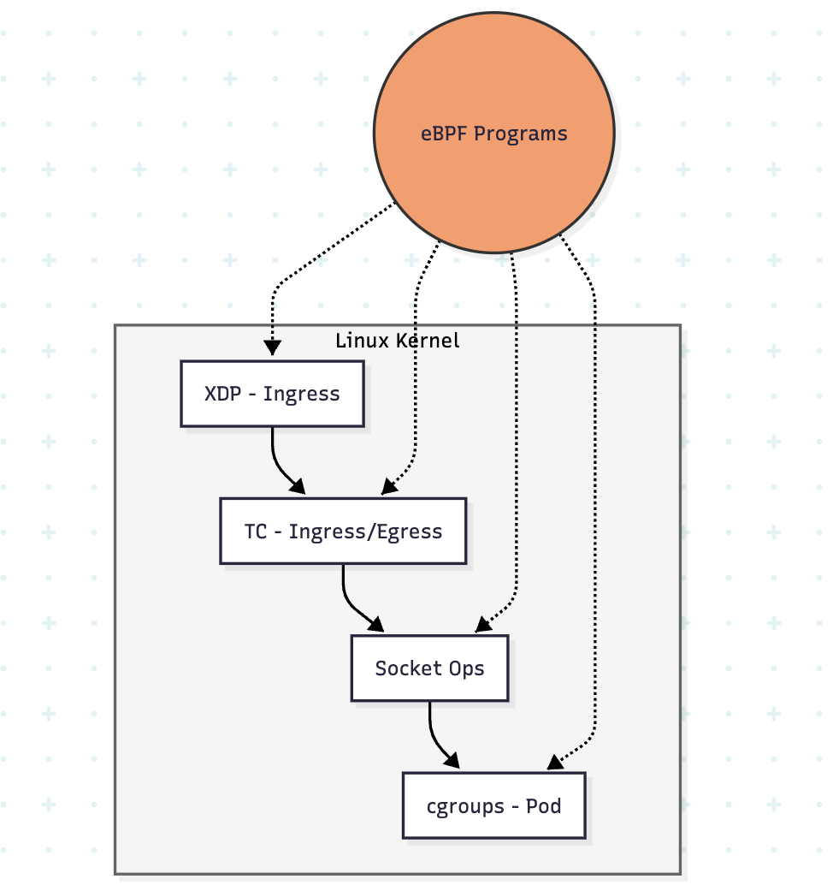
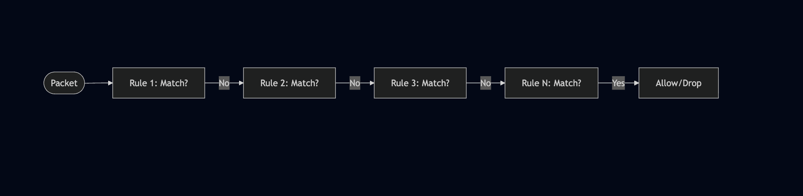
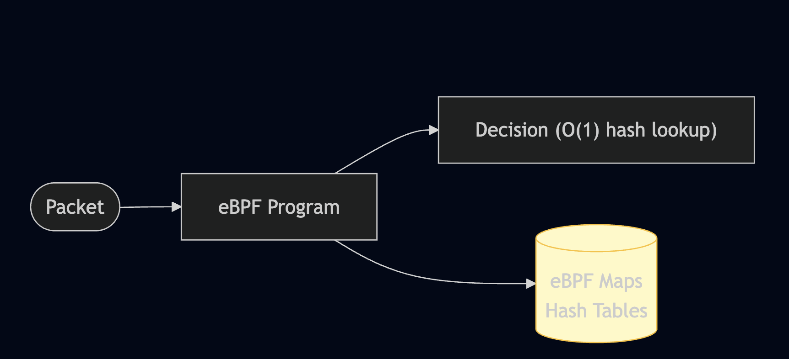
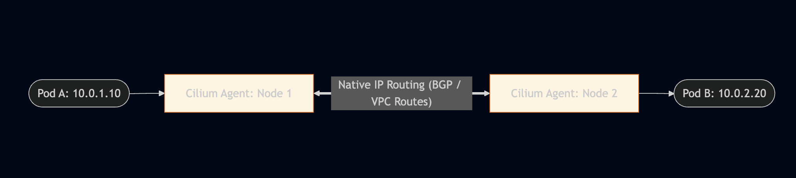
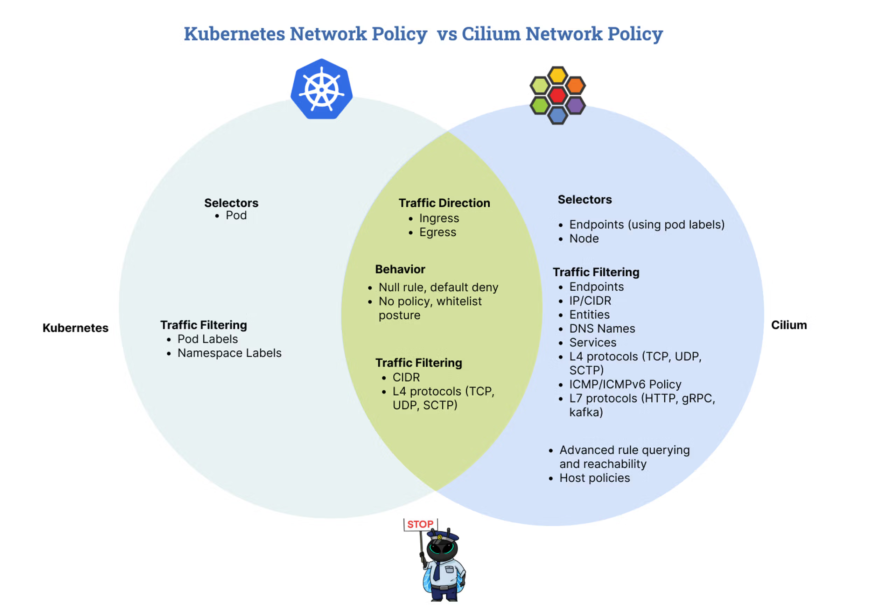

Title: [WIP] Prepare for the Cilium Certified Associate (CCA) Exam
Date: 2025-12-21
Category: Knowledge Base
Tags: cilium, certification, linux-foundation, cca, ebpf, kubernetes, networking


---

# Cilium Certified Associate (CCA) Overview

### 1. eBPF Fundamentals

Understanding the "Why" before the "How."

- **What is eBPF:** Extended Berkeley Packet Filter — a revolutionary technology that allows running sandboxed programs in the Linux kernel without changing kernel source code.
- **Why eBPF Matters:** Enables high-performance networking, security, and observability without the overhead of traditional approaches (iptables, kernel modules).
- **eBPF vs iptables:** eBPF operates at lower levels with better performance, while iptables uses sequential rule matching that doesn't scale well.

### 2. Cilium Architecture (20%)

The backbone of cloud-native networking.

- **What is Cilium:** An open-source, eBPF-based networking, security, and observability solution for Kubernetes and other container orchestration platforms.
- **Core Components:** Cilium Agent, Cilium Operator, Cilium CNI Plugin, and Hubble.
- **CNCF Project:** Cilium is a CNCF graduated project, widely adopted in production environments.

Example of **Cilium Data Flow**:



### 3. Network Policy (18%)

Securing workloads with identity-based policies.

- **CiliumNetworkPolicy:** Extended network policies with L3/L4/L7 filtering capabilities.
- **Identity-based Security:** Cilium assigns identities to endpoints based on labels, not IP addresses.
- **Policy Enforcement Modes:** Default, Always, and Never modes for controlling policy behavior.
- **K8s NetworkPolicy vs CiliumNetworkPolicy:** Understanding compatibility and extended features.

### 4. Service Mesh (16%)

Modern traffic management without sidecars.

- **Sidecarless Architecture:** Cilium provides service mesh capabilities using eBPF without sidecar proxies.
- **Gateway API:** The next-generation Kubernetes Ingress API with more expressive routing.
- **Ingress Controller:** Cilium can act as an Ingress controller for external traffic.
- **mTLS Encryption:** Transparent encryption of traffic between services.

### 5. Network Observability (10%)

Visibility into network flows with Hubble.

- **Hubble:** Cilium's observability layer built on top of eBPF.
- **Flow Visibility:** L3/L4/L7 network flow logs and metrics.
- **Hubble CLI & UI:** Command-line and graphical interfaces for observing traffic.
- **Integration:** Export to Prometheus, Grafana, and other monitoring systems.

### 6. Installation & Configuration (10%)

Getting Cilium up and running.

- **Cilium CLI:** The primary tool for installing and managing Cilium.
- **Installation Methods:** Cilium CLI, Helm, or manual manifests.
- **Connectivity Tests:** Built-in tests to validate Cilium installation.
- **Configuration Options:** Datapath modes, IPAM, encryption, and more.

### 7. Cluster Mesh (10%)

Multi-cluster connectivity.

- **What is Cluster Mesh:** Connects multiple Kubernetes clusters into a unified network.
- **Service Discovery:** Services can be discovered and accessed across clusters.
- **Global Load Balancing:** Distribute traffic across clusters for high availability.
- **Requirements:** Unique Pod CIDRs, cluster IDs, and shared CA.

### 8. BGP & External Networking (6%)

Connecting to the outside world.

- **BGP Integration:** Cilium can peer with external routers using BGP.
- **LB IPAM:** Automatic IP address management for LoadBalancer services.
- **Egress Gateway:** Control and monitor egress traffic from the cluster.
- **External Workloads:** Connect non-Kubernetes workloads to the Cilium network.

---

# Sections That Need to Be Understood

### 1. eBPF vs iptables — Why eBPF Matters
*Domain: eBPF (10%)*

Understanding why Cilium chose eBPF over traditional approaches is fundamental.

**iptables Limitations:**




**eBPF Advantages:**



**Comparison Table:**

| Feature | iptables | eBPF (Cilium) |
|---------|----------|---------------|
| Rule matching | O(n) linear | O(1) hash lookup |
| Scalability | Degrades with rules | Millions of endpoints |
| L7 filtering | Limited (with helpers) | Native support |
| Observability | Counters only | Full flow visibility |
| Dynamic updates | Full chain reload | Atomic map updates |
| Identity-based | No (IP-based) | Yes (label-based) |

**eBPF Hook Points:**

| Hook | Location | Use Case |
|------|----------|----------|
| **XDP** | Network driver (earliest) | DDoS mitigation, load balancing |
| **TC** | Traffic Control (ingress/egress) | Network policy, NAT |
| **Socket Ops** | Socket level | Connection tracking, redirection |
| **cgroups** | Process group | Pod-level policies |

> **References:**

> - [eBPF.io](https://ebpf.io/)
> - [Cilium eBPF Documentation](https://docs.cilium.io/en/stable/bpf/)

---

### 2. Cilium Architecture & Components
*Domain: Architecture (20%)*

Understanding each component's role is essential.

**Architecture Overview:**


**Component Details:**

| Component | Type | Role |
|-----------|------|------|
| **Cilium Agent** | DaemonSet | Runs on every node, manages eBPF programs, enforces policies |
| **Cilium Operator** | Deployment | Cluster-wide operations, IPAM, CRD management |
| **Cilium CNI** | Binary | CNI plugin invoked by kubelet for pod networking |
| **Hubble Server** | Part of Agent | Collects and exports network flow data |
| **Hubble Relay** | Deployment | Aggregates Hubble data from all nodes |
| **Hubble UI** | Deployment | Web interface for flow visualization |
| **Cilium Envoy** | Part of Agent | L7 proxy for HTTP/gRPC/Kafka policies |

**Cilium Agent Responsibilities:**
```yaml
# What Cilium Agent does on each node:
- Compiles and loads eBPF programs into kernel
- Manages endpoint (pod) identities
- Enforces network policies
- Handles service load balancing (kube-proxy replacement)
- Provides Hubble flow data
- Manages encryption (IPsec/WireGuard)
```

**Cilium Operator Responsibilities:**
```yaml
# What Cilium Operator does cluster-wide:
- Manages CiliumNode resources
- Handles IPAM (IP allocation)
- Garbage collects stale resources
- Manages Cluster Mesh
- Synchronizes Kubernetes services
```

> **References:**

> - [Cilium Architecture](https://docs.cilium.io/en/stable/overview/component-overview/)
> - [Cilium Agent Reference](https://docs.cilium.io/en/stable/cmdref/cilium-agent/)

---

### 3. Datapath Models
*Domain: Architecture (20%)*

Cilium supports multiple datapath modes for different environments.

**Encapsulation Mode (VXLAN/Geneve):**


- Pros: Works anywhere (any network)
- Cons: MTU overhead (~50 bytes), slight latency

**Native Routing (Direct Routing):**



- Pros: Better performance, no MTU overhead
- Cons: Requires network support (BGP, cloud VPC)

**Datapath Mode Comparison:**

| Mode | Tunnel Type | Use Case | Requirements |
|------|-------------|----------|--------------|
| `tunnel=vxlan` | VXLAN | Default and works anywhere | None |
| `tunnel=geneve` | Geneve | Better metadata support | None |
| `tunnel=disabled` | None (native) | Cloud/BGP environments | Network routing |
| `tunnel=disabled` + `autoDirectNodeRoutes=true` | None | Same L2 network | Nodes on same subnet |

**Configuration:**
```yaml
# Helm values for encapsulation
tunnel: vxlan  # or geneve

# Helm values for native routing
tunnel: disabled
autoDirectNodeRoutes: true  # For same L2 network
# OR use BGP for cross-subnet routing
```

**kube-proxy Replacement:**

Cilium can fully replace kube-proxy for better performance:
```yaml
# Helm values
kubeProxyReplacement: true

# Benefits:
# - eBPF-based service load balancing
# - DSR (Direct Server Return) support
# - Maglev consistent hashing
# - Socket-level load balancing (bypass netfilter)
```

> **References:**

> - [Cilium Datapath](https://docs.cilium.io/en/stable/network/concepts/routing/)
> - [kube-proxy Replacement](https://docs.cilium.io/en/stable/network/kubernetes/kubeproxy-free/)

---

### 4. IPAM Modes
*Domain: Architecture (20%)*

Cilium supports multiple IP Address Management modes.

| IPAM Mode | Description | Use Case |
|-----------|-------------|----------|
| `cluster-pool` | Cilium manages pod CIDRs | Default, any environment |
| `kubernetes` | Use K8s node.spec.podCIDR | Managed K8s (GKE, EKS, AKS) |
| `crd` | CiliumNode CRD defines CIDRs | Custom IPAM integration |
| `eni` | AWS ENI integration | AWS EKS |
| `azure` | Azure IPAM integration | Azure AKS |
| `alibabacloud` | Alibaba Cloud integration | Alibaba Cloud |
| `multi-pool` | Multiple IP pools | Advanced multi-tenant |

**Cluster Pool Mode (Default):**
```yaml
# Helm values
ipam:
  mode: cluster-pool
  operator:
    clusterPoolIPv4PodCIDRList:
      - 10.0.0.0/8
    clusterPoolIPv4MaskSize: 24  # /24 per node
```

**AWS ENI Mode:**
```yaml
# Helm values for AWS EKS
ipam:
  mode: eni
eni:
  enabled: true
  awsReleaseExcessIPs: true
  subnetTagsFilter:
    "kubernetes.io/role/cni": "1"
```

**Kubernetes Mode:**
```yaml
# Helm values (uses node.spec.podCIDR)
ipam:
  mode: kubernetes
```

> **References:**

> - [Cilium IPAM](https://docs.cilium.io/en/stable/network/concepts/ipam/)

---

### 5. CiliumNetworkPolicy vs Kubernetes NetworkPolicy
*Domain: Network Policy (18%)*

Cilium supports both standard Kubernetes NetworkPolicy and its extended CiliumNetworkPolicy.

**Kubernetes NetworkPolicy (Standard):**
```yaml
apiVersion: networking.k8s.io/v1
kind: NetworkPolicy
metadata:
  name: allow-frontend
  namespace: production
spec:
  podSelector:
    matchLabels:
      app: backend
  policyTypes:
    - Ingress
  ingress:
    - from:
        - podSelector:
            matchLabels:
              app: frontend
      ports:
        - protocol: TCP
          port: 8080
```

**CiliumNetworkPolicy (Extended):**
```yaml
apiVersion: cilium.io/v2
kind: CiliumNetworkPolicy
metadata:
  name: allow-frontend-l7
  namespace: production
spec:
  endpointSelector:
    matchLabels:
      app: backend
  ingress:
    - fromEndpoints:
        - matchLabels:
            app: frontend
      toPorts:
        - ports:
            - port: "8080"
              protocol: TCP
          rules:
            http:                        # L7 rules!
              - method: GET
                path: "/api/v1/.*"
              - method: POST
                path: "/api/v1/users"
```

**Feature Comparison:**

Credit: [Isovalent](https://isovalent.com/blog/post/intro-to-cilium-network-policies/)



**CiliumNetworkPolicy Unique Features:**

**L7 HTTP Rules:**
```yaml
spec:
  ingress:
    - toPorts:
        - ports:
            - port: "80"
          rules:
            http:
              - method: GET
                path: "/public/.*"
                headers:
                  - "X-Api-Key: secret"
```

**DNS-based Egress (FQDN):**
```yaml
spec:
  egress:
    - toFQDNs:
        - matchName: "api.github.com"
        - matchPattern: "*.amazonaws.com"
      toPorts:
        - ports:
            - port: "443"
```

**toServices (Service-based):**
```yaml
spec:
  egress:
    - toServices:
        - k8sService:
            serviceName: redis
            namespace: database
```

> **References:**

> - [CiliumNetworkPolicy](https://docs.cilium.io/en/stable/security/policy/)
> - [Policy Examples](https://docs.cilium.io/en/stable/security/policy/language/)

---

### 6. Identity-based Security Model
*Domain: Network Policy (18%)*

Cilium's security model is fundamentally different from IP-based approaches.

**Traditional IP-based Security:**


Problems:
- Pod IPs are ephemeral (change on restart)
- Rules must be updated constantly
- Doesn't scale with dynamic workloads

**Cilium Identity-based Security:**


Benefits:
- Identity based on labels, not IPs
- Survives pod restarts/reschedules
- Scales automatically


**How Cilium Identity Works:**

1. **Label Assignment:** Pods are assigned labels in their spec.
2. **Identity Calculation:** Cilium computes a unique numeric identity from labels.
3. **Identity Propagation:** Identity is embedded in packets via eBPF.
4. **Policy Enforcement:** Policies reference labels, resolved to identities.

**View Identities:**
```bash
# List all identities
cilium identity list

# Example output:
# ID      LABELS
# 1       reserved:host
# 2       reserved:world
# 3       reserved:unmanaged
# 4       reserved:health
# 12345   k8s:app=frontend
# 67890   k8s:app=backend
```

**Reserved Identities:**

| Identity | Numeric ID | Description |
|----------|------------|-------------|
| `reserved:host` | 1 | Node/host traffic |
| `reserved:world` | 2 | External traffic (outside cluster) |
| `reserved:unmanaged` | 3 | Unmanaged endpoints |
| `reserved:health` | 4 | Health check traffic |
| `reserved:init` | 5 | Init containers |
| `reserved:remote-node` | 6 | Other cluster nodes |
| `reserved:kube-apiserver` | 7 | Kubernetes API server |

> **References:**

> - [Identity-based Security](https://docs.cilium.io/en/stable/security/identity/)

---

### 7. Policy Enforcement Modes
*Domain: Network Policy (18%)*

Cilium supports different enforcement modes for policies.

**Enforcement Modes:**

| Mode | Description | Behavior |
|------|-------------|----------|
| `default` | Endpoint-specific | Allow all until policy is applied |
| `always` | Always enforce | Deny all unless explicitly allowed |
| `never` | Never enforce | Policies are ignored (monitoring only) |

**Default Mode (Recommended):**
```yaml
# Helm values
policyEnforcementMode: default

# Behavior:
# - Endpoints WITHOUT policies: Allow all traffic
# - Endpoints WITH policies: Only allowed traffic passes
```

**Always Mode (Zero Trust):**
```yaml
# Helm values
policyEnforcementMode: always

# Behavior:
# - ALL endpoints: Deny by default
# - Must explicitly allow all traffic
# - Most secure, but requires complete policy coverage
```

**Never Mode (Monitoring):**
```yaml
# Helm values
policyEnforcementMode: never

# Behavior:
# - Policies are loaded but not enforced
# - Useful for auditing/testing policies
# - Hubble still shows policy verdicts
```

**Per-Endpoint Annotation Override:**
```yaml
apiVersion: v1
kind: Pod
metadata:
  name: my-pod
  annotations:
    # Force policy enforcement for this pod
    policy.cilium.io/policy-enforcement: "always"
```

**Check Current Mode:**
```bash
# Check policy enforcement mode
# No idea why it only appear in: https://docs.cilium.io/en/latest/cmdref/cilium_config/#see-also
# Not other version like 1.15 -> 1.18
cilium config view | grep PolicyEnforcement

# Check endpoint policy status
cilium endpoint list
```

> **References:**

> - [Policy Enforcement](https://docs.cilium.io/en/stable/security/policy/intro/#policy-enforcement-modes)

---

### 8. Gateway API vs Ingress
*Domain: Service Mesh (16%)*

Cilium supports both traditional Ingress and the newer Gateway API.

**Ingress (Legacy):**
```yaml
apiVersion: networking.k8s.io/v1
kind: Ingress
metadata:
  name: my-ingress
  annotations:
    kubernetes.io/ingress.class: cilium
spec:
  rules:
    - host: app.example.com
      http:
        paths:
          - path: /
            pathType: Prefix
            backend:
              service:
                name: my-service
                port:
                  number: 80
```

**Gateway API (Modern):**
```yaml
# Gateway - defines the listener
apiVersion: gateway.networking.k8s.io/v1
kind: Gateway
metadata:
  name: my-gateway
spec:
  gatewayClassName: cilium
  listeners:
    - name: http
      protocol: HTTP
      port: 80
      allowedRoutes:
        namespaces:
          from: Same
---
# HTTPRoute - defines routing rules
apiVersion: gateway.networking.k8s.io/v1
kind: HTTPRoute
metadata:
  name: my-route
spec:
  parentRefs:
    - name: my-gateway
  hostnames:
    - "app.example.com"
  rules:
    - matches:
        - path:
            type: PathPrefix
            value: /api
      backendRefs:
        - name: api-service
          port: 8080
    - matches:
        - path:
            type: PathPrefix
            value: /
      backendRefs:
        - name: web-service
          port: 80
```

**Gateway API Advantages:**

| Feature | Ingress | Gateway API |
|---------|---------|-------------|
| Role separation | Single resource | Gateway (infra) + Route (dev) |
| Cross-namespace | Limited | Native support |
| Traffic splitting | Annotations | Native weighted routing |
| Header matching | Annotation-dependent | Native support |
| Protocol support | HTTP/HTTPS | HTTP, gRPC, TCP, TLS |
| Extensibility | Annotations | Typed extension points |

**Traffic Splitting with Gateway API:**
```yaml
apiVersion: gateway.networking.k8s.io/v1
kind: HTTPRoute
metadata:
  name: canary-route
spec:
  parentRefs:
    - name: my-gateway
  rules:
    - backendRefs:
        - name: app-v1
          port: 80
          weight: 90          # 90% to v1
        - name: app-v2
          port: 80
          weight: 10          # 10% to v2
```

**Header-based Routing:**
```yaml
apiVersion: gateway.networking.k8s.io/v1
kind: HTTPRoute
metadata:
  name: header-route
spec:
  parentRefs:
    - name: my-gateway
  rules:
    - matches:
        - headers:
            - name: x-canary
              value: "true"
      backendRefs:
        - name: app-canary
          port: 80
    - backendRefs:
        - name: app-stable
          port: 80
```

> **References:**

> - [Cilium Gateway API](https://docs.cilium.io/en/stable/network/servicemesh/gateway-api/gateway-api/)
> - [Gateway API Specification](https://gateway-api.sigs.k8s.io/)

---

### 9. Cilium Service Mesh
*Domain: Service Mesh (16%)*

Cilium provides service mesh capabilities without sidecar proxies.

**Sidecar vs Sidecarless Architecture:**

```
┌─────────────────────────────────────────────────────────────────┐
│              Traditional Sidecar Service Mesh                   │
│                                                                 │
│   ┌─────────────────────-┐    ┌─────────────────────-┐          │
│   │        Pod           │    │        Pod           │          │
│   │  ┌─────┐  ┌──────-┐  │    │  ┌─────--┐  ┌──────┐ │          │
│   │  │ App │◄─┤Sidecar│◄─┼────┼─►│Sidecar├─►│ App  │ │          │
│   │  └─────┘  │Proxy  │  │    │  │Proxy  │  └────-─┘ │          │
│   │           └──────-┘  │    │  └──────-┘           │          │
│   └─────────────────────-┘    └─────────────────────-┘          │
│                                                                 │
│   Cons: Resource overhead, latency, operational complexity      │
└─────────────────────────────────────────────────────────────────┘

┌─────────────────────────────────────────────────────────────────┐
│              Cilium Sidecarless Service Mesh                    │
│                                                                 │
│   ┌───────────┐              ┌───────────┐                      │
│   │    Pod    │              │    Pod    │                      │
│   │  ┌─────┐  │              │  ┌─────┐  │                      │
│   │  │ App │  │              │  │ App │  │                      │
│   │  └──┬──┘  │              │  └──┬──┘  │                      │
│   └─────┼─────┘              └─────┼─────┘                      │
│         │                          │                            │
│         ▼                          ▼                            │
│   ┌─────────────────────────────────────────────────────┐       │
│   │              Cilium eBPF (kernel level)             │       │
│   │         L4 load balancing, mTLS, policy             │       │
│   └─────────────────────────────────────────────────────┘       │
│                            │                                    │
│                            ▼                                    │
│   ┌─────────────────────────────────────────────────────┐       │
│   │         Cilium Envoy (per-node, shared)             │       │
│   │              L7 policies (HTTP, gRPC)               │       │
│   └─────────────────────────────────────────────────────┘       │
│                                                                 │
│   Pros: Lower resource usage, better performance                │
└─────────────────────────────────────────────────────────────────┘
```

**Enabling Cilium Service Mesh:**
```yaml
# Helm values
ingressController:
  enabled: true
  loadbalancerMode: shared  # or dedicated
gatewayAPI:
  enabled: true
envoy:
  enabled: true
```

**mTLS with Cilium:**
```yaml
# Helm values for transparent encryption
encryption:
  enabled: true
  type: wireguard  # or ipsec

# WireGuard is recommended for performance
# Automatically encrypts pod-to-pod traffic
```

**Check Encryption Status:**
```bash
# Verify encryption is enabled
cilium status --verbose | grep Encryption

# Check encrypted connections
cilium encrypt status
```

> **References:**

> - [Cilium Service Mesh](https://docs.cilium.io/en/stable/network/servicemesh/)
> - [Encryption](https://docs.cilium.io/en/stable/security/network/encryption/)

---

### 10. Hubble Observability
*Domain: Network Observability (10%)*

Hubble provides deep network visibility powered by eBPF.

**Hubble Architecture:**
```
┌─────────────────────────────────────────────────────────────────┐
│                       Hubble Architecture                       │
│                                                                 │
│   ┌─────────────────┐                                           │
│   │   Hubble UI     │◄─────────┐                                │
│   │   (Web UI)      │          │                                │
│   └─────────────────┘          │                                │
│                                │                                │
│   ┌─────────────────┐    ┌─────┴─────────┐                      │
│   │  Hubble CLI     │───►│ Hubble Relay  │                      │
│   │ (hubble observe)│    │  (aggregator) │                      │
│   └─────────────────┘    └───────┬───────┘                      │
│                                  │                              │
│           ┌──────────────────────┼──────────────────────┐       │
│           │                      │                      │       │
│           ▼                      ▼                      ▼       │
│   ┌───────────────-┐    ┌──────────────-─┐    ┌───────────────-┐│
│   │ Cilium Agent   │    │ Cilium Agent   │    │ Cilium Agent   ││
│   │ (Hubble Server)│    │ (Hubble Server)│    │ (Hubble Server)││
│   │   Node 1       │    │   Node 2       │    │   Node 3       ││
│   └───────────────-┘    └───────────────-┘    └───────────────-┘│
│                                                                 │
└─────────────────────────────────────────────────────────────────┘
```

**Enable Hubble:**
```yaml
# Helm values
hubble:
  enabled: true
  relay:
    enabled: true
  ui:
    enabled: true
  metrics:
    enabled:
      - dns
      - drop
      - tcp
      - flow
      - icmp
      - http
```

**Hubble CLI Commands:**
```bash
# Observe all flows
hubble observe

# Filter by namespace
hubble observe --namespace production

# Filter by pod
hubble observe --pod production/frontend

# Filter by verdict (FORWARDED, DROPPED, AUDIT)
hubble observe --verdict DROPPED

# Filter by protocol
hubble observe --protocol TCP

# Filter by L7 type
hubble observe --type l7

# Filter by HTTP status
hubble observe --http-status 500

# Follow real-time flows
hubble observe -f

# Output as JSON
hubble observe -o json

# Show DNS queries
hubble observe --protocol DNS
```

**Hubble Flow Fields:**
```json
{
  "time": "2025-12-21T10:30:00.000Z",
  "verdict": "FORWARDED",
  "ethernet": { "source": "...", "destination": "..." },
  "IP": { "source": "10.0.1.5", "destination": "10.0.2.10" },
  "l4": { "TCP": { "source_port": 45678, "destination_port": 8080 } },
  "source": {
    "identity": 12345,
    "namespace": "production",
    "labels": ["k8s:app=frontend"],
    "pod_name": "frontend-abc123"
  },
  "destination": {
    "identity": 67890,
    "namespace": "production",
    "labels": ["k8s:app=backend"],
    "pod_name": "backend-xyz789"
  },
  "Type": "L3_L4",
  "l7": {
    "type": "HTTP",
    "http": { "method": "GET", "url": "/api/users", "code": 200 }
  },
  "traffic_direction": "INGRESS"
}
```

**L7 Visibility:**
```yaml
# Enable L7 visibility with annotation
apiVersion: v1
kind: Pod
metadata:
  name: my-pod
  annotations:
    policy.cilium.io/proxy-visibility: "<Ingress/80/TCP/HTTP>"
```

Or via CiliumNetworkPolicy:
```yaml
apiVersion: cilium.io/v2
kind: CiliumNetworkPolicy
metadata:
  name: l7-visibility
spec:
  endpointSelector:
    matchLabels:
      app: backend
  ingress:
    - toPorts:
        - ports:
            - port: "80"
          rules:
            http: {}           # Empty rules enable visibility without filtering
```

> **References:**

> - [Hubble Documentation](https://docs.cilium.io/en/stable/observability/hubble/)
> - [Hubble CLI Reference](https://docs.cilium.io/en/stable/observability/hubble/hubble-cli/)

---

### 11. Cluster Mesh
*Domain: Cluster Mesh (10%)*

Connect multiple Kubernetes clusters into a unified network.

**Cluster Mesh Architecture:**
```
┌─────────────────────────────────────────────────────────────────────┐
│                        Cluster Mesh                                 │
│                                                                     │
│   Cluster A                                     Cluster B           │
│   ┌────────────────────--─┐               ┌─────────────────────--┐ │
│   │  Pod CIDR: 10.1.0.0/16│               │  Pod CIDR: 10.2.0.0/16│ │
│   │  Cluster ID: 1        │               │  Cluster ID: 2        │ │
│   │                       │               │                       │ │
│   │  ┌───────────────┐    │               │  ┌───────────────┐    │ │
│   │  │ clustermesh-  │    │◄─────────────►│  │ clustermesh-  │    │ │
│   │  │ apiserver     │    │    mTLS       │  │ apiserver     │    │ │
│   │  └───────────────┘    │               │  └───────────────┘    │ │
│   │                       │               │                       │ │
│   │  ┌───────┐ ┌───────┐  │               │┌───────┐ ┌───────┐    │ │
│   │  │Pod A  │ │Pod B  │  │               ││Pod C  │ │Pod D  │    │ │
│   │  │       │ │       │  │               ││       │ │       │    │ │
│   │  └───────┘ └───────┘  │               │└───────┘ └───────┘    │ │
│   └─────────────────────--┘               └─────────────────────--┘ │
│                                                                     │
└─────────────────────────────────────────────────────────────────────┘
```

**Requirements:**

| Requirement | Description |
|-------------|-------------|
| Unique Pod CIDRs | Each cluster must have non-overlapping pod CIDRs |
| Unique Cluster IDs | Each cluster needs a unique numeric ID (1-255) |
| Network Connectivity | Clusters must be able to reach each other |
| Shared CA | All clusters must use the same CA for mTLS |

**Enable Cluster Mesh:**
```bash
# Enable cluster mesh on each cluster
cilium clustermesh enable --service-type LoadBalancer

# Connect clusters
cilium clustermesh connect --destination-context cluster2

# Check status
cilium clustermesh status
```

**Helm Configuration:**
```yaml
# Cluster 1
cluster:
  name: cluster1
  id: 1
clustermesh:
  useAPIServer: true
  apiserver:
    service:
      type: LoadBalancer

# Cluster 2
cluster:
  name: cluster2
  id: 2
clustermesh:
  useAPIServer: true
  apiserver:
    service:
      type: LoadBalancer
```

**Global Services:**
```yaml
# Service accessible from all clusters
apiVersion: v1
kind: Service
metadata:
  name: global-api
  annotations:
    service.cilium.io/global: "true"      # Enable global service
    service.cilium.io/shared: "true"      # Share this service
spec:
  selector:
    app: api
  ports:
    - port: 80
```

**Service Affinity:**
```yaml
apiVersion: v1
kind: Service
metadata:
  name: global-api
  annotations:
    service.cilium.io/global: "true"
    service.cilium.io/affinity: "local"   # Prefer local cluster
    # Options: local, remote, none
```

> **References:**

> - [Cluster Mesh](https://docs.cilium.io/en/stable/network/clustermesh/)

---

### 12. Cilium CLI Commands Cheat Sheet
*Domain: Installation and Configuration (10%)*

Essential `cilium` CLI commands for the exam.

**Installation & Status:**
```bash
# Install Cilium
cilium install

# Install with specific version
cilium install --version 1.15.0

# Install with custom Helm values
cilium install --helm-values values.yaml

# Check Cilium status
cilium status

# Detailed status
cilium status --verbose

# Wait for Cilium to be ready
cilium status --wait
```

**Connectivity Tests:**
```bash
# Run connectivity tests
cilium connectivity test

# Run specific test
cilium connectivity test --test pod-to-pod

# Run tests with Hubble enabled
cilium connectivity test --hubble=true

# Cleanup test resources
cilium connectivity test --cleanup
```

**Configuration:**
```bash
# View current config
cilium config view

# Get specific config value
cilium config get tunnel

# Set config value (requires agent restart)
cilium config set debug true
```

**Endpoints & Identity:**
```bash
# List endpoints
cilium endpoint list

# Get endpoint details
cilium endpoint get <endpoint-id>

# List identities
cilium identity list

# Get identity details
cilium identity get <identity-id>
```

**Network Policy:**
```bash
# List policies
cilium policy get

# Import policy
cilium policy import policy.yaml

# Delete policy
cilium policy delete <policy-name>

# Trace policy decision
cilium policy trace --src-identity <id> --dst-identity <id> --dport 80
```

**Hubble:**
```bash
# Enable Hubble
cilium hubble enable

# Enable Hubble UI
cilium hubble enable --ui

# Port-forward Hubble UI
cilium hubble ui

# Port-forward Hubble Relay
cilium hubble port-forward &
hubble observe
```

**BPF & Debugging:**
```bash
# List BPF maps
cilium bpf endpoint list

# Show BPF policy maps
cilium bpf policy get <endpoint-id>

# Show NAT table
cilium bpf nat list

# Show connection tracking
cilium bpf ct list global

# Debug datapath
cilium monitor

# Verbose monitoring
cilium monitor -v

# Monitor dropped packets only
cilium monitor --type drop
```

**Encryption:**
```bash
# Check encryption status
cilium encrypt status

# View encryption keys (IPsec)
cilium encrypt key list
```

**Cluster Mesh:**
```bash
# Enable cluster mesh
cilium clustermesh enable

# Connect to another cluster
cilium clustermesh connect --destination-context <context>

# Check cluster mesh status
cilium clustermesh status

# Disconnect cluster
cilium clustermesh disconnect <cluster-name>
```

**Upgrade:**
```bash
# Upgrade Cilium
cilium upgrade

# Upgrade with specific version
cilium upgrade --version 1.15.0

# Upgrade with custom values
cilium upgrade --helm-values values.yaml
```

**Troubleshooting:**
```bash
# Generate support bundle
cilium sysdump

# Check agent logs
kubectl logs -n kube-system -l k8s-app=cilium

# Check operator logs
kubectl logs -n kube-system -l name=cilium-operator

# Verify BPF filesystem
cilium bpf fs show
```

---

# Cilium Resource Quick Reference

```
┌─────────────────────────────────────────────────────────────────────┐
│                     CILIUM ARCHITECTURE                             │
├─────────────────────────────────────────────────────────────────────┤
│                                                                     │
│   ┌─────────────────┐    ┌─────────────────┐                        │
│   │ Cilium Operator │    │  Hubble Relay   │                        │
│   │  (Deployment)   │    │  (Deployment)   │                        │
│   └────────┬────────┘    └────────┬────────┘                        │
│            │                      │                                 │
│            ▼                      ▼                                 │
│   ┌─────────────────────────────────────────────────────────┐       │
│   │              Cilium Agent (DaemonSet)                   │       │
│   │  ┌─────────────┐  ┌─────────────┐  ┌─────────────────┐  │       │
│   │  │ eBPF Progs  │  │   Hubble    │  │      Envoy      │  │       │
│   │  │  Datapath   │  │   Server    │  │    (L7 Proxy)   │  │       │
│   │  └─────────────┘  └─────────────┘  └─────────────────┘  │       │
│   └─────────────────────────────────────────────────────────┘       │
│                                                                     │
├─────────────────────────────────────────────────────────────────────┤
│                      NETWORK POLICY                                 │
├─────────────────────────────────────────────────────────────────────┤
│                                                                     │
│   CiliumNetworkPolicy ──────► L3/L4/L7 filtering                    │
│   CiliumClusterwideNetworkPolicy ──────► Cluster-wide policies      │
│                                                                     │
│   Key Selectors:                                                    │
│   - endpointSelector (target pods)                                  │
│   - fromEndpoints / toEndpoints (L3)                                │
│   - toPorts (L4)                                                    │
│   - rules.http / rules.dns (L7)                                     │
│   - toFQDNs (DNS-based egress)                                      │
│   - toServices (service-based)                                      │
│                                                                     │
├─────────────────────────────────────────────────────────────────────┤
│                      SERVICE MESH                                   │
├─────────────────────────────────────────────────────────────────────┤
│                                                                     │
│   Gateway ──────► GatewayClass: cilium                              │
│   HTTPRoute ────► Routing rules, traffic splitting                  │
│   TLSRoute ─────► TLS passthrough                                   │
│                                                                     │
│   Encryption: WireGuard (recommended) or IPsec                      │
│                                                                     │
├─────────────────────────────────────────────────────────────────────┤
│                     OBSERVABILITY                                   │
├─────────────────────────────────────────────────────────────────────┤
│                                                                     │
│   hubble observe ──────► Flow visibility                            │
│   hubble observe --verdict DROPPED ──────► Dropped packets          │
│   hubble observe --type l7 ──────► L7 flows (HTTP, DNS)             │
│   cilium monitor ──────► Real-time BPF events                       │
│                                                                     │
└─────────────────────────────────────────────────────────────────────┘
```

---

# Key Resources

- [Cilium Official Documentation](https://docs.cilium.io/)
- [CCA Exam Curriculum](https://training.linuxfoundation.org/certification/cilium-certified-associate-cca/)
- [Cilium GitHub](https://github.com/cilium/cilium)
- [eBPF.io](https://ebpf.io/)
- [Isovalent Labs (Free Tutorials)](https://isovalent.com/labs/)

---

# Exam Details

| Item | Details |
|------|---------|
| **Format** | Multiple-choice |
| **Duration** | 90 minutes |
| **Questions** | ~60 questions |
| **Passing Score** | 75% |
| **Validity** | 2 years |
| **Retakes** | 1 free retake included |
| **Price** | $250 (exam only) |

---

# Honest Recommendation

- The CCA exam is **multiple-choice**, not hands-on. Focus on understanding concepts, architecture, and the "why" behind features.
- **eBPF fundamentals (10%)** are crucial — understand why Cilium uses eBPF over iptables.
- **Network Policy (18%)** — know the difference between K8s NetworkPolicy and CiliumNetworkPolicy, especially L7 and FQDN features.
- **Architecture (20%)** — understand all components (Agent, Operator, Hubble) and their roles.
- Practice with the **Isovalent Labs** — they offer free hands-on tutorials that cover most exam topics.
- Read the official docs multiple times. The exam questions are often directly from documentation.

[https://docs.cilium.io/](https://docs.cilium.io/)

---

# My Secret Weapon: Mock Exam

After absorbing all the concepts above, there's one more crucial step before you're truly exam-ready: **practice with mock exams**.

Reading documentation and understanding concepts is essential, but the real test comes when you face actual exam-style questions under time pressure. Mock exams help you:

- **Identify knowledge gaps:** You might think you understand a topic until a tricky question proves otherwise.
- **Get familiar with question patterns:** The CCA exam has its own style of wording and question structure.
- **Build time management skills:** Knowing the content is one thing; answering ~60 questions in 90 minutes is another.
- **Boost confidence:** Walking into the exam having already "passed" a similar test reduces anxiety significantly.

### Recommended Resource

👉 *[Mock exam link - TBD]*

I'd recommend taking each mock exam at least twice:

1. **First attempt:** Simulate real exam conditions (timed, no references).
2. **Review:** Go through every wrong answer and understand *why* it's wrong.
3. **Second attempt:** Aim for 90%+ before scheduling your real exam.

> **Pro tip:** If you're consistently scoring above 85% on mock exams, you're ready for the real thing. If not, revisit the sections where you're struggling and try again.

---

# Final Wrap-Up

*[To be updated after passing the exam]*

---

# Exam Notes

*[To be updated with exam experience]*