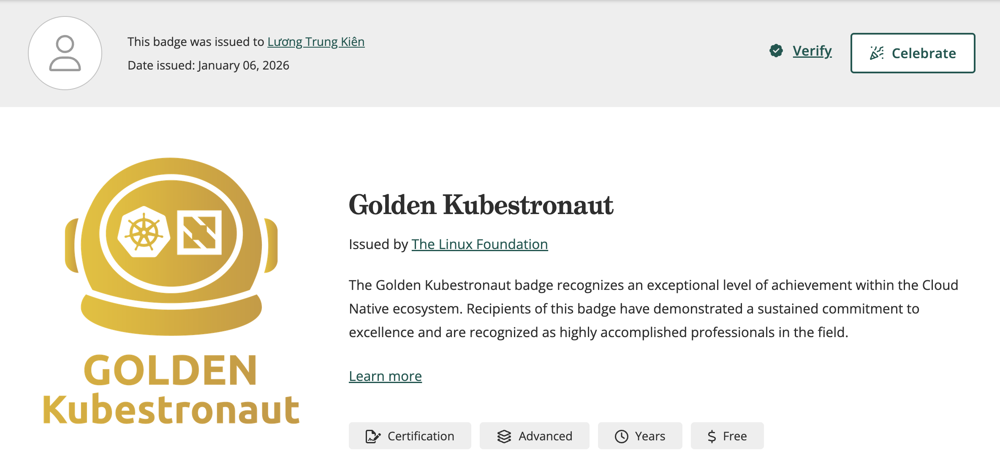
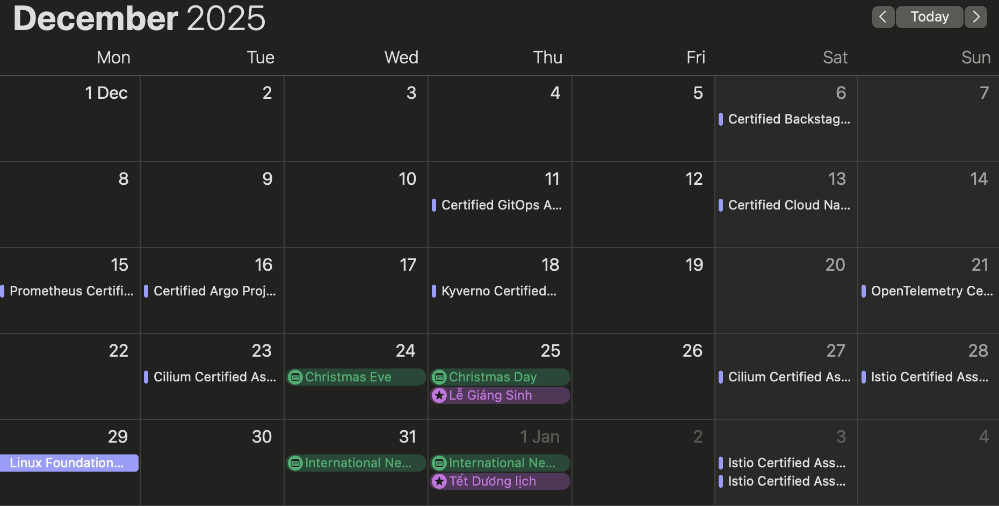

Title: My journey: from Kubestronaut to Golden Kubestronaut in 30 days
Date: 2026-01-10
Category: Knowledge Base
Tags: k8s, certification

# The story

TLDR: The title is a lie xD, in fact, I have spent about total 45-50 days.

From the beginning, I never think I will go for full Golden Kubestronaut certifications, I just had interest in field of Platform Engineering after viewing a demo what its capabilities, then I was aiming for 2 certifications which are Certified Backstage Associate (CBA) and Certified Cloud Native Platform Engineer (CNPE), but somehow I started thinking about full complete Golden Kubestronaut, it was affected by the following conditions:

- Cyber Week Promo (50% discount on any exams)
- While scrolling through LinkedIn, one of my connections shared a certification in a bundle of Golden Kube, which gave me extra motivation xD
- I have no idea what I will do in December 2025. I want to keep myself busy instead of spending every free evening time for gaming, short videos, drama...
- I want a target with clarified objectives to be achieved

The last condition is the most important, I guess, because with clear and detailed input/output, it should be a good task or objective. So I set a board with a task list of how many exams I need to pass to achieve that Golden Kubestronaut cert!

---

# Progress for each exam

In the first week, I was really careful and serious, only scheduling after I felt confident about the exam. But from the second week, I was "YOLO" and forced my lazy ass to learn, just scheduled without preparing or feeling confident about the exam, haha.

### 01. Prometheus (PCA)
This is the exam that I underestimated, and I almost paid the price for being careless. I'm still thinking that this exam is easy. I have been working with Prometheus for a long time, and this should not be hard. But in fact, I didn't understand Prometheus well enough, like what the core metric types of Prometheus are, I'm not able to answer or explain that =.=!

[Link to article - Prepare for PCA](https://blackmetalz.github.io/how-i-passed-the-prometheus-certified-associate-pca-exam.html)

---

### 02. Istio (ICA)
This is the second exam I failed to pass on the 1st try. My mistake was not checking the exam details carefully of the exam. I assumed this was quiz choices, and I only spent 1 day to prepare, and the result is failure for the 1st time for sure. Have to prepare and practice and lab, reschedule it for 3 days after 1st try!

[Link to article - Prepare for ICA](https://blackmetalz.github.io/prepare-for-the-istio-certified-associate-ica-exam.html)

### 03. Cilium (CCA)
This is the first exam I failed to pass on the 1st try. I failed because I didn't think the resource kind Gateway of K8S would appear in the exam (yeah, I'm a little outdated on K8S xD), and I was angry at myself.

[Link to article - Prepare for CCA](https://blackmetalz.github.io/prepare-for-the-cilium-certified-associate-cca-exam.html)

### 04. Argo (CAPA)
Haha, I thought Argo Projects were just ArgoCD and Argo Rollouts before.

[Link to article - Prepare for CAPA](https://blackmetalz.github.io/prepare-for-the-certified-argo-project-associate-capa-exam.html)

### 05. Gitops (CGOA)
This was easy to pass.

[Link to article - Prepare for CGOA](https://blackmetalz.github.io/mastering-gitops-crushing-the-certified-gitops-associate-cgoa-exam.html)

### 06. Backstage (CBA)
This is the first of the 2 certifications I did serious learning, which led to Golden Kubestronaut.

[Link to article - Prepare for CBA](https://blackmetalz.github.io/my-platform-engineering-journey-2-getting-started-with-backstage-internal-developer-portal-and-prepare-for-certified-backstage-associate-exam.html)

### 07. Opentelemetry (OTCA)
Opentelemetry is a vendor-neutral, tool for collecting telemetry data, including traces, metrics, and logs. I had fun with the basic traces and spans.

[Link to article - Prepare for OTCA](https://blackmetalz.github.io/prepare-for-the-opentelemetry-certified-associate-otca-exam.html)

### 08. Kyverno (KCA)
This is good to learn, even though I haven't used this in the past (same for CKS, attempt for the mindset increment, not certification itself)

[Link to article - Prepare for KCA](https://blackmetalz.github.io/prepare-for-the-kyverno-certified-associate-kca-exam.html)

### 09. Platform Engineer (CNPA)
This is the second of the 2 certifications I did serious learning, which led to Golden Kubestronaut.

[Link to article - Prepare for CNPA](https://blackmetalz.github.io/how-i-passed-cnpa-certification.html)

### 10. Linux Admin (LFCS)
I forgot some basics, this is a chance that forced me to re-learn xD

[Link to article - Prepare for LFCS](https://blackmetalz.github.io/prepare-for-linux-foundation-certified-system-administrator-lfcs.html)

---

# The sesult
Here is the result (ummm, My handwriting is bad and ugly AF)

---

# My personal rating and recommendation for each certification

### Rating

This was just based on my personal experience: 

- Prometheus (PCA): Medium
- Istio (ICA): Medium
- Cilium (CCA): Medium
- Argo (CAPA): Medium
- Gitops (CGOA): Easy
- Backstage (CBA): Medium
- Opentelemetry (OTCA): Medium
- Kyverno (KCA): Medium
- Platform Engineer (CNPA): Medium
- Linux Admin (LFCS): Easy

### Recommendation

First and second, orders do not matter

- 1st: Prometheus, Argo, Gitops, Opentelemetry, Linux Admin, Istio, Cilium
- 2nd: Kyverno, Backstage
- 3rd: Platform Engineer

---

# Conclusion

- What does it cost? A lot of fucking money!!!
- What does it gain? A big debt!!!
- This meme I could use whenever passing any certification LOL

