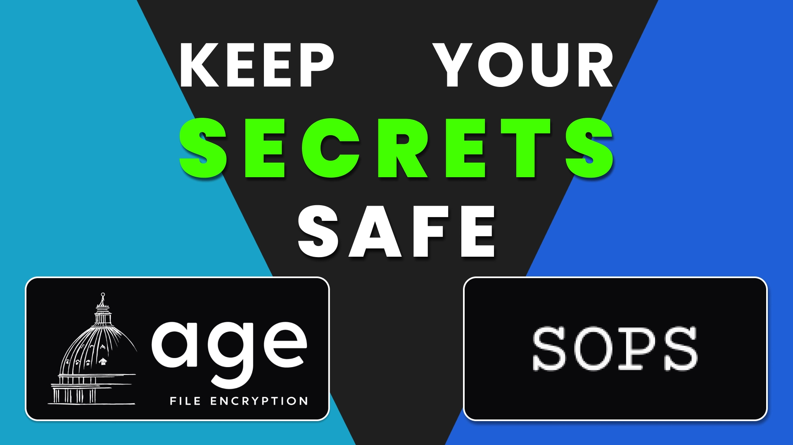

Title: No Vault? No GitOps? No Problem - Securing K8s Secrets with SOPS
Date: 2026-01-31
Category: Knowledge Base
Tags: security, k8s


# Introduction
There will always be problems that need to be solved, and then solutions come after that to fit the problem. So today I will tell you about it xD

I have a Streamlit application that needs to open to internal access for reporting about AI usage (Copilot/Cursor), to see if they are effective or not, and a Jira sprint, objectives report.

So the only deployment available at that time is only k8s cluster staging that I have access to. And I have no idea how many people have access in there, I don't want to be flagged by Red Team xD.

So what is Red Team (Copied from Google):
```
A red team is a group that simulates an adversary, attempts a physical or digital intrusion against an organization at the direction of that organization, then reports back so that the organization can improve their defenses. Red teams work for the organization or are hired by the organization
```

So to avoid that, I need some solution, at least they can not access my secret env, which contains API keys, login credentials, etc. Because in K8S, a secret is just encoded base64, not encrypted. 


I copied image from this site: https://mirceanton.com/posts/doing-secrets-the-gitops-way/

--- 

# Why I chose SOPS?

Before talking about it, I want to show the current state of staging k8s cluster:

- I'm not the only person who has access to the k8s cluster
- No GitOps, ArgoCD
- No Vault or External Secrets Operator
- Just kubectl apply xD

So I need to find a solution to encrypt my secret, and I chose SOPS after getting some recommendations from Claude since it is the best that fit with my condition.

--- 

# Install locally to generate encrypted file

You can read detail in here [https://github.com/getsops/sops](https://github.com/getsops/sops)

So, I expected that you already have `sops` and `age-keygen` available.

### 1. Generate an Age Key Pair (if you haven't already)

This creates your private key file (`key.txt`). This file **must be present in the project root** when you build the Docker image. It is ignored by `.gitignore` so it won't be committed to Git.

```bash
age-keygen -o key.txt
# You will need the public key (from the output or key.txt.pub) for the next step.
```

Expected output:
```
Public key: age1dk67a27dugyy964g38s462mjjn32aewzr4a2fy3yuwcd6wmvufrsg0n7ef
```

It also generated a private key file (`key.txt`), which you should keep secure.


### 2. Encrypt dotenv secret

Run following command:
```bash
sops --encrypt --age age1dk67a27dugyy964g38s462mjjn32aewzr4a2fy3yuwcd6wmvufrsg0n7ef .env > .env.enc
```

Expected output of file `.env.enc`:
```json
{
 "data": "ENC[AES256_GCM,data:adasdasdasdasd,type:str]",
 "sops": {
  "age": [
   {
    "recipient": "age1dk67a27dugyy964g38s462mjjn32aewzr4a2fy3yuwcd6wmvufrsg0n7ef",
    "enc": "-----BEGIN AGE ENCRYPTED FILE-----\somethingsecrethereLOLLLn-----END AGE ENCRYPTED FILE-----\n"
   }
  ],
  "lastmodified": "2026-01-30T04:31:13Z",
  "mac": "ENC[AES256_GCM,data:aaasddsadadasda==,type:str]",
  "version": "3.11.0"
 }
}
```

You can test decrypt it with:
```bash
export AGE_KEY_FILE=key.txt # Set environment variable
sops --decrypt --input-type json --output-type binary .env.enc > env.decrypted
```

And check output by read content of `env.decrypted` file.

### 3. Create secret and build Dockerfile for it
Create secret from file: with this, you don't care about people with access can decode the secret xD

```bash
# The key is: encrypted.env. Value is content of .env.enc
kubectl create secret generic my-secret --from-file=encrypted.env=.env.enc
```

Dockerfile for that shit, you will notice that I did removed shell from final image. So in that scenario those with k8s cluster access won't be able to enter into container to decode the secret xD

But you need to keep `key.txt` and build image manually, it is not possible to put `key.txt` into git repo and use pipeline for CICD in there.

```dockerfile
# Stage 1: Builder
FROM python:3.12-alpine AS builder

WORKDIR /app
RUN apk add --no-cache build-base && python -m pip install --no-cache-dir pip==25.3

RUN python -m venv /opt/venv
ENV PATH="/opt/venv/bin:$PATH"

COPY requirements.txt .
RUN python -m pip install --no-cache-dir -r requirements.txt

# Stage 2: Runner
FROM python:3.12-alpine

ENV PYTHONDONTWRITEBYTECODE=1 \
    PYTHONUNBUFFERED=1 \
    PATH="/opt/venv/bin:$PATH"

# Upgrade pip
RUN python -m pip install --no-cache-dir pip==25.3

# Install sops and jq, then remove shell-related packages
# Note: --no-check-certificate is used due to corporate proxy limitations
RUN apk add --no-cache wget jq && \
    SOPS_VERSION="v3.11.0" && \
    wget "https://github.com/getsops/sops/releases/download/${SOPS_VERSION}/sops-${SOPS_VERSION}.linux.amd64" --no-check-certificate -O /usr/local/bin/sops && \
    chmod +x /usr/local/bin/sops && \
    apk del wget

# Create user (still need shadow temporarily)
RUN apk add --no-cache shadow && \
    groupadd -g 1000 appuser && \
    useradd -u 1000 -r -g appuser -d /app appuser && \
    apk del shadow

WORKDIR /app

# Copy virtual environment
COPY --from=builder /opt/venv /opt/venv

# Copy source code and entrypoint
COPY . .
COPY entrypoint.py /app/entrypoint.py
RUN chmod +x /app/entrypoint.py

# Copy age key
RUN mkdir -p /etc/.yolo
COPY key.txt /etc/.yolo/key.txt
RUN chown -R appuser:appuser /app /etc/.yolo

# Remove shells (bash, sh, ash)
RUN rm -f /bin/sh /bin/ash /bin/bash /usr/bin/sh 2>/dev/null || true

USER appuser

EXPOSE 8501

# Use exec form to avoid shell
CMD ["python3", "/app/entrypoint.py"]
```

And important for runtime decryption `entrypoint.py`. I create this script to decrypt the secret at runtime then start the application.

```python
#!/usr/bin/env python3
import os
import subprocess
import sys

ENCRYPTED_SECRET_PATH = "/etc/secrets/encrypted.env"
AGE_KEY_FILE = "/etc/.yolo/key.txt"
DECRYPTED_ENV_PATH = "/app/.env"

def main():
    print("Attempting to decrypt secret...")
    
    # Check files exist
    if not os.path.isfile(ENCRYPTED_SECRET_PATH):
        print(f"ERROR: Encrypted secret file not found at {ENCRYPTED_SECRET_PATH}", file=sys.stderr)
        sys.exit(1)
    
    if not os.path.isfile(AGE_KEY_FILE):
        print(f"ERROR: Age private key file not found at {AGE_KEY_FILE}", file=sys.stderr)
        sys.exit(1)
    
    # Read age key
    with open(AGE_KEY_FILE, 'r') as f:
        age_key = ''.join(line for line in f if not line.startswith('#')).strip()
    
    if not age_key:
        print("ERROR: Age private key file is empty or could not be read.", file=sys.stderr)
        sys.exit(1)
    
    # Set SOPS_AGE_KEY environment variable
    env = os.environ.copy()
    env['SOPS_AGE_KEY'] = age_key
    
    # Detect format
    with open(ENCRYPTED_SECRET_PATH, 'r') as f:
        first_char = f.read(1)
    
    # Decrypt
    if first_char == '{':
        print("Detected JSON format (binary encrypted)")
        cmd = ['/usr/local/bin/sops', '--decrypt', '--input-type', 'json', '--output-type', 'binary', ENCRYPTED_SECRET_PATH]
    else:
        print("Detected dotenv format")
        cmd = ['/usr/local/bin/sops', '--decrypt', ENCRYPTED_SECRET_PATH]
    
    with open(DECRYPTED_ENV_PATH, 'wb') as out:
        result = subprocess.run(cmd, env=env, stdout=out, stderr=subprocess.PIPE)
    
    if result.returncode != 0:
        print(f"ERROR: Decryption failed: {result.stderr.decode()}", file=sys.stderr)
        sys.exit(1)
    
    # print(f"Secret decrypted successfully to {DECRYPTED_ENV_PATH}")
    
    # Show first 1 lines (for debugging)
    # with open(DECRYPTED_ENV_PATH, 'r') as f:
    #     for i, line in enumerate(f):
    #         if i >= 1:
    #             break
    #         print(f"Line {i+1}: {line.rstrip()}")
    
    # Start Streamlit
    print("Starting Streamlit application...")
    os.execvp('streamlit', ['streamlit', 'run', 'report.py', '--server.address=0.0.0.0'])

if __name__ == '__main__':
    main()
```

### 4. Deploy to k8s

Here is my sample deployment, I create service so I know which user for securityContext and yeah Sonarqube is annoying, it force me to put resource request and limit, haha

```yaml
apiVersion: apps/v1
kind: Deployment
metadata:
  name: reporting-dashboard
  namespace: dashboard-analytics
  labels:
    app: reporting-dashboard
spec:
  replicas: 1
  selector:
    matchLabels:
      app: reporting-dashboard
  template:
    metadata:
      labels:
        app: reporting-dashboard
    spec:
      # non-root (appuser - 1000) defined in Dockerfile
      automountServiceAccountToken: false
      securityContext:
        runAsUser: 1000
        runAsGroup: 1000
        fsGroup: 1000
        runAsNonRoot: true
      imagePullSecrets:
      - name: secret-for-pull-image-here
      containers:
      - name: dashboard
        securityContext:
          allowPrivilegeEscalation: false
        image: your-image-here:v1.2.3
        imagePullPolicy: Always
        ports:
        - containerPort: 8501
          name: http
        # New: Mount encrypted secret and age key for runtime decryption
        volumeMounts:
        - name: encrypted-secret
          mountPath: /etc/secrets/encrypted.env
          subPath: encrypted.env # Mounts the 'encrypted.env' key from the secret as a file
          readOnly: true
        resources:
          requests:
            cpu: "200m"
            memory: "256Mi"
          limits:
            cpu: "1000m"
            memory: "1Gi"
            ephemeral-storage: "5Gi"
      volumes:
      # New: Define volumes for the encrypted secret
      - name: encrypted-secret
        secret:
          secretName: my-secret
          items:
          - key: encrypted.env
            path: encrypted.env
```

That's all, I think it's the best solution for me in this case!

---

# Conclusion

Trade-off:

- Risk: if anyone has access to image registry or pull image, they can get the key.txt and decrypt the secret. So make sure your image registry is secure.
- How to mitigate: Make sure your image registry is secure and only authorized users can pull images.

Something fun I learned:

- `sops` for encryption/decryption
- `age` for key management
- Just remove fucking shell from container. A little hard to debug but I'm capable of doing that via logging, I don't need to use shell in container for debugging. I think it's a good practice for security. And yeah, I know how the application works since I'm the only developer in that project.
- Sonarqube is annoying but worth it, it forces me to put resource request and limit if I don't want to see a lot of warning.

I'm using this solution because it just matched for my case. It's simple, secure, and easy to maintain.


