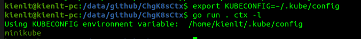
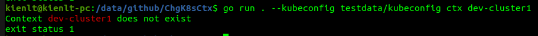

Title: Learn Go by doing project: Change K8S Contexts CLI
Date: 2026-02-20
Category: Coding
Tags: Go

--- 

# Learn Go from trash/pet project xD

### Purpose
Learn by building some project, use AI as less as I can with purpose to learn, not to cheat. This is not Python where I already have little experience and Go is zero!

Not really trying to focus on syntax but trying a lot to understand its logic!

### The knowledge I write in this article is pretty basic. Are you out of your mind, or do you have no self-respect to share this?

Haaaa, who cares? I write this for myself, for my memory, for my future self to look back and laugh at how stupid I was!

### Repo to throw the bricks/criticize xD

[https://github.com/BlackMetalz/ChgK8sCtx/](https://github.com/BlackMetalz/ChgK8sCtx/)

---

# Some screenshots

List Context with KUBECONFIG env:



Help flag:


Interaction:


Switch direct + check current context:


Switch direct with non exist context:



Fuzzy Search:


# Day 1

### Go function return

TLDR copied from: [https://www.w3schools.com/go/go_function_returns.php](https://www.w3schools.com/go/go_function_returns.php)
```
If you want the function to return a value, you need to define the data type of the return value (such as int, string, etc), and also use the return keyword inside the function:
```

Readfile success, still remember init func that return `[]byte` and `error` for example, for call it we need to assign it to a variable and check error. (`holyFuck, err := os.ReadFile("./testdata/kubeconfig")`)

Source code example: [https://go.dev/src/io/fs/readfile.go](https://go.dev/src/io/fs/readfile.go)

We can clearly see what is returned
```go
func ReadFile(fsys FS, name string) ([]byte, error) {
```

### Blank Identifier

It's a bit like writing to the Unix /dev/null file. Read more details here: [https://go.dev/doc/effective_go#blank](https://go.dev/doc/effective_go#blank)

### PromptUI
Someone will tell you that why you don't build a lib, but I'm noob AF, know how to use lib correctly already is a success for me. So for the need that list context and select I will use it. 

Example is pretty clear to understand how it works by just look at syntax!

[https://github.com/manifoldco/promptui/blob/master/_examples/select/main.go](https://github.com/manifoldco/promptui/blob/master/_examples/select/main.go)

I chose `Promptui` for interaction selection for my project. Expected output after implement `PromptUI`

- Output was amazing:
```bash
kienlt@Luongs-MacBook-Pro ChgK8sCtx % go run main.go
Current context:
dev-cluster
==========All context:==========
dev-cluster
staging-cluster
prod-cluster
aws-eks-cluster
gke-cluster
Use the arrow keys to navigate: ↓ ↑ → ←
? Select k8s cluster:
  ▸ dev-cluster
    staging-cluster
    prod-cluster
    aws-eks-cluster
    gke-cluster
---> After pick a context

✔ staging-cluster
Your selection:  staging-cluster
```

---

# Day 2
Nothing much for day 2

### Go run command
For the common scenario we have seen, we would use command to execute the Go program: `go run main.go`, but if there is multiple go files, we would use `go run .` (it means build and run package in current folder, not all go files, it will skip file like `_test.go`)

# Day 3

### Join path
I remember my first approach, it was just hardcoded string combined with `/`. But it worked only in my machine xD, not cross-platform if in the future I want to implement it for windows!. 

It is the best for handle `/` or `\` (windows).
Example implement:
```go
package main

import (
	"fmt"
	"path/filepath"
)

func main() {
	path := filepath.Join("/", "home", "user", "documents", "file.txt")
	fmt.Println(path) // /home/user/documents/file.txt
}
```

### Wrap errors

- In Day 3, I clearly did not understand how error should be wrapped, it took me about 3 hours to figure it out!
- So I would pick consistent error wrapping style. Error should be wrapped with **fmt.Errorf("context: %w", err)** and it will be returned inside function. 

Example: 


- And if we know that type is error, we can do something more like how we would handle if an error appears!
Example:
```go
package main

import (
	"errors"
	"fmt"
)

// Create new error type
var ErrInvalidID = errors.New("invalid id")

func getUser(id int) error {
	if id <= 0 {
		return fmt.Errorf("getUser: %w", ErrInvalidID)
	}
	return nil
}

func handleRequest() error {
	if err := getUser(-1); err != nil {
		return err
	}
	return nil
}

func main() {
	err := handleRequest()
	if err != nil {
		fmt.Println(err) // getUser: invalid id

		// With %w → We know it is ErrInvalidID 
        // Check err is ErrInvalidID or not
		if errors.Is(err, ErrInvalidID) {
			fmt.Println("==> Handle invalid id here!")
		}
	}
}
```

### Pointer
This shit even took me several days to figure it out! I'm able to live coding this small example without any help xD.
```go
package main

import "fmt"

type Account struct {
	Name    string
	Balance int
}

func withValue(acc Account, amount int) {
	acc.Balance += amount
	fmt.Println("Balance inside withValue: ", acc.Balance)
}

func withPointer(acc *Account, amount int) {
	acc.Balance += amount
}

func main() {
	acc := Account{Name: "kienlt", Balance: 100}
	fmt.Println("Before:", acc.Balance)
	withValue(acc, 10)
	fmt.Println("After withValue: ", acc.Balance)
	withPointer(&acc, 15)
	fmt.Println("After withPointer ", acc.Balance)
}
/* Output 
Before: 100
Balance inside withValue:  110
After withValue:  100
After withPointer  115
*/
```

---

# Day 4

### Interaction with K8S API to list namespaces
- use [client-go](https://github.com/kubernetes/client-go), k8s client lib to interact with K8s API
- create client from kubeconfig file
- get all namespace with `clientset.CoreV1().Namespaces().List()`

It is pretty basic for me since I already done it in the past with this trash project xD [https://github.com/BlackMetalz/KubeNotifyPlus](https://github.com/BlackMetalz/KubeNotifyPlus)

---

# Day 5

### Using Cobra CLI
[cobra-cli](https://github.com/spf13/cobra), I remember everytime I'm working on CLI with Go, I always chose cobra no matter how. LOL

Pretty useful, a lot of built-in feature. No need to write from scratch, great lib! Like this example below, we just need to define command flags then helper will auto generated

```bash
go run . ns --help
Switch to a different kubernetes namespace. 
Examples:
  # Interactive mode - show selection menu
  chg-k8s-ctx ns
  
  # Direct mode - switch immediately  
  chg-k8s-ctx ns kube-public
  chg-k8s-ctx ns my-namespace

Usage:
  chg-k8s-ctx ns [namespace] [flags]

Examples:
  chg-k8s-ctx ns
  chg-k8s-ctx ns kube-public

Flags:
  -h, --help   help for ns
```

And remember Cobra CLI doesn't support multiple character shorthand, I mean shorthand `-` only available to `single character`, it is convention of POSIX/GNU, not limitation of Cobra, Cobra just follow that convention (Thanks Claude xD). So we need to use `--` instead of `-` for those flags xD

---

# Day 6

### Fuzzy search
I used `sahilm/fuzzy` library for fuzzy search in context lists

### Switch to previous context
Implement this feature is not hard for me, I just needed to write down a flag to store previous context, and then use it to switch back to previous context. Not a big deal since in the past I have worked with this!

---

# Day 7
No idea what I learned

---

# Day 8

### Higher-order function
Little hard to understand, this is harder than pointer at this time for me xD

So higher-order function is function that take function as param or return function.

Hmm, so they called higher-order function because it is higher than normal function? LOL.... No, from what I copied, it works in higher layer, instead of working with data, it works with function!

Example:
```go
// Normal function → receive data, return data
func add(a, b int) int { return a + b }

// Higher-order function → receive function as param, return data
func filter[T any](items []T, match func(T) bool) []T { ... }
//                              ^^^^^^^^^^^^^^^^ receive function as param
```

But like Pointer in Day 3, I will need to remember its syntax to use it correctly.
```go
package main

import "fmt"

func removeByName[T any](items []T, name string, getName func(T) string) []T {
	var result []T
	for _, item := range items {
		if getName(item) != name {
			result = append(result, item)
		}
	}
	return result
}

type User struct {
	Name string
}

func main() {
	users := []User{{Name: "Alice"}, {Name: "Bob"}, {Name: "Charlie"}}

	result := removeByName(users, "Bob", func(u User) string {
		return u.Name
	})

	fmt.Println(result) // [{Alice} {Charlie}]
}
```

### Generics
Reducing code duplication is what I understand!

Without generics you have to write a lot of code for each type
```go
func removeUserByName(items []User, name string) []User {
	var result []User
	for _, item := range items {
		if item.Name != name {
			result = append(result, item)
		}
	}
	return result
}

func removeProductByName(items []Product, name string) []Product {
	var result []Product
	for _, item := range items {
		if item.Name != name {
			result = append(result, item)
		}
	}
	return result
}
```

With generics, it is a lot cleaner!
```go
func removeByName[T any](items []T, name string, getName func(T) string) []T {
	var result []T
	for _, item := range items {
		if getName(item) != name {
			result = append(result, item)
		}
	}
	return result
}
```

The main disadvantages of generics are complicated syntax, harder to debug. And only use when you have to handle multiple types. If you write generic for single type, it is just over-engineering!

---

# Special section for Higher-order function and Generics (update Feb 21,2026)

As you can see in Day 8 I already described them, but I want to write more about it! So let me bring an example

```go
package main

import "fmt"

type User struct {
	Name string
}

type Account struct {
	Holder  string
	Balance int
}

func removeByName[Type any](items []Type, strRemove string, getStr func(Type) string) []Type {
	var result []Type
	for _, item := range items {
		if getStr(item) != strRemove {
			result = append(result, item)
		}
	}

	return result
}

func main() {
	users := []User{{Name: "kienlt"}, {Name: "black"}, {Name: "metalz"}}
	fmt.Println(users) // {kienlt} {black} {metalz}]
	_result := removeByName(users, "metalz", func(u User) string { return u.Name })
	fmt.Println(_result) // [{kienlt} {black}]

	accounts := []Account{
		{
			Holder:  "kienlt",
			Balance: 100,
		},
		{
			Holder:  "black",
			Balance: 200,
		},
		{
			Holder:  "metalz",
			Balance: 300,
		},
	}
	fmt.Println(accounts) // [{kienlt 100} {black 200} {metalz 300}]
	_result1 := removeByName(accounts, "kienlt", func(a Account) string { return a.Holder })
	fmt.Println(_result1) // [{black 200} {metalz 300}]

}
```

- Anonymous function: `func(u User) string { return u.Name }` / `func(a Account) string { return a.Holder }` - passed as argument to **getStr**
- Generics: `[Type any]` - accepts any type
- Higher-order function: `removeByName` - takes a function as parameter

Does it always requires struct to have field **Name**? No, it is just need that param function must be **return string**, field in struct doesn't matter!

Conclusion: Compiler only care about **getStr func(Type) string** must return **string**


---

# Conclusion
- Approach by `KISS`: Keep it simple, stupid!
- Finished feature matter, finish first, make it work first before starting to do any over-engineering like refactor/rewrite/make code cleaner/beautiful.