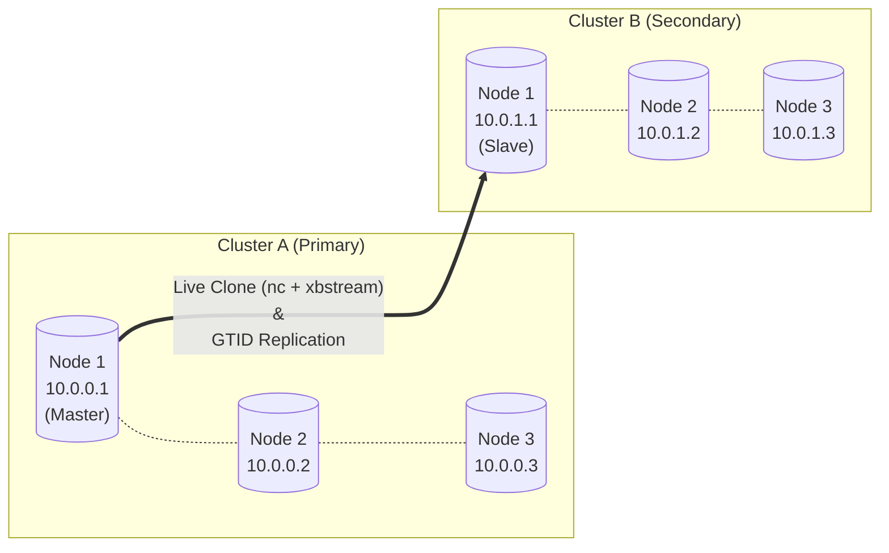

Title: Live Clone MySQL Replication using Percona XtraBackup
Date: 2026-03-11
Category: Knowledge Base
Tags: mysql, galera, xtrabackup


# Guide: Live Clone MySQL Replication using Percona XtraBackup

**Reference:** [Percona XtraBackup 8.0 Documentation](https://docs.percona.com/percona-xtrabackup/8.0/)

## Prerequisites

Before proceeding, ensure you have the following:
- **Two pre-provisioned Galera clusters** (this guide assumes the nodes are already installed with MySQL and Galera). We will not cover the initial base setup of the Galera packages here to keep the guide focused.
- **Network connectivity:** Essential Galera ports (3306, 4567, 4568, 4444) must be open across cluster nodes. Specifically, port `9999` must be allowed between Node 1 of Cluster A and Node 1 of Cluster B for the `nc` stream transfer.
- **GTID Enabled:** GTID (Global Transaction Identifier) replication must be enabled in the configuration (`gtid_mode=ON` and `enforce-gtid-consistency=ON`) on **both** clusters beforehand. This guide assumes it is already configured.
- **Zero-Downtime Operation:** This procedure is designed to be **zero-downtime** for the Primary cluster (Cluster A). It is safe to perform on a production environment.

## Environment Setup

-   **OS:** Ubuntu 24.04
-   **Privileges:** All operations are performed using the `root` user.

### Architecture Topology
We operate with two **Galera clusters**, each containing 3 nodes:

**Cluster A (Primary)**: Contains existing data.
- Node 1: `10.0.0.1` (designated as `Master`)
- Node 2: `10.0.0.2`
- Node 3: `10.0.0.3`

**Cluster B (Secondary)**: Currently empty.
- Node 1: `10.0.1.1` (designated as `Slave`)
- Node 2: `10.0.1.2`
- Node 3: `10.0.1.3`



**Objective:** Create a replication topology ensuring a full database clone, including all users and granted privileges from existing Cluster A (Primary).

### Important Context for Cluster B (Secondary)
After the initial setup of Cluster B (Secondary), gracefully shut down the nodes in reverse order: **Node 3**, then **Node 2**.
Only **Node 1** should remain active. The goal is to establish replication exclusively on Node 1 first. Once replication is stable, Galera will automatically sync the data to the other nodes when they are powered back on.

---

## 1. Install Percona XtraBackup

Execute the following commands on the nodes handling the backup/restore to install Percona XtraBackup 8.0:

```bash
apt update
apt install curl -y
curl -O https://repo.percona.com/apt/percona-release_latest.generic_all.deb
apt install gnupg2 lsb-release ./percona-release_latest.generic_all.deb -y
apt update
percona-release setup pxb-80
apt install percona-xtrabackup-80 -y

# Verify installation
xtrabackup --version
```
> **Tip:** For large databases, it is highly recommended to run the upcoming backup/restore processes inside a `screen` or `tmux` session to prevent interruptions.

---

## 2. Stream Data from Master to Slave

### On the Slave Node (Cluster B (Secondary) - Node 1)
Prepare the MySQL data directory and start a `netcat` listener (`nc`) to receive the incoming backup stream:

```bash
cd /var/lib/
mv mysql mysql.bak
mkdir mysql && cd mysql

# Listen on port 9999 and extract the incoming xbstream
nc -l 9999 | xbstream -xv
```

### On the Master Node (Cluster A (Primary) - Node 1)
Ensure you have an existing `/root/.my.cnf` configuration to authenticate XtraBackup without manual password prompts:

```ini
# /root/.my.cnf
[client]
user=root
password="<your_password>"
host=localhost
```

Initiate the backup process and pipe it over the network to the Slave Node (e.g., `10.0.1.1`):

```bash
mkdir -p /data/tmp
xtrabackup --backup --stream=xbstream --target-dir=/data/tmp/ | nc 10.0.1.1 9999
```

Wait for the process to output `completed OK!` on both sides. Once finished, you can press `CTRL+C` on the Master machine if the command doesn't detach automatically.

---

## 3. Prepare the Backup (Apply Logs)

### On the Slave Node (Cluster B (Secondary) - Node 1)
We must "prepare" the database (apply transaction logs) so that the data is consistent.

```bash
mkdir -p /data/tmp
xtrabackup --prepare --use-memory=10G --tmpdir=/data/tmp --target-dir=/var/lib/mysql
```

Wait for the `completed OK!` message. Once finished, correct the directory ownership back to the `mysql` user:

```bash
chown -R mysql:mysql /var/lib/mysql
```

---

## 4. Bootstrap the Replica Galera Cluster

If you start MySQL normally at this stage, it will fail with `Connection refused` or `failed to reach primary view` because it attempts to join its configured Galera peers (Node 2 and Node 3), which are currently powered off.

To safely boot the first node:

1. Edit the Galera configuration file (`/etc/mysql/conf.d/galera.cnf`).
2. Comment out the existing `wsrep_cluster_address` definition.
3. Add an empty `gcomm://` address to force the node to bootstrap a new cluster view.

```ini
# /etc/mysql/conf.d/galera.cnf
# wsrep_cluster_address="gcomm://10.0.1.1,10.0.1.2,10.0.1.3"
wsrep_cluster_address="gcomm://"
```

Start MySQL and verify its status:

```bash
systemctl start mysql
```

Check the MySQL variables to confirm it is running standalone:
```sql
mysql> SHOW VARIABLES LIKE 'wsrep_cluster_address';
-- Expected: gcomm://

mysql> SHOW STATUS LIKE 'wsrep_ready';
-- Expected: ON

mysql> SHOW STATUS LIKE 'wsrep_cluster_size';
-- Expected: 1
```

Once successfully booted, **re-edit** `/etc/mysql/conf.d/galera.cnf` back to its original state (uncomment the IP list and delete the empty `gcomm://` line).

> [!WARNING]
> **Do NOT restart MySQL** at this point! If you leave `gcomm://` and the server reboots later, it will attempt to form a new, separate primary partition (Split-Brain) instead of joining the existing cluster.

---

## 5. Rejoin the Remaining Slave Nodes

Now, power on **Node 2** in Cluster B (Secondary). You can monitor the cluster size on Node 1:

```sql
mysql> SHOW STATUS LIKE 'wsrep_cluster_size';
-- Should increment to 2
```

Next, power on **Node 3**. 

> [!WARNING]
> When a new or desynced node joins the cluster, Galera will trigger an **SST (State Snapshot Transfer)**. This process will completely wipe the existing `/var/lib/mysql/` directory on the joining node (Node 2 & Node 3) and stream the fresh data from the donor node.

> [!NOTE]
> For large databases (e.g., 100GB - 200GB), the initial sync might take considerable time. Node 3 will block on startup until the state transfer from Node 2 completes. 

To monitor the synchronization status on any active node:
```sql
mysql> SHOW STATUS LIKE 'wsrep_local_state_comment';
-- "Donor/Desynced" implies data transfer is still occurring.
-- Wait until it changes to "Synced".
```

Verify the final cluster size ensures all 3 nodes are active:
```sql
mysql> SHOW STATUS LIKE 'wsrep_cluster_size';
-- Expected: 3
```

---

## 6. Configure GTID Replication

*(Note: Using GTID via `SOURCE_AUTO_POSITION=1` abstracts away the requirement to manually provide the precise binlog file and position, but obtaining this XtraBackup info is still good practice for record-keeping).*

Check the binary log coordinate that the backup corresponds to:
```bash
cat /var/lib/mysql/xtrabackup_binlog_info
# Example Output: mysql-bin.000006 197 3bdafe24-05eb-11f1-bcd2-03edd96ddbe9:1-153268
```

Connect to MySQL on **Slave Node 1** and configure the replication link using GTIDs:

```sql
mysql> STOP REPLICA;
mysql> RESET REPLICA ALL;

mysql> CHANGE REPLICATION SOURCE TO
    SOURCE_HOST='10.0.0.1',
    SOURCE_USER='repl_user',
    SOURCE_PASSWORD='password_here',
    SOURCE_AUTO_POSITION=1;

mysql> START REPLICA;
```

Verify replication is completely healthy:
```sql
mysql> SHOW REPLICA STATUS\G
-- Ensure both threading states are 'Yes'
-- Replica_IO_Running: Yes
-- Replica_SQL_Running: Yes
-- Seconds_Behind_Source: 0
```

### Testing Replication
Create a test database on Cluster A (Primary):
```sql
mysql> CREATE DATABASE test_replication;
```
Verify it propagates to Cluster B (Secondary):
```sql
mysql> SHOW DATABASES;
```

---

## Appendix

### A. Example Slave Galera Configuration (`galera.cnf`)
Ensure essential replica flags (`super_read_only`) are enforced on Cluster B (Secondary) to prevent accidental writes.

```ini
[mysqld]
binlog_format=ROW
default_storage_engine=InnoDB
innodb_autoinc_lock_mode=2
max_connections=10000

# Galera Provider Configuration
wsrep_on=ON
wsrep_provider=/usr/lib/galera/libgalera_smm.so

# Cluster Connection (IPs of the 3 Site B nodes)
wsrep_cluster_address="gcomm://10.0.1.1,10.0.1.2,10.0.1.3"

# Node Specific
wsrep_node_address="10.0.1.1"
wsrep_node_name="lab-site2-galera-rep-1"
wsrep_cluster_name="cluster-site-b"

# SST Method
wsrep_sst_method=rsync

# GTID & Binary Logs (Crucial for Site-to-Site Replication)
server-id=201 # Must be unique per node (e.g., 201, 202, 203)
log_bin=mysql-bin
log_slave_updates=ON
gtid_mode=ON
enforce-gtid-consistency=ON

# Replica safeguards
super_read_only=1
```

### B. Promoting Cluster B (Secondary)
If a failover occurs and you need to deploy Cluster B (Secondary) as primary, run the following on a single node (**Node 1**):
```sql
mysql> STOP REPLICA;
mysql> RESET REPLICA ALL;
```
Then, on **all 3 nodes**, disable read-only modes:
```sql
mysql> SET GLOBAL super_read_only = 0;
mysql> SET GLOBAL read_only = 0;
```
> **Crucial:** Remember to permanently adjust `super_read_only` out of `/etc/mysql/conf.d/galera.cnf` (without restarting the service immediately) so the nodes do not revert to a read-only state upon an unexpected machine reboot.

### C. Using ProxySQL vs HAProxy
**Why use ProxySQL over standard HAProxy?** 

Galera clusters frequently face Multi-Writer deadlocks (Certification Conflicts) when writing heavily to multiple nodes simultaneously. ProxySQL provides a native capability via the `max_writers=1` setting. This intelligently restricts all writes to a single node, completely eliminating Galera deadlock scenarios—a function standard TCP load balancers like HAProxy cannot natively manage. Using Keepalived + VIP without an intelligent proxy leaves the secondary nodes effectively idle without maximizing performance safely.

Read more: [ProxySQL Native Galera Support](https://www.proxysql.com/blog/proxysql-native-galera-support/)
