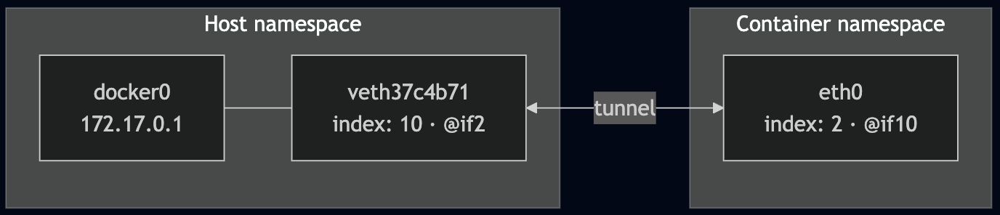
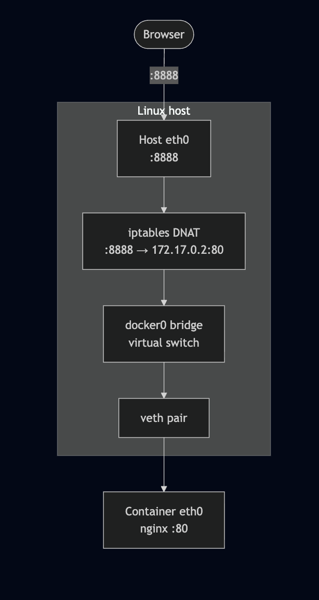
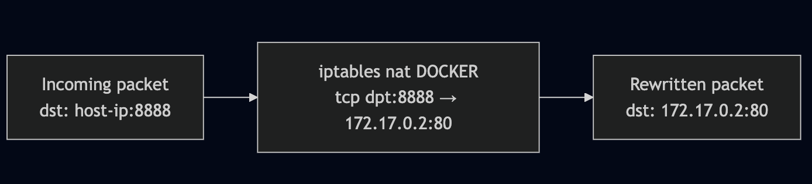

Title: Demystifying Docker Networking: A Deep Dive into Bridge & veth
Date: 2026-03-15
Category: Knowledge Base
Tags: networking, container, docker

I guess I'm not the only one who gets confused with Docker networking. Let's try to understand it better!

## Prerequisites
- Ubuntu 24.04
- Docker installed.
- Bridge Utils: `apt install bridge-utils -y`

## Bridge Network flow
I think I will only talk about this, since this is default network in docker.



Let's get started:
```bash
docker run -d -p 8888:80 --name nginx-demo nginx
```

Expected output:
```bash
root@kienlt-lab-utilities:~# docker ps
CONTAINER ID   IMAGE          COMMAND                  CREATED         STATUS         PORTS                                                    NAMES
67b80460a739   nginx          "/docker-entrypoint.…"   2 seconds ago   Up 2 seconds   0.0.0.0:8888->80/tcp, [::]:8888->80/tcp                  nginx-demo
```

Haha, I was having a hard time to understand which is container port and which is host port. But it is pretty simple, you just need to remember that the format is `host_port:container_port`, it means you will access nginx container from outside of the container using `host_port`, and inside the container, the nginx is running on `container_port`.

TLDR: if we have request access to port 8888, docker will throw that damn request to port 80 inside the container.

Verify by this command below:
```bash
root@kienlt-lab-utilities:~# docker port nginx-demo
80/tcp -> 0.0.0.0:8888
80/tcp -> [::]:8888
```

Why request from port 8888 can be forwarded to port 80 inside the heck container? It is iptables, hmm I thought it was used only for drop/accept like a firewall. But it is not, it can be used for port forwarding too. Let's check the iptables rules:
```bash
# To view full rule of Docker, remove that grep.
root@kienlt-lab-utilities:~# iptables -t nat -L DOCKER -n|grep 8888
DNAT       6    --  0.0.0.0/0            0.0.0.0/0            tcp dpt:8888 to:172.17.0.2:80
```

Let's break down the rule above:

- DNAT: Destination Network Address Translation
- 6: protocol (tcp)
- 0.0.0.0/0: source ip (any ip)
- 0.0.0.0/0: destination ip (any ip)
- tcp dpt:8888: destination port (8888)
- to:172.17.0.2:80: destination ip and port (172.17.0.2:80)

Hmm, where is the ip `172.17.0.2` comes from?
```bash
root@kienlt-lab-utilities:~# docker inspect -f '{{range .NetworkSettings.Networks}}{{.IPAddress}}{{end}}' nginx-demo
172.17.0.2
```

Flow summary:

1. User sends request to: `http://host-ip:8888`
2. Host kernel receives the packet, sees destination port 8888
3. iptables DNAT rule rewrites destination to `172.17.0.2:80`
4. The packet is forwarded to docker0 bridge
5. Packet travels through a `veth pair` into the container's network namespace
6. nginx receives it on port 80

## Hmmm, how Bridge (docker0) and veth works?

Before running any commands, here's the full picture of what we're about to explore:



What is `veth`? It is a virtual ethernet pair, it is like a tunnel between two network namespaces.

What is `Network Namespace (netns)`? It is a feature of Linux kernel that allows you to create isolated network environments.

There are 3 keys component that need to be understood:

- `docker0`: virtual bridge
- `veth pair`: 2 way tunnel, 1 plugged into docker0, 1 plugged into container
- `Network Namespace`: the reason why container have it's own `eth0` interface, complete isolated with host network

## Verifying the Bridge and veth Pairs
We mentioned docker0, let's check it. (I have more than 1 container running, so you probably see more than 1 veth)

```bash
root@kienlt-lab-utilities:~# brctl show
bridge name	        bridge id		    STP enabled	interfaces
br-2a065d00678a		8000.7687adb1e805	no		    vethf6114a2
br-bf86e395575b		8000.72f5de7a4fae	no		    vethfc36c96
br-c1027faa9820		8000.6a557a38506a	no		    veth11ad843
docker0		        8000.fa5bcf9b5087	no		    veth37c4b71
```

`veth37c4b71` is the host-side end of the tunnel connected to our container.

Let confirms with `ip link`
```bash
root@kienlt-lab-utilities:~# ip link show master docker0
10: veth37c4b71@if2: <BROADCAST,MULTICAST,UP,LOWER_UP> mtu 1500 qdisc noqueue master docker0 state UP mode DEFAULT group default
    link/ether 3a:e0:83:b9:4e:7b brd ff:ff:ff:ff:ff:ff link-netnsid 3
```

Notice `veth37c4b71@if2` — the `@if2` means this interface is paired with interface index 2 on the other side (inside the container).


## Network Namespaces (netns)
Each container runs in its own network namespace. Let's inspect it to confirm the veth pairing.

We can list all netns with `ip netns list`

```bash
root@kienlt-lab-utilities:~# ip netns list
root@kienlt-lab-utilities:~#
```

"Why are you lying? there is no netns here?" Don't worry bro, I will explain why!

```bash
root@kienlt-lab-utilities:~# man ip-netns
```

You will see a section like this, I'm showing from manual page, so no need external link xD
```
       ip netns list - show all of the named network namespaces

              This command displays all of the network namespaces in /run/netns
```

Ok, let's check in `/run/netns` and `/var/run/netns`. Wait a minute? why `/var/run/netns`, in man page haven't mentioned it?

Here you go bro, in Ubuntu `/var/run` is a link that pointed to `/run`
```bash
root@kienlt-lab-utilities:~# ll  /var/run
lrwxrwxrwx 1 root root 4 Feb 17  2025 /var/run -> /run/
```

```bash
root@kienlt-lab-utilities:~# ll /run/netns
ls: cannot access '/run/netns': No such file or directory
root@kienlt-lab-utilities:~# ll /var/run/netns
ls: cannot access '/var/run/netns': No such file or directory
```

To make it show properly in there, we will need to do some trick, why trick? This is only for learning purpose, in facts Docker doesn't expose `netns` to `/run/netns` due security.
```bash
# 1. Find PID of container
PID=$(docker inspect -f '{{.State.Pid}}' nginx-demo)

# 2. Create netns directory because it is not exists
sudo mkdir -p /var/run/netns

# 3. Soft link namespace of container to /var/run/netns
sudo ln -sf /proc/$PID/ns/net /var/run/netns/nginx-demo-ns

# 4. Check again - Now it will show up!
ip netns list
## expected output
nginx-demo-ns (id: 3)
## 
```

## Look inside the container's network namespace
Check `veth pairing`
```bash
root@kienlt-lab-utilities:~# sudo ip netns exec nginx-demo-ns ip link show eth0
2: eth0@if10: <BROADCAST,MULTICAST,UP,LOWER_UP> mtu 1500 qdisc noqueue state UP mode DEFAULT group default
    link/ether 42:17:5a:54:f2:c4 brd ff:ff:ff:ff:ff:ff link-netnsid 0
```

Important output: `eth0@if10`, `if10` is the other side of the veth pair, it is connected to `docker0` bridge. So let see all network interface in Host, who the fuck has index 10?

I want to prove: `eth0` inside container is paired with `veth37c4b71` outside, network host.

```bash
root@kienlt-lab-utilities:~# ip link | grep ^10:
10: veth37c4b71@if2: <BROADCAST,MULTICAST,UP,LOWER_UP> mtu 1500 qdisc noqueue master docker0 state UP mode DEFAULT group default
```

Hmm, it is `veth37c4b71` and you see master docker0 which means it is plugged into the docker0 bridge. Ok what is `@if2` in `veth37c4b71@if2`? I would type this command again to prove it is linked with each other.
```bash
root@kienlt-lab-utilities:~# sudo ip netns exec nginx-demo-ns ip link show eth0
2: eth0@if10: <BROADCAST,MULTICAST,UP,LOWER_UP> mtu 1500 qdisc noqueue state UP mode DEFAULT group default
    link/ether 42:17:5a:54:f2:c4 brd ff:ff:ff:ff:ff:ff link-netnsid 0
```

You see index 10 (`if10`)? It is the other side of the veth pair.

Hmm, let me tell you what is interface index
```bash
root@kienlt-lab-utilities:~# ip link
1: lo: <LOOPBACK,UP,LOWER_UP> mtu 65536 qdisc noqueue state UNKNOWN mode DEFAULT group default qlen 1000
    link/loopback 00:00:00:00:00:00 brd 00:00:00:00:00:00
2: eth0: <BROADCAST,MULTICAST,UP,LOWER_UP> mtu 1500 qdisc mq state UP mode DEFAULT group default qlen 1000
    link/ether fa:16:3e:36:85:01 brd ff:ff:ff:ff:ff:ff
    altname enp0s3
    altname ens3
3: docker0: <BROADCAST,MULTICAST,UP,LOWER_UP> mtu 1500 qdisc noqueue state UP mode DEFAULT group default
    link/ether fa:5b:cf:9b:50:87 brd ff:ff:ff:ff:ff:ff
4: br-c1027faa9820: <BROADCAST,MULTICAST,UP,LOWER_UP> mtu 1500 qdisc noqueue state UP mode DEFAULT group default
    link/ether 6a:55:7a:38:50:6a brd ff:ff:ff:ff:ff:ff
5: veth11ad843@if2: <BROADCAST,MULTICAST,UP,LOWER_UP> mtu 1500 qdisc noqueue master br-c1027faa9820 state UP mode DEFAULT group default
    link/ether ee:e7:24:2f:ca:b5 brd ff:ff:ff:ff:ff:ff link-netnsid 0
6: br-2a065d00678a: <BROADCAST,MULTICAST,UP,LOWER_UP> mtu 1500 qdisc noqueue state UP mode DEFAULT group default
    link/ether 76:87:ad:b1:e8:05 brd ff:ff:ff:ff:ff:ff
7: vethf6114a2@if2: <BROADCAST,MULTICAST,UP,LOWER_UP> mtu 1500 qdisc noqueue master br-2a065d00678a state UP mode DEFAULT group default
    link/ether ea:85:60:ef:33:a4 brd ff:ff:ff:ff:ff:ff link-netnsid 1
8: br-bf86e395575b: <BROADCAST,MULTICAST,UP,LOWER_UP> mtu 1500 qdisc noqueue state UP mode DEFAULT group default
    link/ether 72:f5:de:7a:4f:ae brd ff:ff:ff:ff:ff:ff
9: vethfc36c96@if2: <BROADCAST,MULTICAST,UP,LOWER_UP> mtu 1500 qdisc noqueue master br-bf86e395575b state UP mode DEFAULT group default
    link/ether 5e:e7:47:ac:9c:a2 brd ff:ff:ff:ff:ff:ff link-netnsid 2
10: veth37c4b71@if2: <BROADCAST,MULTICAST,UP,LOWER_UP> mtu 1500 qdisc noqueue master docker0 state UP mode DEFAULT group default
    link/ether 3a:e0:83:b9:4e:7b brd ff:ff:ff:ff:ff:ff link-netns nginx-demo-ns
```

so inside container, interface `eth0` is linked with `veth37c4b71@if2` which have interface index is 10. And `veth37c4b71@if2` is linked with `docker0` bridge.

## Visualizing the pairing



You can use this command to see it more clearly
```bash
root@kienlt-lab-utilities:~# ip netns exec nginx-demo-ns ethtool -S eth0
NIC statistics:
     peer_ifindex: 10 # This is 10th interface in host
     ...

# Run this shit
root@kienlt-lab-utilities:~# ethtool -S veth37c4b71
NIC statistics:
     peer_ifindex: 2 # This is 2nd interface in container
     ...
```

Why we need this fucking veth pair? Because `Network Namespace` is isolated, so we need a tunnel to connect them.

## Docker-Proxy
In this article, I haven't mentioned any keyword related to "docker-proxy". Why?

It works together with `iptables` but have lower priority. In essence, networking stack of Linux handle packet at kernel level before it has a chance to processed by docker-proxy in User-space. So if `iptables` process the packet, the packet will go to container directly without passing through `docker-proxy`. If packet does not match any rule in `iptables`, it will go to `docker-proxy` to process for edge case like traffic from localhost itself.

Why it is created? to solve what problem?

We maybe noticed or never notice (like me), there is a process `docker-proxy` for each published port. Let run in my server to see what are they
```bash
root@kienlt-lab-utilities:~# ps -ef | grep docker-proxy
root      399782  399324  0 Mar07 ?        00:00:01 /usr/bin/docker-proxy -proto tcp -host-ip 0.0.0.0 -host-port 8000 -container-ip 172.18.0.2 -container-port 80 -use-listen-fd
root      399787  399324  0 Mar07 ?        00:00:01 /usr/bin/docker-proxy -proto tcp -host-ip :: -host-port 8000 -container-ip 172.18.0.2 -container-port 80 -use-listen-fd
root      399985  399324  0 Mar07 ?        00:00:01 /usr/bin/docker-proxy -proto tcp -host-ip 0.0.0.0 -host-port 6379 -container-ip 172.19.0.2 -container-port 6379 -use-listen-fd
root      399990  399324  0 Mar07 ?        00:00:01 /usr/bin/docker-proxy -proto tcp -host-ip :: -host-port 6379 -container-ip 172.19.0.2 -container-port 6379 -use-listen-fd
root      400735  399324  0 Mar07 ?        00:00:01 /usr/bin/docker-proxy -proto tcp -host-ip 0.0.0.0 -host-port 3306 -container-ip 172.20.0.2 -container-port 3306 -use-listen-fd
root      400740  399324  0 Mar07 ?        00:00:01 /usr/bin/docker-proxy -proto tcp -host-ip :: -host-port 3306 -container-ip 172.20.0.2 -container-port 3306 -use-listen-fd
root      538366  399324  0 Mar15 ?        00:00:00 /usr/bin/docker-proxy -proto tcp -host-ip 0.0.0.0 -host-port 8888 -container-ip 172.17.0.2 -container-port 80 -use-listen-fd
root      538372  399324  0 Mar15 ?        00:00:00 /usr/bin/docker-proxy -proto tcp -host-ip :: -host-port 8888 -container-ip 172.17.0.2 -container-port 80 -use-listen-fd
root      558780  558312  0 11:14 pts/0    00:00:00 grep --color=auto docker-proxy
```

Why they are created? To solve some edge case (Source here: https://serverfault.com/questions/633604/what-is-the-point-of-the-docker-proxy-process-why-is-a-userspace-tcp-proxy-need)

- localhost<->localhost routing
- docker instance calling into itself via its published port
- And more...

Docker issue: 

- https://github.com/docker/docker/issues/8356
- https://github.com/moby/moby/issues/11185

So at this time, Docker hasn't removed that feature yet but give user able to disable it to save some memory xD. I also like that approach, because it is better to have 100% working instead of 95% working but gain very little value by saving small memory.

Disable docker-proxy: Simple add or modify in `/etc/docker/daemon.json`

```json
{
  "userland-proxy": false
}
```

Then restart docker service and validate by:
```bash
root@kienlt-lab-utilities:~# ps -ef|grep docker-proxy
root      559752  558312  0 11:37 pts/0    00:00:00 grep --color=auto docker-proxy
```

---

## Conclusion
I hope this post help you understand how docker networking works.