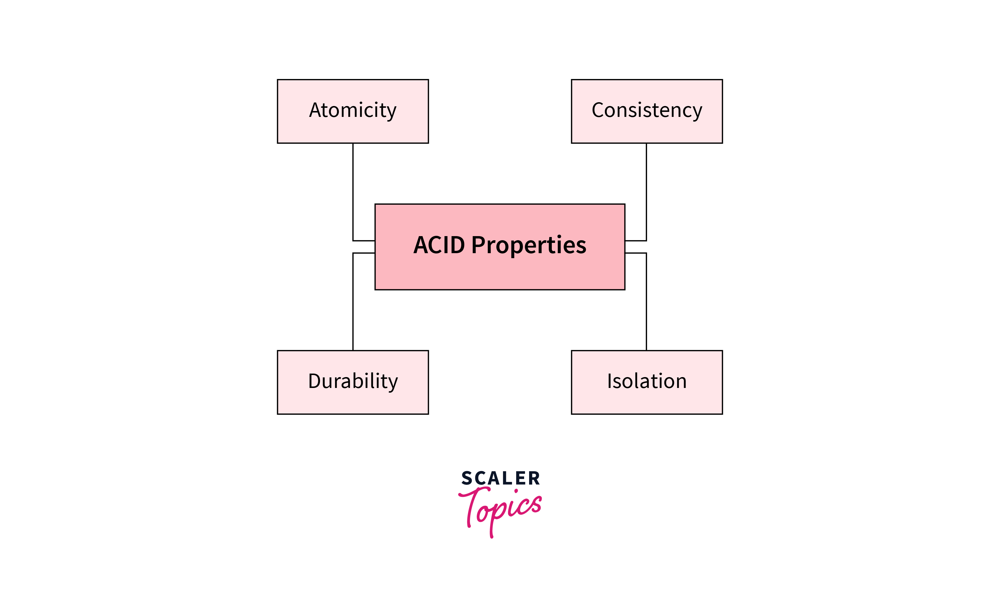

Title: Mysql - ACID Principle
Date: 2026-03-16
Category: Knowledge Base
Tags: mysql, database

As a System Admin, I want to understand ACID principles in MySQL, mainly for learning purposes.


## ACID: It is not only definition, it is mechanism!

- `A` stands for `Atomicity`
- `C` stands for `Consistency`
- `I` stands for `Isolation`
- `D` stands for `Durability`

### Atomicity



Let's talk about `Atomicity`: from what I understand, it means all transactions will be executed completely or not at all (All or nothing). 

Here is an example for ecommerce:
```sql
START TRANSACTION; -- We can use BEGIN | BEGIN WORK as well?

-- 1. Check product stock (usually done with FOR UPDATE to lock the row)
SELECT stock FROM products WHERE id = 1 FOR UPDATE;

-- 2. Create order
INSERT INTO orders (product_id, quantity, status) VALUES (1, 1, 'pending');

-- 3. Deduct stock
UPDATE products SET stock = stock - 1 WHERE id = 1;

-- 4. Create payment
INSERT INTO payments (order_id, amount, status) VALUES (1, 100, 'pending');

COMMIT; -- Send transaction
```

**What makes it Atomic?**

Because we wrapped these 4 queries inside a `START TRANSACTION;` ... `COMMIT;` block, MySQL will treat them as a single Unit of Work.

If step 3 fails (e.g., due to a trigger error, constraint violation, or server crash), the application or MySQL will execute a `ROLLBACK;` command. At that point, the data inserted in step 2 will be undone (removed). The database will return to the exact same state it was in before running `START TRANSACTION`. That is atomicity!

So for `ROLLBACK`, it will used data in [Undo Log](https://dev.mysql.com/doc/refman/8.4/en/innodb-undo-logs.html) to restore the data to the previous state.

### Consistency
Database never lies! If Atomicity ensures "all or nothing", `Consistency` ensures that after a transaction is done, the data will be in a valid state. So, how does it work?

[Database Constraints](https://www.w3schools.com/sql/sql_constraints.asp) are used to ensure data integrity. 

I copied from `w3schools`, SQL Constraint Types:
```
The following constraints are commonly used in SQL:

NOT NULL - Ensures that a column cannot have a NULL value
UNIQUE - Ensures that all values in a column are unique
PRIMARY KEY - Uniquely identifies each row in a table (a combination of a NOT NULL and UNIQUE)
FOREIGN KEY - Establishes a link between data in two tables, and prevents action that will destroy the link between them
CHECK - Ensures that the values in a column satisfies a specific condition
DEFAULT - Sets a default value for a column if no value is specified
CREATE INDEX - Creates indexes on columns to retrieve data from the database faster
```

Consistency is not only about DB avoid wrong data, it is also state of data when change from current valid state to another valid state after transaction finished succesfully!

### Isolation
This might be a little advanced for me, but I will try my best to explain. The target is Isolation, and MVCC (Multi-Version Concurrency Control) is the mechanism that achieves it without making our database slow as hell!

Okay, why do we need Isolation?

- Dirty Read: Transaction A read data that transaction B is modifying but not commit yet. If transaction B rollback, transaction A will have wrong data.
- Non-repeatable Read: Transaction A read data, then transaction B modify the same data and commit. If transaction A read the same data again, it will get different data.
- Phantom Read: Transaction A read data, then transaction B insert new data that match the condition of transaction A. If transaction A read the same data again, it will get new data.


So how do we deal with those issues above?: Instead of lock database, not allow anyone to read or write when someone is modifying database, InnoDB create multiple version of data (we called it is Snapshot!)

- When user A is updating, User B execute select query and still see old snapshot without being locked!
- Each transaction will have it's owned [Read View](https://dev.mysql.com/doc/dev/mysql-server/latest/classReadView.html) to known which data is visible to it.

And I want to put keyword [Next-Key Lock](https://dev.mysql.com/doc/refman/9.6/en/innodb-locking.html), it is unique machanism of InnoDB to avoid phantom read! Read more here: https://dev.mysql.com/doc/refman/8.4/en/innodb-next-key-locking.html 

For a good example: with MVCC, we can backup database using mysqldump without lock the database! (`mysqldump --single-transaction`)

So again, it's a tradeoff between performance and safety! Choose carefully!

### Durability
This is the easiest part of the ACID principles. After you `COMMIT`, it will persist on disk!

When we `COMMIT`, changes will be written into a log file sequentially called the `Redo Log` (file `ib_logfile`), often known as Write-Ahead Logging (WAL). Here is the documentation for the [Redo log](https://dev.mysql.com/doc/refman/8.4/en/innodb-redo-log.html). 

Again, there is a tradeoff between performance and safety! 

[Doublewrite - Buffer](https://dev.mysql.com/doc/refman/9.6/en/innodb-doublewrite-buffer.html)
```
The innodb_doublewrite variable controls whether the doublewrite buffer is enabled. It is enabled by default in most cases. To disable the doublewrite buffer, set innodb_doublewrite to OFF. Consider disabling the doublewrite buffer if you are more concerned with performance than data integrity, as may be the case when performing benchmarks, for example.
```

InnoDB System Variables - [innodb_flush_log_at_trx_commit](https://dev.mysql.com/doc/refman/8.4/en/innodb-parameters.html#sysvar_innodb_flush_log_at_trx_commit)
So for System/DB Admin: 

- Value = 1 (default), the most safety, but slowest!
- Value = 0/2, faster, but less safety!

--- 

## The SRE Takeaway

- Want complete safety?: set `innodb_flush_log_at_trx_commit = 1`
- Want to backup without downtime? Use `--single-transaction`

--- 

## Conclusion

ACID is a set of properties that ensure transactions in a database are processed reliably. It is a fundamental concept in database management systems, and it is essential for ensuring data integrity and consistency.
