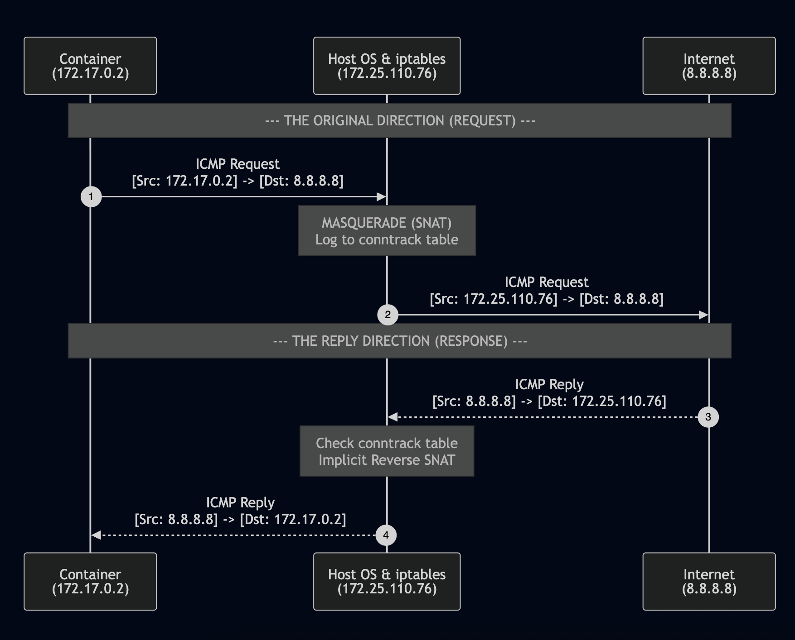

Title: Demystifying Docker Networking: Outbound Traffic & The Masquerade Magic
Date: 2026-03-16
Category: Knowledge Base
Tags: networking, container, docker

In the [previous post](https://blackmetalz.github.io/demystifying-docker-networking-a-deep-dive-into-bridge-veth.html), we explored how external requests find their way into a container via DNAT. But there is a flip side to that coin: When a container needs to download a package or call an external API, how does it "break out" to the internet when it only has a private, internal IP?

Today, we are diving deep into the fucking `Egress Flow`.

## 1. Finding the "Gateway"
Every journey begins with a door. Inside a container, that door is the damn `Default Gateway`. Usually, we would just `exec` into the container to check it, but modern official images like `nginx:latest` are minimal — meaning they lack common tools like `ip` or `ifconfig` binary for security and size reasons.

No worries, we can borrow the Host's `ip` command to take a look inside the damn container:
```bash
# Issue
root@kienlt-lab-utilities:~# docker exec nginx-demo ip route
OCI runtime exec failed: exec failed: unable to start container process: exec: "ip": executable file not found in $PATH

# 1. Get the PID of your container
PID=$(docker inspect -f '{{.State.Pid}}' nginx-demo)

# 2. Use nsenter to run the Host's 'ip route' inside the container's network namespace
nsenter -t $PID -n ip route

# Example output
default via 172.17.0.1 dev eth0
172.17.0.0/16 dev eth0 proto kernel scope link src 172.17.0.2
```

The gateway `172.17.0.1` is actually the IP of the `docker0` interface on my host. The container sends all out-of-network packets here!
```bash
root@kienlt-lab-utilities:~# ifconfig docker0
docker0: flags=4163<UP,BROADCAST,RUNNING,MULTICAST>  mtu 1500
        inet 172.17.0.1  netmask 255.255.0.0  broadcast 172.17.255.255
        inet6 fe80::f85b:cfff:fe9b:5087  prefixlen 64  scopeid 0x20<link>
        ether fa:5b:cf:9b:50:87  txqueuelen 0  (Ethernet)
        RX packets 6  bytes 168 (168.0 B)
        RX errors 0  dropped 0  overruns 0  frame 0
        TX packets 7  bytes 746 (746.0 B)
        TX errors 0  dropped 0 overruns 0  carrier 0  collisions 0
```

## 2. IP Forwarding

Once the packet hits the Host via the `veth pair`, the Host Kernel acts as a router. It must decide whether to forward this packet from the virtual bridge (docker0) to the physical interface (like eth0 as a common interface name xD). This requires IP Forwarding to be enabled.

```
root@kienlt-lab-utilities:~# sysctl net.ipv4.ip_forward
net.ipv4.ip_forward = 1
```

But this is enabled by default when we install Docker I guess.

Reference: https://docs.docker.com/engine/network/firewall-iptables/#allow-forwarding-between-host-interfaces
```
Docker requires IP Forwarding to be enabled on the host for its default bridge network configuration
```

## 3. MASQUERADE
The container's IP (e.g., 172.17.0.2) is "non-routable" on the public internet. If you send a packet with this source IP, the internet won't know where to send the response.

To resolve that issue, Docker uses MASQUERADE (a form of Source NAT). Let's look at our `nat` table:
```bash
root@kienlt-lab-utilities:~# iptables -t nat -L POSTROUTING -n
Chain POSTROUTING (policy ACCEPT)
target     prot opt source               destination
MASQUERADE  0    --  172.17.0.0/16        0.0.0.0/0 # This
MASQUERADE  0    --  172.20.0.0/16        0.0.0.0/0 # This
MASQUERADE  0    --  172.18.0.0/16        0.0.0.0/0 # This

# Hairpin NAT — a different beast entirely
# These handle the case where a container calls its own published port (src = dst).
# Docker adds these automatically when you use -p to publish a port.
MASQUERADE  6    --  172.18.0.2           172.18.0.2           tcp dpt:80
MASQUERADE  6    --  172.20.0.2           172.20.0.2           tcp dpt:3306
MASQUERADE  6    --  172.17.0.2           172.17.0.2           tcp dpt:80
```

So let's break down rules above to understand how they work! [Document of iptables](https://man7.org/linux/man-pages/man8/iptables.8.html)

- `POSTROUTING` (for altering packets as they are about to go out)
- `prot` = Protocol. 0 (ALL), 6(TCP)
- Docker tells the Kernel: "Whenever you see a packet coming from 172.17.0.0/16 (or any other Docker subnet) heading to the outside world (0.0.0.0/0), strip its internal source IP and replace it with the Host's actual IP."
- The Kernel uses a conntrack (connection tracking) table to remember this mapping, ensuring that when the response comes back, it knows exactly which container to return it to.
- MASQUERADE is essentially a dynamic form of Source NAT (SNAT). While common SNAT requires a static IP to convert, MASQUERADE will dynamically read the IP of the NIC (network interface card) to convert.

## 4. Verification

How do we see this in reality instead of just reading a wall of text? `tcpdump` bro!

First terminal: Listen for ICMP packets on the physical interface (`eth0`).
```bash
root@kienlt-lab-utilities:~# tcpdump -i eth0 icmp -n
```

Second terminal: send a ping from inside the container.
```bash
# Nginx containers don't have a built-in shell by default, so we use nsenter
root@kienlt-lab-utilities:~# PID=$(docker inspect -f '{{.State.Pid}}' nginx-demo)

root@kienlt-lab-utilities:~# nsenter -t $PID -n ping 8.8.8.8 -c 1
PING 8.8.8.8 (8.8.8.8) 56(84) bytes of data.
64 bytes from 8.8.8.8: icmp_seq=1 ttl=112 time=24.9 ms

--- 8.8.8.8 ping statistics ---
1 packets transmitted, 1 received, 0% packet loss, time 0ms
rtt min/avg/max/mdev = 24.859/24.859/24.859/0.000 ms
```

Output of first terminal:
```bash
root@kienlt-lab-utilities:~# tcpdump -i eth0 icmp -n
tcpdump: verbose output suppressed, use -v[v]... for full protocol decode
listening on eth0, link-type EN10MB (Ethernet), snapshot length 262144 bytes
15:30:56.850483 IP 172.25.110.76 > 8.8.8.8: ICMP echo request, id 1, seq 1, length 64
15:30:56.875204 IP 8.8.8.8 > 172.25.110.76: ICMP echo reply, id 1, seq 1, length 64
```

Let's break down 2 lines

1. `172.25.110.76 > 8.8.8.8: ICMP echo request, id 1, seq 1, length 64`. This happens when the container sends a ping request to the outside world. 
2. `8.8.8.8 > 172.25.110.76: ICMP echo reply, id 1, seq 1, length 64`. This happens when the outside world replies to the container's ping request. 

Wait, but earlier I mentioned that the Kernel uses a **conntrack** table to remember this mapping. How can we prove that? Let's verify it!

Because a single ping (`-c 1`) terminates quickly, its conntrack entry might expire before we can catch it. Let's do a continuous ping from the container instead.
```bash
# Terminal 2
root@kienlt-lab-utilities:~# nsenter -t $PID -n ifconfig
eth0: flags=4163<UP,BROADCAST,RUNNING,MULTICAST>  mtu 1500
        inet 172.17.0.2  netmask 255.255.0.0  broadcast 172.17.255.255
        ether b6:3c:9e:1f:12:cb  txqueuelen 0  (Ethernet)
        RX packets 326  bytes 30416 (30.4 KB)
        RX errors 0  dropped 0  overruns 0  frame 0
        TX packets 306  bytes 28868 (28.8 KB)
        TX errors 0  dropped 0 overruns 0  carrier 0  collisions 0

# See the IP of eth0 in container (172.17.0.2)
root@kienlt-lab-utilities:~# nsenter -t $PID -n ping 8.8.8.8
```

In the First terminal: you might need to install the conntrack package (`apt install conntrack`)
```bash
root@kienlt-lab-utilities:~# conntrack -L|grep icmp
conntrack v1.4.8 (conntrack-tools): 3 flow entries have been shown.
icmp     1 29 src=172.17.0.2 dst=8.8.8.8 type=8 code=0 id=2 packets=25 bytes=2100 src=8.8.8.8 dst=172.25.110.76 type=0 code=0 id=2 packets=25 bytes=2100 mark=0 use=1
```

Let's break down the output of conntrack!

1. **The original direction (the request):** `src=172.17.0.2 dst=8.8.8.8`. This shows the packet leaving the container (172.17.0.2) and heading toward `8.8.8.8`.
2. **The reply direction (the expected response):** `src=8.8.8.8 dst=172.25.110.76`. Here is the magic! The reply packet comes from `8.8.8.8` back to our Host's static IP (`172.25.110.76`). The Kernel recognizes this as the reply to the original connection. After that, the Kernel will rewrite the destination IP from `172.25.110.76` -> `172.17.0.2` before sending the packet into the container!

Here is a visual flow of the entire process (made with mermaid.live)



---

## Conclusion
That wraps up the two-way street of Docker networking:

- Ingress (Incoming): Uses DNAT to map Ports.
- Egress (Outgoing): Uses MASQUERADE (SNAT) to map IPs.