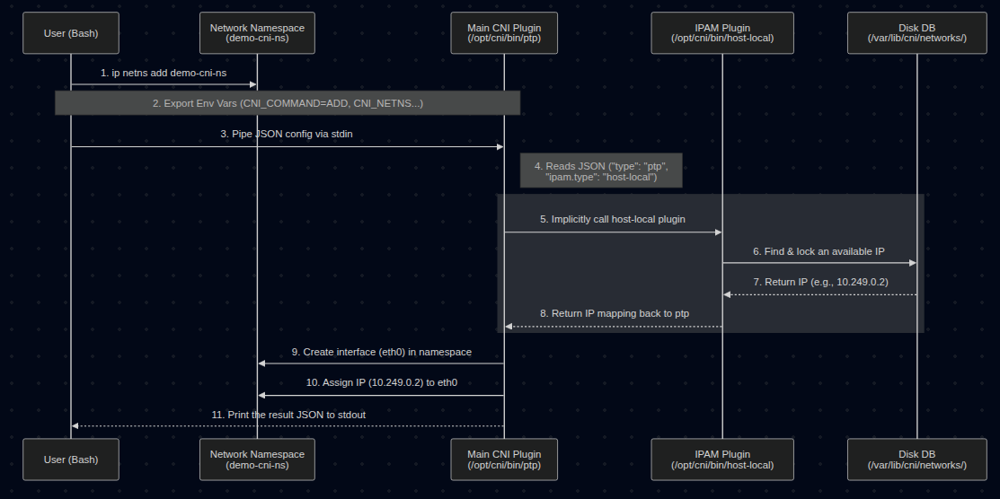
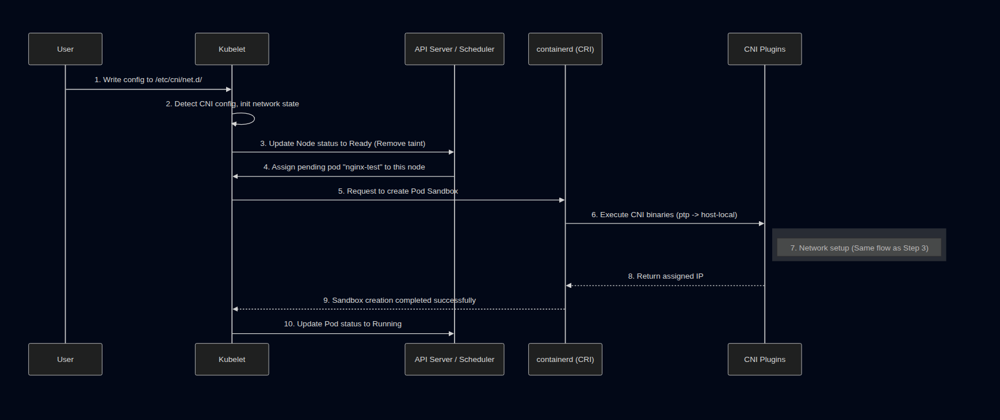

Title: [Container Networking Series - Part 3] Demystifying CNI: When Kubernetes "Borrows" Plugins to Build Its Network
Date: 2026-03-21
Category: Knowledge Base
Tags: networking, container, k8s

**Series: Container Networking Deep Dive**

- [Demystifying Docker Networking: A Deep Dive into Bridge & veth](https://blackmetalz.github.io/demystifying-docker-networking-a-deep-dive-into-bridge-veth.html)
- [Demystifying Docker Networking Egress: The Masquerade Magic](https://blackmetalz.github.io/demystifying-docker-networking-outbound-traffic-the-masquerade-magic.html)
- **Demystifying CNI: When Kubernetes "Borrows" Plugins to Build Its Network** *(You are here)*
- How Cilium CNI works in K8S *(In coming)*

In the previous two posts, we performed a deep dive into Docker's [Ingress Flow](https://blackmetalz.github.io/demystifying-docker-networking-a-deep-dive-into-bridge-veth.html) and [Egress Flow](https://blackmetalz.github.io/demystifying-docker-networking-outbound-traffic-the-masquerade-magic.html) by manually tinkering with `veth`, `iptables`, and `nsenter`.

But in Kubernetes (K8s), thousands of Pods are created and destroyed continuously. Kubelet can't afford the manual labor of typing those commands for every single Pod. It needs an "assistant" to do the heavy lifting. That assistant is the **CNI (Container Network Interface)**.

Today, we will learn about CNI by running it manually (by hand), without using any sophisticated CNI suites like Calico or Cilium.

---

## 1. Prerequisites (Setup)

To follow this lab on **Ubuntu 24.04**, you will need:

1. **Docker:** The foundational engine to run Kind.
2. **Kind v0.31.0 (Released Dec 18, 2025):** A tool to create K8s Nodes as Docker containers.
3. **Kubectl:** The CLI to control your cluster.
4. **jq:** A divine JSON processor for parsing PIDs.

**Detailed Installation:**

```bash
# Install Kind v0.31.0
curl -Lo ./kind https://github.com/kubernetes-sigs/kind/releases/download/v0.31.0/kind-linux-amd64
chmod +x ./kind
sudo mv ./kind /usr/local/bin/kind
kind version 
# Expected output: kind v0.31.0 go1.25.5 linux/amd64

# Install jq
sudo apt update && sudo apt install jq -y
```

---

## 2. Decoding the "Core" Concepts

### What exactly is CNI?

It's not a background service. CNI is actually just a **Specification** that defines how the Container Runtime (like containerd) calls **binaries** located in `/opt/cni/bin/`. The runtime feeds it JSON, the Binary executes the task and returns the result.

### IPAM (IP Address Management)

If the main CNI Plugin (like `bridge` or `ptp`) handles "plugging the wires," then **IPAM** handles the "ledgering" and decides *which* IP to use.

* It manages IP ranges (Subnets), tracking which IPs are assigned and which are free.
* **The Delegation:** The main CNI binary (like `ptp`) doesn't choose the IP itself. It reads the `"ipam"` section in the JSON config, sees `"type": "host-local"`, and implicitly executes the `host-local` binary (also located in `/opt/cni/bin/`).
* The IPAM plugin returns an available IP back to the main plugin, and the main plugin then applies that IP to the container's network interface.
* In this lab, `host-local` stores its IP database simply as text files on the Node's disk (in `/var/lib/cni/networks/`).

### crictl - When Docker is no longer "The Boss"

Modern K8s uses the **CRI (Container Runtime Interface - API between Kubelet and Container Runtime)** — usually `containerd`. `crictl` is the tool to interact with the CRI. We use it here because Kind runs K8s nodes using containerd inside Docker.

---

## 3. Lab: Running CNI by Hand (Manual Execution)

### Step 1: Spin up a "Naked" Cluster

Delete the old cluster (if any), since I have only 1 kind cluster for testing purpose. 
```bash
root@kienlt-lab-utilities:~# kind get clusters
kind
root@kienlt-lab-utilities:~# kind delete cluster --name kind
Deleting cluster "kind" ...
Deleted nodes: ["kind-control-plane"]
```

Create a `kind-config.yaml` file to block the default network:

```yaml
kind: Cluster
apiVersion: kind.x-k8s.io/v1alpha4
networking:
  disableDefaultCNI: true 

```

```bash
kind create cluster --config kind-config.yaml
```


Output:
```bash
root@kienlt-lab-utilities:~# kind create cluster --config kind-config.yaml
Creating cluster "kind" ...
 ✓ Ensuring node image (kindest/node:v1.35.0) 🖼
 ✓ Preparing nodes 📦
 ✓ Writing configuration 📜
 ✓ Starting control-plane 🕹️
 ✓ Installing StorageClass 💾
Set kubectl context to "kind-kind"
You can now use your cluster with:

kubectl cluster-info --context kind-kind

Have a nice day! 👋
root@kienlt-lab-utilities:~# kubectl get nodes
NAME                 STATUS     ROLES           AGE   VERSION
kind-control-plane   NotReady   control-plane   12s   v1.35.0
```

Check running containers:
```bash
root@kienlt-lab-utilities:~# docker ps
CONTAINER ID   IMAGE                  COMMAND                  CREATED         STATUS         PORTS                       NAMES
e174ac300eb9   kindest/node:v1.35.0   "/usr/local/bin/entr…"   4 minutes ago   Up 4 minutes   127.0.0.1:43013->6443/tcp   kind-control-plane
```

### Step 2: Create a Pod — Witness the Scheduler's "Helplessness"

Try to create a Pod **WITHOUT** any CNI config:

```bash
kubectl run nginx-test --image=nginx
```

Result: The Pod is **stuck** in `Pending`:
```bash
root@kienlt-lab-utilities:~# kubectl get pods
NAME         READY   STATUS    RESTARTS   AGE
nginx-test   0/1     Pending   0          12s
```

Run `kubectl describe` to see why:
```bash
root@kienlt-lab-utilities:~# kubectl describe pod nginx-test
...
Events:
  Type     Reason            Age   From               Message
  ----     ------            ----  ----               -------
  Warning  FailedScheduling  10s   default-scheduler  0/1 nodes are available: 
           1 node(s) had condition {Ready False}. preemption: ...

# Check node status
root@kienlt-lab-utilities:~# k get nodes
NAME                 STATUS     ROLES           AGE   VERSION
kind-control-plane   NotReady   control-plane   13s   v1.35.0
```

**Why?** No CNI config → The [Container Runtime is responsible for loading CNI plugins](https://kubernetes.io/docs/concepts/extend-kubernetes/compute-storage-net/network-plugins/#installation). In this setup, containerd finds no valid config in its CNI conf directory and reports `NetworkReady=false` via the CRI Status API → Kubelet polls this status and marks the Node as `NotReady` → The Node is tainted with `node.kubernetes.io/not-ready:NoSchedule` → The Scheduler cannot place the Pod on any Node → The Pod stays in `Pending` indefinitely.

### Step 3: Call the CNI Binary Manually — Exposing the Truth

Now, we will prove that CNI is just: **a binary + environment variables + JSON via stdin**. No magic involved. But let's me show you complete flows first (made with Mermaid)



Enter the Kind node:
```bash
docker exec -it kind-control-plane bash
```

Check available CNI binaries:
```bash
root@kind-control-plane:/# ls -l /opt/cni/bin
total 18804
-rwxr-xr-x 1 root root 4354987 Dec 15 23:24 host-local
-rwxr-xr-x 1 root root 4306167 Dec 15 23:24 loopback
-rwxr-xr-x 1 root root 5108415 Dec 15 23:24 portmap
-rwxr-xr-x 1 root root 5475215 Dec 15 23:24 ptp
```

Manually create a **network namespace** (simulating the namespace containerd would create for a Pod):
```bash
ip netns add demo-cni-ns
```

Set all required **Environment Variables** according to the [CNI Spec](https://www.cni.dev/docs/spec/#cni-operations):
```bash
export CNI_COMMAND=ADD
export CNI_CONTAINERID=demo-container-001
export CNI_NETNS=/var/run/netns/demo-cni-ns
export CNI_IFNAME=eth0
export CNI_PATH=/opt/cni/bin
```

Variable Breakdown:

| Variable | Meaning |
|---|---|
| `CNI_COMMAND=ADD` | Tells the plugin: "**Add** a network interface to this namespace" |
| `CNI_CONTAINERID` | Arbitrary ID to identify the container (used for IPAM tracking) |
| `CNI_NETNS` | Path to the network namespace to be configured |
| `CNI_IFNAME` | Name of the interface to be created inside the namespace |
| `CNI_PATH` | Directory containing CNI binaries (used to find auxiliary plugins like IPAM) |

We gonna use `ptp` for this demo, why? `ptp` easier than `bridge` because it doesn't need to create `bridge` device, suitable for demo.


Feed the JSON config into the `ptp` binary's stdin:
```bash
cat <<EOF | /opt/cni/bin/ptp
{
  "cniVersion": "0.4.0",
  "name": "demo",
  "type": "ptp",
  "ipam": {
    "type": "host-local",
    "subnet": "10.249.0.0/24"
  }
}
EOF
```

Wait, where the fuck `cniVersion` comes from? can I put 9.9.9?

Same energy as the question: But here you go: 

[https://github.com/containernetworking/cni/blob/main/SPEC.md#version](https://github.com/containernetworking/cni/blob/main/SPEC.md#version)

**Result:** The `ptp` binary returns JSON confirming a successful IP assignment:
```json
{
    "cniVersion": "0.4.0",
    "interfaces": [
        {
            "name": "vetha6b605d3",
            "mac": "8e:c0:6e:6a:da:c4"
        },
        {
            "name": "eth0",
            "mac": "da:4d:d4:6f:fb:84",
            "sandbox": "/var/run/netns/demo-cni-ns"
        }
    ],
    "ips": [
        {
            "version": "4",
            "interface": 1,
            "address": "10.249.0.2/24",
            "gateway": "10.249.0.1"
        }
    ],
    "dns": {}
}
```

Verify — the namespace now has a real IP:
```bash
root@kind-control-plane:/# ip netns exec demo-cni-ns ip addr show eth0
# Output
2: eth0@if3: <BROADCAST,MULTICAST,UP,LOWER_UP> mtu 1500 qdisc noqueue state UP group default qlen 1000
    link/ether da:4d:d4:6f:fb:84 brd ff:ff:ff:ff:ff:ff link-netnsid 0
    inet 10.249.0.2/24 brd 10.249.0.255 scope global eth0
       valid_lft forever preferred_lft forever
    inet6 fe80::d84d:d4ff:fe6f:fb84/64 scope link
       valid_lft forever preferred_lft forever
root@kind-control-plane:/# ip netns
demo-cni-ns
# Check what ip that have been assigned
root@kind-control-plane:/# ls /var/lib/cni/networks/demo/
10.249.0.2  last_reserved_ip.0	lock
```

**Boom!** With just a binary call + env vars + JSON stdin, we created a functional network interface with an IP for a namespace. This is **exactly** what the Container Runtime does behind the scenes whenever it creates a Pod Sandbox.

Clean up the demo namespace, so we will have to do this everytime when we create new namespace, that is why we are heading to step 4 for automation. But please clear old namespace first:
```bash
# Call DEL to release the assigned IP (returning it to IPAM)
# The assigned IP WAS 10.249.0.2
export CNI_COMMAND=DEL # We need to set DEL to release the IP
export CNI_CONTAINERID=demo-container-001    # must be same as ADD
export CNI_NETNS=/var/run/netns/demo-cni-ns
export CNI_IFNAME=eth0                   # interface name in netns
export CNI_PATH=/opt/cni/bin

cat <<EOF | /opt/cni/bin/ptp
{
  "cniVersion": "0.4.0",
  "name": "demo",
  "type": "ptp",
  "ipam": {
    "type": "host-local",
    "subnet": "10.249.0.0/24"
  }
}
EOF

# Manually delete!
root@kind-control-plane:/# ip netns del demo-cni-ns

# Validate after delete!
root@kind-control-plane:/# ls /var/lib/cni/networks/demo/
last_reserved_ip.0  lock
root@kind-control-plane:/# cat /var/lib/cni/networks/demo/last_reserved_ip.0
10.249.0.2
```

### Step 4: "Rescuing" the Pod — Letting CRI Execute CNI

Now, let's create a CNI config file so the Container Runtime (CRI) knows which plugin to load:

```bash
# Still inside the Kind node
mkdir -p /etc/cni/net.d/

cat <<EOF > /etc/cni/net.d/10-dummy.conf
{
  "cniVersion": "0.4.0",
  "name": "dummy",
  "type": "ptp",
  "ipam": {
    "type": "host-local",
    "subnet": "10.249.0.0/24"
  }
}
EOF
```

Back on your Host machine, wait a few seconds and check:
```bash
root@kienlt-lab-utilities:~# kubectl get pods
NAME         READY   STATUS    RESTARTS   AGE
nginx-test   0/1     Pending   0          118s
root@kienlt-lab-utilities:~# kubectl get pods
NAME         READY   STATUS              RESTARTS   AGE
nginx-test   0/1     ContainerCreating   0          2m1s
root@kienlt-lab-utilities:~# kubectl get pods
NAME         READY   STATUS    RESTARTS   AGE
nginx-test   1/1     Running   0          2m28s
root@kienlt-lab-utilities:~# k get pod -o wide
NAME         READY   STATUS    RESTARTS   AGE     IP           NODE                 NOMINATED NODE   READINESS GATES
nginx-test   1/1     Running   0          2m30s   10.249.0.4   kind-control-plane   <none>           <none>

```

Check how many IP it assigned inside control plane
```bash
root@kind-control-plane:/# ls /var/lib/cni/networks/dummy/
10.249.0.2  10.249.0.3	10.249.0.4  10.249.0.5	last_reserved_ip.0  lock
```

Ok, we see IP `10.249.0.4`. How about other IPs? Easy AF, get all pod and grep! (forget about `local-path-provisioner` xD)
```bash
root@kienlt-lab-utilities:~# k get pod -owide -A|grep 10.249
default              nginx-test                                   1/1     Running   0               2m35s   10.249.0.4   kind-control-plane   <none>           <none>
kube-system          coredns-7d764666f9-hdwlt                     0/1     Running   0               2m35s   10.249.0.2   kind-control-plane   <none>           <none>
kube-system          coredns-7d764666f9-p94hv                     0/1     Running   0               2m35s   10.249.0.5   kind-control-plane   <none>           <none>
local-path-storage   local-path-provisioner-67b8995b4b-qxhwt      0/1     Error     6 (2m10s ago)   2m35s   10.249.0.3   kind-control-plane   <none>           <none>
```

So, we know where the IP is assigned from!


**The Pod lives! Here is what just happened:**




1. The Container Runtime (containerd) successfully loads a valid CNI config and reports `NetworkReady` to Kubelet.
2. Kubelet updates the Node's status to **`Ready`** (removing the `NotReady` taint).
3. The Kubernetes **Scheduler** sees a `Ready` Node and finally schedules our pending `nginx-test` Pod to `kind-control-plane`.
4. Kubelet receives the assigned Pod and requests containerd to create the Pod Sandbox.
5. containerd calls `/opt/cni/bin/ptp` (exactly as we did in Step 3) → Network setup succeeds → Pod transitions to `Running`.

Verify using `crictl` + `nsenter`:
```bash
docker exec -it kind-control-plane bash

POD_ID=$(crictl pods --name nginx-test -q | head -n 1)
PID=$(crictl inspectp $POD_ID | jq '.info.pid')
echo "PID: $PID"

nsenter -t $PID -n ip addr show eth0
```

Output:
```bash
PID: 1516
2: eth0@if4: <BROADCAST,MULTICAST,UP,LOWER_UP> mtu 1500 qdisc noqueue state UP group default qlen 1000
    link/ether 0a:68:56:c0:9c:a3 brd ff:ff:ff:ff:ff:ff link-netnsid 0
    inet 10.249.0.4/24 brd 10.249.0.255 scope global eth0
       valid_lft forever preferred_lft forever
    inet6 fe80::868:56ff:fec0:9ca3/64 scope link
       valid_lft forever preferred_lft forever
```

The Container Runtime (containerd) did **exactly** what we did manually in Step 3: set env vars → piped JSON into the binary → received the IP.

---

## 4. Summary & The "Gotcha"

| Step | What happens |
|------|-------------------|
| No CNI config | CRI reports `NetworkReady=false`, Kubelet marks Node as NotReady, Scheduler cannot schedule, Pod is stuck in `Pending` |
| Manual CNI execution | Proves CNI = binary + env vars + JSON stdin |
| Create config file | The CRI (containerd) automates the process for every Pod upon Kubelet's request |

### The Truth about the Flow
- **CNI** isn't magic; it's a coordination between a **Binary** (execution) and **JSON** (declaration).
- **IPAM** (`host-local`) manages IP addresses — stored directly on disk at `/var/lib/cni/networks/` to prevent conflicts.
- **Kubelet vs Container Runtime:** It's important to note that **Kubelet does NOT call the CNI binary itself**. Kubelet tells the CRI (Container Runtime, like containerd) to create the Pod sandbox. It is the **CRI** that reads `/etc/cni/net.d/`, sets the environment variables, and executes the CNI binary.

### The Big Disclaimer
Does this setup mean our cluster network is fully functional? **Absolutely not!**

Look closely at the output from earlier: at that moment, `coredns` is `0/1 Running`, and `local-path-provisioner` is in `Error`.

By using the bare `ptp` plugin, we only proved that the CRI can call a CNI plugin and assign an IP to a Pod locally on this node. That does **not** prove the full Kubernetes networking stack is healthy.

As the output shows, `coredns` is stuck at `0/1 Running` — a strong signal that Service connectivity is likely incomplete, since CoreDNS depends on reaching the Kubernetes API via a ClusterIP Service. Meanwhile, `local-path-provisioner` being in `Error` simply confirms the cluster is not fully healthy. This minimal `ptp` setup lacks critical pieces — such as Service-to-Pod routing (normally handled by `kube-proxy`) and proper masquerading — that system components likely depend on. This setup does not prove that Service connectivity or the full cluster networking path is working end to end.

On top of that, if we had multiple nodes, **Pods on different nodes still cannot communicate with each other** because there is no cross-node routing or overlay network configured.

To get a fully functional K8s network where system components thrive and cross-node traffic succeeds, we need a more complete networking stack: a CNI implementation that satisfies the Kubernetes network model plus the components responsible for Service handling and cross-node traffic.

Understanding how CNI operates "by hand" will take the fear out of networking errors. In the next post, we'll see how a real-world CNI like **Cilium** levels up this game using **eBPF**.

**References:**

* [CNI Operations Spec](https://www.cni.dev/docs/spec/#cni-operations)
* [Kind Quick Start Guide](https://kind.sigs.k8s.io/docs/user/quick-start/)
* [Kubernetes Network Plugins](https://kubernetes.io/docs/concepts/extend-kubernetes/compute-storage-net/network-plugins/)
* [https://claude.ai/](https://claude.ai/)
* [chatgpt.com](chatgpt.com)
* [https://gemini.google.com/](https://gemini.google.com/)