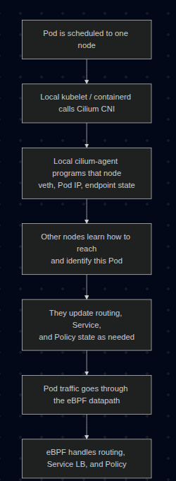

Title: [Container Networking Series - Part 4] How Cilium CNI works in K8S
Date: 2026-03-22
Category: Knowledge Base
Tags: networking, container, k8s, cilium

**Series: Container Networking Deep Dive**

- [Demystifying Docker Networking: A Deep Dive into Bridge & veth](https://blackmetalz.github.io/container-networking-series-part-1-demystifying-docker-networking-a-deep-dive-into-bridge-veth.html)
- [Demystifying Docker Networking Egress: The Masquerade Magic](https://blackmetalz.github.io/container-networking-series-part-2-demystifying-docker-networking-outbound-traffic-the-masquerade-magic.html)
- [Demystifying CNI: When Kubernetes "Borrows" Plugins to Build Its Network](https://blackmetalz.github.io/container-networking-series-part-3-demystifying-cni-when-kubernetes-borrows-plugins-to-build-its-network.html)
- **How Cilium CNI works in K8S** *(You are here)*

---

In [Part 3](https://blackmetalz.github.io/container-networking-series-part-3-demystifying-cni-when-kubernetes-borrows-plugins-to-build-its-network.html), we stripped the CNI flow down to bare metal: **a binary + env vars + JSON on stdin**. That contract does not change with Cilium. Kubelet still calls a CNI plugin. What changes is what the plugin and its agent do after that call.

If you want a easier Kubernetes networking refresher before going deeper, I also wrote another intro-level post [back in 01-2025](https://blackmetalz.github.io/sharing-what-ive-learned-about-kubernetes-networking-part-2.html). Even beginner level can read it pretty well (I'm bad at that time xD)

One correction before we start: "Cilium means iptables is gone" is too simplistic. The more accurate version is:

- Cilium can move **Service load-balancing, policy enforcement, and a large part of the datapath** into **eBPF**
- Cilium can also **replace kube-proxy**
- Depending on the feature set and host config, you may still see some iptables rules on the node

So the real win is not "iptables disappears completely". The real win is that the hot Kubernetes networking path no longer depends on kube-proxy building giant iptables chains for every Service.

---

## 1. Prerequisites (Setup)

To follow this lab on **Ubuntu 24.04**, you need those softwares installed:

1. **Docker** to run Kind
2. **Kind** to spin up a local multi-node cluster
3. **Kubectl** to control the cluster
4. **Cilium CLI** to install and validate Cilium
5. **A host that can run kube-proxy-free Cilium on Kind**

That last point matters. For Cilium's Socket LB and kube-proxy replacement on Kind, your host should have:

- **cgroup v2 enabled**
- Docker using **private cgroup namespaces**
- A reasonably recent Linux kernel

Quick checks with output from my lab:

```bash
root@kienlt-lab-utilities:~# docker info | grep -i cgroup
 Cgroup Driver: systemd
 Cgroup Version: 2
  cgroupns
root@kienlt-lab-utilities:~# stat -fc %T /sys/fs/cgroup
cgroup2fs
```

If those 2 checks are wrong, fix the host first. Otherwise the cluster may come up, but kube-proxy replacement can fail in confusing ways.

### Install Cilium CLI

```bash
CILIUM_CLI_VERSION=$(curl -s https://raw.githubusercontent.com/cilium/cilium-cli/main/stable.txt)
CLI_ARCH=amd64
if [ "$(uname -m)" = "aarch64" ] || [ "$(uname -m)" = "arm64" ]; then
  CLI_ARCH=arm64
fi

curl -L --fail --remote-name-all https://github.com/cilium/cilium-cli/releases/download/${CILIUM_CLI_VERSION}/cilium-linux-${CLI_ARCH}.tar.gz{,.sha256sum}

sha256sum --check cilium-linux-${CLI_ARCH}.tar.gz.sha256sum
sudo tar xzvfC cilium-linux-${CLI_ARCH}.tar.gz /usr/local/bin
rm cilium-linux-${CLI_ARCH}.tar.gz{,.sha256sum}

cilium version --client
```

Expected result: the CLI prints a client version successfully.
```bash
cilium-linux-amd64.tar.gz: OK
cilium
cilium-cli: v0.19.2 compiled with go1.25.5 on linux/amd64
cilium image (default): v1.19.1
cilium image (stable): v1.19.1
```

---

## 2. Decoding the Core Concepts

### Pod Networking Flow with Cilium



### What exactly is eBPF?

Think of eBPF as a way to run **small, verified programs inside the Linux kernel**. You do not rebuild the kernel. You do not reboot the machine. You load a program, the kernel verifies it, then attaches it to specific hooks in the networking path.

That means packets can be inspected, forwarded, dropped, NATed, or load-balanced **inside kernel space**, without punting every decision to userspace tools.

### What changes when the CNI is Cilium?

With a more traditional K8S setup, the flow often looks like this:

```text
Pod -> veth -> routing -> kube-proxy / iptables / IPVS -> destination
```

With Cilium, the flow becomes more like this:

```text
Pod -> veth -> Cilium eBPF datapath -> destination
```

More precisely, Cilium can use **TC(Traffic Control) hooks**, **socket-level load-balancing**, and in some cases **XDP(eXpress Data Path)**, depending on which feature is in play.

### Cilium can replace kube-proxy

In a standard cluster, `kube-proxy` watches Services and installs iptables or IP Virtual Server (IPVS) rules so `ClusterIP`, `NodePort`, and friends actually work.

In a kube-proxy-free Cilium cluster, Cilium does that job itself. It stores Service and backend mappings in **BPF maps**, so when traffic hits a Service IP, the translation happens in the eBPF datapath instead of an iptables chain.

That is why in this lab we explicitly disable kube-proxy and tell Cilium to take over.

Important: Cilium deploys an agent on every Kubernetes node as a DaemonSet. The CNI plugin is invoked during Pod setup, and the local cilium-agent maintains endpoint state and programs the eBPF datapath on that node.

### Cilium Identity

This is one of Cilium's killer ideas.

Instead of treating workloads as "just IP addresses", Cilium assigns them **security identities** derived from labels. Policies are then evaluated against identities, not just raw IPs.

That matters because Pod IPs are ephemeral. Labels are usually a better description of intent.

---

## 3. Lab: Seeing Cilium in Action

This walkthrough intentionally uses:

- **Kind** as the cluster runtime
- **No default CNI**
- **No kube-proxy**
- **Cilium as both CNI and Service datapath**

We will also pin the demo pods to **different worker nodes** so cross-node traffic is guaranteed instead of being left to scheduler luck.

### Step 1: Create a Kind cluster for Cilium

Create `kind-cilium-config.yaml`:

```yaml
kind: Cluster
apiVersion: kind.x-k8s.io/v1alpha4
networking:
  disableDefaultCNI: true
  kubeProxyMode: none
  podSubnet: "10.244.0.0/16"
  serviceSubnet: "10.96.0.0/12"
nodes:
  - role: control-plane
  - role: worker
  - role: worker
```

Recreate the cluster:

```bash
kind delete cluster --name kind 2>/dev/null
kind create cluster --config kind-cilium-config.yaml
```

Expected output:
```bash
kind create cluster --config kind-cilium-config.yaml
Creating cluster "kind" ...
 ✓ Ensuring node image (kindest/node:v1.35.0) 🖼
 ✓ Preparing nodes 📦 📦 📦  
 ✓ Writing configuration 📜 
 ✓ Starting control-plane 🕹️ 
 ✓ Installing StorageClass 💾 
 ✓ Joining worker nodes 🚜 
Set kubectl context to "kind-kind"
You can now use your cluster with:

kubectl cluster-info --context kind-kind

Have a nice day! 👋

```

Quick checks:

```bash
k get nodes
k -n kube-system get ds kube-proxy
```

Expected:

- Nodes are `NotReady` because there is no CNI yet
- `kube-proxy` is absent because we explicitly disabled it

Example:

```bash
root@kienlt-lab-utilities:~# k get nodes
NAME                 STATUS     ROLES           AGE   VERSION
kind-control-plane   NotReady   control-plane   32s   v1.35.0
kind-worker          NotReady   <none>          18s   v1.35.0
kind-worker2         NotReady   <none>          18s   v1.35.0
root@kienlt-lab-utilities:~# k -n kube-system get ds kube-proxy
Error from server (NotFound): daemonsets.apps "kube-proxy" not found
```

### Step 2: Install Cilium in kube-proxy-free mode

This is the most important step, so be explicit instead of relying on defaults.

First, get the control-plane container IP. In kube-proxy-free mode, Cilium needs a direct API server address from the start:

```bash
API_SERVER_IP=$(docker inspect -f '{{range.NetworkSettings.Networks}}{{.IPAddress}}{{end}}' kind-control-plane)
echo "$API_SERVER_IP"
```

Expected output:
```bash
root@kienlt-lab-utilities:~# API_SERVER_IP=$(docker inspect -f '{{range.NetworkSettings.Networks}}{{.IPAddress}}{{end}}' kind-control-plane)
echo "$API_SERVER_IP"
172.21.0.4
root@kienlt-lab-utilities:~# docker ps
CONTAINER ID   IMAGE                  COMMAND                  CREATED              STATUS              PORTS                       NAMES
c4f449135b8a   kindest/node:v1.35.0   "/usr/local/bin/entr…"   About a minute ago   Up About a minute                               kind-worker
8d1c2dc19bf7   kindest/node:v1.35.0   "/usr/local/bin/entr…"   About a minute ago   Up About a minute                               kind-worker2
b3b9d1736252   kindest/node:v1.35.0   "/usr/local/bin/entr…"   About a minute ago   Up About a minute   127.0.0.1:39803->6443/tcp   kind-control-plane
```

Now install Cilium, you will notice why cilium cli is able to interact without K8s cluster?
It used the same way as `kubectl` or `helm` interact with K8s cluster.

```bash
cilium install \
  --set kubeProxyReplacement=true \
  --set k8sServiceHost=${API_SERVER_IP} \
  --set k8sServicePort=6443 \
  --set ipam.mode=kubernetes
```

Expected output:
```bash
🔮 Auto-detected Kubernetes kind: kind
ℹ️  Using Cilium version 1.19.1
🔮 Auto-detected cluster name: kind-kind
ℹ️  Detecting real Kubernetes API server addr and port on Kind
🔮 Auto-detected kube-proxy has not been installed
ℹ️  Cilium will fully replace all functionalities of kube-proxy
```

Wait for it:

```bash
cilium status --wait
```

Expected output:
```bash
root@kienlt-lab-utilities:~# cilium status
    /¯¯\
 /¯¯\__/¯¯\    Cilium:             OK
 \__/¯¯\__/    Operator:           OK
 /¯¯\__/¯¯\    Envoy DaemonSet:    OK
 \__/¯¯\__/    Hubble Relay:       disabled
    \__/       ClusterMesh:        disabled

DaemonSet              cilium                   Desired: 3, Ready: 3/3, Available: 3/3
DaemonSet              cilium-envoy             Desired: 3, Ready: 3/3, Available: 3/3
Deployment             cilium-operator          Desired: 1, Ready: 1/1, Available: 1/1
Containers:            cilium                   Running: 3
                       cilium-envoy             Running: 3
                       cilium-operator          Running: 1
                       clustermesh-apiserver    
                       hubble-relay             
Cluster Pods:          3/3 managed by Cilium
Helm chart version:    1.19.1
Image versions         cilium             quay.io/cilium/cilium:v1.19.1@sha256:41f1f74a0000de8656f1de4088ea00c8f2d49d6edea579034c73c5fd5fe01792: 3
                       cilium-envoy       quay.io/cilium/cilium-envoy:v1.35.9-1770979049-232ed4a26881e4ab4f766f251f258ed424fff663@sha256:8188114a2768b5f49d6ce58e168b20d765e0fbc64eee0d83241aa2b150ccd788: 3
                       cilium-operator    quay.io/cilium/operator-generic:v1.19.1@sha256:e7278d763e448bf6c184b0682cf98cdca078d58a27e1b2f3c906792670aa211a: 1
```

Then verify the cluster is alive:

```bash
k get nodes
k -n kube-system get pods -o wide
```

Expected result:

- All nodes become `Ready`
- You see a Cilium agent pod on each node
- You see the Cilium operator running

```bash
root@kienlt-lab-utilities:~# k get nodes
NAME                 STATUS   ROLES           AGE     VERSION
kind-control-plane   Ready    control-plane   4m41s   v1.35.0
kind-worker          Ready    <none>          4m27s   v1.35.0
kind-worker2         Ready    <none>          4m27s   v1.35.0
root@kienlt-lab-utilities:~# k -n kube-system get pods -o wide
NAME                                         READY   STATUS    RESTARTS   AGE     IP             NODE                 NOMINATED NODE   READINESS GATES
cilium-24nnn                                 1/1     Running   0          2m14s   172.21.0.3     kind-worker          <none>           <none>
cilium-envoy-72wgk                           1/1     Running   0          2m14s   172.21.0.3     kind-worker          <none>           <none>
cilium-envoy-dd9c8                           1/1     Running   0          2m14s   172.21.0.4     kind-control-plane   <none>           <none>
cilium-envoy-m9jsq                           1/1     Running   0          2m14s   172.21.0.2     kind-worker2         <none>           <none>
cilium-k8lp8                                 1/1     Running   0          2m14s   172.21.0.4     kind-control-plane   <none>           <none>
cilium-operator-8d68cc6b5-78dnv              1/1     Running   0          2m14s   172.21.0.3     kind-worker          <none>           <none>
cilium-pxks9                                 1/1     Running   0          2m14s   172.21.0.2     kind-worker2         <none>           <none>
coredns-7d764666f9-l8rth                     1/1     Running   0          4m36s   10.244.0.96    kind-control-plane   <none>           <none>
coredns-7d764666f9-pmbvr                     1/1     Running   0          4m36s   10.244.0.108   kind-control-plane   <none>           <none>
etcd-kind-control-plane                      1/1     Running   0          4m44s   172.21.0.4     kind-control-plane   <none>           <none>
kube-apiserver-kind-control-plane            1/1     Running   0          4m43s   172.21.0.4     kind-control-plane   <none>           <none>
kube-controller-manager-kind-control-plane   1/1     Running   0          4m43s   172.21.0.4     kind-control-plane   <none>           <none>
kube-scheduler-kind-control-plane            1/1     Running   0          4m44s   172.21.0.4     kind-control-plane   <none>           <none>
```

### Step 2.1: Run a smoke test before going deeper
TLDR: **Don't run it unless you want to see a wall of text and time consuming. LOLL**

Command to create wall of text and time consuming:
```bash
cilium connectivity test
```

Expected output (holy fucking shit, wall of text and time consuming, so I only put some here):
```bash
root@kienlt-lab-utilities:~# cilium connectivity test
ℹ️  Monitor aggregation detected, will skip some flow validation steps
✨ [kind-kind] Creating namespace cilium-test-1 for connectivity check...
✨ [kind-kind] Deploying echo-same-node service...
✨ [kind-kind] Deploying DNS test server configmap...
✨ [kind-kind] Deploying same-node deployment...
..................................................................
[=] [cilium-test-1] Skipping test [no-policies-from-outside] [2/130] (skipped by condition)
[=] [cilium-test-1] Test [no-policies-extra] [3/130]
....................................................................
[=] [cilium-test-1] Skipping test [seq-from-cidr-host-netns] [36/130] (skipped by condition)
[=] [cilium-test-1] Test [echo-ingress-from-other-client-deny] [37/130]
....................................................................
[=] [cilium-test-1] Skipping test [client-egress-tls-sni-random-wildcard-denied] [80/130] (requires Cilium version >=1.20.0 but running 1.19.1)
[=] [cilium-test-1] Test [client-egress-tls-sni-double-wildcard] [81/130]
.........................
✅ [cilium-test-1] All 80 tests (695 actions) successful, 50 tests skipped, 0 scenarios skipped.
```

This is the cheapest failure detector in the whole lab but it is time consuming. It validates common paths like:

- pod-to-pod on the same node
- pod-to-pod across nodes
- pod-to-service
- DNS
- policy paths

If this fails, stop and fix the installation first. Do not continue to the tracing section while the base connectivity test is red.

---

## 4. Prove That Cilium Replaced kube-proxy

We want an explicit signal, not guesswork.

Pick any Cilium agent pod:

```bash
CILIUM_POD=$(kubectl -n kube-system get pods -l k8s-app=cilium -o jsonpath='{.items[0].metadata.name}')
echo "$CILIUM_POD"
```

Expected output:
```bash
root@kienlt-lab-utilities:~# CILIUM_POD=$(kubectl -n kube-system get pods -l k8s-app=cilium -o jsonpath='{.items[0].metadata.name}')
echo "$CILIUM_POD"
cilium-24nnn
```

Any agent pod is fine for cluster-wide views like `status`, `bpf lb list`, or `identity list`. Those views should be consistent across agents. The node-specific nuance shows up later when we trace packets.

Now inspect the agent status:

```bash
kubectl -n kube-system exec "$CILIUM_POD" -- cilium-dbg status | grep KubeProxyReplacement
```

Expected output:

```bash
root@kienlt-lab-utilities:~# kubectl -n kube-system exec "$CILIUM_POD" -- cilium-dbg status | grep KubeProxyReplacement
KubeProxyReplacement:    True   [eth0    172.21.0.3 fc00:f853:ccd:e793::3 fe80::3016:cff:fe09:cb71 (Direct Routing)]

```

That line is much stronger evidence than "iptables looks short today".

### A note about iptables

You can still inspect iptables if you want, but use it as a side observation, not as the primary proof:

```bash
docker exec kind-control-plane iptables -t nat -L -n
```

You may still see some rules depending on the environment. That does **not** invalidate the point. What matters is whether Kubernetes Service handling and policy enforcement are happening in the Cilium datapath.

---

## 5. Create Deterministic Cross-Node Workloads

Instead of `kubectl run` and hoping the scheduler spreads the pods out, pin them yourself for this lab.

Create `cilium-demo.yaml`:

```yaml
apiVersion: v1
kind: Pod
metadata:
  name: nginx-server
  labels:
    app: nginx-server
spec:
  nodeName: kind-worker
  containers:
    - name: nginx
      image: nginx:stable
      ports:
        - containerPort: 80
---
apiVersion: v1
kind: Pod
metadata:
  name: curl-client
  labels:
    app: curl-client
spec:
  nodeName: kind-worker2
  containers:
    - name: curl
      image: curlimages/curl
      command: ["sleep", "3600"]
---
apiVersion: v1
kind: Service
metadata:
  name: nginx-svc
spec:
  selector:
    app: nginx-server
  ports:
    - port: 80
      targetPort: 80
```

Apply it:

```bash
root@kienlt-lab-utilities:~# k apply -f cilium-demo.yaml 
pod/nginx-server created
pod/curl-client created
service/nginx-svc created
# Wait and check
kubectl get pods -o wide
kubectl get svc nginx-svc
```

Expected:
```bash
root@kienlt-lab-utilities:~# kubectl get pods -o wide
NAME           READY   STATUS    RESTARTS   AGE   IP             NODE           NOMINATED NODE   READINESS GATES
curl-client    1/1     Running   0          49s   10.244.1.65    kind-worker2   <none>           <none>
nginx-server   1/1     Running   0          49s   10.244.2.187   kind-worker    <none>           <none>
root@kienlt-lab-utilities:~# kubectl get svc nginx-svc
NAME        TYPE        CLUSTER-IP     EXTERNAL-IP   PORT(S)   AGE
nginx-svc   ClusterIP   10.108.51.80   <none>        80/TCP    57s
```

- `nginx-server` runs on `kind-worker`
- `curl-client` runs on `kind-worker2`
- `nginx-svc` gets a `ClusterIP`

---

## 6. Inspect the eBPF Service Map

Now that a real Service exists, inspect how Cilium programs it:

```bash
kubectl -n kube-system exec "$CILIUM_POD" -- cilium-dbg bpf lb list
```

You should see entries for:

- the Kubernetes API Service
- CoreDNS
- your `nginx-svc`

The exact output varies, but conceptually it will look like:

```text
SERVICE ADDRESS               BACKEND ADDRESS (REVNAT_ID) (SLOT)
0.0.0.0:4000/TCP (0)          0.0.0.0:0 (18) (0) [HostPort, non-routable]                   
10.100.124.85:0/ANY (0)       0.0.0.0:0 (0) (0) [ClusterIP, non-routable]                   
0.0.0.0:4000/TCP (1)          10.244.2.191:8080/TCP (18) (1)                                
10.108.51.80:80/TCP (0)       0.0.0.0:0 (20) (0) [ClusterIP, non-routable]                  

...
```

That is the interesting bit: Service frontends and backends are in BPF maps, which is how Cilium can do Service translation without kube-proxy.

---

## 7. Trace Cross-Node Traffic

We want to prove 2 things:

1. direct Pod IP traffic across nodes
2. Service traffic through the eBPF load-balancer

Find the Cilium agent on the destination node and, optionally, on the source node:

```bash
CILIUM_POD_ON_DEST=$(kubectl -n kube-system get pods -l k8s-app=cilium -o wide --no-headers | awk '$7=="kind-worker"{print $1}')
CILIUM_POD_ON_SRC=$(kubectl -n kube-system get pods -l k8s-app=cilium -o wide --no-headers | awk '$7=="kind-worker2"{print $1}')
echo "$CILIUM_POD_ON_DEST"
echo "$CILIUM_POD_ON_SRC"
```

Why 2 pods?

- Monitor on `kind-worker` to inspect ingress handling and policy enforcement at the destination (`nginx-server`)
- Monitor on `kind-worker2` if you also want to catch `ClusterIP -> Pod IP` translation, because Socket LB can translate the Service on the source node before the packet leaves it

If you only want one monitor, start with the destination-side one. If you want the full picture for the Service request, run both.

Open **Terminal 1** and start the destination-side monitor:

```bash
kubectl -n kube-system exec -it "$CILIUM_POD_ON_DEST" -- \
  cilium-dbg monitor --type trace --type drop --type policy-verdict
```

Optional: open **Terminal 1B** if you also want to watch the earlier source-side Service translation:

```bash
kubectl -n kube-system exec -it "$CILIUM_POD_ON_SRC" -- \
  cilium-dbg monitor --type trace --type drop --type policy-verdict
```

Open **Terminal 2**:

```bash
NGINX_IP=$(kubectl get pod nginx-server -o jsonpath='{.status.podIP}')
SVC_IP=$(kubectl get svc nginx-svc -o jsonpath='{.spec.clusterIP}')

kubectl exec curl-client -- curl -sS -o /dev/null -w "podIP:%{http_code}\n" http://$NGINX_IP
kubectl exec curl-client -- curl -sS -o /dev/null -w "svcIP:%{http_code}\n" http://$SVC_IP
```

Expected:

```bash
podIP:200
svcIP:200
```

What this proves:

- `podIP:200` shows **cross-node Pod routing** works
- `svcIP:200` shows **Service translation** works with kube-proxy removed

If you only run the destination-side monitor, you will mainly see the ingress path and policy verdicts near `nginx-server`. If you also run the source-side monitor, the `svcIP` request becomes more interesting because you can catch the earlier Service translation phase there.

Do not try to match the output 1:1 with some screenshot on the internet because monitor output changes across versions. The important thing is:

- traffic is visible in the Cilium datapath
- the request succeeds
- no kube-proxy exists in the cluster

That combination is the real proof.

---

## 8. IPAM in This Lab

This lab uses:

```text
ipam.mode=kubernetes
```

That means Cilium uses the **PodCIDRs assigned by Kubernetes on the `Node` objects**. I chose this mode because it keeps the mental model simple on Kind.

Check it:

```bash
kubectl get nodes -o custom-columns=NODE:.metadata.name,PODCIDR:.spec.podCIDR
```

Example:

```bash
NODE                 PODCIDR
kind-control-plane   10.244.0.0/24
kind-worker          10.244.1.0/24
kind-worker2         10.244.2.0/24
```

So the mental model for this lab is:

1. Kubernetes gives each node a PodCIDR
2. Cilium allocates Pod IPs from that per-node range
3. Cilium still enforces policy and does Service load-balancing in eBPF

### Wait, I thought Cilium uses `CiliumNode` CRDs for IPAM?

That is also true, but **not in this exact lab mode**.

On many generic Cilium installs, the default is **cluster-pool IPAM**, where Cilium Operator assigns per-node PodCIDRs and you inspect that through `CiliumNode` resources.

If you want to explore that mode in another lab, `kubectl get ciliumnodes -o yaml` is a great command. But for this Kind walkthrough, `ipam.mode=kubernetes` is the cleaner path.

---

## 9. Identity-Based Network Policy

Now let's use labels, not IPs, to block traffic.

First, inspect identities:

```bash
kubectl -n kube-system exec "$CILIUM_POD" -- cilium-dbg identity list
```

Expected output with filter
```bash
root@kienlt-lab-utilities:~# kubectl -n kube-system exec "$CILIUM_POD" -- cilium-dbg identity list|grep -E "app=nginx-server|app=curl-client"
750     k8s:app=nginx-server
31622   k8s:app=curl-client
```

You should find identities associated with labels similar to:

- `app=nginx-server`
- `app=curl-client`

Now create `deny-curl.yaml`:

```yaml
apiVersion: cilium.io/v2
kind: CiliumNetworkPolicy
metadata:
  name: deny-curl-to-nginx
spec:
  endpointSelector:
    matchLabels:
      app: nginx-server
  ingressDeny:
    - fromEndpoints:
        - matchLabels:
            app: curl-client
```

Apply it:

```bash
kubectl apply -f deny-curl.yaml
```

Important nuance: this policy does **not** put `nginx-server` into a full ingress default-deny posture. `ingressDeny` only adds an explicit deny for traffic from `app=curl-client` here. Because we did not add any `ingress` allow section, other sources remain allowed unless another policy restricts them.

Test again:

```bash
kubectl exec curl-client -- curl -sS --connect-timeout 5 --max-time 5 http://$NGINX_IP
echo $?
```

Expected output:
```bash
root@kienlt-lab-utilities:~# kubectl exec curl-client -- curl -sS --connect-timeout 5 --max-time 5 http://$NGINX_IP
echo $?
curl: (28) Connection timed out after 5001 milliseconds
command terminated with exit code 28
28
```

Expected result:

- the request fails
- the exit code is non-zero
- in the Cilium monitor, you should see `drop` or `policy-verdict` events

That is the cool part: the policy decision is attached to the workload identity, not some fragile Pod IP you have to keep chasing after reschedules.

Clean up:

```bash
kubectl delete -f deny-curl.yaml
kubectl delete -f cilium-demo.yaml
```

---

## 10. Summary

Not really a summary but here you go.

| Aspect | Traditional CNI + kube-proxy | Cilium in this lab |
|---|---|---|
| CNI contract | Binary + env vars + JSON | Binary + env vars + JSON |
| Datapath | Linux routing + iptables/IPVS heavy lifting | eBPF datapath |
| Service routing | kube-proxy | Cilium eBPF load-balancer |
| Network policy | Often iptables-based | Identity-aware eBPF policy |
| IPAM | Plugin-specific (`host-local`, etc.) | Kubernetes PodCIDR mode in this lab |
| Observability | `tcpdump`, iptables logs | `cilium-dbg monitor`, Hubble |

The important takeaway is this:

- **Cilium does not replace the CNI spec**
- **Cilium replaces what happens behind that spec**

Kubelet still says, "Hey CNI plugin, wire this Pod up." But once the Pod exists, Cilium can take over the interesting parts:

- Service translation
- policy enforcement
- cross-node datapath
- observability

And when kube-proxy is removed, Cilium is not just "another CNI plugin". It becomes the thing driving a large part of the cluster network data plane.

---

## 11. Cilium Certified Associate (CCA) Exam

In case you are interest with, you can go to this link (my blog also xD):

[Prepare for the Cilium Certified Associate (CCA) Exam](https://blackmetalz.github.io/prepare-for-the-cilium-certified-associate-cca-exam.html)

## 12. eBPF explain in Cilium context

To be honest, I still messed up with this, can not explain meaning I'm not fully understand.

So all I know is that Cilium uses eBPF to replace kube-proxy and policy enforcement. But it is not enough to explain how it works. So again, what the fuck is eBPF? 

eBPF = extended Berkeley Packet Filter (packet filter, remember this damn word!). It allows you write a small program (C is the most common language to write eBPF program, then compile to bytecode), load into kernel, kernel verify that fucking program (make sure no fucking infinite loop, no memory leak, and so on..) then attach it into 1 specific `hook point`

### Hook point
I will try to write down small part, if fully, it will be overload for me.

```
Packet into NIC --> XDP --> TC --> Socket-level hooks
```

- XDP: earliest hook point, before kernel create sk_buff (socket buffer). Cilium use for DDos mitigation, early drop
- TC: Traffic Control, hook point after XDP, after having sk_buff, Cilium attach eBPF program here for Policy enforcement (ingress/egress), Service DNAT (clusterIP --> podIP),routing decision.
- Socket-level hooks: Cilium use Socket LB for translate service IP before packet create --> avoid DNAT completely.

That is what I understand, but Linux network look like fun if I deep dive more. But that's it for now!

---

**References:**

- [Cilium Documentation](https://docs.cilium.io/)
- [Installation Using Kind](https://docs.cilium.io/en/stable/installation/kind/)
- [Kubernetes Without kube-proxy](https://docs.cilium.io/en/stable/network/kubernetes/kubeproxy-free/)
- [CRD-Backed by Cilium Cluster-Pool IPAM](https://docs.cilium.io/en/stable/network/kubernetes/ipam-cluster-pool.html)
- [Cluster Scope IPAM](https://docs.cilium.io/en/latest/network/concepts/ipam/cluster-pool/)
- [cilium install](https://docs.cilium.io/en/latest/cmdref/cilium_install.html)
- [cilium connectivity test](https://docs.cilium.io/en/latest/cmdref/cilium_connectivity_test/)
- [cilium-dbg monitor](https://docs.cilium.io/en/latest/cmdref/cilium-dbg_monitor.html)
- [cilium-dbg bpf lb list](https://docs.cilium.io/en/stable/cmdref/cilium-dbg_bpf_lb_list.html)
- [cilium-dbg identity list](https://docs.cilium.io/en/latest/cmdref/cilium-dbg_identity_list.html)
