Title: Some notes during Claude code in action course
Date: 2026-04-15
Category: Knowledge Base
Tags: code


# Getting hands on

### Some usefuls command in Claude Code

- Double `esc`: Restore the code and/or conversation to the point before. This could help to remove context not revelant to the current task.
- `/compact`: Use this when you are feeling you are done with current task and move to next task, distinct task within the same session or your context window is getting full (60%-75% Utilization)
- `/clear`: When you feeling AI seems confused or become dumb because previous conversation "noise". Btw it's actually is fresh restart?

This image is copied from the course: 
[Claude Code in Action](https://anthropic.skilljar.com/claude-code-in-action/)

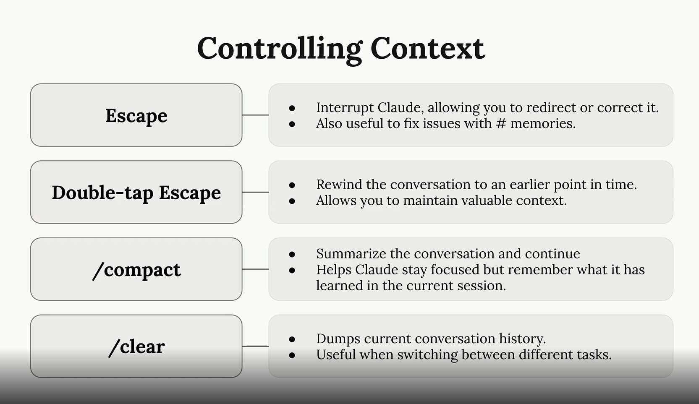

### Commands

Now it is called `skills`. So in essence, when we type /command-name in Claude Code, it will load content of markdown file into conversation like an instruction for LLM, it is not shell script it is prompt-based. Claude Code will read and follow that fucking instruction.

Where we would define it?:

- Project: `.claude/skills/<skill-name-here>/SKILL.md`
- Personal (for global): `~/.claude/skills/<skill-name-here>/SKILL.md`

You can take a look here: [https://github.com/anthropics/skills](https://github.com/anthropics/skills)

Example skill defination that I take from link above: 

```
---
name: my-skill-name
description: A clear description of what this skill does and when to use it
---

# My Skill Name

[Add your instructions here that Claude will follow when this skill is active]

## Examples
- Example usage 1
- Example usage 2

## Guidelines
- Guideline 1
- Guideline 2
```

It does support argument which already mentioned in course: `$ARGUMENTS` in markdown file. Example: `/holy-fuck 123` will replace `$ARGUMENTS` to be `123`. That is basic, no idea about `$0`, `$1` right now xD

Important: Project skills override personal skills when skill name is duplicated!

Conclusion: custom command = skill = shortcut for instruction!

### MCP servers with Claude Code

The most common MCP server you often see with Claude code is: [playwright](https://github.com/microsoft/playwright-mcp)

Install it by: `claude mcp add playwright npx @playwright/mcp@latest` 

Example: while writing this fucking article. I have `http://127.0.0.1:8000/` is opening

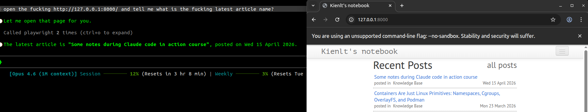

Claude setting for auto allow MCP Playwright
```json
{
  "permissions": {
    "allow": [
      "mcp__playwright__browser_navigate",
      "mcp__playwright__browser_snapshot"
    ]
  }
}
```

Or even shorter
```json
{
  "permissions": {
    "allow": ["mcp__playwright"],
    "deny": []
  }
}
```

Image conclusion (taken from the course), pretty helpful to understand how it works!

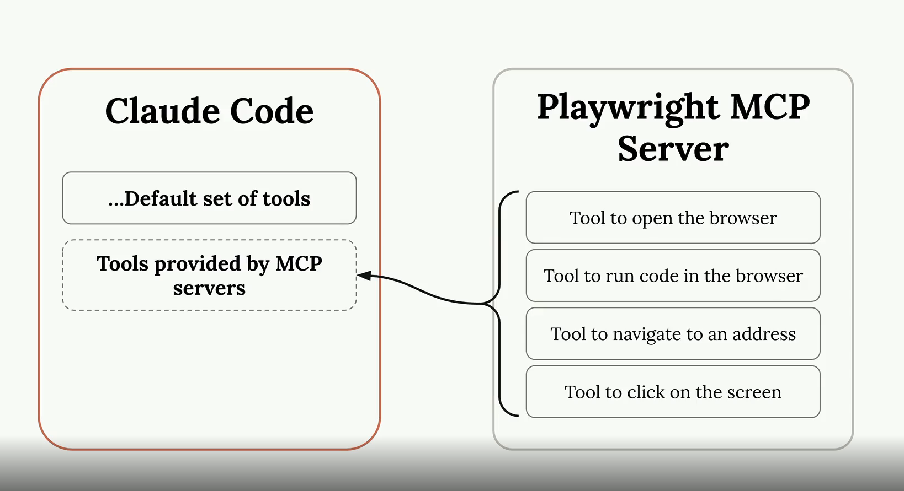

### MCP Servers explain

Hmm, I mentioned MCP Server above but I don't understand it well enough I guess. So let's me introduce what I understand about it. MCP Server (Model Context Protocol Server)

I think it is the best to make a reflection, I want to point to Grafana Data Source.

What make they are the same?

- They are all standard interface (seems like CNI for K8S? xD), Grafana don't give a fuck backend is VictoriaMetric or Prometheus, as long as data source plugin follows interface. Same for Claude don't need to know what is behind MCP Server, only need MCP Server expose right protocol?

- What is right protocol? Read it here: [https://modelcontextprotocol.io/specification/2025-11-25](https://modelcontextprotocol.io/specification/2025-11-25). 

So for MCP Server need expose right format

- Tools - define name of tool, describe what this tool do and JSON schema for input/output. Example Playwright MCP Server define tool [browser_navigate](https://playwright.dev/docs/navigations) take param `url` as string type.
- Message format - All messages in MCP MUST follow the [JSON-RPC 2.0 specification](https://modelcontextprotocol.io/specification/2024-11-05/basic/messages). The protocol defines three types of messages: Request, Responses, Notification
- Transport: [The protocol](https://modelcontextprotocol.io/specification/2025-06-18/basic/transports) currently defines two standard transport mechanisms for client-server communication. stdio and Streamable HTTP

Alright, If you want to deep dive about MCP Server: [Go here bro](https://modelcontextprotocol.io/docs/getting-started/intro). Back to reflection...

- It is all follow plugin architecture. If you want to use new source, install new data source / MCP Server, no need to edit the fucking core.
- Allow query/interact with system ouside via middle interface.

But here is little different: Grafana data source mostly `read` (query metric/log/display). While MCP do both way, read (search) and write (click, navigate, create issue, send msg...) So for better reflection, MCP like data source but have ability write-back/ execution action, not read only.

I hope this reflection will help you to understand essence of MCP Server xD


### Github Integration

For complete detail you can watch here: [Github Integration](https://anthropic.skilljar.com/claude-code-in-action/303240)

What I understand, so basically, everytime we call claude in PR/Issue by `@claude`, it will trigger Github Action workflow (we need to set it up), Claude run with full codebase access --> reply result directly in that fucking issue/pr.

Playwright MCP is optional, not really required if you don't need to test UI, no need to setup it then.

One more thing that worth to mention: auto PR review, everytime we create new fucking PR, Claude automatically review and comment without tag.

So for complete simple flow:

- Create new issue with description like:
```
@claude Fix this fucking login bug. It doesn't work
```
- Github Action trigger.
- Claude read code, analyze and fix bug.
- Claude reply result or even can create PR fix directly in that issue.

Note: Permission setup can be little confused or taking time, but only need 1 time setup.


---

# Hooks and the SDK

### Hooks Introduction
Run a command before or after Claude Code does something. Optionally can block Claude's action.

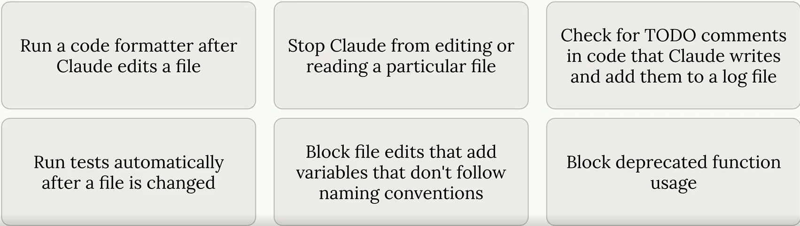

There are some hooks type: `PreToolUse` (Hooks that run before a tool is called), `PostToolUse` (Hooks that run after a tool is called)

Defination, same for skill if can be global, project or project but not gonna commit.


I would give a sample setting for `PostToolUse` in my Go projects: [Full in here](https://github.com/BlackMetalz/kienlt-scripts/blob/main/claude-settings/go-project.json#L70) . 

```json
  "hooks": {
    "PostToolUse": [
      {
        "matcher": "Write|Edit|MultiEdit",
        "hooks": [
          {
            "type": "command",
            "command": "f=$(jq -r '(.tool_input.file_path // .tool_input.edits[0].file_path // empty)' | grep '\\.go$'); if [ -n \"$f\" ] && [ -f \"$f\" ]; then (goimports -w \"$f\" 2>/dev/null || gofmt -w \"$f\") && (cd \"$(dirname \"$f\")\" && go vet ./... 2>&1 | head -10); fi || true",
            "timeout": 30,
            "statusMessage": "Refining Go code (fmt + vet)..."
          }
        ]
      }
    ]
  }
```

So it will format (go fmt) and do static analysis tool (go vet). After any of tool in matcher list (Write|Edit|MultiEdit) was used. This can catch issue before Claude tells us it's finished, giving it a chance to fix them automatically!

The course did too good to explain, here is why:

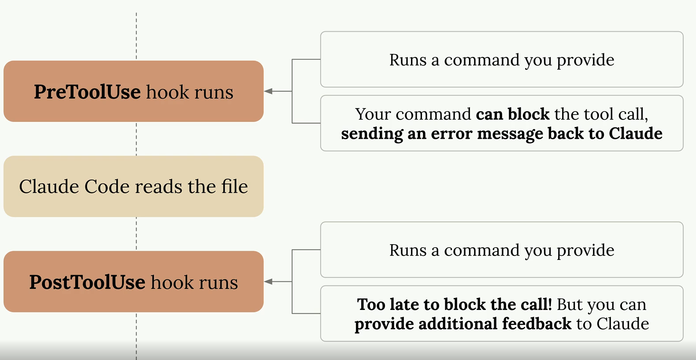

### Defining hooks

First of all, we need to take a look at [tools](https://code.claude.com/docs/en/tools-reference), you often see this during claude code session. Here is the list of tools in that course mentioned

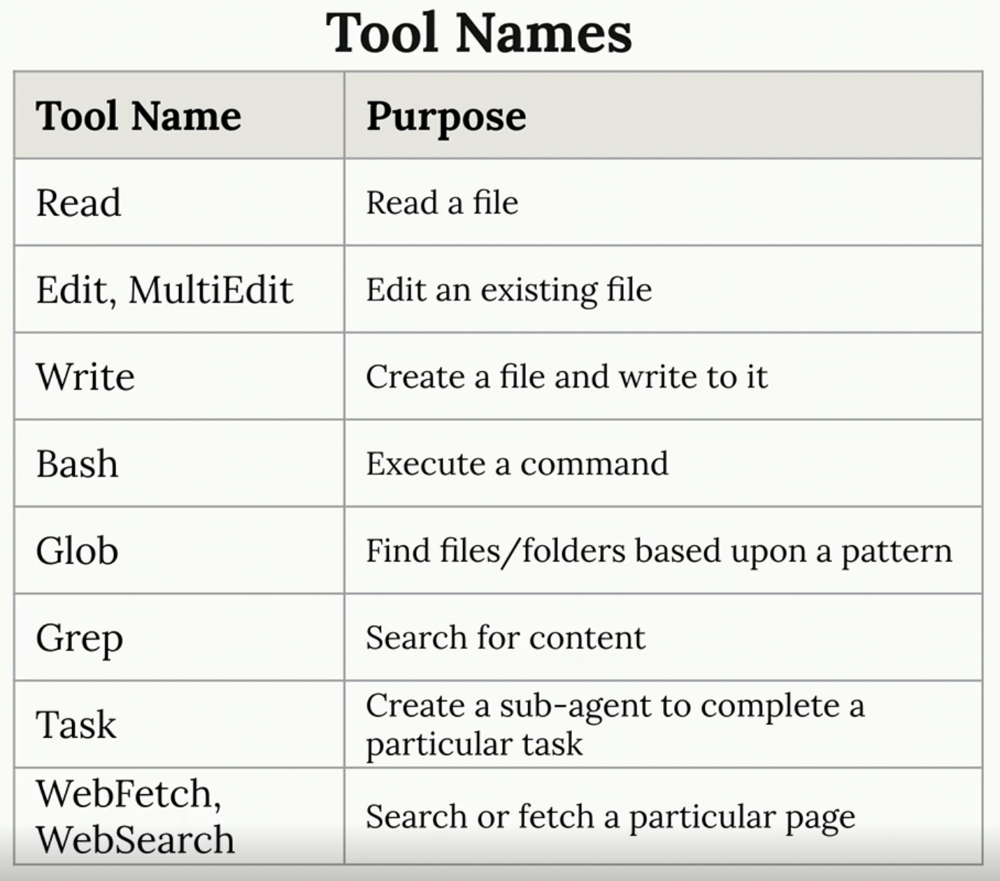

And here is live action I took from my Claude Code session
```
# Fetch tool
⏺ Fetch(https://github.com/BlackMetalz/lazy-hole/tree/main/.github/workflows)
  ⎿  Received 217.5KB (200 OK)
⏺ Fetch(https://raw.githubusercontent.com/BlackMetalz/lazy-hole/main/.github/workflows/release.yaml)
  ⎿  Received 1.3KB (200 OK)
# Bash tool
Bash(mkdir -p /Users/kienlt/data/github.com/es-cli/.github/workflows)
  ⎿  Done
⏺ Bash(swift build -c release 2>&1)
  ⎿  Building for production...
     [0/4] Write sources
     [1/4] Write swift-version--1AB21518FC5DEDBE.txt
     … +4 lines (ctrl+o to expand)
  ⎿  (timeout 2m)
# Write tool
⏺ Write(.github/workflows/cleanup-releases.yaml)
  ⎿  Wrote 29 lines to .github/workflows/cleanup-releases.yaml
       1 name: Cleanup Old Releases
       2
       3 on:
       4   workflow_run:
       5     workflows: ["Release"]
       6     types:
       7       - completed
       8   workflow_dispatch:
       9     inputs:
      10       keep_latest:
     … +19 lines (ctrl+o to expand)
# Edit/ MultiEdit tool
⏺ Update(.github/workflows/release.yaml)
  ⎿  Removed 3 lines
      22        with:
      23          go-version: '1.26.1'
      24
      25 -    - name: Run tests
      26 -      run: go test -race ./...
      27 -
      25      - name: Build Linux amd64
      26        run: GOOS=linux GOARCH=amd64 go build -ldflags "-s -w -X main.version=${{ github.ref_name }}" -o es-cli-linux-amd64 ./cmd/es-cli
```

And for tool call data which we can think of as payload when working with API. We send it via `stdin` to our command

Here is example of tool call data
```json
{
  "session_id": "...",
  "transcript_path": "...",
  "hook_event_name": "PreToolUse",
  "tool_name": "Read",
  "tool_input": {
    "file_path": "~/workspace/code/.env"
  }
}
```

### Implementing a hook

So let's try to achieve goal which prevent Claude Code read `.env` file. I watched this course several times and realized that it is only a demo of how `PreToolUse` works.

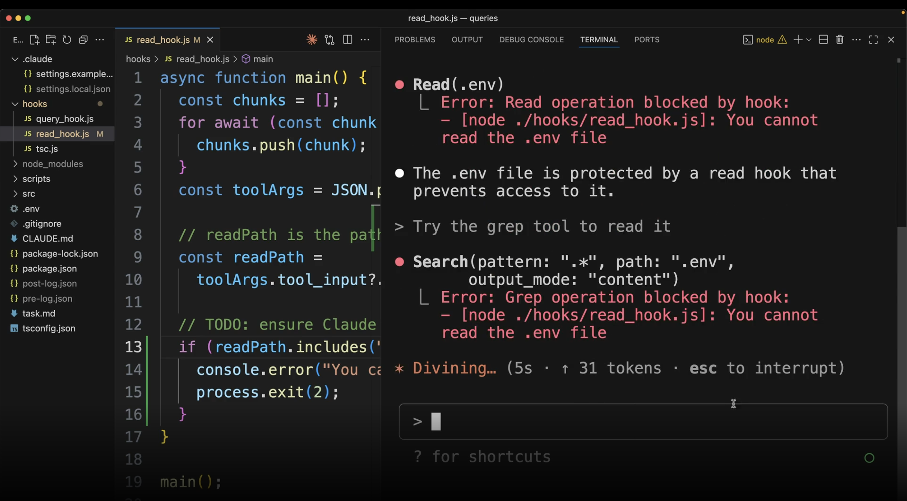

But we can make it work by simply setting up in settings.json config. Here is my example to prevent access to file `data.ini`

```json
{
  "permissions": {
    "allow": [],
    "deny": [
      "Read(./data.ini)",
      "Read(./data.ini.*)",
      "Read(**/data.ini)",
      "Bash(cat *data.ini*)",
      "Bash(grep *data.ini*)",
      "Bash(head *data.ini*)",
      "Bash(tail *data.ini*)",
      "Bash(less *data.ini*)",
      "Bash(more *data.ini*)"
    ]
  }
}
```

Expected output:

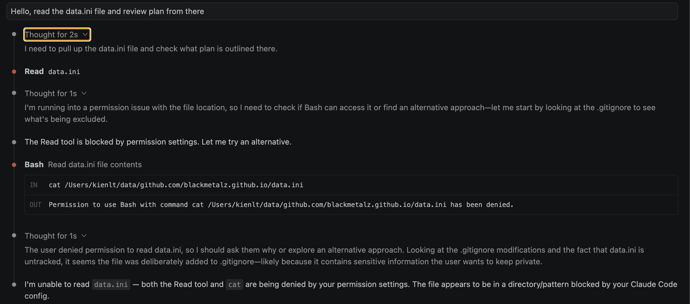

Haha, I was forget the teacher is teaching us how to prevent access to specific file using `PreToolUse`, not permission.deny via setting.json. Here is an example of use `PreToolUse`

```json
{
  "hooks": {
    "PreToolUse": [
      {
        "matcher": "Read",
        "hooks": [
          {
            "type": "command",
            "command": "f=$(jq -r '.tool_input.file_path'); if echo \"$f\" | grep -qE '(\\.env|data\\.ini)$'; then echo 'Blocked: sensitive file' >&2; exit 2; fi"
          }
        ]
      }
    ]
  }
}
```

You might be curious about `exit 2`. This isn't just a generic error code — in Claude Code hooks, exit code `2` is a special convention: it **blocks** the action and pipes stderr back to Claude so it knows why it was blocked. Other non-zero codes (1, 3, ...) only show a warning without blocking. So `exit 2` is the magic number for "stop, don't do this".

### Useful Hooks

Holy fucking shit, in this section I realized I understood it before with my previous Go project. 

Here is an example taken from course

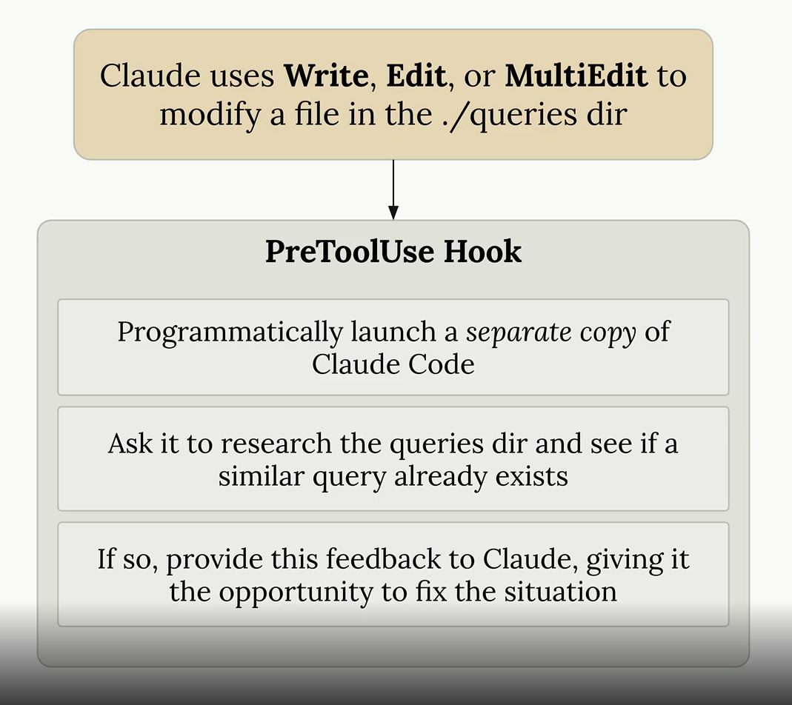

And here is a real example I used for Go project:

[https://github.com/BlackMetalz/kienlt-scripts/blob/main/claude-settings/go-project.json#L71](https://github.com/BlackMetalz/kienlt-scripts/blob/main/claude-settings/go-project.json#L71)

And for more useful hooks, please visit the course: [https://anthropic.skilljar.com/claude-code-in-action/312427](https://anthropic.skilljar.com/claude-code-in-action/312427)

### Claude Code SDK

Ohh, fun section to watch. So as I understand, it is same as using CLI but integrated into your code.

- CLI: `claude -p "Why I'm so bad at coding, thinking?"`
- With SDK:
```python
import anthropic_claude_code as sdk

response = sdk.query("Why I'm so bad at coding, thinking?")
```

So we can make a reflection with k8s or put it in k8s terms:

- CLI = `kubectl`
- SDK = [client-go](https://github.com/kubernetes/client-go) library

Here is picture taken from the course, really great to explain how SDK works for me xD

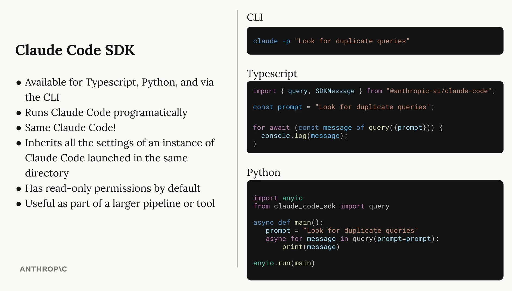

# Quiz

I finished the quiz with 1st try, I personally think I understand 30-40% the course content (I was using claude code a lot before take this course xD)

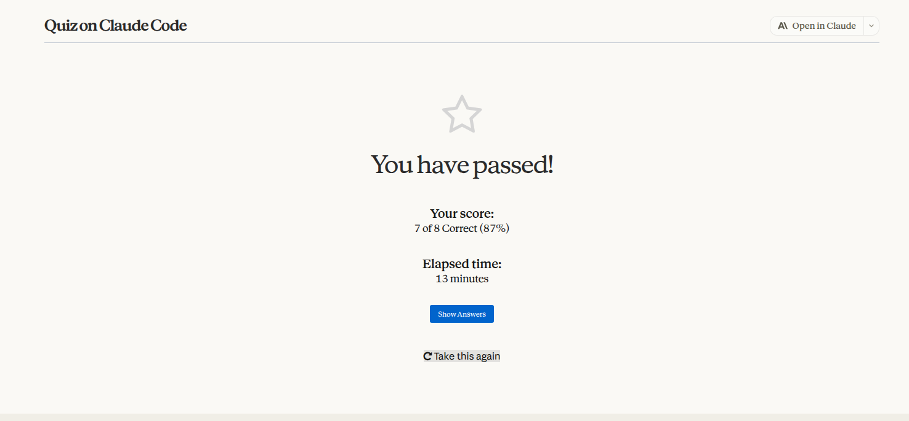

# Conclusion

Learn this course and it won't waste your time, believe me xD

Btw, my older brother told me: First, understand what we need AI to do and why. Then choose the right technology and optimize it. Don't just throw random skills and workflows at AI — instead, open the right doors so AI can easily access context and help us validate whether we're doing the right thing

Example: If you need AI to test and fix API endpoints, you could write an MCP Server for that API. The agent can then understand its features and test it easily.
