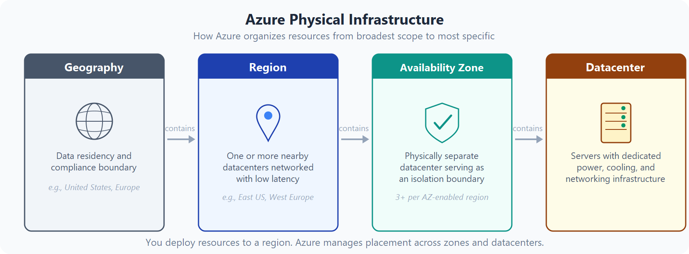
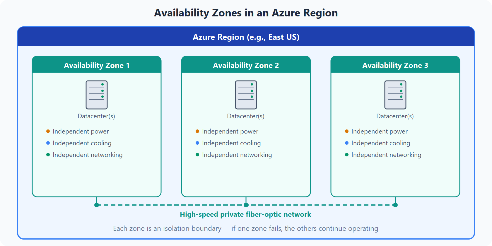
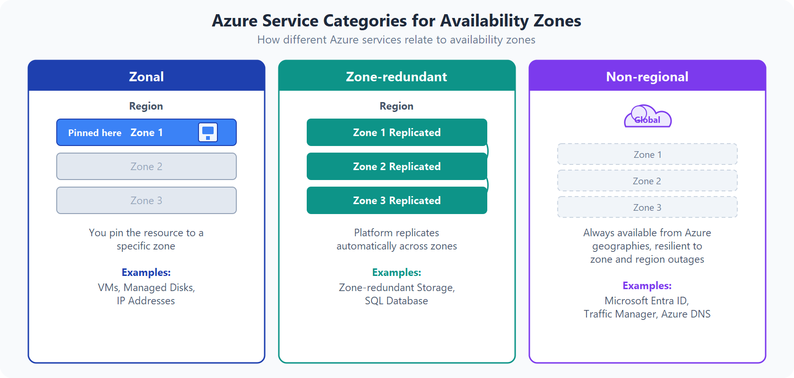
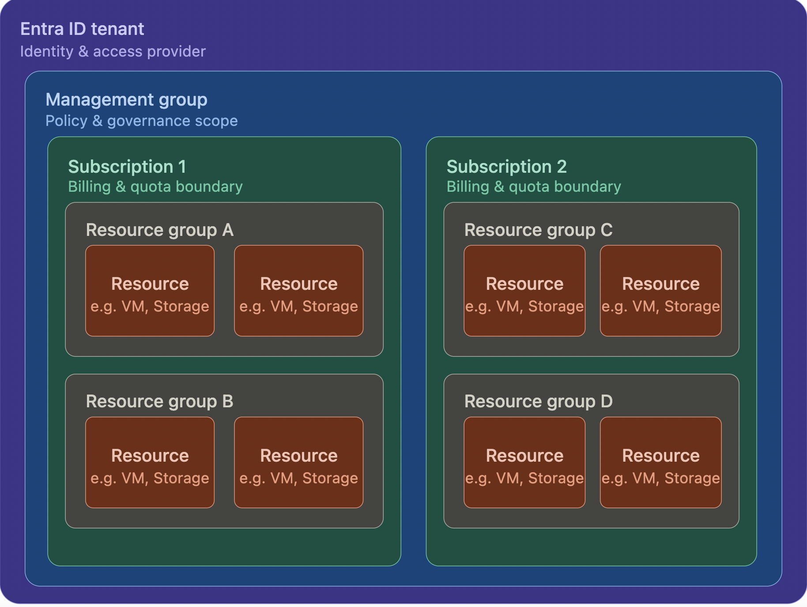
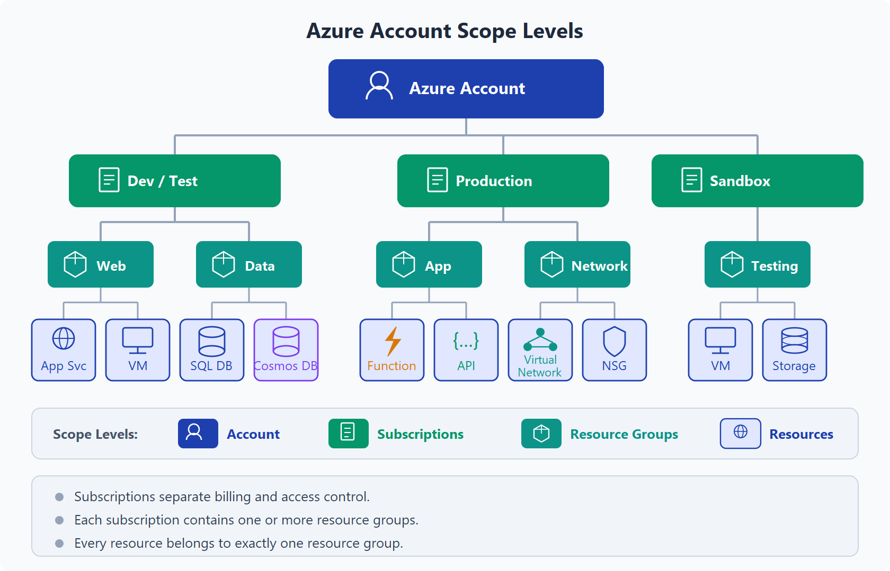
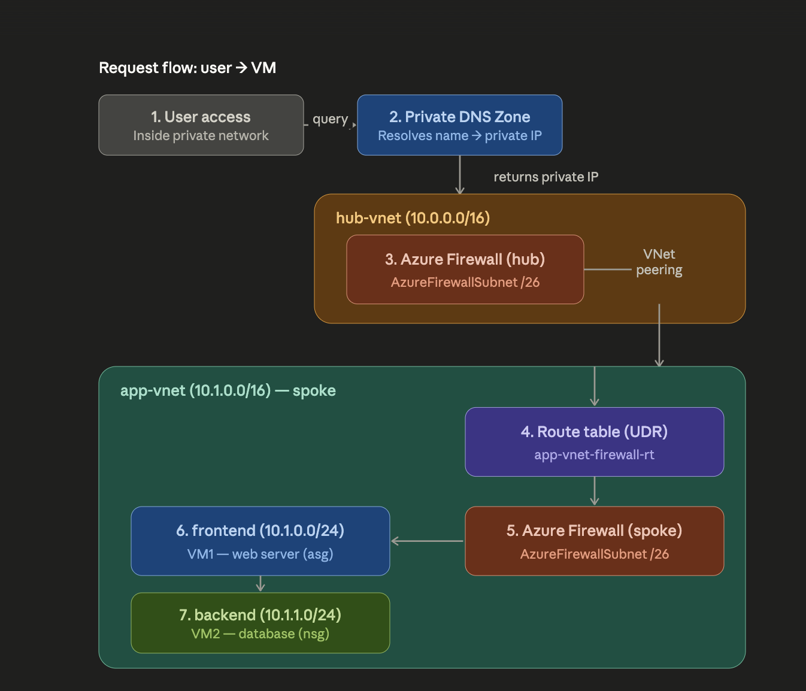

Title: [WIP] Prepare for the Microsoft Certified: Azure Administrator Associate (AZ-104)
Date: 2026-05-16
Category: Knowledge Base
Tags: azure, devops, exam


New challenge, acquire all DevOps certifications in 3 popular public cloud providers, Azure is the first target of mine. Let's fucking go!!!

I will try to refer to AWS as much as I can because AWS is the first cloud I learned.

This article could contain some wrong information since I'm new to this, correct me if I'm wrong, thanks xD

--- 

# Prepare for the exam

### Useful resources:

A lot of image I take from [https://learn.microsoft.com/](https://learn.microsoft.com/). I think next article better use link instead copy to this repo and include to article xD

Resource must/should watch (Yeah, it is a lot, I didn't watched them all, just write here for reference. Haaaaaaaaaa):

- [AZ-104 Microsoft Azure Administrator - Complete Exam Prep - Scott Duffy](https://udemy.com/course/70533-azure/)
- [AZ-104 Preparation Done Wrong | What Top Scorers Do Differently](https://www.youtube.com/watch?v=KD1cEc1-vOE)
- [Everything you need to know about the AZ-104 exam](https://www.youtube.com/watch?v=27WLcdQkqIg)
- [AZ-104 Administrator Associate Study Cram v2](https://www.youtube.com/watch?v=0Knf9nub4-k&list=PLlVtbbG169nH_CJl4wwKBfS1V8nMYr7xL&index=9)
- [AZ-104 Microsoft Azure Administrator Sample Exam Questions](https://tutorialsdojo.com/az-104-microsoft-azure-administrator-sample-exam-questions/)
- [AZ-104: Prerequisites for Azure administrators](https://learn.microsoft.com/en-us/training/paths/az-104-administrator-prerequisites/)
- [AZ-104 Must-Know Case Study Questions Scenarios You Can’t Skip for the Exam!](https://www.youtube.com/watch?v=EkJQXUGlLGU)
- [Vietnamese - Kinh nghiệm thi chứng chỉ AZ-104: Microsoft Azure Administrator](https://viblo.asia/p/kinh-nghiem-thi-chung-chi-az-104-microsoft-azure-administrator-5pPLkxgyVRZ)


### Some section need to be understand before taking the exam.

- Domain 1 — Identity & Governance (20–25%)
- Domain 2 — Compute (20–25%)
- Domain 3 — Storage (15–20%)
- Domain 4 — Networking (15–20%)
- Domain 5 — Monitor & Backup (10–15%)
- Exam Tip/Tricks
- Secure Weapons
- Taking the Exam!

Ok, let's take them one by one!

### Azure physical infrastructure



### Availability Zones



### Use availability zones for your workloads



---

# Domain 1 - Identity & Governance

### Hierarchy

We can simply understand it by following (Generated by Sonnet 4.6 xD):



### RBAC

It likes IAM Roles of AWS but can be assign in multiple levels:

```
Management Group  →  inherit all belows
  └── Subscription  →  inherit all Resource Groups belows
        └── Resource Group  →  inherit all resources belows
              └── Resource  →  only that resource
```

I like this fucking picture that explain everything!



Here are common built-in roles of Azure RBAC:

| Role | Permissions |
|------|-------|
| Owner | Full access + assign roles |
| Contributor | Full access, without assign roles |
| Reader | View only |
| User Access Administrator | Manage access only |


Resource reference: 

[https://learn.microsoft.com/en-us/azure/role-based-access-control/overview](https://learn.microsoft.com/en-us/azure/role-based-access-control/overview)

Inheritance: very very very important, **assigned 1 time in Management Group, all sub resource inherit.**

### Azure Policy vs IAM Policy

Totally different versus AWS IAM Policy. Azure Policy enforce rules on resources, not permissions.

| AWS | Azure |
|-----|-------|
| IAM Policy = who can do what | RBAC = who can do what |
| SCP = restrict permissions across accounts | Azure Policy = enforce rules on resources |


Example about Azure Policy:

- VM only created in Southeast Asia.
- Storage Account must enable encryption.
- All resources must have tag `Environment`

### Management Groups

Like AWS Organization, group Subscription for apply policies/RBAC

```
Root Management Group
  ├── Production
  │     ├── Subscription: prod-app1
  │     └── Subscription: prod-app2
  └── Development
        └── Subscription: dev-sandbox
```

Policy/RBAC assigned in Management Group, inherit to all subscription. Easy to understand, right?

Resource reference: 

[https://learn.microsoft.com/en-us/azure/governance/management-groups/overview](https://learn.microsoft.com/en-us/azure/governance/management-groups/overview)

### Little concept comparison

| Concept | AWS | Azure |
|---------|-----|-------|
| Identity provider | IAM | Entra ID (Azure AD) |
| Permissions | IAM Policies | RBAC Role Assignments |
| Resource rules | Service Control Policies | Azure Policies |
| Account grouping | Organizations and Organization Units | Management Groups |
| Billing boundary | Account | Subscription |
| Resource grouping | Tags only | Resource Groups + Tags |
| Delete protection | Termination protection (EC2) | Resource Locks (any resource) |

### Entra ID (Azure AD) vs AWS IAM

B2B: [Business to Business](https://learn.microsoft.com/en-us/entra/external-id/what-is-b2b)

B2C: [Business to Consumer](https://learn.microsoft.com/en-us/azure/active-directory-b2c/overview)

| Feature | AWS IAM | Entra ID |
|---------|---------|----------|
| Built-in MFA | IAM MFA | Azure MFA (enforce via Conditional Access) |
| SSO to apps | IAM Identity Center | Enterprise Apps |
| B2B access | Cross-account roles | Guest Users |
| B2C access | Cognito | Azure AD B2C |

### System-Assigned Managed Identity (SAMI) vs User-Assigned Managed Identity (UAMI)

Resource reference:

[https://learn.microsoft.com/en-us/entra/identity/managed-identities-azure-resources/overview](https://learn.microsoft.com/en-us/entra/identity/managed-identities-azure-resources/overview)

[https://learn.microsoft.com/en-us/entra/identity/managed-identities-azure-resources/managed-identity-best-practice-recommendations](https://learn.microsoft.com/en-us/entra/identity/managed-identities-azure-resources/managed-identity-best-practice-recommendations)

| | SAMI | UAMI |
|---|---|---|
| Lifecycle | attach with resource, when delete resource, SAMI will be delete also | Don't care, still stay after resource deletion xD |
| Reuse | 1 resource → 1 identity | 1 identity → multiple resources |
| When | Throwaway, 1-1 with VM/App Service | Reuse identity between multiple resources |

### Control Plane vs Data Plane

```
Subscription Owner
├── Control plane: create/delete/manage resource (Microsoft.Storage/*, Microsoft.KeyVault/*)
└── Data plane: No — must assign role explicitly
```

For example:

- Owner can create Storage Account
- Owner access blob (Binary Large Object) -> need role "Storage Blob Data Reader"
- Owner can create Key Vault
- Owner access secret -> need role "Key Vault Secrets User" 

Resource Reference:

- [Azure Control Plane and Data Plane](https://learn.microsoft.com/en-us/azure/azure-resource-manager/management/control-plane-and-data-plane)
- [RBAC for Storage](https://learn.microsoft.com/en-us/azure/storage/blobs/assign-azure-role-data-access?tabs=portal)
- [RBAC for Key Vault](https://learn.microsoft.com/en-us/azure/key-vault/general/rbac-guide?tabs=azure-cli)

### Managed Identity + Key Vault

Pattern:

```
App Service → [SAMI] → Key Vault Reference → Secret
```

Setup step:

- Enable SAMI in App Service
- Assign role Key Vault Secrets User for managed identity in Key Vault
- App setting uses `@Microsoft.KeyVault(SecretUri=...)`

No need to store credentials anywhere, managed identity auto get token from Azure AD

**K8s analogy:** This pattern is identical to **Workload Identity** (AKS/GKE) or **IRSA** (EKS — IAM Roles for Service Accounts):

```
K8s:    Pod → [ServiceAccount] → IAM Role / Managed Identity → AWS/Azure resource
Azure:  App Service → [SAMI] → RBAC role → Key Vault secret
```

Same idea: workload is bound to an identity, the identity is granted permissions, and the runtime auto-exchanges tokens (via OIDC / IMDS endpoint). Code only calls the SDK — no secrets or keys needed anywhere. When Pod/App restarts, the identity persists — no manual credential rotation.

It also applies to in-cluster K8s RBAC: a Pod runs as a ServiceAccount, that SA is bound via Role/RoleBinding (or ClusterRole/ClusterRoleBinding), and calls to the K8s API server (default endpoint **https://kubernetes.default.svc** inside the Pod) are authenticated using the projected token at **/var/run/secrets/kubernetes.io/serviceaccount/token**. Same identity-binds-to-workload pattern, just scoped to the cluster instead of cloud resources.

Resource Reference:

- [Use Key Vault references for App Service and Azure Functions](https://learn.microsoft.com/en-us/azure/app-service/app-service-key-vault-references?tabs=azure-cli)
- [How to use managed identities for App Service and Azure Functions](https://learn.microsoft.com/en-us/azure/app-service/overview-managed-identity?tabs=portal%2Chttp)
- [Azure AD Workload Identity for AKS](https://learn.microsoft.com/en-us/azure/aks/workload-identity-overview)


### Conclusion and Gotchas

- RBAC = IAM Roles. 
- Azure Policy = Service Control Policies (but have more flexibility)
- SAMI is often prefer because it will not make `orphaned identities` xD
- Subscription owner can not read KV secret by default. Owner only have control plane permissions — need to self-grant data plane role (e.g. `Key Vault Secrets User`) if access is needed, applies regardless of permission model, but RBAC is recommended!
- Key Vault Contributor = manage vault configuration (control plane), NOT read secret
- Key Vault Administrator = full data plane access (read/write/delete secrets, keys, certs)
- For vault access model best practice: pick RBAC!
- Microsoft Identity Manager (MIM) = bridging/sync identity store on-premises (like AD FS) with Microsft Entra ID

Resource Reference:

- [Built-in roles for Key Vault data plane operations](https://learn.microsoft.com/en-us/azure/key-vault/general/rbac-guide?tabs=azure-cli#azure-built-in-roles-for-key-vault-data-plane-operations)


### Enhanced after fail first exam

- User type can be: Member or Guest. Dynamic membership is a rule if user have some specific attribute that matched with dynamic membership, they will automatically added to that group, that is why it called Dynamic Group I guess! Group with membership assigned is common group that Admin user select member manually.
- Administratives users can work which some parts of your organization. Administrative units allow you to segregate your directory such that certain administrators only have permissions to work on certain areas. 
- Devices in Azure AD represent and manage physical devices used by users that access organization's resources. You can allow/block devices of specific users.
- Bulk Operations: Allow you create a lot of users from csv file.
- External Users: Can be understand as Guest User (Need to invite from user creation page) who's granted access to your organization's resources (Partners, vendors, contractors... who you need to collabrate with) and you don't want them to have an account in your Azure AD.
- Self service password reset: Allow member/group able to reset their pasword, default only Administrator have that feature.
- RBAC: not thing much new, default comes with over 90++ built-in roles. 
- We can swap Storage Account from using Access Key to RBAC as well. And we can grant role/permission on various levels from the specific container, storage account, resource group.
- And yeah we can have a custom role, for example Sysadmin Group can be access to Storage,VM,Network. We create that role for example and only need assign Sysadmin user to that group for simple management. Custom role required Azure Entra ID license P1/P2 in order to get access to custom roles.
- Custom role defined with AssignableScopes, specify range(Management group, subscription or resource group) that role can be assigned.
- Interpret Access Assignments: additive union permissions of assigned role. Because RBAC have no fucking deny iin role, so Contributor role will eat custom role that have some permission like in Contributor role
- Azure Account/User: a person(username, password, multi-factor) or a program (managed identity), basis for authentication.
- Tenant: represent of an org, usually with public domain name. Will be assigned a domain if not specified (example.onmicrosoft.com). It is a fucking dedicated instance of Azure Actice Directory, every Azure Account is part of at least one tenant! More than one account can be the owner in a tenant!
- Subscription: An agreement with Microsoft to use Azure services and how you are fucking to pay for that. All Azure resource usage gets billedd to the payment method of subscription (Free, PAYG, Enterprise agreements...). Not every tenant needs to have a subscription. Tenants can have more than one subscription. 
- Resources: Nothing much to say about this... Account can be given read,update, owner rights to resources.
- Resource Groups: a way to organizing resources in a subscription. A Folder struct, all resources must belong to only one resource group.
- Subscription have option for Resource locks, that prevent you from delete any resource in subscription scope or resource scope or even more, for example specific Function App. It means no one would able to delete if the lock still exists! (Or control people have permission that able to delete). Lock type Read only, you are not able to change setting. So 2 types, remember this.
- We can restrict location access for specific resource or deny unencrypted HTTPS storage accounts as example of Policy. Policy definition is single policy, but Initiative is set of policies.
- Custom policy, you want may want to copy syntax from template first before create custom policy, because they are all ARM templates. And after create custom policy, assign to specific scope like resource group.
- Tags: Is one of important thing to manage resource on any public cloud provider, not only Azure.
- Move Resources: It can be move to another resource group/subscription/region. 
- Manage policy by Powershell, mostly you can do everything like manage resource/policy in Portal via Powershell or CLI.
- Subscription and Management Group: We can create new subsciption and put it under a management group
---

# Domain 2 - Compute

### Virtual Machine (VM) Availability

| | Availability Set | Availability Zones | VM Scale Sets (VMSS) |
|---|---|---|---|
| Protection | Hardware/rack failure | Datacenter failure | Scale + HA |
| SLA | 99.95% | 99.99% | depend config |
| Use case | Legacy app, lift-and-shift | Production critical | Web tier, stateless |
| Region support | All region | Only region with zones | All region |


What is [update domains](https://learn.microsoft.com/en-us/training/modules/configure-virtual-machine-availability/4-review-update-fault-domains): An update domain is a group of nodes that are upgraded together during the process of a service upgrade (or roll out). An update domain allows Azure to perform incremental or rolling upgrades across a deployment. 

What is [fault domains](https://learn.microsoft.com/en-us/training/modules/configure-virtual-machine-availability/4-review-update-fault-domains): A fault domain is a group of nodes that represent a physical unit of failure. Think of a fault domain as nodes that belong to the same physical rack. Yes, it is acting as rack!


Exam Gotchas

- SLA 99.99% -> must pick Zones, not Set
- Can not combine Availability Set and Availability Zones
- Availability Set: **Fault Domain (FD):** different physical rack (power, switch) — default 2, max 3 (some regions support 3)
- Availability Set: **Update Domain (UD):** group VM not going to restart together when Azure patch — max 20

Resource Reference:

- [Availability options for Azure Virtual Machines](https://learn.microsoft.com/en-us/azure/virtual-machines/availability)
- [SLA for Online Services](https://www.microsoft.com/licensing/docs/view/Service-Level-Agreements-SLA-for-Online-Services)

### VM Encryption

| Type | What | When |
|------|-------|--------------|
| **SSE** (Server-Side Encryption) | Azure auto encrypt in storage layer | Default|
| **ADE** (Azure Disk Encryption) | Encrypt OS + Data disks at OS level (BitLocker/DM-Crypt), key in Key Vault | Compliance required OS-level encryption |

**Verdict:** SSE almost ready for everything. ADE only when compliance is required.

Resource Reference:

- [Overview of managed disk encryption options](https://learn.microsoft.com/en-us/azure/virtual-machines/disk-encryption-overview)
- [Server-side encryption of Azure Disk Storage](https://learn.microsoft.com/en-us/azure/virtual-machines/disk-encryption)
- [Azure Disk Encryption for VMs and VMSS](https://learn.microsoft.com/en-us/azure/security/fundamentals/azure-disk-encryption-vms-vmss)

> **Note:** ADE is scheduled for retirement on **September 15, 2028**. Microsoft recommends migrating to **encryption at host** for new VMs.

### Deployment slot

Azure App Service deployment slots are live, distinct environments for your web apps. They allow you to test changes, warm up instances, and achieve zero-downtime deployments. By managing configurations independently, you can deploy updates to a staging slot, verify them, and instantly swap them into production. (from AI Overview when google search xD).

Reference: It is same like AWS Beanstalk

- Staging/Production Slot = AWS - Elastic Beanstalk Environments / AWS - Lambda Versions
- Swap Slots = AWS Swap Environment URLs
- Traffic % (Routing) = Weighted Aliases (Lambda) or Weighted Routing (Route 53 / ALB)

Some note for exam:

- Deployment slot is not available in Free/Basic plan. If question related to staging environment, pick Standard.
- After slot swap, both slot still running, for rolling back, just simple by swap back.
- App Service Plan = compute resource.

Resource Reference:

- [Set up staging environments in Azure App Service](https://learn.microsoft.com/en-us/azure/app-service/deploy-staging-slots)

### ARM (Azure Resource Manager) and Bicep

- ARM Template = Cloudformation Template of AWS
- Bicep still is ARM but better syntax (Azure only)
- Still prefer to use Terraform instead of this fucking shit when it comes to production!
- From Bicep to ARM (build/compile): 
```bash
az bicep build --file main.bicep
# Output: main.json (ARM template)
# Directly
bicep build main.bicep
bicep decompile main.json
```
- From ARM to Bicep (decompile):
```bash
az bicep decompile --file main.json
# Output: main.bicep
```

### Containers

Comparison between 3 services

| Service | What | When |
|---------|-------|--------------|
| **ACI** (Azure Container Instances) | Run 1 container fast, no fucking cluster | Dev/test, batch jobs, CI/CD runners |
| **Container Apps** | Serverless containers with scaling (KEDA inside), ingress | Production apps, microservices |
| **AKS** | Managed Kubernetes | You know when.... |

Resource Reference:

- [What is Azure Container Instances?](https://learn.microsoft.com/en-us/azure/container-instances/container-instances-overview)
- [What is Azure Container Apps?](https://learn.microsoft.com/en-us/azure/container-apps/overview)

Gotchas: Remember this fucking shit!

- strong / complete / security isolation / security boundaries = Virtual Machine
- light weight / fast / microservices = Containers

--- 

# Domain 3 - Storage

### Azure Storage Account vs AWS S3 — Mental Model

```
AWS                              Azure
───────────────────────────────────────────────────
(No Need!)                   →   Storage Account (wrap layer)
S3 Bucket                    →   Blob Container
S3 Object                    →   Blob
S3 Bucket Policy             →   Container Access Policy / RBAC
S3 Lifecycle Rules           →   Lifecycle Management
S3 Versioning                →   Blob Versioning
S3 Storage Classes           →   Access Tiers (Hot/Cool/Archive)
S3 Presigned URL             →   SAS Token
S3 Static Website            →   Static Website (in Blob)
───────────────────────────────────────────────────
EFS                          →   Azure Files
SQS                          →   Queue Storage
DynamoDB (simple use)        →   Table Storage
```

Key Differences:

| AWS | Azure |
|-----|-------|
| Create S3 bucket directly | Need to init Storage Account first, then create container |
| Each bucket have it owns settings| Storage Account contains setting for all services inside |
| Bucket name globally unique | Storage Account name globally unique, Blob container only need unique in internal Storage Account |
| Bucket policy per bucket | RBAC can be set at account or container level |

Example:

```
AWS:
  - s3://my-images-bucket        (Create)
  - s3://my-backup-bucket        (Create)  
  - EFS: my-team-share           (Other service)

Azure:
  - mystorageaccount
      ├── container: images      (Like S3 bucket)
      ├── container: backups     (Like S3 bucket)
      └── fileshare: team-share  (Like EFS)
```

### Immutable vs Mutable Settings

Can not change after created:

- Storage Account name
- Location/Region
- Performance tier (Standard <---> Premium)
- Hierarchical namespace (For exam, but in fact we have migration tool)

Can be change after created:

- Redundancy (LRS/ZRS/GRS) - but limit
- Access tier (Hot/Cool)
- Network/Firewall rules
- Data protection (soft delete, versioning)
- Encryption settings

We need to pick Name, Region, Performance tier right for the first damn time!

### Replication Types

In single region:

| Type | What | When |
|------|--------|-----------------|
| **LRS** (Locally Redundant) | 3 copies, 1 datacenter | Hardware failure |
| **ZRS** (Zone Redundant) | 3 copies, 3 zones | Datacenter / zone failure |


Cross-region:

| Type | What | When | Read from secondary? |
|------|--------|-----------------|---------------------|
| **GRS** (Geo-Redundant) | 6 copies (3+3), 2 regions | Region failure | No, Never able to read from secondary, must failover first, after failover, secondary become new primary |
| **RA-GRS** (Read-Access GRS) | 6 copies, 2 regions | Region failure | **Yes** (always) |
| **GZRS** | ZRS primary + LRS secondary | Zone + region failure | No |
| **RA-GZRS** | ZRS primary + LRS secondary | Zone + region failure | **Yes** |

Pick replication by keyword:

| When | What |
|--------------------|------|
| Disk/hardware failure, cheapest | **LRS** |
| Zone failure, within region | **ZRS** |
| Region down, data still available | **GRS** (If no continuously read) |
| Region down + can read secondary continuously | **RA-GRS** |
| Zone + region, highest availability | **RA-GZRS** |
| Available even if a region goes down and cost-effective | **GRS** (GRS cheaper than RA-GRS / GZRS) |

GZRS = Geo-Zone-Redundant Storage


Resource Reference:

- [Azure Storage redundancy](https://learn.microsoft.com/en-us/azure/storage/common/storage-redundancy)
- [Change how a storage account is replicated](https://learn.microsoft.com/en-us/azure/storage/common/redundancy-migration)
- [Hot, cool, cold, and archive access tiers for blob data](https://learn.microsoft.com/en-us/azure/storage/blobs/access-tiers-overview)
- [Grant limited access to data with shared access signatures (SAS)](https://learn.microsoft.com/en-us/azure/storage/common/storage-sas-overview)

### AzCopy

Standalone CLI tool to copy data to/from Azure Storage. `aws s3 cp` / `aws s3 sync` equivalent.

Auth: `azcopy login` (Azure AD, RBAC) hoặc SAS Token embedded in URL.

| Command | When |
|---------|------|
| `azcopy copy` | One-time copy/migration |
| `azcopy sync` | Incremental sync (like rsync), only new/changed |

Exam Gotchas:

- `azcopy sync` does **NOT** delete by default — need `--delete-destination=true`
- Cross-account copy is **server-side** — no local bandwidth used
- Standalone binary, **no Azure CLI** dependency

Resource Reference:

- [Get started with AzCopy](https://learn.microsoft.com/en-us/azure/storage/common/storage-use-azcopy-v10)

### Exam Tricks for Storage Features (non-replication)

> For replication keywords (LRS/ZRS/GRS/RA-GRS/GZRS/RA-GZRS), see the **Replication Types** section above.

| When | What |
|-----------|--------|
| Data cannot be deleted/modified for compliance | Immutable storage (WORM - Write once read many) |
| Automatically move old data to cheaper tier | Lifecycle Management Policy |
| Share files between VMs (SMB) | Azure Files |
| Store VM disk | Managed Disk (Premium SSD/Standard SSD/HDD) |
| Cheapest storage for rarely accessed archived data | Archive tier |
| Restore accidentally deleted blob | Soft Delete |
| Grant temp access to a specific blob without sharing key | SAS token |

### Enhanced after fail first exam
- Not related to exam but some region required to store data in their region, for example, when you are working with EU clients, you need to create storage account in EU region I guess.
- Redundancy type: Not all region have option for GZRS.
- Storage account advanced setting: Required secure transfer for REST API, it means you only can use HTTPS for interacting. For authentication we have 2 option storage account key access(enable by default) and microsoft entra authorization.
- Storage account access tier: So for more cheaper from store the data(Cool/Cold), the more expensive for operation(read/write) for example. And you can have a mix of access tier file, some files are hot, some files are cool/cold/archive.
- Storage account networking: Public access from all networks are not worth to mention. But public access from selected virtual network and IP address are (You h ave an option to add IP Address for public access in this case like test from your home?). And finally disable public access and use private access. Network routing, lets use Microsoft network routing by default. (Travel over a private network or Azure backbone network I guess).
- Storage account data protection: soft delete can be enable for blobs,containers,file shares as an option in this tab. And enable versioning for blobs, the more money you are going to pays xD
- Storage account encryption: This section is easy to understand xD
- We can generate SAS with assigned access policy. (Control how we access on file share).
- If enable (Entra ID/Azure AD), we can give specific user to have access read/write on specific containers.
- Object replication copied "asynchronously" from a source storage account to a destination account.
- For quick example with Azcopy, create a folder as destination, generate SAS token and get SAS URL, then:
```bash
azcopy copy "C:\my\file.txt" "https://blob-sas-url-here"
```
- And we have talking a lot about containers, one revelant to this fucking exam called file shares, we can understand it as fucking NFS (we have a tool to keep file sync between on-premises and Azure called Azure File Sync). Also Azure File can be backup as Snapshot
--- 

# Domain 4 - Networking

Resource Reference:

- [AWS to Azure services comparison - Networking](https://learn.microsoft.com/en-us/azure/architecture/aws-professional/networking)
- [Azure Virtual Network (VNet) Overview](https://learn.microsoft.com/en-us/azure/virtual-network/virtual-networks-overview)

### Quick Mapping from AWS VPC xD

```
AWS                              Azure
───────────────────────────────────────────────────
VPC                          →   VNet
Subnet                       →   Subnet
Security Group               →   NSG (Network Security Group)
Elastic IP                   →   Public IP (Static)
ENI                          →   NIC (Network Interface Card)
VPC Peering                  →   VNet Peering
NAT Gateway                  →   NAT Gateway
Route Table                  →   Route Table
```

But there is still some little different. And we will go one by one

Subnet and Availability Zones (AZs)

- AWS: each Subnet locked into 1 AZ. To achieve HA, we need to create multiple subnet in different AZ.
- Azure: Subnet expanded to all AZ in single region. We can place VM in AZ 1, AZ 2, AZ 3 into same subnet.

NSG (Network Security Group) vs SG (Security Group) / NACL

- AWS: Use SG (applied at ENI/Instance) and Network ACL (NACL) (applied at Subnet)
- Azure: Use only NSG. NSG Can be applied both to NIC or Subnet
- NSG is stateful, NACL is stateless

**Stateful vs Stateless — what does it mean?**

- **Stateful (NSG, AWS SG):** firewall *remembers* connections. When outbound traffic is allowed, the return traffic is **automatically allowed** — the firewall tracks the session in a connection table.
- **Stateless (AWS NACL):** firewall has *no memory*. Every packet is evaluated independently → you must define rules for **both directions** (inbound AND outbound).

Quick example — VM calling GitHub API (HTTPS port 443):

```
VM (random port 54321) --> [request] --> GitHub (port 443)
VM (random port 54321) <-- [response] <-- GitHub (port 443)
```

| | NSG (stateful) | NACL (stateless) |
|---|---|---|
| Rules needed | 1 outbound: Allow TCP 443 | Outbound: Allow TCP 443 **+** Inbound: Allow TCP from 443 -> ephemeral ports 1024-65535 |
| Forget the return rule? | Still works (auto-tracked) | Response dropped → connection fails |

That's why Azure only needs **one NSG** instead of AWS's two-layer SG + NACL model — simpler, no need to open wide ephemeral port ranges, less misconfiguration risk.

Resource Reference:

- [Azure network security groups overview](https://learn.microsoft.com/en-us/azure/virtual-network/network-security-groups-overview)

### VNet Peering & Gateway

```
AWS                              Azure
───────────────────────────────────────────────────
VPC Peering (same region)    →   VNet Peering
VPC Peering (cross-region)   →   Global VNet Peering
VPN Gateway                  →   Virtual Network Gateway
Transit Gateway              →   Virtual WAN / VNet Gateway
Site-to-Site VPN             →   VPN Gateway Connection
Direct Connect               →   ExpressRoute
```

| When | What |
|--------|------|
| Connect 2 VNets same region | VNet Peering |
| Connect 2 VNets different region | Global Peering |
| On-prem <--> Azure (internet) | VPN Gateway |
| On-prem <--> Azure (dedicated) | ExpressRoute |

Resource Reference:

- [Azure Virtual Network peering](https://learn.microsoft.com/en-us/azure/virtual-network/virtual-network-peering-overview)
- [About Azure VPN Gateway](https://learn.microsoft.com/en-us/azure/vpn-gateway/vpn-gateway-about-vpngateways)
- [Azure ExpressRoute overview](https://learn.microsoft.com/en-us/azure/expressroute/expressroute-introduction)

### Azure DNS

```
AWS                              Azure
───────────────────────────────────────────────────
Route53                      →   Azure DNS
Route53 Hosted Zone (public) →   Public DNS Zone
Route53 Private Hosted Zone  →   Private DNS Zone
Route53 Domain Registration  →   App Service Domain
Route53 Health Checks        →   Traffic Manager
Route53 Routing Policies     →   Traffic Manager
```

Azure separates health checks + traffic routings via Traffic Manager, not built-in like Route53.

### Azure Load Balancing

```
AWS                              Azure
───────────────────────────────────────────────────
NLB (Layer 4)                →   Azure Load Balancer
ALB (Layer 7)                →   Application Gateway
CloudFront + ALB (global)    →   Azure Front Door
Route53 routing policies     →   Traffic Manager (DNS-based)
```

| Service | Layer | Use case |
|---------|-------|----------|
| **Load Balancer** | L4 | VM load balancing, non-HTTP |
| **Application Gateway** | L7 | Web apps, SSL termination, WAF |
| **Front Door** | L7 Global | Global apps, CDN + LB + WAF |
| **Traffic Manager** | DNS | Failover, geo routing |

Resource Reference:

- [Load-balancing options](https://learn.microsoft.com/en-us/azure/architecture/guide/technology-choices/load-balancing-overview) — Official Microsoft comparison

### Azure Network Watcher (Debug tools)

```
AWS                              Azure
───────────────────────────────────────────────────
VPC Flow Logs                →   NSG Flow Logs
VPC Reachability Analyzer    →   IP Flow Verify / Connection Troubleshoot
VPC Traffic Mirroring        →   Packet Capture
```

**Verdict:** Almost 1:1 with AWS VPC/Route53/ELB, just a fucking name different.

Resource Reference:

- [Azure Network Watcher overview](https://learn.microsoft.com/en-us/azure/network-watcher/network-watcher-overview)

### Hub and Spoke

Reference Resource: [Exercise: Create and configure virtual networks](https://learn.microsoft.com/en-us/training/modules/configure-virtual-networks/9-simulation-create-networks)


Flow request (write by Claude):



Explain by Claude (I don't think I can explain it better LOL)

What is hub-and-spoke used for?

```
Hub-and-spoke is a network architecture model that helps organize multiple VNets in a clean and cost-effective way. Instead of having each VNet provision its own shared services such as firewall, gateway, or DNS (which is both expensive and hard to manage), you consolidate them into a central VNet called the hub. The application VNets (called spokes) only hold their own workloads and "borrow" the shared services from the hub. In this architecture, hub-vnet (10.0.0.0/16) acts as the hub hosting the shared Azure Firewall, while app-vnet (10.1.0.0/16) is the spoke containing the application (the frontend and backend VMs). The main benefits are centralized security control, lower cost by avoiding duplication of expensive services, and easy scalability — adding a new spoke simply requires peering it to the hub.
```

Why do we need Virtual Network Peering?

```
By default, two different VNets are fully isolated and cannot communicate with each other, even when they're in the same region or subscription. VNet Peering is the mechanism that connects two VNets so they can route traffic to each other over private IPs, traveling across Microsoft's backbone infrastructure instead of going out to the internet. In a hub-and-spoke model, peering is mandatory: without peering between the hub and the spoke, the spoke cannot send its traffic through the Azure Firewall located in the hub. In other words, peering is what turns separate, isolated VNets into a unified hub-and-spoke architecture.
```


### Exam Gotchas

- ExpressRoute **does not go via internet** → question "secure private connection" = ExpressRoute.
- VPN Policy-based **not support** Point-to-Site.
- **Active-Active** VPN Gateway = 2 tunnel, high availability.
- ExpressRoute **Global Reach:** connect 2 on-prem sites via Azure backbone (no need internet).
- Question "consistent latency, high bandwidth" = ExpressRoute.
- Question "quick setup, cost-effective" = VPN Gateway.
- Specific subnets allowed into PAAS (Ex: Azure SQL Database) = **Service Endpoint**
- Private IP for service in VNet / Disable public access = **Private Endpoint**
- Filter IP/Port in VNet/Subnet = **NSG**
- Again, **NSG** = firewall rules (allow/deny by IP, port, protocol). **ASG** (Application Security Group) = a logical group tag for NICs/VMs, so rules can reference a group by name instead of listing every IP.
- **DMZ** = buffer / barrier between external and internal.
- A virtual network can have only one VPN gateway.
- 2 VNet talking to each other = Peering.
- Spoken uses the hub's shared VPN/ExpressRoute gateway to return to on-premises = Gateway Transit.
- Azure Load Balancer = Layer 4 (TCP/UDP). Application Gateway = Layer 7  (HTTP/HTTPS, URL/path routing, WAF, SSL termination, web application)


---

# Domain 5 - Monitor & Backup

### Quick Mapping from AWS for Backup xD

```
AWS                              Azure
───────────────────────────────────────────────────
AWS Backup                   →   Azure Backup
Backup Vault                 →   Recovery Services Vault
AWS DRS / CloudEndure        →   Azure Site Recovery (ASR)
EBS Snapshots                →   VM Backup (disk snapshots)
```

### Backup Services

| Service | What |
|---------|--------|
| **Azure Backup** | Backup VMs, databases, files (daily, point-in-time) |
| **ASR** (Azure Site Recovery) | Replicate VMs to another region, failover when DR |


**Verdict:** Azure Backup = AWS Backup, ASR = DRS (AWS Elastic Disaster Recovery).

Resource Reference:

- [What is Azure Backup?](https://learn.microsoft.com/en-us/azure/backup/backup-overview)
- [About Azure Site Recovery](https://learn.microsoft.com/en-us/azure/site-recovery/site-recovery-overview)

### Quick Mapping from AWS CloudWatch

```
AWS                              Azure
───────────────────────────────────────────────────
CloudWatch                   →   Azure Monitor
CloudWatch Metrics           →   Metrics
CloudWatch Logs              →   Log Analytics Workspace
CloudWatch Logs Insights     →   Kusto Query Language (KQL)
CloudWatch Alarms            →   Alerts
CloudWatch Agent             →   Azure Monitor Agent
X-Ray                        →   Application Insights
```

Resource Reference:

- [Azure Monitor overview](https://learn.microsoft.com/en-us/azure/azure-monitor/overview)
- [Kusto Query Language (KQL) overview](https://learn.microsoft.com/en-us/kusto/query/)

---

# Exam Tip/Tricks

Summary of common pitfalls, this is not study guide. Only pattern to drop wrong answer xD

### 1. "X replaces NSG/Firewall"

This is always wrong. Bastion, Private Endpoint, VPN Gateway, Front Door, App Gateway... **not** replace NSG. NSG is layer filter , always apply together.

### 2. VNet Peering

| Trap | Correct |
|-----|------|
| Peering is **transitive** | Wrong. A<->B, B<->C does **not** imply A<->C |
| Enable `Use Remote Gateway` in 1 side is enough | Wrong, must be paired with **Allow Gateway Transit** with gateway side |
| 1 spoke use multiple remote gateway | Wrong, only one |

### 3. Storage Replication

See **Domain 3 — Replication Types** for the full picker table.

**Pitfalls:** "highest availability within a region" -> ZRS (not GRS). GRS is **cross-region**. G stands for GEO

### 4. Backup vs Site Recovery

- **Azure Backup** = data recovery (file, VM disk, DB) — RPO calculate by hour/day
- **Azure Site Recovery (ASR)** = disaster recovery (replicate VM into another region) — RPO/RTO low

Question "recover deleted file" -> Azure Backup. "Region down, switch to another region" -> ASR.

### 5. Recovery Services vault vs Backup vault (naming pitfall )

| Vault | Workload |
|-------|----------|
| **Recovery Services vault** (Old) | Azure VM, **MARS agent (files/folders/system state on-prem)**, SQL/SAP HANA in VM, Azure File Shares |
| **Azure Backup vault** (New) | PostgreSQL, **Blob**, Managed Disks, AKS, MySQL |

Keyword **"files, folders, system state"** -> alway are **Recovery Services vault** (Because attach with MARS agent). Don't be wrong with Azure Backup vault

Resource Reference:

- [Overview of Backup vaults](https://learn.microsoft.com/en-us/azure/backup/backup-vault-overview)
- [Recovery Services vaults overview](https://learn.microsoft.com/en-us/azure/backup/backup-azure-recovery-services-vault-overview)

### 6. RBAC vs Azure Policy

- **RBAC** = who did what (access)
- **Policy** = resource allows to exist or not (compliance, deny tag missing, deny SKU ...)

If questions are "enforce tag", "block region" -> Policy. Otherwise "grant read access" -> RBAC.

### 7. Four built-in roles

| Role | Manage resources | Assign roles |
|------|:----------------:|:------------:|
| **Owner** | Yes | Yes |
| **Contributor** | Yes | Hell no |
| **Reader** | No | No |
| **User Access Administrator** | No | Yes |

**Common pitfalls:** exam question full manage resources **but no** assign roles -> answer is **Contributor**, NOT User Access Administrator (UAA). UAA is reversed role. Only assign roles, not going to have permissions to touch resources.

**Trick:**

- Owner = Contributor + UAA
- Contributor = Everything but not able to give permissions
- UAA = Only able to give permissions

### 8. RBAC scope — 4 levels

```
Management Group  (top, contains multiple subscription)
    ↓ inherit
Subscription
    ↓ inherit
Resource Group
    ↓ inherit
Resource          ← VNet, VM, Storage, Key Vault... individual resource.
```

**Rules**: Anything that contains Resource ID can be scope. Role assigned at higher scope, inherit to lower scope.

**Pitfalls**: List specific like Virtual Network, Storage Account make distractor, it still is valid scope (Level Resource).

**Least privilege pattern**: Instead assign Contributor at Subscription, assign role lower scope, like Network Contributor at that damn Virtual Network.

### 9. Locks

| Lock | what Lock |
|------|---------|
| **ReadOnly** | Both modify + delete |
| **CanNotDelete** | only delete, still able to modify |

Gotcha: ReadOnly lock can break some operations thought it was read. 

Example: list keys of Storage Account actually is post request.

Resource Reference:

- [Considerations before applying your locks](https://learn.microsoft.com/en-us/azure/azure-resource-manager/management/lock-resources?tabs=json#considerations-before-applying-your-locks)

### 10. Cost Management Pitfalls

- **Reserved Instance** = commit 1/3 year, reduced up to 72%
- **Spot VM** = cheap but can be evicted
- **Hybrid Benefit** = bring license Windows/SQL on-prem to Azure

If question predictable workload, lowest cost -> Reserved Instance. Batch job, can be restart -> Spot.

Resource Reference:

- [What are Azure Reservations?](https://learn.microsoft.com/en-us/azure/cost-management-billing/reservations/save-compute-costs-reservations)
- [Use Azure Spot Virtual Machines](https://learn.microsoft.com/en-us/azure/virtual-machines/spot-vms)

### 11. An overly absolute answer → 90% chance of being a distractor

Red flags in answer xD:

| Red flag | Why |
|----|-----------------|
| `automatically` | Azure rare do for user, license, scaling, backup... all need config |
| `all` / `every` | All PaaS services, every VM in subscription —> Azure doesn't apply blanket |
| `only` | Each user can have only one license, only via portal Azure normally can have multiple ways |
| `never` / `cannot` | Azure dynamic, Absolute prohibitions are rare |
| `replaces` | Service A replaces Service B -> mostly they are individual layer |

### 12. Network Watcher — choose the right tool

| What | Tool |
|---------|------|
| latency / packet loss VM<-->VM | **Connection Monitor** |
| Test 1 time: VM A can connect to VM B port X? | **Connection Troubleshoot** |
| This fucking packet would dropped by NSG or not? | **IP Flow Verify** |
| Effective NSG rules applied NIC | **Effective Security Rules** |
| Log all traffic via NSG | **NSG Flow Logs** |
| Draw network topology | **Topology** |
| Capture packet to analyze Wireshark | **Packet Capture** |

Need to remember: 

- If question between two VMs + network -> reflex Network Watcher. 
- If question continuous/monitor over time -> Connection Monitor. 
- If question one-time test -> Connection Troubleshoot.

### 13. Azure Monitor — Metrics vs Logs vs Insights


Pitfalls: exam ask diagnostic between 2 specific VM -> **Hell No**, is NOT Insights. Insights is overview, not deep-dive.

**Differentiation Insights vs Log Analytics when exam have analyze:**

| Exam | Pick |
|-------|------|
| view dashboard / performance overview / dependency map | Insights |
| analyze / query / compliance report | Log Analytics |
| across multiple VMs + summary data | Log Analytics |
| Update Management / patch compliance | Log Analytics (data put into workspace) |
| Change tracking | Log Analytics |

### 14. Private DNS + Private Endpoint + Hybrid resolution


Questions around Can VM/on-prem resolve name of private or not?. Need to remember scope of each components.

| Component | Scope | Note |
|------------|-------|---------|
| **Private DNS Zone** | **Global** | 1 zone link, multiple VNet in every region/sub |
| **VNet** | Region | No cross-region |
| **VNet Peering** | Cross-region/cross-sub OK | **Not share DNS by default** |
| **DNS Private Resolver** (inbound/outbound endpoint) | **Region** | HA need resolver for each region |
| **Private Endpoint NIC** | Region (in subnet) | |

Pitfall 1: Peering not share DNS

- VNet-A have Private Endpoint + zone already link -> VM-A resolve OK. VM-B in VNet-B (peered) **fail** because zone haven't link to VNet-B.

- **Fix:** link zone to **both** VNet. Zone is global, link is unlimit

Pitfall 2: Hybrid DNS need Private Resolver

- On-prem need to resolve `mystorage.privatelink.blob...` →

```
# Generate with AI xD
On-prem DNS  ──> conditional fwd -->   DNS Private Resolver
                                   (inbound endpoint, region X)
                                          ↓
                                   linked Private DNS Zones
                                          ↓
                                   return IP private endpoint
```

- **Inbound endpoint** = on-prem DNS forward query into Azure (resolve privatelink zones)
- **Outbound endpoint** = Azure VM resolve DNS on-prem via conditional forwarding rules.
- HA cross-region -> deploy resolver in 2 region

Common Scenario:

| Symptoms | Reason | Fix |
|-------------|-------------|-----|
| VM resolve private endpoint to public IP | Zone haven't link VNet | Link zone into VNet |
| Spoke not resolve even peered hub | Zone link only hub | Link zone into spoke also |
| On-prem resolve -> public IP | Don't have hybrid DNS | Deploy **DNS Private Resolver** and conditional fwd |
| HA cross-region hybrid | Resolver region-bound | Resolver in 2 region |
| Zone in different sub without link | Cross-sub permission | Provide `Network Contributor` for zone |

Resource Reference:

- [Azure DNS Private Resolver overview](https://learn.microsoft.com/en-us/azure/dns/dns-private-resolver-overview)
- [What is an Azure Private DNS zone?](https://learn.microsoft.com/en-us/azure/dns/private-dns-overview)

### 15. Azure Files vs Azure Blob Storage

Azure files when: file share / shared files / mount/ SMB (Access via mount, smb...).

Azure blob storage when: object / blob / images / unstructured data (Access via Rest API/URl).

---

# Taking the Exam

From my experience preparing for cloud certs, AZ-104 feels harder than AWS SAA / GCP ACE at the associate level, broader scope and tons of edge cases xD

Even you can access [https://learn.microsoft.com/](https://learn.microsoft.com/) but should use only for verifying information like plans, very slow and time consuming, like watch document during CKAD/CKS/CKA exam!

Fuck this exam, it was hard AF. No idea I can complete this or not!!!

Schedule [exam here](https://learn.microsoft.com/en-us/credentials/certifications/azure-administrator/?practice-assessment-type=certification)

Random useful comment from [Youtube](https://www.youtube.com/watch?v=3mxjUtHHVKI) I think, 9 months ago, so it maybe like September-2025 this comment appears.

```
Just Passed Today. Most of question were around File/Blob Storage Access Tier and LifeCycle. RBAC Role assingment, AzCopy, Recovery service vault, LoadBalancer,VNET . Thanks TechBlackBoard for providing compiled question and pattern. 15-20% in actual exams questions were almost same from the video. There will be 50 questions which include 40 normal question and 2 not skipped question set of 3 and 3 which we cant review at end and 1 case study having 4 questions. Total Time is 100 minutes. Now these days microsoft allows the open notebook so that we can use the micosoft.learn portal in exam and that is too helpful. you can review the price tier and static content for various azure services.
```

Update 1st try in June-04-2026: failed with score 622/1000. It is just hard because I haven't prepare serious enough, still need more practice. The domain Compute and Storage I felt pretty confident, but domain Entra ID is really really bad for me =.=
But I didn't watch serious **AZ-104 Microsoft Azure Administrator - Complete Exam Prep**, I skip a lot and spam only on practice test!

Start learning again in morning saturday June-06-2026! Plan for retake in June-12-2026!