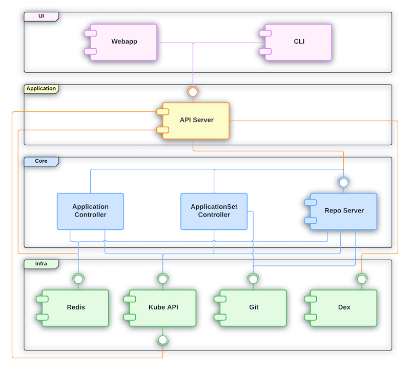

Title: [WIP] Understand ArgoCD architecture
Date: 2026-05-30
Category: Knowledge Base
Tags: k8s

# Intro

I thought I understood ArgoCD well enough — in the past I ran ArgoCD with multiple K8s clusters inside it (>10 clusters), and had around 500-600 ArgoCD Applications in a single cluster. But I was a contributor there, not the one who built it from scratch, and it turns out I had 100% misconceptions that I often ran into. Even though I had the Certified Argo Project Associate (CAPA), it was a joke for me — no value gained! So that is the reason this article was born — to help me understand the "basic" knowledge of ArgoCD better.

Ok, we will go through the sections below in this article:

- Architecture & Reconciliation loop
- Application - atomic unit
- Cluster registration
- AppProject - governance layer
- ApplicationSet - factory pattern
- Sync mechanics deep dive
- RBAC 3 layers
- Operational gotchas
- Recap - mental model

---

# Architecture & Reconciliation loop

- Static View: what the fuck the components are
- Dynamic View: how the fuck they are looping

ArgoCD is not a fucking monolith, it's a fucking workload that commonly runs in the **argocd** namespace.

First I thought ArgoCD's watch mechanism was the same as K8s's watch mechanism, but it turns out there's a little difference — let's figure it out!

### Kubernetes Controller Manager: Real-time Watch (Event-Driven)

In K8s, Controllers (like the ReplicaSet Controller, Deployment Controller) set up an [HTTP Long-Polling](https://learnkube.com/kubernetes-controller-manager-explained) watch mechanism to the Kube-ApiServer. For example:

- Desired State: state stored in ETCD (example: replicas: 1)
- Actual State: actual state of the pod in the cluster
- When something changes: the Kube-ApiServer sends an event to let the Controller Manager know. The Controller Manager sees actual pod replicas = 0, but desired = 1, so it makes a request to the Kube-ApiServer to create pod replicas that match the desired state. That is why when we delete a pod in a deployment with 1 replica, it automatically brings up a new pod!

Conclusion: K8s works in an event-driven way — if an event appears, it reacts and makes the change.

### Difference between ArgoCD and Kubernetes

| Property | K8s Controller Manager | ArgoCD (Application Controller) |
| -- | -- | -- |
| Source keep desired state | etcd | Git repository (outside of cluster) |
| How to recognize changes | Watch API (Real-time events) from Kube-ApiServer | Polling periodically to check Git or webhook |
| Main quest | Make sure resources run in the desired state which is stored in etcd | Make sure actual/live cluster state matches the desired state (Git) |

### Overview when combining ArgoCD + K8s
Actually when we use GitOps (ArgoCD + K8s), we're using a double reconciliation loop:

- First loop (ArgoCD): compare Git (desired) <--> K8s object spec read via kube-apiserver (this is "actual" from ArgoCD's view — but it's also exactly what feeds into loop 2 below as "desired"). If Git changes, or someone drifts the live spec away from Git (and selfHeal: true is set), ArgoCD re-applies via kube-apiserver to overwrite the drift back to match Git.
- Second loop (Kubernetes, independent of ArgoCD): compare K8s object spec in etcd (desired at this layer) <--> actual runtime state (is the pod really running as spec says). If a pod dies, K8s controllers recreate it to match spec.

- When someone uses `kubectl delete pod`, K8s controllers will recreate that pod (ofc, I'm talking about Deployment/ReplicaSet, not a fucking standalone pod)

- If someone uses `kubectl edit deployment` to change a resource/spec, ArgoCD will notice and change it back to match the data in Git (if selfHeal: true)

---

# Application - [atomic unit](https://octopus.com/blog/argo-cd-application-dependencies)

### Application vs ApplicationSet

- Application: a CRD (Custom Resource Definition) that describes 1 source (repo + path/chart + revision) mapped to a destination (cluster + namespace). It's handled by application-controller's reconcile and sync loop.
- ApplicationSet: a controller that runs separately (known as the `argocd-applicationset-controller` pod in the argocd namespace). Its job is to generate multiple Applications from 1 template + generator(s) — it doesn't do the sync job itself, it just creates/updates/deletes the Application resource, then application-controller does that part.

### Flow between ApplicationSet and Application in ArgoCD
So basically, the flow in order from ApplicationSet to Application:

- Update the value file of ApplicationSet, or add a new folder in the Gitops repo (generator source changes) — applicationset-controller learns about the changes via periodic requeue (polling interval) or webhook.
- ApplicationSet runs a generator (for example git-dir), asking argocd-repo-server for help to checkout the repo and list folders that match the pattern.
- argocd-repo-server will checkout git, list the folders/files that match the pattern, then return a raw parameter list to applicationset-controller. After that, applicationset-controller renders the templates with those parameters, feeding into `template:` — we call this the wanted, or expected, Application.
- Then applicationset-controller compares the expected Application vs the current Application; if there's a diff, it modifies/updates the current Application.
- After that, the current Application gets compared against live-state — the result is the Sync/OutOfSync status you often see.

---

# Cluster Registration

So basically, for cluster registration in ArgoCD, application-controller calls the endpoint of the kube-apiserver of the destination cluster (the same idea as `kubectl --context X`).

The destination cluster credential is saved as a Secret in the argocd namespace of the cluster hosting ArgoCD. It must have the label `argocd.argoproj.io/secret-type: cluster`.

Fields:

- `name`: display name, used as destination.name
- `server`: endpoint
- `config`: JSON of bearerToken, tlsClientConfig/exec-based

application-controller reads the secret via a separate informer/watch — it doesn't go through the manifest-render pipeline (repo-server) like a normal Application does.

Mostly we use argocd-vault-plugin for the secret — we only store the path that defines where the secret is saved in Vault.

The Application delivering the Secret must target `destination.name: in-cluster`, which is the built-in cluster, meaning the cluster hosting ArgoCD. This Secret needs to be stored in the local argocd namespace, not the destination cluster!

Provisioning the actual credential (ServiceAccount + ClusterRole + Binding + mint token) on the destination cluster is a separate concern — ArgoCD itself doesn't do this:

- CLI flow (`argocd cluster add`): the CLI (using your own local kubeconfig with admin access) bootstraps SA + ClusterRole + ClusterRoleBinding on the destination cluster, as a one-time setup. The default ClusterRole (`argocd-manager-role`) is near cluster-admin (`*/*/*`) unless scoped down manually.
- Declarative/GitOps flow (what we do): this provisioning has to happen outside ArgoCD (Terraform/other pipeline) against the destination cluster; only the resulting token gets pushed to Vault for AVP to inject.

The cluster only actually shows up in ArgoCD (Settings > Clusters, usable as a destination) AFTER the Secret is applied via a real sync — not the moment the Application object gets created. If the sync policy is manual and hasn't run yet, the Application just sits `OutOfSync` and the cluster stays invisible.

---

# AppProject

AppProject is a guardrail of ArgoCD that limits 3 independent axes:

- sourceRepos (which git repo)
- destinations (which cluster + namespace)
- clusterResourceWhitelist/namespaceResourceWhitelist (which K8s resource kind, cluster-scoped vs namespace-scoped)

`clusterResourceWhitelist` defaults to empty (deny all cluster-scoped resources like ClusterRole/ClusterRoleBinding/CRD/Namespace) unless explicitly whitelisted — this default-deny is what actually gives AppProject teeth.

AppProject is a secondary defense, running concurrently with (not nested inside) the destination cluster's own RBAC:

- First (Real, K8s-enforced): RBAC of the SA/token on the destination cluster. An absolute limit!
- Second (Software, defined and enforced by ArgoCD): only allows requests permitted by clusterResourceWhitelist/namespaceResourceWhitelist, sourceRepos, and destinations — anything outside that gets blocked.

An Application's `spec.project` must reference an AppProject that already exists — validated right at Application creation time, before it even gets to sync. No AppProject means the Application object fails to even get created, full stop.

# argocd-repo-server

It's one of the most important components — it's the only one that talks to git/Helm/OCI registries. It clones/fetches the repo, checks out the right revision, then renders the final manifest end-to-end no matter if the source is a Helm chart, Kustomize, or plain YAML. argocd-repo-server is called by:

- application-controller: each time it needs to diff git vs live-state, it needs to ask repo-server to show the rendered manifest for this source.
- applicationset-controller: each time it runs a git generator, it needs to ask repo-server to list folders/files that match this pattern, plz.

---

# argocd-server (API/UI gateway)

It's the API/UI gateway — it handles every request and enforces RBAC to determine which user/group is allowed to sync/create/delete/overwrite what.
