Title: Understand ArgoCD architecture with theory and hands-on
Date: 2026-07-26
Category: Knowledge Base
Tags: k8s

# Intro

I thought I understood ArgoCD well enough in the past I ran ArgoCD with multiple K8s clusters inside it (>10 clusters), and had around 500-600 ArgoCD applications in multiple k8s clusters. But I was a contributor there, not the one who built it from scratch, and it turns out I had 100% misconceptions that I often ran into. Even though I had the Certified Argo Project Associate (CAPA), it was a fuckin' joke to me, no fuckin' value gained! So that is the reason this article was born to help me understand the "basic" knowledge of ArgoCD!

Ok, we will go through the sections below in this article:

- Architecture & Reconciliation loop
- Application - atomic unit
- Cluster registration
- AppProject - governance layer
- Sync mechanics deep dive
- RBAC 3 layers
- How Sealed Secrets works
- Hands-on Lab
- Conclusion

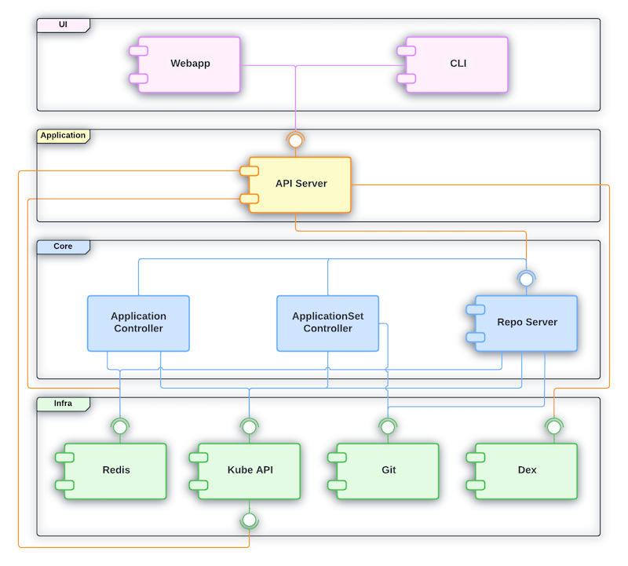

---

# [Architecture](https://argo-cd.readthedocs.io/en/stable/operator-manual/architecture/) & Reconciliation loop

ArgoCD is not a fuckin' monolith; it's a fuckin' workload that commonly runs in the **argocd** namespace.

First, I thought ArgoCD's watch mechanism was the same as K8s's watch mechanism, but it turns out there's a little difference, let's figure it out!

### Static View

- **argocd-server**: API Gateway, take request from UI/CLI, check auth/RBAC of user only.
- **argocd-repo-server**: clone Git, run **helm template** or **kustomize build** to render raw yaml.
- **argocd-application-controller**: where we runs reconciliation loop to see the drift between the desired state (rendered YAML from repo-server) versus live state in k8s.. This is only component that call the API to apply manifest.
- **argocd-redis**: Cache the rendered manifests, without Redis, each check sync, repo server will need to clone Git and render helm again! That is why we need fuckin' cache!

### Dynamic View

Here is the flow:

Git commit --> Webhook --> argocd-server (sets refresh annotation on Application CR) --> application-controller (watches Application CRs, detects refresh annotation) --> application-controller asks repo-server --> repo-server clones & renders manifests (caching via Redis) --> returns rendered YAML to application-controller --> application-controller compares with live state (K8S API) --> applies diff to K8s cluster (if out-of-sync).

### Kubernetes Controller Manager: Real-time Watch (Event-Driven)

In K8s, Controllers (like the ReplicaSet Controller, Deployment Controller) set up an [HTTP Streaming Watch](https://kubernetes.io/docs/reference/using-api/api-concepts/#efficient-detection-of-changes) watch mechanism to the kube-apiserver. For example:

- Desired State: state stored in ETCD ( for example "replicas: 1")
- Actual State: actual state of the pod in the cluster
- When something changes: the kube-apiserver sends an event to let the Controller Manager know. The Controller Manager sees actual pod replicas = 0, but desired = 1, so it makes a request to the kube-apiserver to create pod replicas that match the desired state. That is why when we delete a pod in a deployment with 1 replica, it automatically brings up a new pod!

Conclusion: K8s works in an event-driven way, if an event appears, it reacts and makes the change.

### Difference between ArgoCD and Kubernetes

| Property | K8s Controller Manager | ArgoCD (Application Controller) |
| -- | -- | -- |
| Source keep desired state | etcd | Git repository (outside of cluster) |
| How to recognize changes | Watch API (Real-time events) from Kube-ApiServer |Git side: Polling (default 3m) or Webhook. Live-cluster side: Watch API / Informer (same as K8s controller) |
| Main quest | Make sure resources run in the desired state which is stored in etcd | Make sure actual/live cluster state matches the desired state (Git) |

### Overview when combining ArgoCD + K8s
Actually when we use GitOps (ArgoCD + K8s), we're using a double **reconciliation** loop:

- **First loop** (ArgoCD): compare Git (desired) versus K8s object spec read via kube-apiserver (this is `actual` from ArgoCD's view, but it's also exactly what feeds into loop 2 below as `desired`). If Gitops repo changes, or someone drifts the live spec away from Git (and selfHeal: true is set), ArgoCD re-applies via kube-apiserver to overwrite the drift back to match Git.
- **Second loop** (Kubernetes, independent of ArgoCD): compare K8s object spec in etcd (desired at this layer) versus actual runtime state (is the pod really running as spec says?). If the pod dies, K8s controllers recreate it to match spec.
- When someone uses `kubectl delete pod`, K8s controllers will recreate that pod (ofc, I'm talking about Deployment/ReplicaSet, not a fuckin' standalone pod)
- If someone uses `kubectl edit deployment` to change a resource/spec, ArgoCD will notice and change it back to match the data in Git (if selfHeal: true)

And one more thing that worth to mentioning: [Kube-operators](https://kubernetes.io/docs/concepts/extend-kubernetes/operator/) using same mechanism like **second loop**

### Reconciliation Fight (War between 2 reconciliation loops)

We have an easy example to understand: HPA (Horizontal Pod Autoscaler)

- Desired state in Git: Deployment with **replicas:2**
- ArgoCD loop: read Git , see **replicas:2**, apply to K8S.
- K8S HPA Controller Loop: See pod resource reached condition to scale, update Deployment spec in K8S cluster to **replicas:5** for example.
- ArgoCD loop: (if enable **selfHeal: true**): Scan cluster, see actual **replicas:5** while Git defined **replicas:2** (Drift). ArgoCD update deployment spec that match in Git defined.
- K8S HPA Controller Loop: scale up again because pod reached condition to scale.
- Result: It creates an infinity loop causing unnecessary churn (constant rollouts, wasted resources) and potential service disruption.

This is actually a very common real-world issue unless you configure ArgoCD to ignore the replicas field using [**ignoreDifferences**](https://argo-cd.readthedocs.io/en/stable/user-guide/diffing/#application-level-configuration), or **omit the replicas** field from Git completely xD

---

# Application - [Atomic Unit](https://octopus.com/blog/argo-cd-application-dependencies)

### Application vs ApplicationSet

- [Application](https://argo-cd.readthedocs.io/en/stable/user-guide/application-specification/): a CRD (Custom Resource Definition) that describes 1 source (repo + path/chart + revision) mapped to a destination (cluster + namespace). It's handled by application-controller's reconcile and sync loop.

```yaml
apiVersion: argoproj.io/v1alpha1
kind: Application
metadata:
  name: guestbook-app
  namespace: argocd     # Must match the namespace where Argo CD is installed
  finalizers:
    - resources-finalizer.argocd.argoproj.io # Enables cascading delete (deletes K8s resources when the app is deleted)
spec:
  project: default       # The Argo CD project this app belongs to
  # 1. Source: Where your Kubernetes manifests live
  source:
    repoURL: 'https://github.com/argoproj/argocd-example-apps.git' # Git or Helm repo URL
    targetRevision: HEAD # Git branch, tag, or commit hash
    path: guestbook      # Directory inside the repository containing the YAMLs

  # 2. Destination: Where to deploy the resources
  destination:
    server: 'https://kubernetes.default.svc' # Cluster API URL (this refers to the local cluster). We could define to other cluster if we have.
    namespace: guestbook                     # Target namespace in your cluster

  # 3. Sync Policy: How Argo CD handles configuration drift
  syncPolicy:
    automated:
      prune: true     # Automatically delete resources no longer present in Git
      selfHeal: true  # Automatically fix deviations if someone manually edits live cluster resources
    syncOptions:
      - CreateNamespace=true # Create the target namespace automatically if it doesn't exist
      - ApplyOutOfSyncOnly=true # Only sync components that have drifted to optimize performance
```

- [ApplicationSet](https://argo-cd.readthedocs.io/en/stable/operator-manual/applicationset/): a controller that runs separately (known as the **argocd-applicationset-controller** pod in the argocd namespace). Its job is to generate multiple Applications from 1 template + generator(s), it doesn't do the sync job itself, it just creates/updates/deletes the Application resource, then application-controller does that part.

```yaml
apiVersion: argoproj.io/v1alpha1
kind: ApplicationSet
metadata:
  name: guestbook
  namespace: argocd        # Must match the namespace where Argo CD is installed
spec:
  goTemplate: true          # Enables Go template syntax ({{.path.basename}}) used in `template:` below
  goTemplateOptions: ["missingkey=error"] # Fail render instead of silently rendering empty if a field is missing
  # 1. Generators: how ApplicationSet discovers "what Applications should exist"
  generators:
    - git:
        repoURL: https://github.com/argoproj/argocd-example-apps.git # Same repo concept as a normal Application source
        revision: HEAD
        directories:
          - path: apps/*    # Glob pattern — each matching folder becomes 1 generated Application

  # 2. Template: how each matched folder gets turned into an actual Application
  template:
    metadata:
      name: '{{.path.basename}}'   # e.g. folder "apps/guestbook" -> Application name "guestbook"
    spec:
      project: default
      source:
        repoURL: https://github.com/argoproj/argocd-example-apps.git
        targetRevision: HEAD
        path: '{{.path.path}}'     # Full matched path, e.g. "apps/guestbook"
      destination:
        server: https://kubernetes.default.svc
        namespace: '{{.path.basename}}'  # Deploy each generated app into its own namespace or in same namespace, your choice.
      syncPolicy:
        automated:
          prune: true
          selfHeal: true
```

An ApplicationSet relies on [**Generators**](https://argo-cd.readthedocs.io/en/stable/operator-manual/applicationset/Generators/) to discover targets and parameters. Common generators include:

- [Git Generator](https://argo-cd.readthedocs.io/en/stable/operator-manual/applicationset/Generators-Git/): scans a Git repo for directories/files (used in our initial lab).
- [Cluster Generator](https://argo-cd.readthedocs.io/en/stable/operator-manual/applicationset/Generators-Cluster/): automatically discovers registered clusters.
- [Matrix Generator](https://argo-cd.readthedocs.io/en/stable/operator-manual/applicationset/Generators-Matrix/): combines multiple generators (e.g., deploying all Git apps to all registered clusters).

### Flow between ApplicationSet and Application in ArgoCD
So basically, the flow in order from ApplicationSet to Application:

- Update the value file of ApplicationSet, or add a new folder in the Gitops repo (generator source changes), applicationset-controller learns about the changes via periodic requeue (polling interval) or webhook.
- ApplicationSet runs a generator (for example git-dir), asking argocd-repo-server for help to checkout the repo and list folders that match the pattern.
- argocd-repo-server will checkout git, list the folders/files that match the pattern, then return a raw parameter list to applicationset-controller. After that, applicationset-controller renders the templates with those parameters, feeding into `template:`, we call this the wanted, or expected, Application.
- Then applicationset-controller compares the expected Application vs the current Application; if there's a diff, it modifies/updates the current Application.
- After that, the current Application gets compared against live-state, the result is the Sync/OutOfSync status you often see.

---

# [Cluster Registration](https://argo-cd.readthedocs.io/en/stable/operator-manual/declarative-setup/#clusters)

So basically, for cluster registration in ArgoCD, application-controller calls the endpoint of the kube-apiserver of the destination cluster (the same idea as `kubectl --context X`).

The destination cluster credential is saved as a Secret in the argocd namespace of the cluster hosting ArgoCD. It must have the label `argocd.argoproj.io/secret-type: cluster`.

Fields:

- `name`: display name, used as destination.name
- `server`: endpoint
- `config`: JSON of bearerToken, tlsClientConfig/exec-based

application-controller reads the secret via a separate informer/watch, it doesn't go through the manifest-render pipeline (repo-server) like a normal Application does.

Mostly we use argocd-vault-plugin for the secret, we only store the path that defines where the secret is saved in Vault.

The Application delivering the Secret must target `destination.name: in-cluster`, which is the built-in cluster, meaning the cluster hosting ArgoCD. This Secret needs to be stored in the local argocd namespace, not the destination cluster!

Provisioning the actual credential (ServiceAccount + ClusterRole + Binding + mint token) on the destination cluster is a separate concern, ArgoCD itself doesn't do this:

- CLI flow (`argocd cluster add`): the CLI (using your own local kubeconfig with admin access) bootstraps SA + ClusterRole + ClusterRoleBinding on the destination cluster, as a one-time setup. The default ClusterRole (`argocd-manager-role`) is near cluster-admin (`*/*/*`) unless scoped down manually.
- Declarative/GitOps flow (what we do): this provisioning has to happen outside ArgoCD (Terraform/other pipeline) against the destination cluster; only the resulting token gets pushed to Vault for AVP to inject.
The cluster only actually shows up in ArgoCD (Settings > Clusters, usable as a destination) AFTER the Secret is applied via a real sync, not the moment the Application object gets created. If the sync policy is manual and hasn't run yet, the Application just sits `OutOfSync` and the cluster stays invisible.

---

# [AppProject](https://argo-cd.readthedocs.io/en/stable/user-guide/projects/)

AppProject is a guardrail of ArgoCD that limits 3 independent axes:

- sourceRepos (which git repo)
- destinations (which cluster + namespace)
- clusterResourceWhitelist/namespaceResourceWhitelist (which K8s resource kind, cluster-scoped vs namespace-scoped)

`clusterResourceWhitelist` defaults to empty (deny all cluster-scoped resources like ClusterRole/ClusterRoleBinding/CRD/Namespace) unless explicitly whitelisted, this default-deny is what actually gives AppProject teeth.

AppProject is a secondary defense, running concurrently with (not nested inside) the destination cluster's own RBAC:

- First (Real, K8s-enforced): RBAC of the SA/token on the destination cluster. An absolute limit!
- Second (Software, defined and enforced by ArgoCD): only allows requests permitted by clusterResourceWhitelist/namespaceResourceWhitelist, sourceRepos, and destinations, anything outside that gets blocked.

An Application's `spec.project` must reference an AppProject that already exists, validated right at Application creation time, before it even gets to sync. No AppProject means the Application object fails to even get created, full stop.

AppProject whitelists namespace-scoped resources by default, but cluster-scoped resources (like ClusterRole, CustomResourceDefinition, and Namespace itself) are blocked by default. If your app uses CreateNamespace=true, ArgoCD will fail to sync unless you explicitly whitelist the Namespace kind under clusterResourceWhitelist.

---

# Sync mechanics deep dive

- Sync Phases: ArgoCD supports [Hooks](https://argo-cd.readthedocs.io/en/stable/user-guide/resource_hooks/) ([PreSync for DB migration, Sync, PostSync](https://argo-cd.readthedocs.io/en/stable/user-guide/sync-waves/)).
- [Automated Sync](https://argo-cd.readthedocs.io/en/stable/user-guide/auto_sync/): Automatically updates resources when Git changes, but enters a cooling-down period if sync fails.
- [Server-Side Apply](https://argo-cd.readthedocs.io/en/stable/user-guide/sync-options/#server-side-apply): Crucial for deploying huge resources (like CRDs) that exceed the annotation size limit.

---

# [RBAC](https://argo-cd.readthedocs.io/en/stable/operator-manual/rbac/) 3 Layers

- [K8s RBAC](https://kubernetes.io/docs/reference/access-authn-authz/rbac/): What ArgoCD is allowed to do in target clusters (enforced by the cluster API).
- AppProject: Logical governance within ArgoCD (restricting repos, namespaces, and resource types).
- SSO/User RBAC: Restricting what UI/CLI users can do (e.g., who can click "Sync" or "Delete").

---

# How Sealed Secrets works

To keep it secure, [Bitnami Sealed Secrets](https://github.com/bitnami-labs/sealed-secrets) uses public-key cryptography:

- **Encryption (Local):** When you run `kubeseal`, it uses your `kubeconfig` to fetch only the **Public Key** from the controller in your cluster (or you can download the public cert and run it completely offline). The CLI encrypts your secret locally using this public key.
- **Decryption (On-cluster):** Once committed to Git, ArgoCD applies the `SealedSecret` custom resource to K8s. The **Sealed Secrets Controller** running inside the cluster is the only one holding the **Private Key**. It automatically watches the resource, decrypts it using the private key, and generates a standard unencrypted K8s `Secret` in the target namespace.

**Note on Kubernetes Security:** Please remember once decrypted inside the cluster, the output is a standard Kubernetes `Secret` (which is only base64 encoded, unless you've explicitly enabled [etcd encryption-at-rest](https://kubernetes.io/docs/tasks/administer-cluster/encrypt-data/)). Sealed Secrets (and Vault) only solve "Secret-in-Git" security, not "Secret-at-Rest" inside etcd. Back in 2024, it took me a whole week to realize this....

---

# Hands-on Lab

We have 2 fuckin' repo:

- First, [gitops-bootstrap](https://gitlab.com/kienlt-gitlab-ci-demo/gitops-bootstrap) which is the Platform/SRE control plane repo storing bootstrap manifests (we only need to apply the root-app manually once to kickstart the cluster)
- Second, [gitops-manifests](https://gitlab.com/kienlt-gitlab-ci-demo/gitops-manifests) where we store application configs (which are scanned and applied automatically by the ApplicationSet)


```bash
kienlt@Luongs-MacBook-Pro gitops-bootstrap % k get nodes
NAME                                                            STATUS   ROLES    AGE    VERSION
fke-kienlt51-cluster1-hojhilgi-worker-rlqssho7-z1-bf598-qjcg2   Ready    <none>   5d3h   v1.31.4
kienlt@Luongs-MacBook-Pro gitops-bootstrap % k apply -f root-app.yaml
application.argoproj.io/bootstrap-app created
# Remember to get init password and port-forward to access ArgoCD UI locally.
```

After that we have first connected repo:

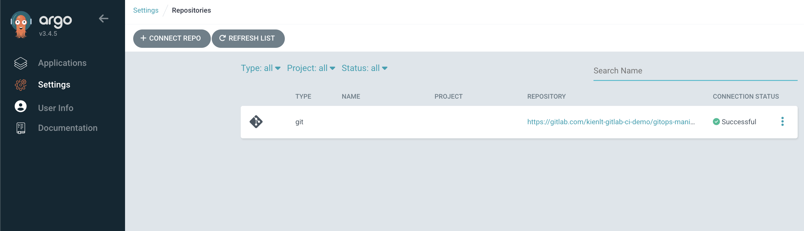

And our applications:

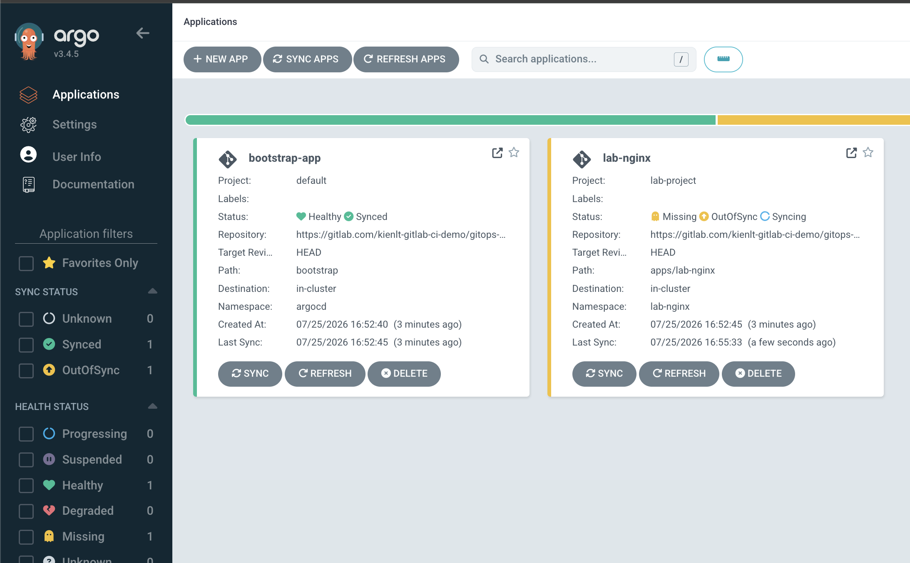

Oh, what is wrong to prevent ArgoCD sync the application?

```
resource :Namespace is not permitted in project lab-project
```

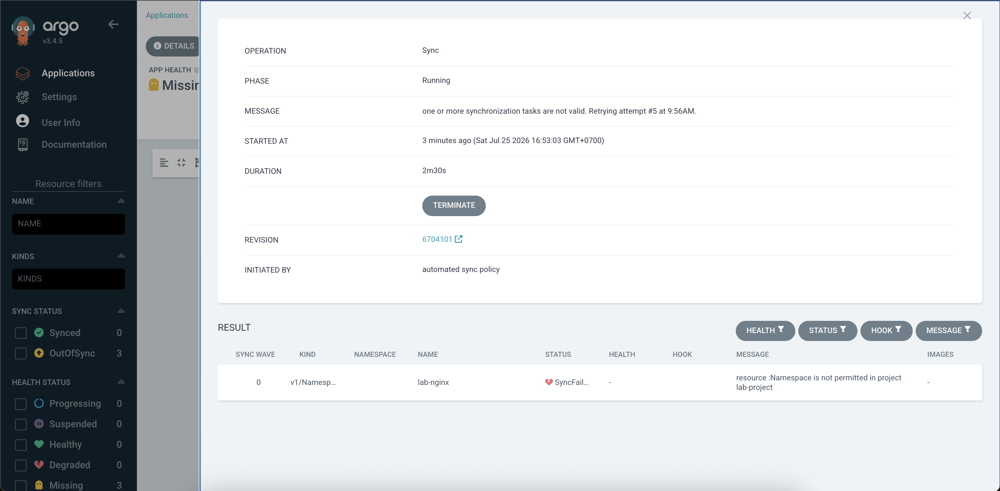

I'm pretty fuckin' sure that caused by destination we defined in here that allow only namespace with this pattern: **lab-***

```yaml
apiVersion: argoproj.io/v1alpha1
kind: AppProject
metadata:
  name: lab-project
  namespace: argocd
spec:
  description: "Project for ArgoCD Hands-on Lab"
  sourceRepos:
  - "https://gitlab.com/kienlt-gitlab-ci-demo/gitops-manifests.git"
  destinations:
  - namespace: "lab-*"
    server: "https://kubernetes.default.svc"
  namespaceResourceWhitelist:
  - group: '*'
    kind: '*'
```

No, I was wrong, LOL. Here is [the fix](https://gitlab.com/kienlt-gitlab-ci-demo/gitops-bootstrap/-/commit/b0f7a5d58cebcadadfc5a4b7a367ff365f03f631):

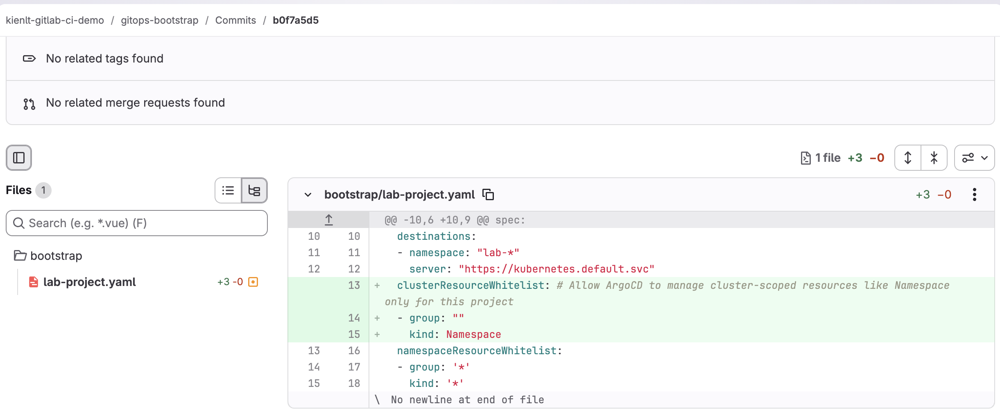

Click sync again, an expected version will be like this!

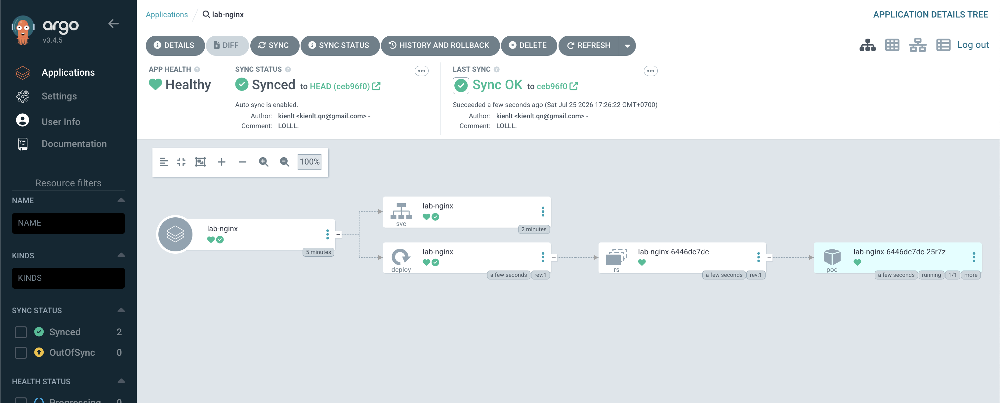

And for testing, i added 3 more repos and wait for [3 minutes](https://argo-cd.readthedocs.io/en/stable/operator-manual/applicationset/Controlling-Resource-Modification/#prevent-an-applicationsets-child-apps-from-being-deleted-or-modified) (default interval that **applicationSet-controller** will scan repo **gitops-manifest**)

```bash
kienlt@Luongs-MacBook-Pro gitops-manifests % ll apps
total 0
drwxr-xr-x@ 6 kienlt  staff  192 25 Jul 17:32 .
drwxr-xr-x@ 5 kienlt  staff  160 20 Jul 14:42 ..
drwxr-xr-x@ 5 kienlt  staff  160 25 Jul 17:28 lab-new-nginx
drwxr-xr-x@ 5 kienlt  staff  160 25 Jul 17:32 lab-new-nginx-1
drwxr-xr-x@ 5 kienlt  staff  160 25 Jul 17:32 lab-new-nginx-2
drwxr-xr-x@ 5 kienlt  staff  160 20 Jul 14:43 lab-nginx
```

It will appears in **bootstrap-app**

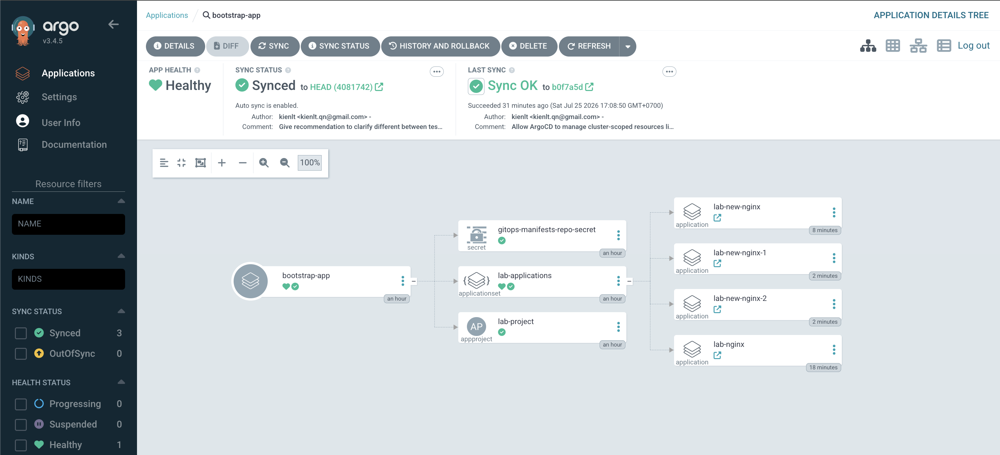

ok, we have setup connected repo, we have setup applicationSet that generate Argo Applications. Next we will move to cluster registration, we commonly regist cluster via argocd-cli. But I want to show you another approach that is using gitops way!

Before that, we need to setup/install Bitnami Sealed Secret because we are gonna push secret to gitops...

```bash
# Run this in current cluster, where ArgoCD installed!
kubectl apply -f https://github.com/bitnami-labs/sealed-secrets/releases/download/v0.22.0/controller.yaml

# I'm working in Mac, so brew for me...
brew install kubeseal
```

We create a raw cluster secret in local named: **raw-cluster-register.yaml**, Please notice that **bearerToken** is actually field **token** under users section. If you are using managed k8s for testing like me, remove **tlsClientConfig**.

```yaml
apiVersion: v1
kind: Secret
metadata:
  name: kienlt-cluster2-secret
  namespace: argocd
  labels:
    argocd.argoproj.io/secret-type: cluster
type: Opaque
stringData:
  name: kienlt-cluster2
  server: "https://<IP_API_SERVER_CLUSTER_2>"
  config: |
    {
      "bearerToken": "TOKEN_OF_CLUSTER_2",
      "tlsClientConfig": {
        "insecure": true
      }
    }
```

Then run the fuckin command to encrypt it and store it in bootstrap repo.

```bash
kubeseal --format=yaml < raw-cluster-register.yaml > bootstrap/cluster-registration.yaml
```

Commit it to **gitops-bootstrap** repo. Then refresh in **bootstrap-app**, we will have new sealedSecret resource

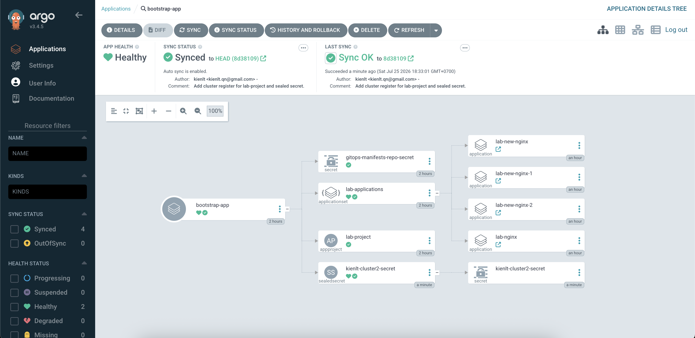

But cluster is "Unknown"?

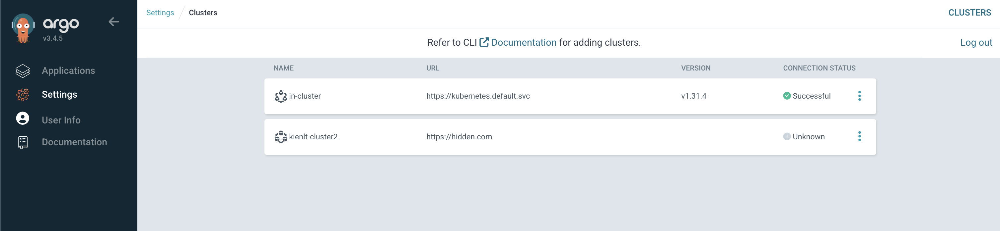

Don't panic! ArgoCD handles cluster **connections lazily**. It won't actively probe the cluster API unless there is at least one Application targeting it. Once we deploy a test application to **kienlt-cluster2**, the status will immediately transition to Successful (or show auth/network errors if we fucked up the token/API endpoint).

We commit [this change](https://gitlab.com/kienlt-gitlab-ci-demo/gitops-bootstrap/-/commit/4965f0745ad75f1bc4314245a597c81b821fb4c5) to the **gitops-bootstrap** repo, then hit the refresh button on the **bootstrap-app** in ArgoCD:

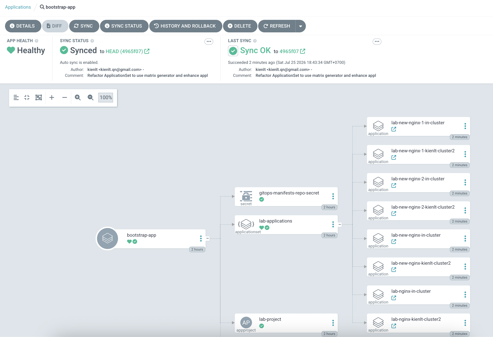

But we run into an issue on the new Cluster 2 xD: 
```
> application destination server 'https://hidden.com' and namespace 'lab-new-nginx' do not match any of the allowed destinations in project 'lab-project'
```

This is because our AppProject didn't permit it yet. Here is the [commit](https://gitlab.com/kienlt-gitlab-ci-demo/gitops-bootstrap/-/commit/3066c35480ca6df5f01ef2b5f1ebff7d666e2e0c) that fixes it.

After this change, we finally see both clusters showing "Successful" in their Connection Status:

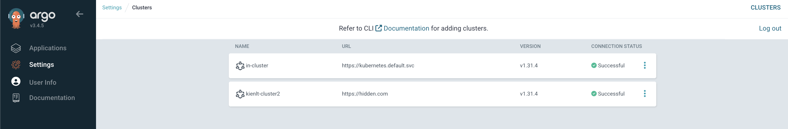

This pattern is commonly used for Multi-Cluster GitOps to architect High Availability (HA) and Disaster Recovery (DR) in production environments. But everything comes with a trade-off at a higher level, nothing is perfect and there is no fuckin' free lunch!

### Hub-and-Spoke Topology vs Decentralized

- Hub (ArgoCD Control Plane): Installed in Cluster 1, acting as the central management plane.
- Spokes (Target Clusters): Cluster 2, Cluster 3... only receive deployment instructions.

```
                   ┌────────────────┐
                   │    Git Repo    │
                   └───────┬────────┘
                           │
                           ▼
               ┌───────────────────────┐
               │ Cluster 1 (Hub/Argo)  │
               └──────┬─────────┬──────┘
                      │         │
            (Deploy)  │         │  (Deploy)
                      ▼         ▼
        ┌───────────────┐     ┌───────────────┐
        │  Cluster 2    │     │  Cluster 3    │
        │    (Spoke)    │     │    (Spoke)    │
        └───────────────┘     └───────────────┘
```

- Advantage: Centralized management—you only need a single UI dashboard to monitor the entire system.
- Disadvantage: Single Point of Failure. If Cluster 1 goes down, we cannot deploy or update workloads on Cluster 2 and 3. However, existing workloads will continue running fine—this only affects new deployments.

Alternative pattern: Decentralized. Each cluster runs its own ArgoCD instance separately, watching the same GitOps repo! The catch is we have to manage multiple UI dashboards and it consumes slightly more cluster resources.

Furthermore, we also need to handle traffic redirection (failover) when Cluster 1 goes down and tackle data replication challenges for stateful apps. But I won't cover those here due to complexity. Maybe in the future once I get the fuckin' chance xD.

---

# Conclusion

- ArgoCD is harder than you ever imagine if you really want to understand it.
- Reconciliation Fight: Avoid conflicts with other controllers (like HPA replicas) by using **ignoreDifferences**.
- Repo Server CPU/RAM spikes: Rendering heavy Helm charts can OOM-kill the repo-server; configure parallel limits or cache properly.