Title: [WIP] Prepare for AWS Certified CloudOps Engineer Associate SOA-C03 2026 exam
Date: 2026-06-14
Category: Knowledge Base
Tags: aws, certification


# Introduction
I start the progress by using [Stephane Maarek's course](udemy.com/course/aws-certified-cloudops-associate/)

Honestly, if I keep studying the same way I always have in the past which is memorization keyword, I'm going to fail this exam for fuckin' sure. The real problem is I don't have hands-on AWS experience — I work with Kubernetes and on-premises stuff day to day, so a lot of this is purely theoretical for me. Watching videos and taking notes clearly isn't enough when the exam throws scenario-based questions at you that only make sense if you've actually touched the console.

### Learning Sections

I will follow Udemy course, no idea if this article will be more than 1k5 lines long....

- Section 1: EC2 for CloudOps
- Section 2: AMI - Amazon Machine Image
- Section 3: Managing EC2 at Scale - Systems Manager (SSM)
- Section 4: EC2 High Availability and Scalability
- Section 5: CloudFormation for CloudOps
- Section 6: Lambda for CloudOps
- Section 7: EC2 Storage and Data Management - EBS and EFS
- Section 8: Amazon S3
- Section 9: Advanced Amazon S3 & Athena
- Section 10: Amazon S3 Security
- Section 11: Advanced Storage Section
- Section 12: CloudFront
- Section 13: Databases for CloudOps
- Section 14: Monitoring, Auditing and Performance
- Section 15: AWS Account Management
- Section 16: Disaster Recovery
- Section 17: Security and Compliance for CloudOps
- Section 18: Identity
- Section 19: Networking - Route 53
- Section 20: Networking - VPC
- Section 21: Other Services

### Some shortcut I will used in this article

- Load Balancer (LB)
- Placement Groups (PG)
- CloudWatch (CW)
- Auto Scaling Group (ASG)
- Relational Database Service (RDS)
- Amazon Machine Image (AMI)
- Systems Manager (SSM)
- Resource Groups (RGs)
- Elastic Load Balancer (ELB)
- Application Load Balancer (ALB)
- Security Group (SG)
- Network Load Balancer (NLB)
- Gateway Load Balancer (GWLB)
- Server Name Indication (SNI)
- Function as a Service (FAAS)
- Cross-region replication (CRR)
- Same-region replication (SRR)
- Internet Gateway (IGW)
- Network Access Control List (NACL)
- Dead Letter Queue (DLQ)

---

# Section 1: EC2 for CloudOps

### Placement Groups
When I see this, I associate it with HDFS default replication (factor=3).

- Replica 1: Place in node is writing.
- Replica 2: Place in node that have different rack than replica 1.
- Replica 3: Place in same rack with replica 2 but different node.

So let's make a simple compare with AWS PG

| HDFS | EC2 PG|
|--|--|
| Same rack | Cluster PG (low latency, high throughput) - single AZ only |
| Different rack | Spread PG (isolate failure, spread EC2 instances to multiple zones) |
| Custom rack topology | Partition PG (each partition = 1 logic rack)

Ok, why PG?

- Pros: Great network with high throughput, low latency (10Gbps between instances with Enhanced Networking enable).
- Cons: If the AZ fails, all instances fails at the same time. PG spread have limited to 7 instances per AZ per PG. For PG paritions, we can have up to 7 partitions per AZ and can be span across multiple AZs in the same region.

### CloudWatch for EC2

Remind: LGTM (Loki-Grafana-Tempo-Mimir) Stack = CloudWatch.

AWS provided metrics (AWS push them for us) includes CPU,Network,Disk and Status check metric every 5 minutes with no agent needed. (paid version or Detailed Monitoring will be 1 minute interval). Good thing to know that defaults metrics are collected by AWS hypervisor from outside of instance?

Custom metric: Hmm, RAM is a custom metric? (I thought it should be default...), make sure IAM permissions on the EC2 instance role are correct. 

Yeah, RAM is not fucking included into the AWS EC2 metrics.

If you have 3 or fewer dashboards using only standard EC2 metrics, it's completely free. If you have a 4th dashboard, it's $3/month.

How CW collect metrics and logs from EC2 instance? --> Unified CW Agent (with right permissions).

Unified CW Agent - procstat Plugin will come to exam:

- Collect metrics and monitor system utilization of individual process (support both Linux/Window)
- Select which process to monitor by pid_file/process name/pattern... This shit is free in CheckMK
- Metrics collected by procstat plugin begins with "procstat" prefix.

Conclusion: CW agent not only push metrics, it is also able to push logs to CW. Detailed Monitoring won't help you get RAM, it just gives you faster intervals on the same limited set of metrics.

### EC2 Instance Connect Endpoint

Useful when no fucking bastion, public IP on the instance or EC2 instances running in a private subnet in a VPC without Internet Gateway or NAT Gateway.

### Status Check

So for common we have 3 status check: failed system (host hardware), failed instance (our instance) and attached EBS.

With CW Metrics and Recovery

- Option 1: CW Alarm, recover/restart EC2 instance on metric trigger (if StatusCheckFailed_System == 1 for example). Then send notification using SNS (Remember, SNS is **push-based** service, not a pull/polling service. You do not need to build a consumer that constantly checks the topic at intervals)

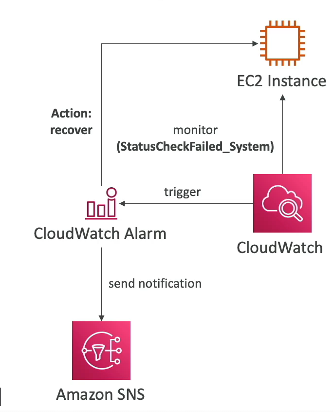

- Option 2: By default, an ASG uses EC2 status checks (StatusCheckFailed_System and StatusCheckFailed_Instance) to monitor the health of its instances and yeah, ASG launch new instance replaced failed instance.

So after we config CW Alarm, we can test it by using CLI:
```bash
aws cloudwatch set-alarm-state --alarm-name name-here-bro --state-value ALARM --state-reason "testing how recover in action after alarm triggered"
```

Also worth to mention action in CW Alarm:

- Recover: moves the instance to new physical host hardware (AWS migrates it), then starts it up.
- Reboot: restarts the OS on the same physical host (For example: StatusCheckFailed_Instance, action will be reboot)

### EC2 Hibernate

Short: keep in-memory state in EBS volume, next time you start EC2 instance, you will load exactly state of your instance before hibernate and shutdown.

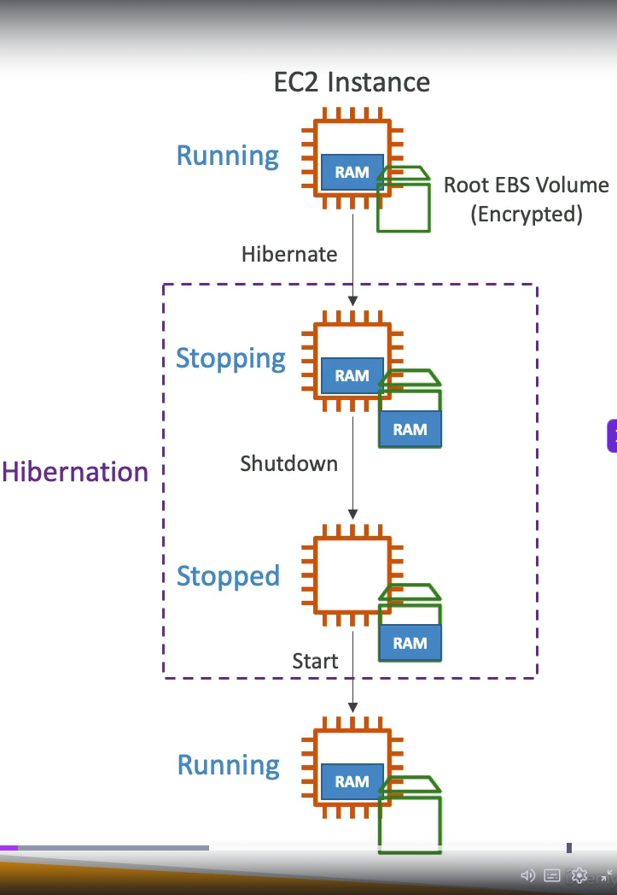

We need to enable it when launch ec2 instance, root volume must have enough size to store hibernate data and root volume must be set to encrypted.

- Instance RAM must be less than 150 GB
- Cannot hibernate for more than 60 days
- Not all instance types support hibernate (exam may test this)

These 3 limits above are commonly tested in SOA-C03!

### Instance Scheduler on AWS

Yeah, that is how we save every bucks when running in Cloud. Features:

- Supports EC2 instances, EC2 ASG and RDS instances.
- Schedules are managed in a DynamoDB table.
- Stop/Start instance by using resource's tag and Lambda.
- Works in cross-account and cross-region resources.

We have to create instance scheduler via Cloudformation --> Stack --> create stack or use exists template to create this fuckin' stack, after that we have a lot of created resources!

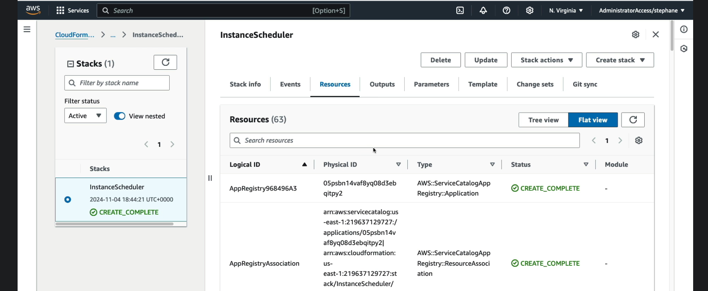

--- 

# Section 2: AMI - Amazon Machine Image

### Overview

We are gonna use public AMI, most well-known is Amazon Linux 2, very popular AMI for AWS.

We can create AMI from running instance without shutdown AMI with AMI No-reboot option (It was disable by default). 

Hmm, so much services in AWS. We can create AMI via AWS Backup also (Doesn't reboot the instances while taking EBS snapshot)

Migrate? yes we can migrate EC2 instance between AZ via AMI

EC2 Image Builder: Hmm, auto build AMI manually or with schedule and run shit load of test cases to validate AMI (free service btw). Oh indetail of EC2 Image Builder, there is shit load of predefined components and OS select to create AMI:

- amazon-cloudwatch-agent-linux
- amazon-corretto-11-headless
- aws-cli-version-2-linux ... and more

And in window of new Image Builder, we need to add a role for it also (Create a role with multiple required policies) and last one was Distributed settings where you can define where AMI will be distributed.

Cross-Account AMI sharing: you can share AMI with another AWS account that AMI can have unencrypted or encrypted volumes via customer managed key (You need to share managed key as well, so they can decrypt the encrypted AMI).

AMI in Production: add tag to AMI and use policy to approve only AMI have tags.

Holy fuck, remember AMI is region locked can not be shared with other regions, only able to share in AZs

---

# Section 3: Managing EC2 at Scale - Systems Manager (SSM)

### Overview
- Manage your EC2 and on-premises systems at scale
- Patching automation for enhanced compliance
- Works for both Window and Linux OS
- Stephane Maarek recommend learn keyword that in blue xD

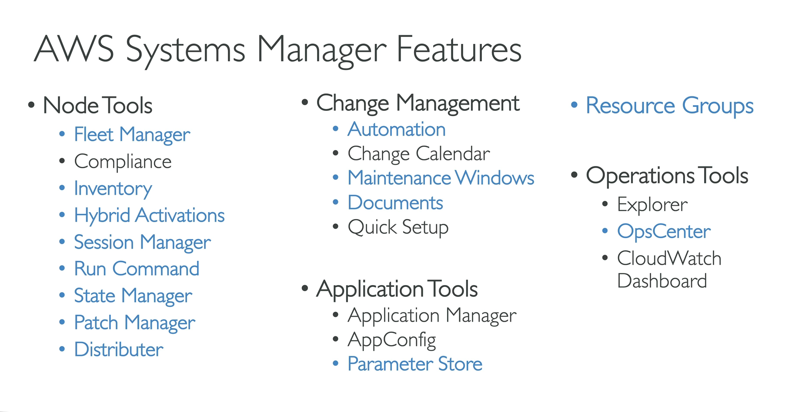

- How it works: basically, it is server-agent model, it needs to install SSM agent into EC2/On-premise Server/VM we control, installed by default on Amazon Linux 2 and some Ubuntu AMI. And make sure EC2 instances have a proper IAM role to allow SSM actions. We manage EC2 instances that installed SSM agent in "Node tools - Fleet manager"

### Resource Groups
Holy shiet, this make me remember about Azure since Resource Group is one of important knowledge in Azure. So RGs create,view or manage logical group of resources by using **tags**. For example EC2 instances have tags **Team = Platform**, we can create a RG based that tag.

This is regional service, works with EC2, S3,DynamoDB, Lambda, etc...

And we can create RG via UI with filter like resource type (EC2 instances...), tags, then group name, details...

Conclusion: It is all about manage resources, Azure when you create a resource you need to put it on a RG, in AWS only when works with SSM xD

### SSM - Documents
Hmm, this is more like Saltstack run command or Ansible shell module? In AWS it's called documents, LOL. It also sync with State Manager, Patch Manager, Automation. We can write our own document also.

We can create Command or Session and Automation.

Let's take a look with **Run Command**:

- Execute a document (= script) or just run a simple command across multiple instances (using RG, hmm this make sense now for RG usage.) with rate control/error control with targets are RG/Instance tags/Instance selected manually and able to config rate control like concurrency and error threshold to stop the task fail.
- Integrated with IAM & CloudTrail (You are able to see who run that commands) and yeah no need for SSH because it is Server-Agent architecture (Saltstack like).
- Command output will be show via console but can be send to S3 bucket or CW logs. Send notification to SNS about command status (In progress, success, failed...) and can be invoked using EventBridge for automation. (AWS really know how to make services... )
- If you know about Saltstack/Ansible, this is pretty easy to understand! But no idea if you need to remember structure of run command for exam!

### SSM - Automation
Simplifies common maintenance and deployment task for EC2 instances and other AWS resources, for example: restart instances, create AMI, EBS snapshot.

Hmm, it mostly choose which module (AWS provided) to run.

Patch AMIs & Update ASG.

### SSM - Parameter Store
Secure storage for configuration and secrets, best for App config + lightweight secrets, no fucking auto-rotation (need auto-rotations/DB Credential/API Keys/Tokens safe location? --> Secrets Manager)

Used with Parameter Store (not just SSM):

- Lambda: reads DB URLs, API keys at runtime
- ECS/EKS: inject secrets as env vars into container
- Code Deploy/Code Build: pull credentials during CI/CD
- Any EC2 app - via SDK/CLI with proper IAM role (ssm:GetParameter)


Hierarchy uses */* delimited paths, like a file system:
```
/                                    ← root
├── myapp/
│   ├── prod/
│   │   ├── db/
│   │   │   ├── url                  → "postgres://prod-db.rds.amazonaws.com:5432/mydb"
│   │   │   ├── username             → "admin"
│   │   │   └── password             → (SecureString, KMS encrypted)
│   │   ├── redis/
│   │   │   └── endpoint             → "redis://prod-cache.abc123.ng.0001.use1.cache.amazonaws.com"
│   │   └── feature_flags/
│   │       └── new_dashboard        → "true"
│   └── dev/
│       ├── db/
│       │   ├── url                  → "postgres://dev-db.rds.amazonaws.com:5432/mydb"
│       │   └── password             → (SecureString)
│       └── feature_flags/
│           └── new_dashboard        → "false"
└── shared/
    ├── datadog_api_key              → (SecureString)
    └── slack_webhook_url            → "https://hooks.slack.com/..."

```

Fetch by path in CLI:
```bash
# single param
aws ssm get-parameter --name "/myapp/prod/db/password" 
# Multi param
aws ssm get-parameter --names "/myapp/prod/db/password" "/myapp/prod/db/username"
# With decryption 
aws ssm get-parameter --name "/myapp/prod/db/password" --with-decryption
# entire subtree at once (recursive)
aws ssm get-parameters-by-path --path "/myapp/prod" --recursive
```

Free parameters tier used up to 10000 number of parameters while paid up to 100k with maximum size of parameter value is 4 KB (advanced 8Kb) and no fucking parameter policies available, parameters policies only available if you upgrade free tier to advanced tier (you can upgrade to advanced but not able to downgrade to free tier, remember it.)

So what is the fucking parameters policies:

- Allow to assign a TTL to a parameter to force updating or deleting sensitive data such as passwords, tokens. Can assign multiple polices at a time.
- ExpirationNotification Policy: fires an event to EventBridge when a parameter is nearing expiration or has just expired.
- NoChangeNotification Policy: Fires an event to EventBridge if a parameter has not been modified/updated within a certain number of days.

### SSM - Default Host Management Configuration (DHMC)
Short explain: turn on one setting per region -> all EC2 instances in that region get SSM managed automatically, no per-instance IAM role needed. 

Required IMDSv2 to be active for enhanced security and to successfully identify instances.

### SSM - Inventory & State Manager
Short explain: what's installed/running inside my instances --> It is fucking SSM Inventory

How it works:

- EC2 (SSM Agent)
- Collects metadata then sends to SSM Inventory
- S3 bucket (optional sync)
- Athena / QuickSight (query/visualize)

Key points for fucking exam:

- Data synced to S3 via Resource Data Sync — aggregate inventory across multiple accounts/regions into one S3 bucket.
- Query with Athena on top of that S3 data
- If instance doesn't show inventory → check SSM Agent running + IAM role has *ssm:PutInventory* permission
- Works for both EC2 and on-premises servers (any SSM managed node)

### SSM - Patch Manager
Automate the process of patching managed instances, patch on demand or on a schedule using Maintenance Windows. Scan instances and generate patch compliance report (missing patches)

Patch baseline:

- Defines which patches should and shouldn't be installed on your instances
- Ability to create custom patch baseline (specify approved/rejected patches)

Patch Group:

- Associate a set of instances with specific patch baseline
- Example: create patch groups for different environments (dev,test,prod)
- An instance can only be in one patch group, patch group can be registered with only one patch baseline


For exam perspective: patch manager is used to patch your instances

### SSM - Session Manager
Allow you to start a secure shell on your EC2 and on-premises servers. Does not need SSH access, bastion hosts or SSH keys. This is possible because we have fucking SSM Agent installed.

Required for SSM Manager works:

- SSM Agent need to be installed and running in the instance.
- Instance must have IAM role with related policy to SSM Managed
- Instance must have internet access or VPC endpoint to SSM connect to AWS endpoint?

And commands in this shell session can be logged and sent to S3, and control user in which group can access shell. Easier to audit I think.

### SSM - Distributor
Packet and deploy software to your managed instances, you can create Distributor package (SSM Document)

Can be install via one-time (Run Command - yes, fucking like saltstack xD) or on a schedule (using state manager)

### SSM - OpsCenter
Allow you to view, investigate and remediate issues in one place (no need to navigate across different AWS services)

Issues could be security, performance issues, failures which help to reduce meantime to resolve issues.

### Conclusion
For this section, I think it has a lot of logic,bussiness and behavior like Ansible(agent-less)/Saltstack(server-agent) model. If you understand Ansible/Saltstack's essence, you should able to understand this section without any issues!

---

# Section 4: EC2 High Availability and Scalability

I skip section and jump direct to quiz. My wrong answer for this question in this quiz:

Question: You would like to expose a fixed static IP to your end-users for compliance purposes, so they can write firewall rules that will be stable and approved by regulators. Which Load Balancer should you use?

Answer: I picked ALB with EIP attached to it because it sounds right LOL. But in fact the ALB itself dynamically manages its IP addresses, so if you need fixed static IP, you need NLB

Second question: Which of the following is NOT a valid target while you create a Target Group for your Application Load Balancer?

Answer: I picked wrong answer again. [It is fucking Public IP](https://docs.aws.amazon.com/elasticloadbalancing/latest/application/load-balancer-target-groups.html)

And I failed 6 in total of 16 questions, I think i need to watch this section again.

### Application Load Balancer (ALB)

- **ALBs have Security Groups!** (A common misconception is that SGs are EC2-only). Because ALBs are public-facing, they need an attached Security Group to control inbound traffic from the internet (e.g., allowing ports 80/443 from `0.0.0.0/0`).
- **Which AWS resources use Security Groups?** Basically any resource with an Elastic Network Interface (ENI). This includes: EC2 instances, RDS databases, Lambda (inside VPC), ECS Tasks, VPC Endpoints, and ALBs/NLBs.

Routing tables to different target groups:

- Routing based path in URL
- Routing based on hostname in URL (It means you can have multiple domain point to ALB)
- Routing based on Query String, Headers (domain.com/users?id=123&order=true)

Target Groups:

- EC2 instances - HTTP
- ECS tasks - HTTP
- Lambda functions - HTTP request is translated into a JSON event
- IP Address (private IPs)

ALB can route to mulitple target groups and health check are at the target group level. There is something great to know from this section (Which I never know/understand before). Header X-Forwarded-For can be spoofed but can be prevented by using last client in ALB (ALB auto inject header)

```
  Client sends:    X-Forwarded-For: fake-ip
  ALB appends:     X-Forwarded-For: fake-ip, real-client-ip  ← ALB controls this
                                              ^^^^^^^^^^^^
                                              always trustworthy


# Unsafe, getting fake-ip
client_ip = request.headers["X-Forwarded-For"].split(",")[0].strip()
# Safe, getting real-client-ip which control by ALB, it can not goes wrong!
client_ip = request.headers["X-Forwarded-For"].split(",")[-1].strip()                       
```

Allow only requests coming from ALB (Security Group Referencing / Chaining): In the Security Group of the EC2 instance, add an inbound rule:

- **Type**: HTTP (Port 80), HTTPS (Port 443), or Custom TCP (your app port, e.g., 8080)
- **Source**: Select **Custom** -> then select/type the **Security Group ID of the ALB** (e.g., `sg-xxxxxxxx`).

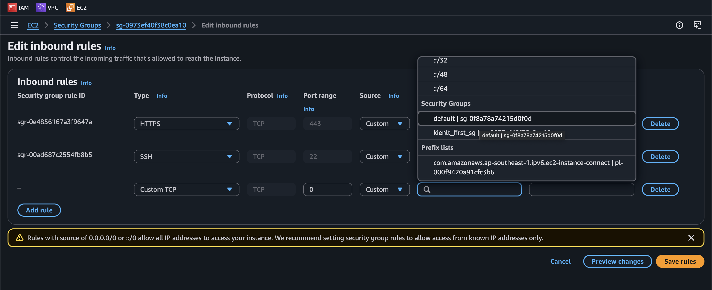

**Why?** Because the ALB's IP addresses are dynamic and change as AWS scales it. By referencing the ALB's Security Group as the source, you ensure only traffic routed through the ALB is allowed, without needing to maintain IP address lists.

We can have listener rule to do routing according conditions/rules. (like add custom path with custom fixed response code, body, content type.)

### Network Load Balancer (NLB)

NLB (Layer 4), has one static ip per AZ and supports assigning Elastic IP (helpful for whitelisting specific IP). And the rest is almost the same with ALB.

NLB does not support cookie-based session affinity, but uses source IP hash for connection stickiness.

### Gateway Load Balancer (GWLB)

Gateway for network virtual appliances (NVA) in AWS (Ex: Firewalls, Intrusion Detection, Deep packet inspection and so on..). 

Flow: **User/Internet Gateway** --> **GWLB** --> **3rd-party NVA** (If passed, traffic will be sent to GWLB otherwise drop) --> **GWLB** --> **Backend**

Operates at Layer 3 - Ip Packets. Exam perspective: Use GENEVE protocol on port 6801 (right if you use GWLB)

### ELB - Server Name Indication (SNI)

Used in scenario where you have multiple domain that point to same ALB/NLB, each domain serving specific target group.

### Connection Draining

Feature naming: **Deregistration Delay** - For ALB & NLB. It is time to complete "in-flight requests" while the instance is de-registering or unhealthy.

Think like graceful shutdown:

- Instance marked as Draining(like k8s drain node xDD)/Deregistration.
- ALB stops sending NEW requests to it.
- But existing in-flight requests get time to finish so users will see no errors.
- After timeout (default 300s), instance is fully removed.

### ELB - monitoring, troubleshooting, logging and tracing

All LB metrics are directly pushed to CW metrics

- **SurgeQueueLength**: The total of request (in HTTP listener) or connection (TCP listener) that are pending routing to a healthy instance.
- **SpilloverCount**: the total number of requests that were rejected because the surge queue is full.

For request tracing, each HTTP request has an added custom header "X-Amzn-Trace-Id". This is useful in logs / distributed tracing platform to track a single request.

### Auto Scaling - Instance Refresh

When we update launch template and then re-creating all EC2 instances, instance refresh is like rolling update in k8s deployment xD, same idea, pattern. Just little different start a VM is slower than start a pod, make sure you have right setting for warm-up time.

### ASG - Warm Pools

To resolve latency issue, we have warm pool, pre-initialized VM but costs more money since they are up and ready to join auto scaling group?

### CloudOps - ASG

There is some lifecycle hooks: instance launching, instance terminating.

This is kind great feature for me when use public cloud, lifecycle event can be trigger to EventBridge,SNS,SQS and with EventBridge it can invoke Lambda function to do your custom logic.


Example, SQS with ASG

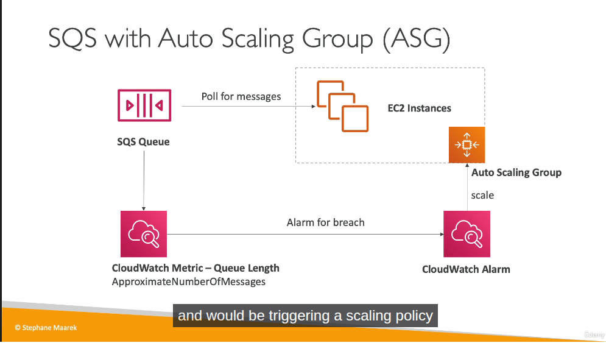

### CW for ASG

Metrics are collected every 1 minutes

---

# Section 5: CloudFormation for CloudOps

ah shit, here we go again, i forfeited this fucking section 2 times when I'm learning this section for AWS DOP-C02 in 2024 and 2025.... Yaml developer, a lot of fucking hooks =.=

Short: IAC but for AWS only. You are able to visualization with Infrastructure Composer to see how components are related to each other in Cloudformation. 

How it works?:

- You should create many stacks separately, each stack for specific resource (VPC/Network/App stacks).
- You need to upload template to S3 then refers it in the CloudFormation. 
- To update template, you will have to upload new version of template, can not edit previous, so you will be able to rollback to previous revision in case new version is messed up!
- Stacks are defined by name. Delete stack will delete any resource/artifact created via that.
- You can deploy using manual way or via CLI / CD tools of AWS.
- Templates could be in YAML or JSON format, YAML is prefered

Building Blocks, we will deep dive in each section below soon:

- AWSTemplateFormatVersion: Identifies the capabilities of template
- Description: description, comment LOL
- Resource: Your resources declared in the fucking template.
- Parameters: it is fucking parameters (dynamic inputs) for your template.
- Mappings: the static variables for your template
- Outputs: yeah, like terraform
- Conditionals: list of conditions to perform resource creation
- Template helpers, we have references and functions.


### Resources

Resources are the core of Cloudformation template (this is the only one mandatory in whole template of Cloudformation.)

### Parameters

This section I tell the AI create the content I want from what I understand xD.

Dynamic inputs for your template. The main benefit: define a value once in Parameters, reference it in multiple places — when you need to change it, update only the parameter instead of hunting down every hardcoded value across the template.

```yaml
Parameters:
  EnvName:
    Description: Environment name (e.g. dev, prod)
    Type: String
    Default: dev

Resources:
  WebServerSG:
    Type: AWS::EC2::SecurityGroup
    Properties:
      GroupDescription: !Sub "SG for web server - ${EnvName}"
      Tags:
        - Key: Name
          Value: !Sub "${EnvName}-web-sg"
        - Key: Environment
          Value: !Ref EnvName

  WebInstance:
    Type: AWS::EC2::Instance
    Properties:
      InstanceType: t2.micro
      ImageId: ami-0a3c3a20c09d6f377
      Tags:
        - Key: Name
          Value: !Sub "${EnvName}-web-server"
        - Key: Environment
          Value: !Ref EnvName
      SecurityGroups:
        - !Ref WebServerSG

  MyBucket:
    Type: AWS::S3::Bucket
    Properties:
      BucketName: !Sub "my-app-${EnvName}-bucket"
      Tags:
        - Key: Environment
          Value: !Ref EnvName
```

`EnvName` is used in 7 places, deploy with `EnvName=prod` and everything updates automatically.

Two ways to reference a parameter:

- `!Ref EnvName` — returns the raw value, use when assigning directly to a field
- `!Sub "${EnvName}-web-server"` — use when you need string interpolation (prefix/suffix)

Exam information: 

- **AllowedValues**: allow user select only allowed values in a parameters.
- **NoEcho**: to not display, echo the sensitive data like password.

Pre-defined / Pseudo parameters:

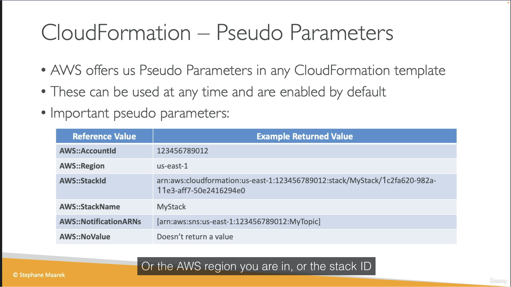

### Mappings

This section I tell the AI create the content I want from what I understand xD.

Static variables hardcoded in the template, no user input and no dynamic lookup. Use when you know the values in advance and they vary by some fixed dimension (region, environment, arch).

Classic use case: AMI IDs. AMIs are region-specific with `ami-0ff8a91507f77f867` in `us-east-1` is a completely different image than `ami-0bdb828fd58c52235` in `us-west-1`. Mappings let you encode that lookup table once and resolve it automatically based on the current region.

```yaml
Mappings:
  RegionMap:
    us-east-1:
      HVM64: ami-0ff8a91507f77f867
      HVMG2: ami-0a584ac55a7631c0c
    us-west-1:
      HVM64: ami-0bdb828fd58c52235
      HVMG2: ami-066ee5fd4a9ef77f1

Resources:
  MyEC2Instance:
    Type: AWS::EC2::Instance
    Properties:
      ImageId: !FindInMap [RegionMap, !Ref "AWS::Region", HVM64]
      InstanceType: t2.micro
```

`!FindInMap [MapName, TopLevelKey, SecondLevelKey]` are three-level lookup, always this structure.

`!Ref "AWS::Region"` is a pseudo parameter. AWS injects the current region automatically, no user input needed. That's what makes this pattern useful: deploy the same template to any region and it picks the right AMI ID.

Mappings vs Parameters: if the value is truly static and predictable (like AMI IDs per region), use Mappings. If it needs to vary per deployment based on user input, use Parameters.

### Outputs and Exports

Holy shiet, If I use AI too much, this fucking article will be more than 2k lines.  So for outputs, think like output in terraform ok? For exports, export in 1 stack, import in another stack: 

Stack 1: export
```yaml
Outputs:
  StackSSHSecurityGroup:
    Value: !Ref MyCompanyWideSSHSecurityGroup
    Export:
      Name: SSHSecurityGroup   # this is the export name
```

Stack 2: import
```yaml
Resources:
  MyInstance:
    Type: AWS::EC2::Instance
    Properties:
      SecurityGroups:
        - !ImportValue SSHSecurityGroup   # must match the fucking export name
```

### Conditions

Holy shit, I just don't want to throw fucking code here but without it, everything else is useless

```yaml
Parameters:
  EnvType:
    Type: String
    AllowedValues: [dev, prod]

Conditions:
  IsProd: !Equals [!Ref EnvType, prod]

Resources:
  MyInstance:
    Type: AWS::EC2::Instance
    Properties:
      ImageId: ami-0ff8a91507f77f867
      InstanceType: t2.micro
      Volumes:
        - !If
          - IsProd
          - Device: /dev/xvdb
            VolumeId: !Ref ProdDataVolume
          - !Ref AWS::NoValue   # remove this property entirely if not prod

  ProdDataVolume:
    Type: AWS::EC2::Volume
    Condition: IsProd           # resource itself only created if IsProd=true
    Properties:
      AvailabilityZone: us-east-1a
      Size: 100
      VolumeType: gp3
```

With this you will understand how conditions works (resource create by conditions)


### Rollbacks

We have some common scenario for rolls back:

- If stack creation failed: Default, everything rolls back (deleted).
- If stack update failed: the stack auto rolls back to previous working state.
- If rolls back failure: fix it manually then ContinueUpdateRollback API from console.


### Other useful sections

- Delete policy: default will delete resource on delete cloudformation stack, but we don't want to delete S3 bucket, we set **DeletionPolicy=Retain**, and last one is snapshot (create one final snapshot before delete the resource, works for some supported resource). 
- Update replace policy: same idea with deletion policy but apply only during stack updates. 
- Stack Policy: protect your resource from unintended update, default all resources are protected, specify an explicit ALLOW for the resources you want to be allowed to be updated.
- Termination Protection: to prevent accidental deletes on Cloudformation, enable this.
- Custom resources: Running lambda function to empty s3 bucket before delete bucket. Define by "Type: Custom::MyCustomResource" and required ServiceToken which can be SNS/Lambda ARN.
- Dynamic references: refer to external values stored in SSM parameter store or Secrets Manager. Format: **{{resolve:service-name:reference-key}}**. Service name value supports: ssm, ssm-secure, secretsmanager.
- Propertie **ManageMasterUsersPassword** = true, Cloudformation will create a secret in Secrets Manager and it's rotation
- For UserData in cloudformation, but it will always show success in cloudformation even script in user data failed.
```yaml
Resources:
  MyInstance:
    Type: AWS::EC2::Instance
    Properties:
      ImageId: ami-123456
      InstanceType: t2.micro
      UserData:
        Fn::Base64: |
          #!/bin/bash
          yum update -y
          yum install -y httpd
```
- And yeah issue in user data scripts could be fail and will give us hardtime to debug, that is why CloudFormation provide a better way, it is **cfn-init**, let's take a look at this picture below. Instead of writing 100+ lines of raw bash, you declare packages/files/commands/services in the **AWS::CloudFormation::Init** metadata, then just call **cfn-init** from UserData to run it. Main benefit is declarative and maintainable, not some magic bash script anymore. It also logs to **/var/log/cfn-init.log** on the instance so debugging is a nice side bonus xD.

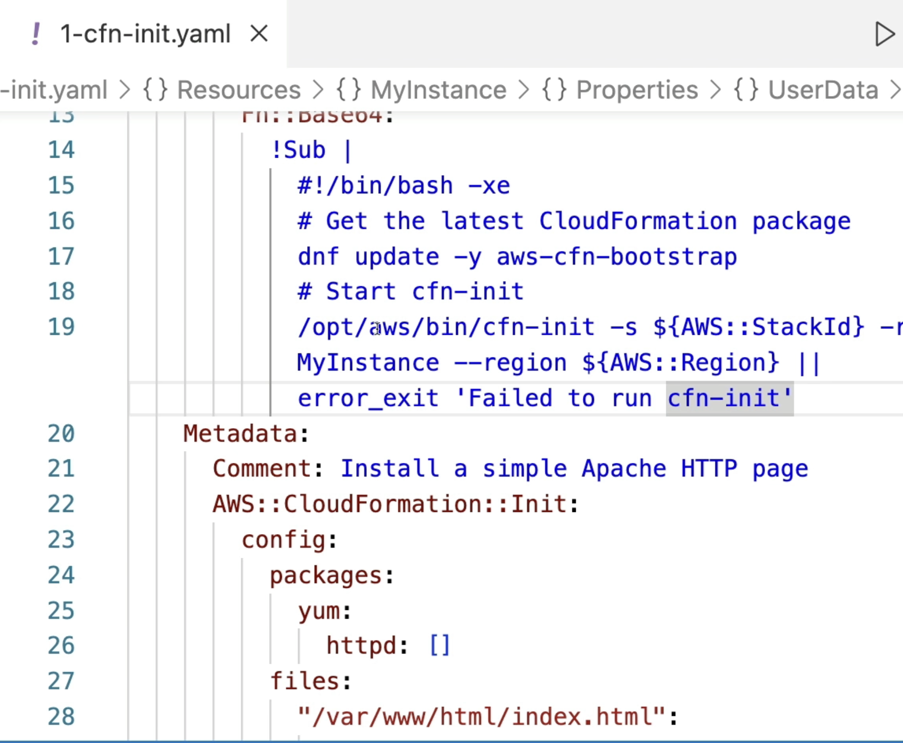

- **cfn-signal** is not really a "debug" tool, it is a synchronization mechanism. Think of it like healthchecks.io, where your script sends a "success" ping to a URL, and if the ping fails or times out, an alert/rollback is triggered). 
- for **cfn-signal** normally CloudFormation marks an EC2 instance as `CREATE_COMPLETE` as soon as it's "running", it has no idea whether your UserData/cfn-init actually succeeded inside. With a `CreationPolicy` attached, CloudFormation will pause and wait for a signal from the instance. At the end of your bootstrap script you call `cfn-signal -e $? ...`, exit code 0 means success, non-zero (or timeout with no signal at all) means failure, and then stack rolls back (deleted), like we talked about some lines above xD. This is also what makes ASG rolling update wait for each instance to be healthy before moving to the next one.
- Nested stack: DRY LOL, mindset is same with gitlab template repo.
- Depends On: depend on other resource before create xD. For example we have 2 fucking resources are EC2instances and S3 Bucket, we set S3bucket depend on EC2instance, that mean s3bucket will not create until ec2instance is created.
- StackSets: holy fucking shit, this is just deploy 1 cloudformation template to multiple AWS account and multiple fucking region at the same time.
- Drift: It is same like state drift in terraform, little different drift detection in cloudformation need to trigger manually or schedule, not like terraform plan.
- Troubleshooting: 
```
- DELETE_FAILED: some resource must be emptied before deleting such as S3 or SecGroup can not be deleted until all EC2 in the fucking group are gone. With DeletionPolicy = Retain --> skip fucking deletion.
- UPDATE_ROLLBACK_FAILED: resource changed outside of Cloudformation.
- And more, I'm fucking lazy right now!
```
- StackFailures: Onfailure = rollback (default) or Do nothing (resource in state CREATE_FAILED) for debug purpose I think or event DELETE for fucking clean.

### Conclusion

We need to understand and remember this section more because it will related to AWS Devops Pro certification path.

---

# Section 6: Lambda for CloudOps

Lambda is FAAS, run on-demand, limited by time (short executions). Lambda support container image but they are not prefer, ECS/Fargate are more preferred for running containers. And for the most important, it is integrations with a lot of AWS services by built-in.

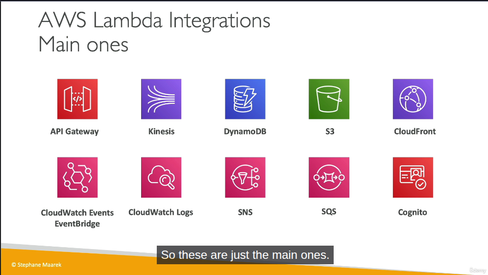

### Some note for Lambda

- Most example for Lambda is serverless cronjob I guess. 
- We can view lambda logs from CW logs. 
- Max memory supports for Lambda is 10Gb. **/tmp storage**: max is also 10GB.
- Integration with CW Events / EventBridge: Create trigger every 1 hour that trigger Lambda function to perform a specific task.

--- 

# Section 7: EC2 Storage and Data Management - EBS and EFS

### EBS Volume
It is like common volume in OpenStack, can be mounted to only 1 VM. Locked to AZ for sure, LOL.

There are some type for this volume type:

- gp2/gp3 (SSD): general purpose
- io1/io2: highest performance ssd (this is exception for multi-attach in EBS)
- st1: low cost hdd for requently access
- sc1: low cost hdd but less frequently access

Some notes:

- Remember only ssd (gp/io series) can be used as boot volume for high performance.
-  We can make EBS snapshots in AWS like snapshot in volume of OpenStack, same logic. AWS create a service called **Amazon Data Lifecycle Manager** to manage **only** creation,retention and deletion of EBS snapshots & EBS-backed AMIs. 
- Locked at the AZ level. If you need more iops and is frequently running out of iops, increase volume size of EBS.

### EFS - Elastic File System

It is fucking managed NFS. Available at region level, it means you can mount NFS from any EC2 in any AZs in that fucking region. We have lifecycle management feature - move file after N days, as a related storage service in AWS, it will have standard storage tiers:

- Standard.
- Infrequent Access (IA).
- Archive.

**In case you forget: IA and Archive will reduce cost but also increase latency**

---

# Section 8: Amazon S3

### S3 - Bucket

Same meaning with Azure Blob Storage Container. There are 2 bucket type:

- General purpose
- Directory: low-latency use cases, use only S3 Express One Zone storage class.

Hmm, let's figure why it is so fast in directory type: [High performance workloads](https://docs.aws.amazon.com/AmazonS3/latest/userguide/directory-bucket-high-performance.html#s3-express-one-zone)

- Single AZ + colocate storage with compute to reduce latency, network hops...
- Session-based authentication: It uses `CreateSession` to get temporary credentials 1 time, next requests will use session token, reduce overhead in auth a lot.
- Zonal endpoint: object operations (GET,PUT) use Zonal endpoint instead of Regional endpoint, traffic go directly into AZ, by passing regional layer xD
- No replicate cross-AZ: data only stored in 1 AZ (multiple devices for sure), not overhead for sync cross-AZ
- Custom or Purpose-built hardware: only storage data in high-performance hardware, doesn't use same infrastructure with standard S3.


### Pre-signed URL

Use case: let user download file from private S3 bucket without create IAM user or make public bucket.

How it works:

- Credential and Signature embeded directly into URL.
- Object still private, but anyone have URL can access.


### S3 security: Bucket Policy 

User-based: IAM policies

Resource-based: 

- Bucket polices - bucket wide rules from the s3 console, allow across account.
- Object ACL - fine grain
- Bucket ACL - less common 

S3 Bucket Policies is Json based policies that define :

- Effect (Allow/Deny)
- Action (Action to Allow/Deny)
- Principal (scope, account or user to apply policy to, * mean public)
- Resource (s3 path arn). Example: "arn:aws:s3:::example-bucket/*"

Use cases:

- Grant public access to the bucket
- Force objects to be encrypted at upload
- Grant access to another account (Cross Account)

### AWS S3 Access Methods from an EC2 Instance

Not related to the exam, but I want to put here to improve my understand. There are two primary ways to grant an Amazon EC2 instance access to an AWS S3 bucket.

**Method 1: Using IAM Roles (Recommended / Best Practice)**

- Mechanism: Attach an IAM Role (via an IAM Instance Profile) directly to the EC2 instance.
- Authentication: The AWS CLI/SDK inside the VM automatically retrieves temporary, rotating credentials from the Instance Metadata Service (IMDS) at [http://169.254.169.254](http://169.254.169.254).
- Configuration: No credentials configuration required inside the VM. You only need to install the AWS CLI and run commands immediately.
- Security: High security. It eliminates the risk of hardcoded keys and avoids credential leakage since AWS manages key rotation automatically.

**Method 2: Using IAM User Credentials (Not Recommended for EC2)**

- Mechanism: Create a dedicated IAM User and generate a pair of long-term Access Key ID and Secret Access Key.
- Authentication: The VM authenticates using these static, long-term credentials.
- Configuration: Requires manual setup inside the VM by either running aws configure (saved in ~/.aws/credentials) or injecting them as environment variables (**AWS_ACCESS_KEY_ID** & **AWS_SECRET_ACCESS_KEY**).
- Security: Low security for EC2. If the VM is compromised or the image is shared, the static credentials could be exposed, leading to unauthorized access from anywhere.

Key Takeaway:

- Use Method 1 (IAM Role) for resources inside AWS (like EC2 instances).
- Use Method 2 (IAM User) only for resources outside AWS (like local development machines or external servers).

Not related but for IAM User, without checking the **Provide user access to the AWS Management Console** option, we are essentially creating a **Machine-to-Machine (M2M) / Robot account** meant solely for programmatic access via APIs, CLI, or SDKs.

### Troubleshooting

After enable Versioning, you have to wait atleast 15 minutes to be fully progated. During that time you may expected error: **HTTP 404 NoSuchKey** when trying to get Objects created or updated.

### S3 Replication (CRR & SRR)

Replication using asynchronous mostly all the time. Same for Azure storage blob container, we need to enable versioning for replication! Use cases:

- **CRR**: Compliance (store data in required region), low latency access from user region, replication across account
- **SRR**: log aggreration (Like Mysql master-slave, we did analytic from slave node, not master node). Live replication between prod and test account

Only new objects are gonna replicate after enable replication, if you want replicate exists object, use S3 Batch Replication. Version ID also going to get replicated in destination bucket xD

We can replicate delete markers from source to target, Deletions with version ID are not replicated, prevent malicious deletes.

AWS S3 Replication Time Control (RTC) guarantees that 99.99% of new objects are replicated within 15 minutes. This feature behaves similarly to MySQL Slave Replication Lag. We can set up a CloudWatch Alarm to alert us if the replication delay exceeds xxx seconds, akin to monitoring Seconds_Behind_Master in a MySQL replica. Ofcourse, there is no fucking free lunch, extra cost per GB for the replication!

Another use case we can do with Batch Replication is add tag to object using job with manifest that contains bucket and path for objects we want to.

--- 

# Section 9: Advanced Amazon S3 & Athena

### Comparison vs Azure storage classes

| Azure Tier | Equivalent AWS Storage Class | Access Frequency | Min Storage Duration | Retrieval Time |
| :--- | :--- | :--- | :--- | :--- |
| **Hot** | **S3 Standard** | High (Frequently accessed data) | None | Milliseconds |
| **Cool** | **S3 Standard-IA** (Infrequent Access) | Low (Accessed 1-2 times/month) | 30 days | Milliseconds |
| **Cold** | **S3 Glacier Instant Retrieval** | Very low (Accessed once a quarter) | 90 days | Milliseconds |
| **Archive** | **S3 Glacier Flexible Retrieval** | Archive (Rarely accessed data) | 180 days | 1 minute to 12 hours |
| *(N/A)* | **S3 Glacier Deep Archive** | Deep Archive (Lowest cost backup) | 180 days | 12 to 48 hours |

### S3 Analytics - Storage Class Analysis

Great feature, that help you decide when to transition objects to right storage class for cost saving. Recommendations for Standard and Standard IA (Infrequently Access). Output file is CSV report

Report is updated daily, 24-48 hours to start seeing data analysis.

### Lifecycle policies

Moving between storage classes, alright? We could have 2 separated transition, one for **current version** and one for **non-current version**.

### S3 Event Notification

Handle event happens in S3 bucket, then trigger to SNS/SQS/Lambda for handle event. And yeah, everything required permission, SNS/SQS/Lambda are not an exception.

So let's take an example for SNS topic, we create IAM Policy that attach to SNS Topic to allow S3 bucket send message directly to SNS Topic, same for SQS queue and Lambda function.

Basically, you attach this **Resource-based Policy** to the **destination** (SNS Topic, SQS Queue, or Lambda Function). **NOT** the S3 bucket:

- **SNS Topic Policy**: Allows S3 to perform `sns:Publish` on the topic.
- **SQS Queue Policy**: Allows S3 to perform `sqs:SendMessage` on the queue.
- **Lambda Function Policy**: Allows S3 to perform `lambda:InvokeFunction` on the function.

Generic template:
```json
{
  "Effect": "Allow",
  "Principal": { "Service": "s3.amazonaws.com" },
  "Action": "sns:Publish", // OR sqs:SendMessage OR lambda:InvokeFunction
  "Resource": "arn:aws:...", // ARN of SNS/SQS/Lambda
  "Condition": {
    "ArnLike": { "aws:SourceArn": "arn:aws:s3:::my-bucket" }
  }
}
```

And one more thing that all events from S3 will be send to AWS EventBridge, so from EventBridge can we have rules sent to more than 18++ AWS services as destination. EventBridge provide more options like Advanced Filter(metadata, object size...), Multiple Destination, EventBridge Capabilities... and so on. Worth to mention, AWS EventBridge = event-driven.

### S3 Inventory

List objects and their corresponding metadata. Usage:

- Audit and report on the replication and encryption status of objects
- Get the number of objects in S3 Bucket.
- Identify the total storage of previous object versions.


### Athena

Serverless query service to analyze data stored in S3. Hmm, this shit is powerful!

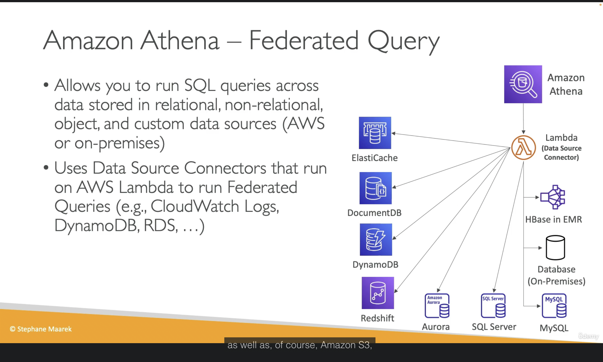

Result can be stored in S3 Bucket for later analysis.

And again, there is no fucking free lunch. [Core Pricing Metric](https://aws.amazon.com/athena/pricing/): $5 per 1 TB of data scanned

- Athena does not charge based on query execution time.
- Athena does not charge based on the amount of data returned (result set).
- It charges you strictly based on the total volume of data it has to read (scan) from S3 to fulfill your query.

Crucial Real-World Example:

- You have a 2 TB uncompressed text log file (CSV/JSON) stored on S3. You run a simple query: SELECT * FROM table LIMIT 10;.
- Because raw text files lack an intelligent columnar layout or metadata index, Athena is forced to scan the entire 2 TB file from top to bottom just to find those 10 rows.
- The result: That single query will cost you $10 in just a few seconds. If a BI Dashboard or an automated script triggers this query 50 times a day, you will burn $500/day instantly.

That is enough I guess, there are other information related to convert Columnar (Parquet / ORC) to reduce data scan, partition data, gzip data and more....

---

# Section 10: Amazon S3 Security

- VPC Gateway Endpoint for Amazon S3: No idea, only remember use VPC Gateway Endpoint to access S3 privately from EC2 for exam...
- IAM Access Analyzer for S3: Ensure that only intended people have access to ur S3 buckets, we can review it is normal, expected or un-expected so you have right action to do.

# Section 11: Advanced Storage Section

### Amazon FSx

Use cases:

- FSx for Windows: sharing disk that support Windows (SMB/NTFS), auto scale up/down. Managed service
- FSx for OpenZFS: High performance, high speed for Linux.
- FSx for Lustre: super performance for HPC/AI for Linux
- FSx for NetApp OnTap: Support both of Window/Linux, for lift and shift to cloud.

Summary: Higher performance than EBS/EFS but cost more money, right?

### AWS Storage Gateway

Bridge between on-premises data and cloud data. Use cases:

- DR
- Backup & Restore... and more

Types of Storage Gateway:

- S3 File Gateway: POSIX compliant (Linux filesystem)

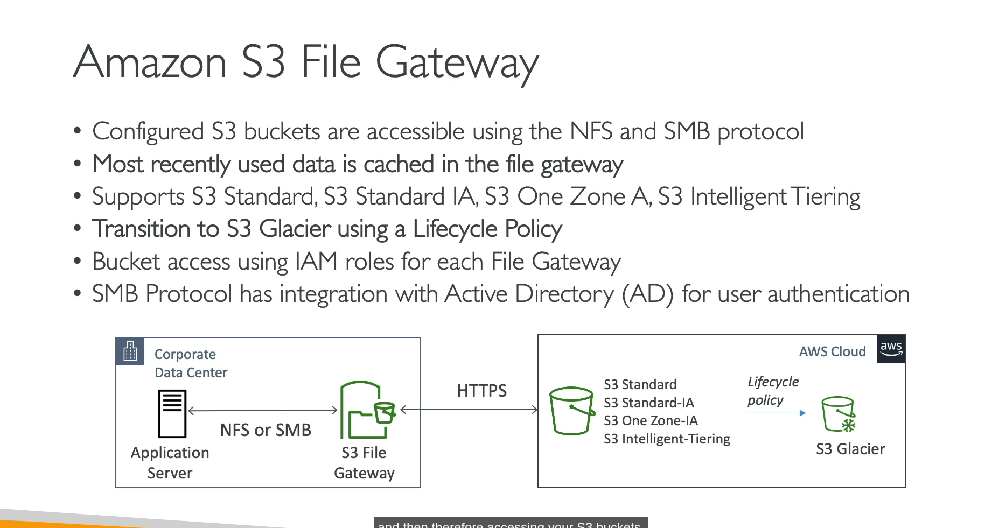

- Volume Gateway
- Tape Gateway

Better to take a picture for summary....

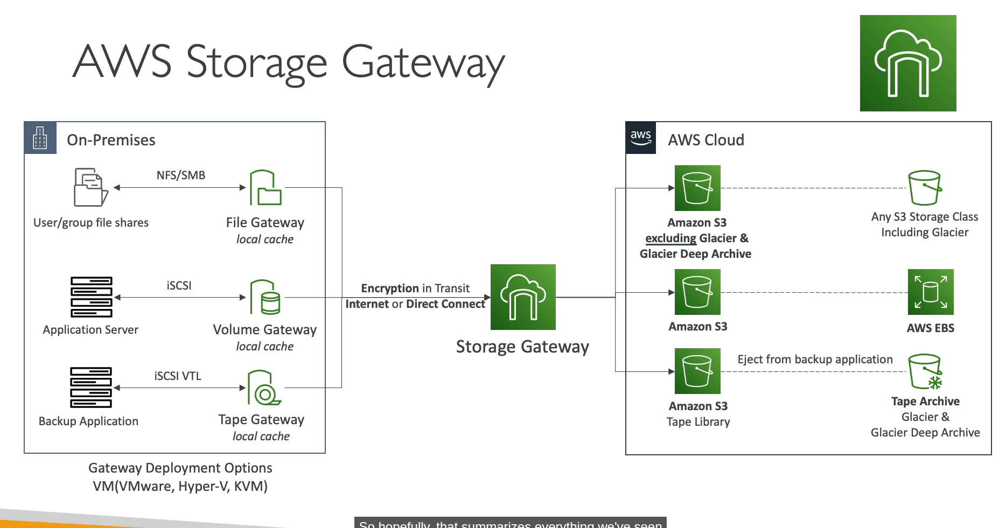


Storage Gateway VM is an on-premises virtual machine that bridges local servers to AWS cloud storage using standard file protocols.

### Little shit for exam:

- Hybrid, Extend on-premises storage (Extend local disk), pick Storage Gateway
- Migrate Windows File Server to Cloud, pick Amazon FSx for windows
- Shared storage for thousands of EC2/GPUs for HPC/AI training -> Pick FSx for Lustre (EFS/EBS can't handle the bandwidth).
- Enterprise needs NetApp ONTAP features (SnapMirror / Deduplication / Multi-protocol) -> Auto-pick FSx for NetApp ONTAP.
- Replace physical tape drives / Backup tape to cloud -> Auto-pick Tape Gateway (AWS's classic legacy backup trap).

# Section 12: CloudFront

CloudFront = CDN xD

### CloudFront - Origins

- S3 bucket / Custom Origin (HTTP/S3 website)
- VPC Origin: Private ALB/NLB/EC2 instances

So basically we can make website from S3 bucket without making public bucket by assign right policy for CloudFront (via OAC - Origin Access Control), CloudFront will serve request from user then use it's permission to access S3 data and return to user.

Origin Shield: a cache for your cache.

Every request made to CloudFront into a logging S3 bucket, that is where access logs stored.

### CloudFront reports

We are able to generate reports on the data from Access Logs

- Cache Statistics Report
- Popular Objects Report
- Top Referrers Report
- Usage Reports
- Viewers Reports

### CloudFront with ALB sticky sessions

- Client must send Cookie within request to CloudFront
- Then CloudFront must forward/whitelist the cookie that controls the session affinity to the origin to allow the session affinity to work.
- You must set TTL to a value lesser than when the authentication cookie expires

### AWS Global Accelerator

- Unicast IP: one server holds one IP address
- Anycast IP: all servers hold the same IP address and the client is routed to the nearest one. Holy shiet, for real?

Yes, AWS Global Accelerator use Anycast IP concept to works.

Compare vs CloudFront

- CloudFront: Improve performance for both cacheable content, dynamic content and content is served at the edge location.
- Global Accelerator: Improves performance for a wide range of application over TCP or UDP, proxying packets at the edge to applications running in one or more AWS region.

---

# Section 13: Databases for CloudOps


### RDS Read Replicas and Multi AZ

I write some notes because this will appear in exam xD.

RDS read replicas for read scalability:

- Up to 15 read replicas (holy fucking shit, 15 replicas node. LOL. In entire my career, maximum slave node was only 3 which split into 3 zones not include master node).
- Available within AZ, Cross AZ or Cross Region.
- Replication is ASYNC.
- For RDS Read Replicas within the same region, you don't need pay the network fee when data goes from current AZ to another AZ.

RDS Multi AZ (DR):

- Auto failover/promote standby to active.
- The read replicas can be setup as Multi AZ for DR

From Single-AZ to Multi-AZ: new DB is restored from snapshot in new AZ then synchronization is established between the two databases.

### Extra section not related to AWS

Ok, there are 3 replication formats in MySQL, but worth, really worth to understand how Mysql Replication works!

- **Statement-based replication**: master write exactly query we did, then slave replay it. Cons: will be issue if related to function like `NOW()`. Because `NOW()` from master at 12:00 will be something like 12:03 in slave, diff issue bro!
- **Row-based replication**: instead of write query SQL, master will record every change of "rows" (data changed). So Slave will replay exactly what is binlog, no diff issue. Cons: if we run update that target 1M rows, Binlog will increase way too big instead write simple 1 sql query.
- **Mixed-based replication**: This is default method of modern MySQL and is exactly what AWS RDS use in common I guess xD. It will make priority for Statement-based, but if any query contain something dangerous like **NOW(), UUID(), RAND()**, it will convert to **Row-based** to make data consistency!

How sync work in Threads? So to understand why it called Async, we need to imagin that in replica side, there are 2 Threads work separately:

- **IO Thread** (Ship): This shipper have a mission that connect to Master, if see any new Binlog, it will copy back into Slave node to a temp file called "Relay Log".
- **SQL Thread** (Worker): This worker just collect row/qery from Relay Log to replay data into Slave node.

### Performance Insights

This feature expensive AF, I think most company will use self-hosted stack instead using AWS if there are giant log/metric (high throughput/high cardinality)!

### Other shit

I don't mention them here because personally I think I understand them enough, I can reflection self-hosted in on-premises versus managed service in AWS...

I spent 15-20 minutes to watch whole section xD

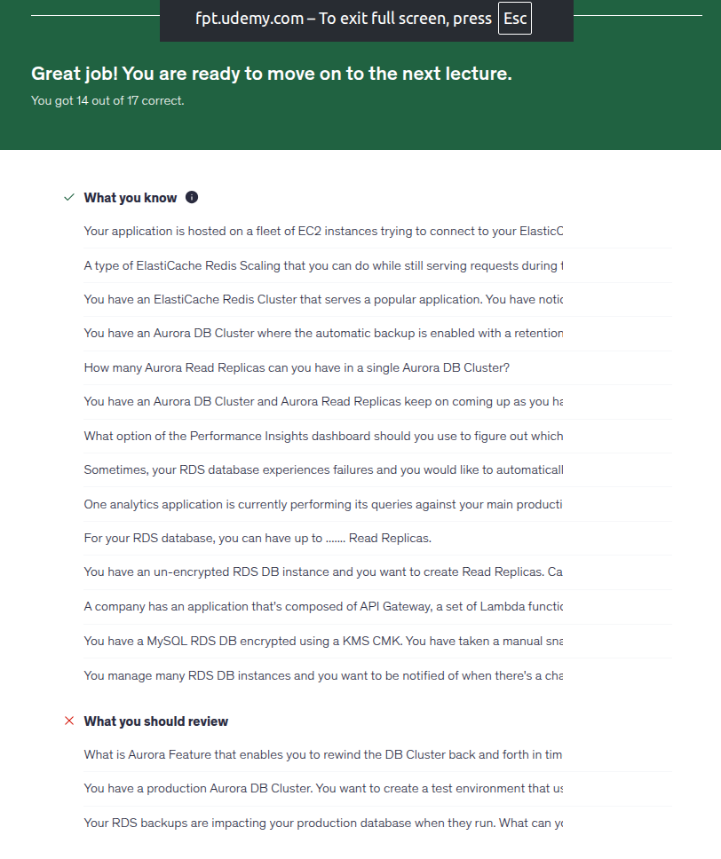

I fail with RDS backup, it only able to take backup from standby, even Read replicas still is a standby with read traffic, so it can not make sure you have the fucking latest data to promote standby to active. And 2 fail question because I did skip them xDD

---

# Section 14: Monitoring, Auditing and Performance

Holy fucking shit, pay more to gain more metric or faster interval when we have fucking Prometheus/victoriaMetrics! And custom metric for what when we have fucking node exporter that include 99% what we need. For anomaly detection instead of using CloudWatch we can use following in Prometheus for example:

- [predict_linear](https://prometheus.io/docs/prometheus/latest/querying/functions/#predict_linear)
- Compare current week with last week:
```
# Alert if current traffic is higher 50% than last week at this time!
abs(
  (rate(http_requests_total[5m]) - rate(http_requests_total[5m] offset 1w))
  / 
  rate(http_requests_total[5m] offset 1w)
) > 0.5
```

Custom dashboard in CloudWatch (3$/month after free dashboard)? Hmm, we have metrics, we can draw any dashboard we want in Grafana. 

CW Synthetics Canary = **Blackbox Monitoring** like zabbix/prometheus blackbox exporter. But Synthetics Canary can do more with headless google chrome browser, not only monitoring....


### EventBridge Content Filtering
Worth money feature I guess.

**Cost optimization**:

- Without filtering: lambda trigger 1M times --> holy fucking AWS billing
- With filtering: EventBridge stop right front door, only event have right condition go through to trigger Lambda.

**Decoupling**: No need to handle if/else for event in Lambda

**Powerful Matching Operators**: Check exists, filtering numberic range, filtering with suffix,prefix, ip address....

**With Input Transformation**: zero cost and cost saving because we don't need to parse data and it is fucking free!


### AWS CloudTrail

- Get history of events / API calls made within your AWS account.
- Audit for your account, enable by default.
- If a resource is deleted in AWS, investigate CloudTrail first!
- Stored for 90 days.

### AWS Config Overview

AWS Config = Azure Policy + Azure Resource Graph

Record configuration Changes and evaluate resources against compliance rules, remediation action...

**Configuration timeline / time travel**: Like 2h AM last sunday, how EC2 instance is configured with which spec, secGroup open which port???

**Resource Relationship Tracking**: visualize relationship between resources. If EBS config changed, AWS Config tell exactly where EBS disk is attached to which EC2, which VPC!

---

# Section 15: AWS Account Management

### SCP - Service Control Policy

So for example, we can restrict specific AWS account in our Org that not able list s3 buckets by use Deny action on s3:ListAllMyBuckets, even that account has Admin. Example SCP code:
```json
{
  "Version": "2012-10-17",
  "Statement": [
    {
      "Sid": "DenyAllFuckingListBuckets",
      "Effect": "Deny",
      "Action": [
        "s3:ListAllMyBuckets"
      ],
      "Resource": [
        "*"
      ]
    }
  ]
}
```

SCP doesn't work with Management Account, it is able to deny root user aswell.

In fact, SCP is just a filter. It does **not** grant permissions; it only sets the maximum permission boundaries (the "guardrail").

- If the SCP **allows** it, but the user's IAM Policy **does not**, the user **cannot** do it.
- If the IAM Policy **allows** it, but the SCP **denies** it (or doesn't allow it), the user **cannot** do it.

Think of it exactly like a **Network ACL (NACL) and a Security Group (SG)**:

- **NACL (SCP)**: Subnet-level firewall (defines what can/cannot enter the account).
- **Security Group (IAM Policy)**: Instance-level firewall (defines what the specific identity is actually permitted to do).
- **Rule**: Both must allow the action. If either blocks it (or doesn't allow it), the action is denied.

### Other shit

- AWS Control Tower = Azure Landing Zone. AWS Control Tower is service that handle multiple aws account or orchestrator.
- AWS Service Catalog: self-service portal with tag option(group them by tag)... Seem like **Backstage**! And able to share service catalog to other account in same ORG. User can use service catalog to deploy safely, no need admin aws permission!
- Create Billing alarm with CW metric and SNS topic:
    - **Important constraint**: The billing metric (`EstimatedCharges`) is **only** available in `us-east-1` (N. Virginia). [You must create the alarm there](https://docs.aws.amazon.com/AmazonCloudWatch/latest/monitoring/monitor_estimated_charges_with_cloudwatch.html#creating_billing_alarm_with_wizard).
    - **Prerequisite**: You must enable **"Receive Billing Alerts"** in the Billing Preferences console first.
    - **Frequency**: The metric is updated only every 4-6 hours (not real-time).
    - Basically when the metric reaches the threshold, CloudWatch Alarm pushes a message containing alarm info (alarm name, reason, cost details) to the SNS topic, which notifies subscribers (emails, webhooks).
- AWS Billing Conductor for customizing and presenting AWS billing data, common use cases: enterprise, finance team, managed service provider (MSP)...

---

# Section 16: Disaster Recovery

### AWS Datasync

- Move large amount data to and from: on-prem/other cloud to AWS, need to install aws agent. And AWS to AWS no need to install agent
- Synchronize: Amazon S3 to any storage class for example (Glacier)
- Replication tasks can be scheduled hourly, daily, weekly.

### Other shits

- When enable backup vault lock policy, we can not delete backups even we are using root user.

---

# Section 17: Security and Compliance for CloudOps

Quick remember:

- WAF = Layer 7
- Firewall Manager = Centralized Security Management
- Shield = DDOS Protection
- Amazon Inspector: analyze issue in EC2, image in ECR, Lambda functions only!
- Amazon GuardDuty: analyze your log to detect threats. CloudTrail, VPC Flow Logs, DNS logs....
- Amazon Macie: Protect sensitive data in AWS...
- AWS Security Hub: Central security tools....
- AWS Secret Manager = Hashicorp Vault for an easy reflection!

---

# Section 18: Identity

- AWS Identity Federation: no idea... Example: provide access to write to s3 bucket using facebook login... (Like Entra ID B2B/B2C)
- AWS STS - Security Token Service.
- IAM Policy Simulator: testing policies....

---

# Section 19: Networking - Route 53

Even thought there are a lot of basics, but some basics I don't understand enough so I will write down here!

Let's compare Simple route vs Weighted route first. I didn't understand this back in 2024 when I use self-hosted DNS.

| # | Simple | Weighted | Multi-Value |
| --- | --- |  --- |  --- |
| Records return | All ip in records | Only 1 | Up to 8 |
| Health check| No | Yes | Yes |
| Loadbalancer | Roundrobin | Probabilistic (by weight) | Roundrobin | 

Other routing policies:

- **Geolocation**: based user location or where user want to be from (VPN xD)
- **Geoproximity**: pretty new for me, route traffic to your resources based on the geographic location of users and resources. For example we need to remember this keyword for shift traffic by increasing bias....
- **IP-based routing**: routing based on client's IP address. Use case: optimize performance, network costs. Example: route end users from a particular ISP to a specific endpoint..
- **Alias Record**: This is fuckin' unique feature of AWS only that allow map domain to AWS services directly, use-able on root domain also and free fuckin' traffic DNS fee!
- **Inbound resolver**: On-premise ask AWS.
- **Outbound resolver**: AWS ask On-premise.


Other shits:

- **Route 53 Query Logging for Public Hosted Zones**: Enabled directly on the hosted zone. Logs are sent **only** to **CloudWatch Logs** (the log group **must** be created in `us-east-1`).
- **Route 53 Resolver Query Logging for Private Hosted Zones / VPC queries**: You cannot enable query logging directly on private hosted zones. Instead, you must use **Route 53 Resolver Query Logging** at the VPC level. These logs can be sent to **CloudWatch Logs, S3, or Kinesis Data Firehose**.
- **Resolver DNS Firewall**: filter `outbound` DNS queries going out through Route53 resolver.
- If we want setup APEX Domain (It is fuckin' Alias Record) for S3 bucket with static hosting enabled, the bucket name must the same as APEX Domain (Root domain, zone Apex....)

---

# Section 20: Networking - VPC

When you create a subnet remember that you are only able to use subnet range - **5 IPs** that is reversed by AWS, pretty same like how VPC in Azure works! The smallest subnet you can use is **/28** which has 16 IPs total - 5 reversed IPs = 11 useable IPs!

Actually, we're gonna make a lot of fun together. **[Insert Tuco sentence from Breaking Bad here 0:51](https://www.youtube.com/watch?v=njtfNPB-YKg)**

### Subnets

You may see a lot of tutorial related to create public/private subnet in VPC in AWS. But you may don't know why like me in the past xD, let's talk about it:

- **Private Subnet**: we often use this to place our applications, for example EC2 instances running Web/Application workloads.
- **Public Subnet**: Bastion, ALB. For example, we would never put DB instances in a Public Subnet, for interface facing.

Without route table, can we use EC2 instance connect? No, it still need access to establish SSH to IP of EC2 instance, because without routing properly (missing route 0.0.0.0/0 that point to IGW), so packet return from EC2 don't know which way for packet return back to AWS/Internet. This is easy to understand if you have working in the past with VMWare VDC.

With EC2 Instance Connect Endpoint (EIC Endpoint), released in 2023, no need route to IGW, no need public IP either!

So for 3 tiers application as theory:

- **Presentation tier**: ALB -> Public Subnet (require atleast 2 AZ for HA)
- **Application tier**: EC2 instances/ECS/EKS Worker group....  -> Private Subnet
- **Data tier**: RDS -> Private subnet, different with subnet of application tier

### NAT Gateway

Pretty sure it is fuckin' easier than NAT Instance, because it is fuckin' managed service. You only need to add route from your instance to NAT Gateway, that's all! 

### NACL

- NACL works at subnet level, not instance level like SecGroup.
- Not like SecGroup which is stateful, NACL is stateless, need define rule for both inbound/outbound!
- Rule based number, lower number, higher priority. Support both Allow/Deny while SecGroup has only Allow. If you have rule number 100 is Deny and rule number 120 is Allow, then it will deny and stop processing for that target!
- Each VPC has a default NACL, auto allow all traffic in/out and attach by default for all subnet in that VPC.
- 1 VPC can have more than 1 NACL (Default NACL + custom NACL).
- Please don't modify default NACL, instead create fuckin' custom NACLs.
- 1 subnet can have only 1 NACL attached at the same time, 1 NACL can attach to multiple subnets.

### VPC Endpoints

Private endpoints connection, we have 2 type of endpoints:

- **Interface Endpoint**: Creates an ENI (Elastic Network Interface) with a private IP in your subnet.
    - **Security**: You can attach a Security Group directly to it to control inbound traffic (e.g., allow port 443 from your App instances).
    - **Resolution**: Uses Private DNS to map the AWS service endpoint directly to this private IP.
    - **Coverage**: Supports most AWS services.
    - **Cost**: Costs money per hour and per GB data processed.
- **Gateway Endpoints**: Free!. Muse be used as target in route table, it means you need to add route for specific ip range via Gateway Endpoints. Only support S3 and DynamoDB

### Other shits:

- You need to know how to calculate CIDR in your head without CIDR tool during exam xD. For example 10.0.4.0/28. So 32-28=4, 2^4=16 (16 IPs). Then you can see what is right answer here. Note: I wish I understand this earlier during AZ-104 exam....

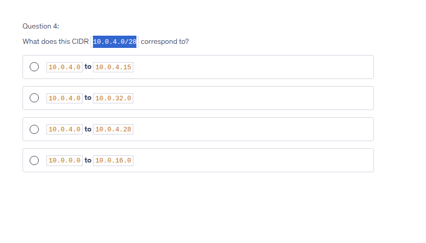

- For example with octet like /24, /16/, /8
```
First-Second-Third-Fourth
/24: only 4th can change
/16: from 3rd to 4th can change
/8: from 2nd to 4th can change
```

- Ok, why this is wrong answer? 

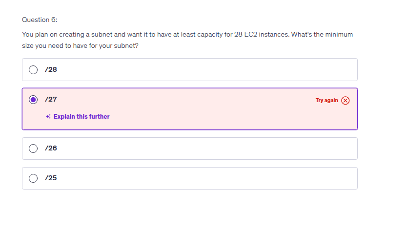

- 32-27 = 5. 2^5 = 32, seem fit right?. But it required at least capacity for 28 EC2 instances and I forgot there are always 5 IP reversed by AWS!. So 32-5 = 27 useable IPs!. So the damn correct fuckin' answer should be /26!

- [max CIDR size in AWS](https://docs.aws.amazon.com/vpc/latest/userguide/vpc-cidr-blocks.html) is /16. Smallest is /28 ( 16 IPs)

- [AWS Network Firewall](https://aws.amazon.com/network-firewall/) is a managed, stateful Layer 3 to Layer 7 service for Amazon VPCs. It offers deep packet inspection, intrusion detection and prevention (IPS), and web filtering...
- [Customer-managed prefix lists](https://docs.aws.amazon.com/vpc/latest/userguide/working-with-managed-prefix-lists.html) allow you to define and maintain your own sets of IP address ranges, known as prefixes, within AWS.
- **VPC Reachability Analyzer tool**: analyze connection between 2 VPC, show which component not allow/block connection. Cost money for each analyze!
- **VPC peering**, this is easy to understand, right? But even you setup already in dashboard, you still need to modify both route table on both side the VPC you are connecting, so each subnet knows how to route traffic through the peering connection. It is pretty easy to understand if you are familiar with setup routing in Linux.
- Like other **VPC Peering**, for example Azure, VPC Peering is not transitive!
- So you know limit with VPC Peering, we have Transit Gateway that able to resolve pain of VPC Peering in scenario you have thousands of VPC....
- **VPC Block Public Access (BPA)**: A global "kill switch" at the Account/Org level to block all Internet Gateway (IGW) traffic to prevent accidental public exposure. You can exclude/whitelist specific subnets (like ALB/Bastion) that need internet.

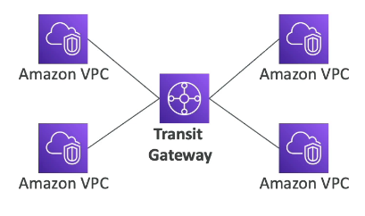

- The picture above is for 1 region, how about multiple region? we have inter-region communication

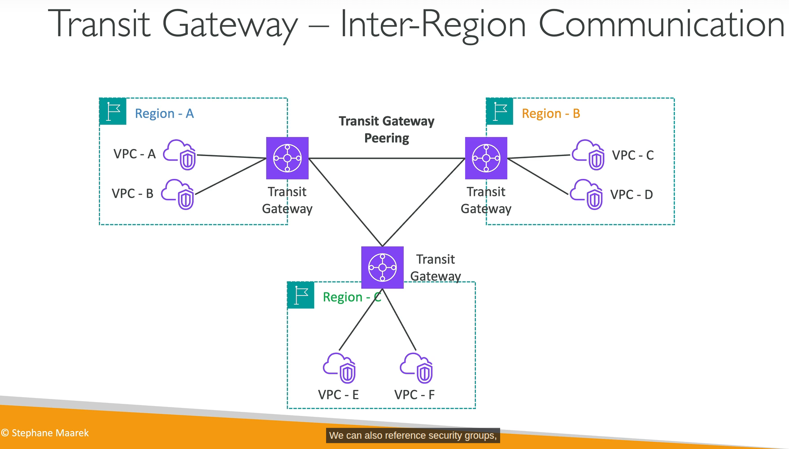

- **AWS PrivateLink**: connect to your service in other VPC without exposing to public.
- **Traffic Mirroring**: yes, mirroring, you know what it means. Use case route the traffic to security appliances that you manage to analyze traffic without affect production workload!
- **Egress-only internet gateway**: Used for IPv6 only. You must update the route tables like IGW or NAT GW. Oh IPv6 have no fuckin' private address, they are all public/route able in internet! So your EC2 instance may have IPv6 but it may get un-wanted access. That is why we have fuckin' Egress-only internet gateway! Nice thing to know about IPv6! This is what I really love when learning!
- Egress-only IGW is fuckin' free! It doesn't need to translate private ip to public ip like NAT Gateway (IPv4)!
- [VPC Block Public Access](https://aws.amazon.com/blogs/networking-and-content-delivery/vpc-block-public-access/) is a simple, declarative control that authoritatively blocks incoming (ingress) and outgoing (egress) VPC traffic through AWS provided internet paths!
- Again, SecGroup is stateful and NACL is stateless. Remember it! On-prem reflection: Openstack vs Vmware VDC!

---

# Section 21: Other Services

I will review this section after I took exam, nothing much to write here right now!

### SQS

- Send msg to DLQ after x times process fail!
- Visibility Timeout: when a consumer receive msg from SQS, that msg will be hidden from queue during processing time. If consumer process more than Visibility Timeout without haven't call deleteMsg action, SQS think that consumer dead, return msg to queue, other consumer or "fake dead" consumer process it again --> duplicate process. 
- SNS Filter Policy: Imagine we have multiple subscribers, for example: Billing, Shipping, and Fraud Detection systems. When we publish a message, by default all subscribers receive every message, even if it's not relevant to their logic. That's why we use an SNS Filter Policy: we attach a filter policy to each subscription, based on message attributes (e.g., messageType: billing), so each subscriber only receives the messages that match its filter — instead of processing every message and discarding irrelevant ones.
- X-Ray = distributed tracing service, sidecar container is 1 way to deploy daemon for EKS/ECS. Other shits are EC2/Lambda.

---

# Tip trick

### Read the damn question carefully!!!

LOL, I don't read questions careful enough. For example:

```
You have attached an Internet Gateway to your VPC, but your EC2 instances still don't have access to the Internet. What is NOT a possible issue?
```

- I pick route table are missing, wrong!
- I pick NACL doesn't allow network traffic out, wrong again!
- I pick the EC2 instance doesn't have a fuckin' public IP, still wrong! WTF!!!

Wait a minute....  What is "NOT" a possible issue. Then I realized....

NOTE: As of March 28, 2023, the AWS Certified SysOps Administrator - Associate exam will not include exam labs until further notice..... They should make exam hard like Azure (AZ-104) hard AF!!!!

---

# Secret Weapons

---

# Conclusion