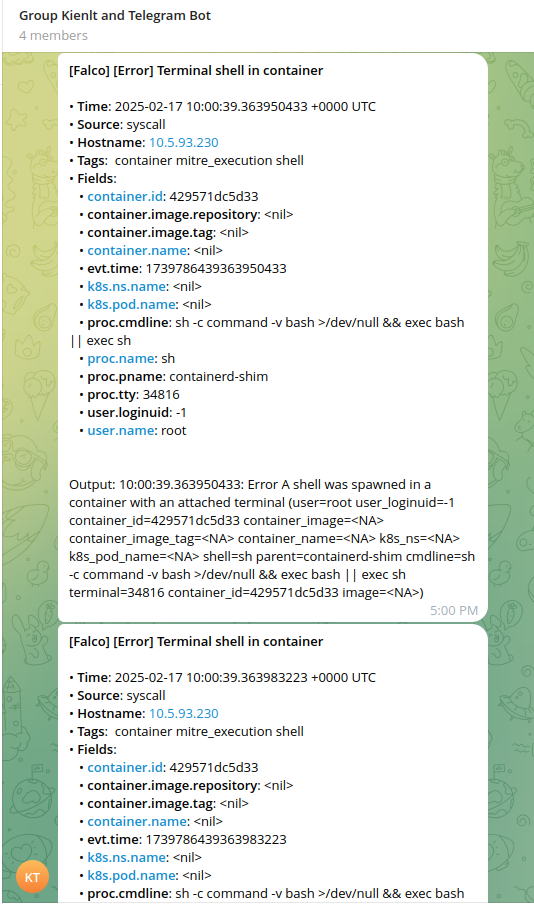
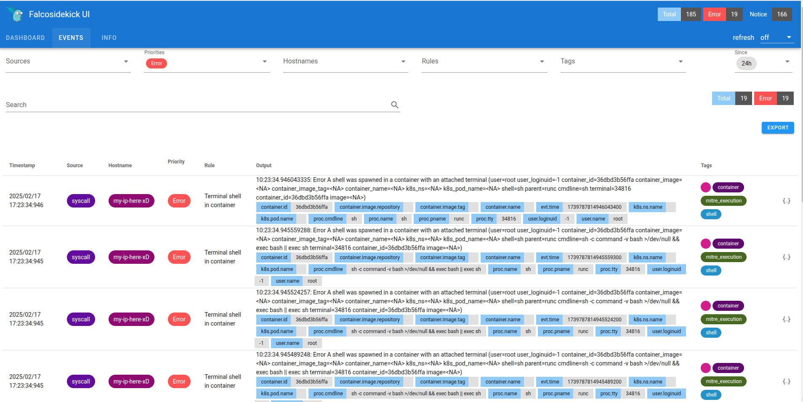

Title: Practical DevSecOps: Hardening and Monitoring: Benchmarking and Runtime Security in DevSecOps - Part 2
Date: 2025-02-17
Category: Knowledge Base
Tags: k8s, devsecops

### This series will contain 3 parts:
- Part 1. Secure Coding Practices: Tools and Techniques for DevSecOps.
- Part 2. Hardening and Monitoring: Benchmarking and Runtime Security in DevSecOps. (**We are here!**)
- Part 3. Automating Security: Integrating DevSecOps into CI/CD with Jenkins.

# Component in this part
- Open Policy Agent (OPA)
- Cis Benchmarking and Kube-bench
- Falco
- KubeSec/Kube-scan
- Istio & mTLS

---

# 1.Open Policy Agent
Open Policy Agent (OPA) is an open-source, general-purpose policy engine that allows you to enforce policies across a wide range of systems and services. Here are the key points about OPA:

### What is OPA?
- Purpose: OPA is designed to decouple policy decision-making from the application logic, providing a unified way to enforce policies across your stack.
- Language: OPA uses a high-level declarative language called Rego to write policies.
- Flexibility: It can be integrated with various systems such as Kubernetes, CI/CD pipelines, API gateways, microservices, and more.

### It looks like things are complicated, right? Don't worry, i will provide simple examples
Challenges:

- I don't allow image tags to be `latest` which can be security considering.
- I don't allow images to run as a `root` user.
https://github.com/BlackMetalz/kube-bench/commit/0e716371dc4f81b01532a6e3cb1fa81885b9a8df
So how can I prevent them when building images?

- I will use `openpolicyagent/conftest` to test it.
- I built an image with the policy defined here: https://github.com/BlackMetalz/opa-custom
- Usage: `docker run - rm -v $(pwd):/project kienlt992/opa-custom:v0.56.0 test Dockerfile`. Output example:
```
5 tests, 5 passed, 0 warnings, 0 failures, 0 exceptions
```
- Let's try with the  image to have root user and the latest tag
```Dockerfile
# Build stage
# 3.10-alpine3.19
# FROM python:3.10-alpine3.19
FROM python:latest
# Switch to root user to install dependencies
USER root
```

Output example:
```bash
docker run - rm -v $(pwd):/project kienlt992/opa-custom:latest test test_Dockerfile/Dockerfile
FAIL - test_Dockerfile/Dockerfile - main - Line 3: do not use 'latest' tag for base images
FAIL - test_Dockerfile/Dockerfile - main - Line 5: Running as root user is forbidden
5 tests, 3 passed, 0 warnings, 2 failures, 0 exceptions
```
So when we integrate this into the CICD Pipeline, it will break the build if checks are not passed!
You can add more custom rules with your policy.

---

# 2. Kube-bench
Kube-bench is a tool that Checks Kubernetes Security Configuration:

- Runs automated tests against your Kubernetes clusters.
- Verifies compliance with the CIS benchmark of K8S (a set of globally recognized best practices for securely configuring IT systems).
- Tests both control plane and worker nodes.

### Installation:
```bash
wget "https://github.com/aquasecurity/kube-bench/releases/download/v0.10.2/kube-bench_0.10.2_linux_amd64.deb"
sudo apt install -f ./kube-bench_0.10.2_linux_amd64.deb
```

### Usage:

- You need to install it to every node, yes holy shiet indeed if you want to use kube-bench cli.
- Run with example output in a worker node using a version of rke1: `v1.28.9` so i would like to use profile `rke-cis-1.24` to benchmark
```bash
# kube-bench - benchmark rke-cis-1.24 
[INFO] 4 Worker Node Security Configuration
[INFO] 4.1 Worker Node Configuration Files
[FAIL] 4.1.1 Ensure that the kubelet service file permissions are set to 644 or more restrictive (Automated)
[PASS] 4.1.2 Ensure that the kubelet service file ownership is set to root:root (Automated)
[PASS] 4.1.3 If proxy kubeconfig file exists ensure permissions are set to 644 or more restrictive (Manual)
[PASS] 4.1.4 Ensure that the proxy kubeconfig file ownership is set to root:root (Manual)
[PASS] 4.1.5 Ensure that the - kubeconfig kubelet.conf file permissions are set to 644 or more restrictive (Automated)
[PASS] 4.1.6 Ensure that the - kubeconfig kubelet.conf file ownership is set to root:root (Manual)
[PASS] 4.1.7 Ensure that the certificate authorities file permissions are set to 644 or more restrictive (Manual)
[PASS] 4.1.8 Ensure that the client certificate authorities file ownership is set to root:root (Manual)
[FAIL] 4.1.9 Ensure that the kubelet - config configuration file has permissions set to 644 or more restrictive (Automated)
[FAIL] 4.1.10 Ensure that the kubelet - config configuration file ownership is set to root:root (Automated)
….
== Summary total ==
3 checks PASS
9 checks FAIL
35 checks WARN
0 checks INFO
```

- Why does the check show fail? Because it is not set correct variable for kubelet service file permission in rke1: [https://github.com/aquasecurity/kube-bench/blob/main/cfg/rke-cis-1.24/node.yaml#L1C1-L23C21](https://github.com/aquasecurity/kube-bench/blob/main/cfg/rke-cis-1.24/node.yaml#L1C1-L23C21)

- I have debug logs here:
```text
I0215 11:42:25.892084 1020849 check.go:309] Command: "/bin/sh -c 'if test -e /etc/systemd/system/kubelet.service.d/10-kubeadm.conf; then stat -c permissions=%a /etc/systemd/system/kubelet.service.d/10-kubeadm.conf; fi'"
I0215 11:42:25.892231 1020849 check.go:310] Output:
""
I0215 11:42:25.892323 1020849 check.go:231] Running 1 test_items
I0215 11:42:25.892382 1020849 test.go:247] Flag 'permissions' does not exist
I0215 11:42:25.892445 1020849 check.go:255] Used auditCommand
I0215 11:42:25.892520 1020849 check.go:287] Returning from execute on tests: finalOutput &check.testOutput{testResult:false, flagFound:false, actualResult:"", ExpectedResult:"'permissions' is present"}
I0215 11:42:25.892581 1020849 check.go:184] Command: "" TestResult: false State: "FAIL"
I0215 11:42:25.892640 1020849 check.go:110] - - - Running check 4.1.2 - - -
I0215 11:42:25.892686 1020849 check.go:125] Test marked as skip
I0215 11:42:25.892732 1020849 check.go:110] - - - Running check 4.1.3 - - -
I0215 11:42:25.895644 1020849 check.go:309] Command: "/bin/sh -c 'if test -e /etc/kubernetes/ssl/kubecfg-kube-proxy.yaml; then stat -c permissions=%a /etc/kubernetes/ssl/kubecfg-kube-proxy.yaml; fi'"
I0215 11:42:25.895790 1020849 check.go:310] Output:
"permissions=600\n"
```

- It's time to fix the wrong check? xD. Yes, definitely.
- Show the debug output `kube-bench - benchmark rke-cis-1.24 - logtostderr - v=3`
- My commit for fixes: [https://github.com/BlackMetalz/kube-bench/commit/0e716371dc4f81b01532a6e3cb1fa81885b9a8df](https://github.com/BlackMetalz/kube-bench/commit/0e716371dc4f81b01532a6e3cb1fa81885b9a8df).
- Not really called fix because i just make them don't score and correct path for required file and little updates. Output after re-run again xD:
```text
== Summary total ==
20 checks PASS
0 checks FAIL
28 checks WARN
5 checks INFO
```

---

# 3. Kubesec
Kubesec is a Security risk analysis for Kubernetes resources. It provides detailed insights and recommendations on how to improve the security posture of your Kubernetes manifests.

### Installation && Usage:
This can be used without installation by sending your deployment manifest to the Kubesec server.

Example: I include timeout to prevent stuck in the pipeline. And manifest [passed-deployment.yaml](https://gist.github.com/BlackMetalz/84e5bccdbe186ca1ee6e9fe837ff275b)
```
curl - max-time 30 -sSX POST - data-binary @passed-deployment.yaml https://v2.kubesec.io/scan
```

Output example with Passed: We can see `message` contains `Passed` word so we can assume it is passed.
```yaml
[
  {
    "object": "Deployment/release-name-golang-webapp-testing.default",
    "valid": true,
    "fileName": "passed-deployment.yaml",
    "message": "Passed with a score of 3 points",
    "score": 3,
    "scoring": {
      "passed": [
        {
          "id": "ServiceAccountName",
          "selector": ".spec .serviceAccountName",
          "reason": "Service accounts restrict Kubernetes API access and should be configured with least privilege",
          "points": 3
        }
      ],
      "advise": [
        {
          "id": "ApparmorAny",
          "selector": ".metadata .annotations .\"container.apparmor.security.beta.kubernetes.io/nginx\"",
          "reason": "Well defined AppArmor policies may provide greater protection from unknown threats. WARNING: NOT PRODUCTION READY",
          "points": 3
        },
.......
```

Output example with Failed with manifest [failed-deployment.yaml](https://gist.github.com/BlackMetalz/ce10ec85601ef384c5fd1f3d8def6226): In `message` field we can see it contains `Failed` word!
```yaml
[
  {
    "object": "Deployment/insecure-app.default",
    "valid": true,
    "fileName": "failed-deployment.yaml",
    "message": "Failed with a score of -67 points",
    "score": -67,
    "scoring": {
      "critical": [
        {
          "id": "CapSysAdmin",
          "selector": "containers[] .securityContext .capabilities .add == SYS_ADMIN",
          "reason": "CAP_SYS_ADMIN is the most privileged capability and should always be avoided",
          "points": -30
        },
        {
          "id": "Privileged",
          "selector": "containers[] .securityContext .privileged == true",
          "reason": "Privileged containers can allow almost completely unrestricted host access",
          "points": -30
        },
        {
          "id": "AllowPrivilegeEscalation",
          "selector": "containers[] .securityContext .allowPrivilegeEscalation == true",
          "reason": "Ensure a non-root process can not gain more privileges",
          "points": -7
        }
....
```

---

# 4. Istio and mTLS (Mutual Transport Layer Security)
I think it will be overwhelming for me if i include it in this post. I will write separately for Istio, Service Mesh, and mTLS… in another article.

---

# 5. Falco
Falco is an open-source runtime security tool originally developed by Sysdig. It is designed to monitor and detect unexpected behavior in your Kubernetes (k8s) clusters. Falco focuses on providing real-time security monitoring by analyzing the behavior of applications, containers, hosts, and network activity.

### Example Use Cases:
1. **Detecting Container Breakouts**:
Falco can alert if a container tries to access the host filesystem in an unexpected way, indicating a potential container breakout attempt.

2. **Monitoring Privileged Escalation**:
Falco can detect if an application or container attempts to run with elevated privileges, which might indicate a privilege escalation attack.

3. **Detecting Suspicious Network Activity**:
Falco can monitor network connections and alert on unusual patterns, such as unexpected outbound connections from a container.

### Deployment in Kubernetes:
To deploy Falco in a Kubernetes cluster, you can use the Helm chart provided by the Falco community. Below are the basic steps to get started:

1. **Add the Falco Helm Repository**:
```sh
helm repo add falcosecurity https://falcosecurity.github.io/charts
helm repo update
```

2. **Install Falco to namespace Falco with limited resources**:
```sh
helm install falco falcosecurity/falco \
 - set resources.requests.cpu=200m \
 - set resources.requests.memory=256Mi \
 - set resources.limits.cpu=500m \
 - set resources.limits.memory=512Mi \
-n falco - create-namespace
```

This will deploy Falco as a DaemonSet, ensuring it runs on all nodes in your cluster and starts monitoring system calls and other activities.

### Demo:
I create separate repo with some examples for Falco: https://github.com/BlackMetalz/falco

Forward message to telegram when event with priority `ERROR` happened and rule `Terminal shell in container` ( I was `overrided` default rule with priority from Notice to Error for demo!)



Show it in UI:


---

# Ref:
- [https://github.com/gbrindisi/dockerfile-security](https://github.com/gbrindisi/dockerfile-security) (outdated)
- [https://github.com/controlplaneio/kubesec](https://github.com/controlplaneio/kubesec)
- [https://github.com/aquasecurity/kube-bench](https://github.com/aquasecurity/kube-bench)
- [https://www.aquasec.com/blog/dns-spoofing-kubernetes-clusters/](https://www.aquasec.com/blog/dns-spoofing-kubernetes-clusters/)
- [https://falco.org/](https://falco.org/)
- [https://github.com/falcosecurity/falco](https://github.com/falcosecurity/falco)
- [https://chatgpt.com/](https://chatgpt.com/) xD
- [https://claude.ai/](https://claude.ai/) xD