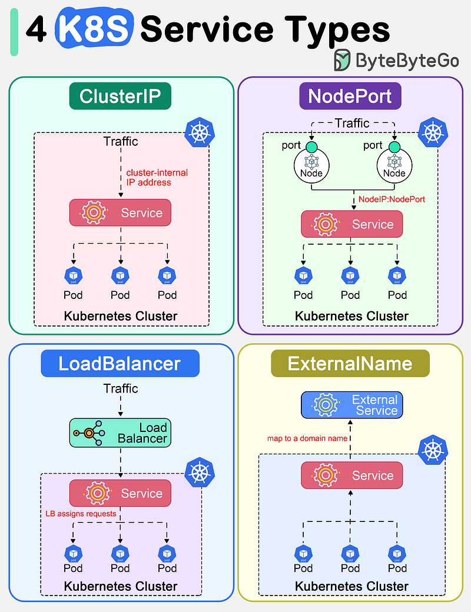
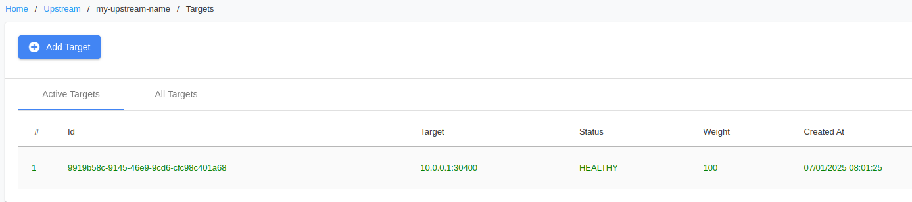

Title: Sharing What I've Learned About Kubernetes Networking - Part 1
Date: 2025-01-17
Category: Knowledge Base
Tags: k8s

In the first part, I will talk about Kubernetes Service, Ingress, and Service Discovery


# Kubernetes Services
In Kubernetes, a Service is a method for exposing a network application that is running as one or more Pods in your cluster.
So how many types of Services? There are 4 types:



### Service type, there is 4 type of service:

1. **ClusterIP**: Exposes the Service on a cluster-internal IP. Choosing this value makes the Service only reachable from within the cluster. This is the default ServiceType ( if you don't define the type, it will be ClusterIP)

2. **NodePort**: Exposes the Service on each Node’s IP at a static port (the NodePort). A ClusterIP Service, to which the NodePort Service routes, is automatically created. You’ll be able to contact the NodePort Service, from outside the cluster, by requesting <NodeIP>:<NodePort>. Default port range: 30000-32767

3. **LoadBalancer**: Exposes the Service externally using a cloud provider’s load balancer. NodePort and ClusterIP Services, to which the external load balancer routes, are automatically created.
    - If you're running Kubernetes on a cloud provider that supports load balancer services (like AWS, GCP, Azure), then type: LoadBalancer will work as expected.
    - If you're running Kubernetes on-premises or on a cloud provider that doesn't support load balancers, type: LoadBalancer will not work.

4. **ExternalName**: Maps the Service to the contents of the externalName field (e.g. `my.database.example.com`), by returning a CNAME record with its value.

### Let's dive deep into each section with the use case and example with the manifest so you can imagine it easily!

#### 1. **ClusterIP**: 
I assume you have redis pod already and you want to access it from backend server, backend server is in same k8s cluster. <br>

- Manifest demo: 
```yaml
apiVersion: v1
kind: Service
metadata:
  name: redis-test-clusterip
  namespace: redis-standalone
spec:
  type: ClusterIP
  ports:
  - port: 6379
    targetPort: 6379
  selector:
    app: redis-test
```

- Access it with FQDN: `redis-test-clusterip.redis-standalone.svc.cluster.local:6379`
- Explains: Fully qualified domain name (FQDN) of the Service. The FQDN takes the form `service-name.namespace.svc.cluster.local`, where:
    - `service-name` is the name of the Service.
    - `namespace-name` is the namespace in which the Service resides.
    - `svc` is a static value.
    - `cluster.local` is the default domain for the cluster. This can be customized during cluster setup.
- The DNS service in Kubernetes (like CoreDNS or kube-dns) is responsible for resolving this FQDN to the appropriate Service. When you create a Service, Kubernetes automatically creates a corresponding DNS record. This allows Pods in the cluster to access the Service using the FQDN.

#### 2. **NodePort**: 
From my experience, this is the most i used when i begin with k8s service expose ( that's time i have no idea about ingress xD). So how i used it.<br>

Service can be access from any node directly with <node-ip>:<port>. This mostly uses for quick access without run port-forward or any others action and ofc you have to allow access port from server to your ip address, i mean the firewall!

- For add backend to Haproxy <br>
```yaml
backend http_backend-name-here
        mode    http
        option forwardfor header X-Client-RIP
        balance roundrobin
        server 10.0.0.1:32332 10.0.0.1:32332 check inter 4000 rise 2 fall 10
        server 10.0.0.2:32332 10.0.0.2:32332 check inter 4000 rise 2 fall 10
```

- Used it as target for Upstream in Kong - Apigateway <br>


#### 3. LoadBalancer:
At this time, i don't use K8s in cloud yet. I will update when i finish my lab with EKS/GKE later.


#### 4. ExternalName
When i learn this for the first time or second time, i didn't really know why it gonna being used, but after several times i got this.

- For consistency, when you change domain of external name, it takes only 5-10s second to update in container without restart. You don't have to restart container to pod take the changes, if you mount config from ConfigMap or Secret, you will have to restart pod xD.

- Leverages K8S internal DNS resolution, you don't need any external DNS server. K8S is act as DNS Server at this point xD.

- Better integration with k8s network policies and service management. I think you will not understand this sentence like me xD. So i asked Copilot to explains.

    - Network Policies: Kubernetes network policies allow you to control the communication between Pods and Services within the cluster. However, ExternalName Services do not directly interact with Pods; they map to external DNS names. This means that network policies within the cluster do not apply to the external services directly. Instead, you need to manage network policies at the cluster boundary or use other mechanisms to secure communication with external services.

    - Service Management: Kubernetes provides robust service management features, such as service discovery, load balancing, and DNS resolution. ExternalName Services leverage Kubernetes' DNS resolution capabilities to provide a seamless way to access external services using a consistent internal DNS name. This allows for better integration and management of external services within the Kubernetes ecosystem, as you can reference external services using Kubernetes Service names.

- Centralizes the configuration of external dependencies within K8S.

- Example manifest:
```yaml
apiVersion: v1
kind: Service
metadata:
  name: my-external-service
  namespace: sysadmin
spec:
  type: ExternalName
  externalName: my.database.example.com
```

### Ingress!

#### Quick start
It will be a little hard to summary ingress in some words, but i will try my best to explain.

Kubernetes Ingress is a resource that allows you to manage external access to your services, typically HTTP ( It does supports TLS/SSL). It acts as a reverse proxy, routing traffic from a DNS name to the appropriate services within your cluster.

- **DNS**: Points to the Ingress controller (proxy server).
- **Ingress Controller**: Forwards traffic to the configured services based on rules defined in the Ingress resource.

- Example manifest and haproxy stand before Ingress:
```yaml
apiVersion: networking.k8s.io/v1
kind: Ingress
metadata:
  name: example-ingress
  namespace: default
spec:
  rules:
  - host: example.com
    http:
      paths:
      - path: /
        pathType: Prefix
        backend:
          service:
            name: example-service
            port:
              number: 80
``` 
Haproxy config
```
backend http_example.com
        mode    http
        option forwardfor header X-Client-RIP
        balance roundrobin
        server 10.0.0.1:80 10.0.0.1:80 check inter 1000 rise 2 fall 10
        server 10.0.0.2:80 10.0.0.2:80 check inter 1000 rise 2 fall 10
```
Explain: DNS will point domain to Haproxy server. Haproxy will forward traffic to Ingress Controller ( 10.0.0.1 and 10.0.0.2 are Ingress Controller). Why i know port 80 is being used?
Because i installed nginx ingress as Daemonset, in default it used hostPort in ports section of Daemonset
```
        name: rke2-ingress-nginx-controller
        ports:
        - containerPort: 80
          hostPort: 80
          name: http
          protocol: TCP
        - containerPort: 443
          hostPort: 443
          name: https
          protocol: TCP
        - containerPort: 8443
          name: webhook
          protocol: TCP
```
And why i use 80 not 443?, for not double encrypt, because in Haproxy it was redirect request to HTTPS, so extra SSL is not necessary and may increase extra cpu load.

#### Ingress workflows:
- Ingress have routing rules to service
- Ingress flows:
```
1. Client Request: A client sends a request to http://example.com/api.
2. Ingress Controller: The request is received by the Ingress Controller.
3. Ingress Resource: The Ingress Controller looks up the Ingress resource to find the routing rules for example.com/api and determines the corresponding Service.
4. Service: The request is forwarded to the Service named my-service.
5. Endpoint: The Service finds the endpoints (IP addresses of Pods) associated with it and selects one based on its load balancing policy.
6. Pod: The request is routed to the selected Pod running the application.
```


# Reference:
- [https://kubernetes.io](https://kubernetes.io/docs/concepts/services-networking/service/)
- [https://bytebytego.com](https://bytebytego.com)
- [https://kodekloud.com](https://kodekloud.com)