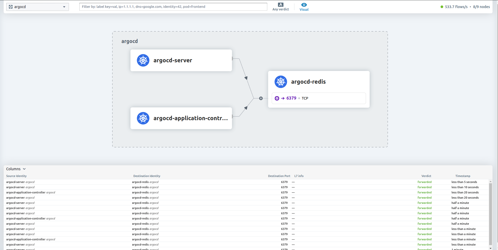

Title: Sharing What I've Learned About Kubernetes Networking - Part 2
Date: 2025-01-20
Category: Knowledge Base
Tags: k8s

In the second part, I will talk about Container network interface (CNI), Cilium CNI and some compare with Network policies and Cilium network policies.

# CNI

### What is CNI:
- Is a framework for configuring network interfaces in Linux container , providing connectivity and ensure network isolation.
- CNI Plugin standarize and simplify Kubernetes networking.

### How CNI Works:
- CNI works by invoke network plugin that handle network configuration for containers. When a container is created, the container runtime call the CNI plugin to setup the container network interface
- Works in K8S:
```
Kube API --> Kubelet --> Container Runtime --> create container, network namespace
                                           --> invoke CNI, create network configuration for veth then map it with container network
```

### CNI specification:
- A Json configuration file that specifies the desired network setup.
- Standard commands: ADD, DEL, CHECK to manage network interfaces.
- Plugin must handle these command and return results in predefined format.

### CNI community popularity:
The following table summarizes different GitHub metrics to give you an idea of each project's popularity and activity levels. This data was collected in December 2024.


| Provider |  Stars | Forks | Contributors |
|----------| -------|-------|--------------|
| Canal    |  718   | 100   | 20           |
| Flannel  |  8.9k  | 2.9k  | 234          |
| Calico   |  6.1k  | 1.4k  | 360          |
| Weave    |  6.6k  | 672   | 84           |
| Cilium   |  20.5k | 3k    | 868          |

# Cilium CNI
### What is Cilium
- Cilium is an open-source networking and security solution designed for Kubernetes and other container orchestration platforms. Its primary purpose is to provide secure and efficient network connectivity between application services deployed in cloud-native environments. Cilium leverages eBPF (extended Berkeley Packet Filter) technology to dynamically insert code into the Linux kernel, enabling high-performance packet processing and security enforcement.

As a comprehensive CNI (Container Network Interface) plugin, Cilium offers advanced networking features, robust security policies, and deep observability capabilities. These features make it an ideal choice for modern cloud-native applications that require scalable and secure network infrastructure.

### Key Features
- **eBPF**
Cilium uses eBPF to dynamically insert code into the Linux kernel, enabling efficient packet processing and security enforcement.

- **Network Policies**
Cilium implements Kubernetes Network Policies and extends them with more advanced features, allowing fine-grained control over network traffic.

- **Service Mesh Integration**
Cilium integrates seamlessly with service meshes like Istio, providing enhanced networking capabilities and security.

- **Observability**
Cilium offers robust observability features through Hubble, which provides deep visibility into network traffic and security events.

### eBPF explain
I think you haven't understand clear about eBPF ( so am i), so i spend time to read document, try to understand it and explain it here xD.

1. `Think of it as a plugin system for the kernel` that can help with monitoring, networking, and security:
    - Observe: Watch what’s happening inside the system (e.g., track network packets, file operations, etc.).
    - Act: Modify or filter data in real-time (e.g., drop a suspicious network packet).


2. `Why is it useful?`: 
Normally, to add new functionality to the Linux kernel, you'd have to rebuild or modify the kernel—a risky and complex task. eBPF solves this by:
    - Letting you "inject" tiny programs dynamically.
    - Running these programs in a safe sandbox to ensure they can’t crash or harm the system.
    - Being fast because the programs run directly inside the kernel.


3. `Simple Analogy`: Imagine the Linux kernel is a busy post office:
    - Every day, it processes letters (network packets, file reads, system events).
    - If you wanted to filter out spam mail (e.g., suspicious packets), you'd normally need to rewrite the post office's internal processes (modify the kernel).
    - But with eBPF, you can simply write a small "mailroom plugin" that works alongside the post office to filter spam as the letters pass through—without changing how the post office works.


4. `Example: Network Packet Filtering`. Let’s say you want to block network packets coming from a suspicious IP address.
    - `Without eBPF`:
        - You might need to install complex tools or write custom firewall rules.
        - Or, you’d need to modify the kernel, which is risky.
    - `With eBPF`:
        - You write a small eBPF program in C or a high-level language like Python (with libraries like bcc or libbpf).
        - This program runs inside the kernel and checks every network packet:
            - If the packet’s source IP matches the bad one, the program drops it.
            - Otherwise, it lets the packet through.
        - You load the eBPF program dynamically using tools like bpftool.
### Cilium eBPF
- First, i think you need to check Cilium is enable in hybrid mode or strict mode or not
```
kubectl -n kube-system edit configmap cilium-config
```
Looks for line `kube-proxy-replacement`, if it is empty (`""`), it is running in hybrid mode and you can see by type `iptables -L`. Enable it with 
```yaml
  kube-proxy-replacement: strict
  kube-proxy-replacement-healthz-bind-address: ""
  enable-l7-proxy: "true"
```

- Second, check kernel support or not: Cilium generally requires a kernel version >= 4.19 for basic eBPF functionality and >= 5.4 for kube-proxy replacement. So it will mostly about supported xD

- Third, lets focus into main objective.
    - Cilium with eBPF is generally faster than iptables. eBPF (extended Berkeley Packet Filter) allows Cilium to dynamically insert code into the Linux kernel, enabling efficient packet processing and security enforcement. This approach reduces the overhead associated with traditional iptables-based packet filtering and routing.
    - Iptables operates in user space and relies on a series of rules to manage network traffic, which can become complex and slow as the number of rules increases. In contrast, eBPF operates in the kernel space, allowing for more direct and efficient handling of network packets. This results in lower latency and higher throughput, making Cilium with eBPF a more performant solution for Kubernetes networking.

[Check out this tweet](https://x.com/diptanu/status/899424568422486016)

- Examples of how Cilium utilizes eBPF: Load Balancing
    - Use Case: Cilium implements a high-performance, distributed load balancer for Kubernetes services
    - eBPF Functionality:
        - eBPF programs attached to networking hooks can direct packets to the correct backend pod without relying on iptables.
        - Example: A packet arriving for ClusterIP is intercepted by an eBPF program, which selects a pod backend based on a consistent hash algorithm and forwards the packet directly.

More example can be found in here: [replacing_iptables_with_ebpf](https://archive.fosdem.org/2020/schedule/event/replacing_iptables_with_ebpf/attachments/slides/3622/export/events/attachments/replacing_iptables_with_ebpf/slides/3622/Cilium_FOSDEM_2020.pdf)

### Common commands of cilium
```
cilium-health status
cilium status
```

### Cilium Observability: Hubble
- There are many way to enable Hubble and Hubble UI, so i won't talk details in here.
- View network flows in real-time: `hubble observe`
- Port forward to use hubble UI: `kubectl port-forward -n kube-system svc/hubble-ui 12000:80`

As you can see, very useful for Observability, debugging and tracing!

# Cilium Network policies
### Comparison
- **Kubernetes Network Policies**: Kubernetes network policies are used to control the traffic between pods. They are defined using the NetworkPolicy resource.
```yaml
apiVersion: networking.k8s.io/v1
kind: NetworkPolicy
metadata:
  name: allow-nginx
  namespace: default
spec:
  podSelector:
    matchLabels:
      app: nginx
  policyTypes:
  - Ingress
  - Egress
  ingress:
  - from:
    - podSelector:
        matchLabels:
          app: frontend
    ports:
    - protocol: TCP
      port: 80
  egress:
  - to:
    - podSelector:
        matchLabels:
          app: backend
    ports:
    - protocol: TCP
      port: 8080
```

- **Cilium Network Policies**: Cilium extends the capabilities of Kubernetes network policies by leveraging eBPF. Cilium policies can be more expressive and can include L7 (Layer 7) rules.
```yaml
apiVersion: cilium.io/v2
kind: CiliumNetworkPolicy
metadata:
  name: allow-nginx
  namespace: default
spec:
  endpointSelector:
    matchLabels:
      app: nginx
  ingress:
  - fromEndpoints:
    - matchLabels:
        app: frontend
    toPorts:
    - ports:
      - port: "80"
        protocol: TCP
  egress:
  - toEndpoints:
    - matchLabels:
        app: backend
    toPorts:
    - ports:
      - port: "8080"
        protocol: TCP
  - toServices:
    - k8sService:
        namespace: default
        serviceName: external-service
  l7Rules:
    http:
    - method: GET
      path: "/api"
```

Above is just an example xD, and CiliumNetworkPolicy may not works because i copied somewhere for the content. For real example, lets continue read below xDD.

- **Key Differences**:
    - Layer 7 Policies: Cilium supports L7 policies (e.g., HTTP methods and paths), while Kubernetes network policies are limited to L3/L4 (IP and port).
    - Integration with eBPF: Cilium uses eBPF for efficient packet processing, which can provide better performance and more advanced features.
    

### Real example of Cilium Network policies
- Before i'm able to write this, i wasted 3-4 hours for checking and testing why we can't have rules that allow both allow / deny. Simply it doesn't support >.>
```
Cilium L7 policies do not directly support explicit deny rules for specific HTTP paths or methods at the moment. Instead, they operate on an allowlist-only model, meaning:

1. Any traffic explicitly defined in rules.l7 is allowed.
2. Any traffic not explicitly listed is denied by default.

This can feel limiting when you're looking for explicit deny functionality. However, there are ways to handle this situation effectively depending on your use case.
```

- **Real Example**: Rule that allow access only path /employees from namespace `test`
```
apiVersion: "cilium.io/v2"
kind: CiliumNetworkPolicy
metadata:
  name: "python-app"
  namespace: "python-app"
  # Apply this in the namespace you want to protect
spec:
  # Target all pods in the namespace where this policy is applied
  endpointSelector: {} # Apply this policy to all pods in the python-app namespace
  ingress:
  # Allow all traffic from pods in test namespace
  - fromEndpoints:
    - matchLabels:
        # This matches all pods in the test namespace
        k8s:io.kubernetes.pod.namespace: test
    toPorts:
      - ports:
        - port: "5000"
          protocol: TCP
        rules:
          http:
          - method: "GET"
            path: "/employees.*"
```

Lets go for testing: if the path is simple `path: "/employees"`. The request to `python-api-app-production.python-app.svc:5000/employees/1` will be denied!
```
### Access from namespace test
k exec -n test kienlt-linux-tools -- curl -s "python-api-app-production.python-app.svc:5000/employees"
[{"id":1,"name":"Ashley"},{"id":2,"name":"Kate"},{"id":3,"name":"Joe"}]

k exec -n test kienlt-linux-tools -- curl -s "python-api-app-production.python-app.svc:5000/secret"
Access denied

k exec -n test kienlt-linux-tools -- curl -s "python-api-app-production.python-app.svc:5000/"
Access denied

k exec -n test kienlt-linux-tools -- curl -s "python-api-app-production.python-app.svc:5000/employees/1"
{"id":1,"name":"Ashley"}
### Access from namespace default
k exec kienlt-linux-tools -- nc -w 3 -vz python-api-app-production.python-app.svc 5000
nc: python-api-app-production.python-app.svc (10.43.67.70:5000): Operation timed out
command terminated with exit code 
```

Specials thanks to `isovalent.com` for the tutorials xD ( included reference link below)


# Conclusion

# Reference:
- [https://ranchermanager.docs.rancher.com/](https://ranchermanager.docs.rancher.com/)
- [https://docs.cilium.io/en/stable/overview/intro/](https://docs.cilium.io/en/stable/overview/intro/)
- [https://cilium.io/blog/2018/04/17/why-is-the-kernel-community-replacing-iptables/](https://cilium.io/blog/2018/04/17/why-is-the-kernel-community-replacing-iptables/)
- [replacing_iptables_with_ebpf](https://archive.fosdem.org/2020/schedule/event/replacing_iptables_with_ebpf/attachments/slides/3622/export/events/attachments/replacing_iptables_with_ebpf/slides/3622/Cilium_FOSDEM_2020.pdf)
- [https://isovalent.com/blog/post/tutorial-cilium-network-policy/](https://isovalent.com/blog/post/tutorial-cilium-network-policy/)