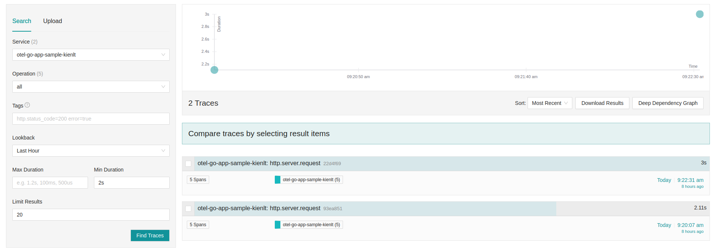
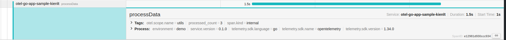

Title: My journey with observability: Opentelemetry
Date: 2025-03-03
Category: Knowledge Base
Tags: observability


# Introduction to Observability
It has 3 pillar we need to know in my knowledge
- Metrics
- Logs
- Traces

So we will talk about Tracing in this article and it will comes with OpenTelemetry(OTel)

# What is Open Telemetry (OTel)
It is observability frameworks for generating, collecting and exporting telemetry data such as traces, metrics and logs. But i will talk only about traces in this article. Metrics and Logs will be introduced in other arcticle with some following information:
- Metrics: Response time, request volume, ingress success rate, status... via Prometheus standard.
- Logs: Application send log to stdout and save those logs for debuging in Elasticsearch, VictoriaLogs with Fluentbit in K8S...

Although OTel supports all of them but i will use only using traces for a demo right now xD

# Let's getting started with sample Go project with OTel

### Setup quick OTel collector and Jaeger which can be considered as a backend in Localhost
- Flows: 


- Docker compose script:
```yaml
services:
  otel-collector:
    image: otel/opentelemetry-collector-contrib:0.120.0
    command: ["--config=/etc/otel-collector-config.yaml"]
    volumes:
      - ./otel-collector-config.yaml:/etc/otel-collector-config.yaml
    ports:
      - "4317:4317"   # OTLP gRPC
      - "4318:4318"   # OTLP HTTP
    networks:
      - otel-network

  jaeger:
    image: jaegertracing/all-in-one:1.66.0
    ports:
      - "16686:16686"   # Jaeger UI
      - "14250:14250"   # Receiver for otel-collector
    environment:
      - COLLECTOR_OTLP_ENABLED=true
    networks:
      - otel-network
networks:
  otel-network:
```

- Otel config file `otel-collector-config.yaml`:
```yaml
receivers:
  otlp:
    protocols:
      grpc:
        endpoint: 0.0.0.0:4317
      http:
        endpoint: 0.0.0.0:4318

processors:
  batch:
    timeout: 1s
    send_batch_size: 1024
  memory_limiter:
    check_interval: 1s
    limit_mib: 1000

exporters:
  debug:
    verbosity: detailed
  otlp:
    endpoint: jaeger:4317
    tls:
      insecure: true

service:
  pipelines:
    traces:
      receivers: [otlp]
      processors: [memory_limiter, batch]
      exporters: [otlp, debug]
```

- Docker ps output after `docker compose up`
```
CONTAINER ID   IMAGE                                          COMMAND                  CREATED       STATUS              PORTS                                                                                                                                  NAMES
d0138238848c   jaegertracing/all-in-one:1.66.0                "/go/bin/all-in-one-…"   2 days ago    Up 7 hours          4317-4318/tcp, 9411/tcp, 0.0.0.0:14250->14250/tcp, [::]:14250->14250/tcp, 14268/tcp, 0.0.0.0:16686->16686/tcp, [::]:16686->16686/tcp   opentelemetry-go-app-jaeger-1
3466baff1cb6   otel/opentelemetry-collector-contrib:0.120.0   "/otelcol-contrib --…"   2 days ago    Up 7 hours          0.0.0.0:4317-4318->4317-4318/tcp, [::]:4317-4318->4317-4318/tcp, 55678-55679/tcp                                                       opentelemetry-go-app-otel-collector-1
```

### Setup Application expose data
I will leave my repo here: [https://github.com/BlackMetalz/otel-go-app-sample](https://github.com/BlackMetalz/otel-go-app-sample)

- Example when you request to path: `/products`. It will connect to DB and some functions which i used to make "accident scenario"
- Here is the explain generated by AI:
```
When you access the path `/products`, the following flow occurs:

1. **Router Setup**:
   - The `SetupRouter` function configures the Gorilla Mux router to handle the `/products` endpoint with the `GetProductsHandler` function.

2. **Request Handling**:
   - The `GetProductsHandler` function is invoked when a request is made to the `/products` endpoint.

3. **Tracing**:
   - A new trace span is started for the `GetProductsHandler` function using OpenTelemetry.

4. **Request Validation**:
   - The `validateRequest` function is called to simulate a validation step with a 1000ms delay and a 20% chance of failure.
   - If validation fails, an error response is returned, and the trace span is annotated with the error.

5. **Database Query**:
   - The `GetAllProducts` function is called to fetch all products from the database.
   - A new trace span is started for the `GetAllProducts` function.
   - The database query is executed, and the results are scanned into a slice of `Product` structs.
   - If the database query fails, an error response is returned, and the trace span is annotated with the error.

6. **Parallel Slow API Call**:
   - A goroutine is started to call the `HandleSlowAPI` function, which simulates a slow API response with a 1000ms delay.
   - The result of the slow API call is sent to a channel.

7. **Data Processing**:
   - The `processData` function is called to simulate additional processing with a 1500ms delay and a 30% chance of failure.
   - If data processing fails, an error response is returned, and the trace span is annotated with the error.

8. **Wait for Slow API Result**:
   - The handler waits for the result of the slow API call from the channel.

9. **Prepare Response**:
   - A `Response` struct is created to combine the products, slow API status, slow API message, and processing status.
   - The response is encoded as JSON and sent to the client.

10. **End Trace**:
    - The trace span for the `GetProductsHandler` function is ended.

This flow ensures that the `/products` endpoint handles request validation, database querying, slow API calls, and data processing, all while being traced using OpenTelemetry.
```

- Output example:
```json
{
  "products": [
    {
      "id": 2,
      "name": "table",
      "quantity": 500,
      "price": 100
    },
    {
      "id": 3,
      "name": "wardrobe",
      "quantity": 100,
      "price": 500
    },
    {
      "id": 4,
      "name": "Pens",
      "quantity": 100,
      "price": 10
    }
  ],
  "slow_status": 200,
  "slow_message": "Slow API response at 2025-03-03T09:22:34+07:00\n",
  "process_status": "success"
}
```

### View the traces with Jaeger UI
- Let's take a look in UI to see how many spans and each span take how long for duration. First i filter for Min Duration is 2 seconds, it means request have more than 2 seconds to response.



- Then i take a look in request with 3 seconds duration. You can see clearly each span takes how long to complete the handle


- I will look at span `processData`

Source code here: [https://github.com/BlackMetalz/otel-go-app-sample/blob/main/utils/mysql.go#L112-L124](https://github.com/BlackMetalz/otel-go-app-sample/blob/main/utils/mysql.go#L112-L124)
```go
// processData simulates additional processing with a delay and possible error
func processData(ctx context.Context, products []Product) (string, error) {
	_, span := otel.Tracer("utils").Start(ctx, "processData")
	defer span.End()

	time.Sleep(1500 * time.Millisecond) // Medium delay
	if rand.Float32() < 0.3 {          // 30% chance of failure
		span.SetAttributes(attribute.String("error", "processing failed"))
		return "failed", fmt.Errorf("data processing failed")
	}
	span.SetAttributes(attribute.Int("processed_count", len(products)))
	return "success", nil
}
```
That is where 1.5 duration comes from in package utils which is matched with `otel.scope.name`


# Conclusion
- Code is mostly generated by AI with my promt since I'm not developer, just a system guy want to learn Go xD


# Ref:
- [https://opentelemetry.io/docs/](https://opentelemetry.io/docs/)
- [https://learn.datadoghq.com/courses/introduction-to-observability](https://learn.datadoghq.com/courses/introduction-to-observability)